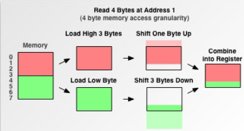

#<center>C++基础知识</center>#
##1. C++中与类型转换相关的关键字
中有哪些与类型转换有关的关键字？这些关键字各有什么特点？应该在什么场合使用？
+ static_cast: 表达式是否合法取决于操作数的类型，而且合法的表达式其含义也由操作数类型决定。但是在C\++中，某些类型之间存在相关的依赖关系。若两种类型相关，则可在需要某种类型的操作数位置上，使用该类型的相关类型对象或值。如果两个类型之间可以相互转换，则称这两个类型相关。C++默认的整数类型之间的转换就属于这种。

+ const_cast: 使用const_cast会消除被转换类型的const特性，而且只有const类型的变量才能使用。那么，什么情况下需要消除一个const变量的const特性呢？比如，有时候有的函数的形参类型为非const类型，那么如果你要将一个const类型的参数传入就会报错。所以在这种情况下需要先使用const_cast转化一下。

+ dynamic_cast: 一种用作运行时检测的类型转换。它可以将基类类型的指针或引用安全地转换为派生类型的指针或引用。当具有基类的引用或指针，但需要执行不是基类组成部分的派生类操作的时候，需要动态的强制类型转换。通常，从基类指针获得派生类行为最好的方法是通过虚函数。当使用虚函数的时候，编译器自动根据对象的实际类型选择正确的函数。但是，在某些情况下，不可能使用虚函数。这时候就需要使用dynamic_cast关键字了。但是，能用虚函数还是用虚函数最好。与其他强制类型转换不同，dynamic_cast涉及运行时类型检查。如果绑定到引用或指针的对象不是目标类型的对象，则dynamic_cast失败。

+ reinterpret_cast: 如果被转换的两种类型之间不相关，比如int指针转换为char指针，就要使用reinterpret_cast这个关键字。

##2. C\++中空类的大小
C\++中空类的大小为1。直观地看，空类对象不使用任何空间，因为没有任何隶属对象的数据需要存储。然而，C\++标准规定，凡是一个独立的(非附属)对象都必须具有非零大小。C\++标准指出，不允许一个对象（当然包括类对象）的大小为0，不同的对象不能具有相同的地址。这是由于：
+ new需要分配不同的内存地址，不能分配内存大小为0的空间。
+ 避免除以 sizeof(T)时得到除以0错误

如果我们定义了一个空类A的一个对象数组，即:
```cpp
class A{};

A a = new A[5];
```
则此时a[0]和a[1]的地址相同，内存地址产生重叠，这样定义对象数组显然就失去了意义。因此C++中要求对于类的每个实例都必须有独一无二的地址,那么编译器自动为空类分配一个字节大小，这样便保证了每个实例均有独一无二的内存地址。

值得注意的是，这并不代表一个空的基类也需要加一个字节到子类中去。这种情况下，空类并不是独立的，它附属于子类。子类继承空类后，子类如果有自己的数据成员，而空基类的一个字节并不会加到子类中去。例如，
```cpp
class Emtpy{};
classs Child : public Empty{int a;};
```
此时sizeof(Child)的大小为4而不是5。

另外一种情况:
```cpp
class Empty{};
class A{int x; Empty e;};
```
此时sizeof(A)的大小为8而不是5。由于Empty类的大小虽然为1，然而为了内存对齐，编译器会为A额外加上一些字节，使得A被放大到足够可以又放一个int。

##3. C/C++中的内存对齐机制
+ 平台原因(移植原因)：不是所有的硬件平台都能访问任意地址上的任意数据的；某些硬件平台只能在某些地址处取某些特定类型的数据，否则抛出硬件异常。
+ 性能原因：经过内存对齐后，CPU的内存访问速度大大提升。

普通程序员心目中的内对对象：

CPU看到的内存对象:

CPU把内存当成是一块一块的，块的大小可以是2，4，8，16字节大小，因此CPU在读取内存时是一块一块进行读取的。块大小成为memory access granularity(内存读取粒度) 。

假设CPU要读取一个int型4字节大小的数据到寄存器中，分两种情况讨论：

1. 数据从0字节开始
2. 数据从1字节开始
再次假设内存读取粒度为4。当该数据是从0字节开始时，很CPU只需读取内存一次即可把这4字节的数据完全读取到寄存器中。当该数据是从1字节开始时，问题变的有些复杂，此时该int型数据不是位于内存读取边界上，这就是一类内存未对齐的数据。


此时CPU先访问一次内存，读取0—3字节的数据进寄存器，并再次读取4—5字节的数据进寄存器，接着把0字节和6，7，8字节的数据剔除，最后合并1，2，3，4字节的数据进寄存器。对一个内存未对齐的数据进行了这么多额外的操作，大大降低了CPU性能。

以上还属于乐观情况了，上文提到内存对齐的作用之一为平台的移植原因，因为以上操作只有有部分CPU肯干，其他一部分CPU遇到未对齐边界就直接罢工了。

## 4. C++中的内存分配
+ 栈内存：由编译器在需要的时候分配，在不需要的时候自动清楚的变量的存储区。里面的变量通常是局部变量、函数参数等。
+ 堆内存：由new分配的内存块，他们的释放编译器不去管，由我们的应用程序去控制，一般一个new就要对应一个delete。如果程序员没有释放掉，那么在程序结束后，操作系统会自动回收。**注意它与数据结构中的堆是两回事，分配方式倒是类似于链表。**
+ 自由存储区：那些由malloc等分配的内存块，他和堆是十分相似的，不过它是用free来释放的。其实可以相当于堆。
+ 全局/静态存储区，全局变量和静态变量被分配到同一块内存中，程序结束后由系统释放。在以前的C语言中，全局变量又分为初始化的和未初始化的，在C++里面没有这个区分了，他们共同占用同一块内存区。
+ 常量存储区，这是一块比较特殊的存储区，他们里面存放的是常量，不允许修改。例如数字2、字符串"abc"等都是存储在常量存储区，不允许被修改。程序结束后由操作系统回收。
+ 程序代码区：存放函数体的二进制代码。

##5. 栈和堆的区别
###5.1 分配效率
栈是机器系统提供的数据结构，计算机会在底层对栈提供支持：分配专门的寄存器存放栈的地址，压栈出栈都有专门的指令执行，这就决定了栈的效率比较高。堆则是C/C++函数库提供的，它的机制是很复杂的，例如为了分配一块内存，库函数会按照一定的算法（具体的算法可以参考数据结构/操作系统）在堆内存中搜索可用的足够大小的空间，如果没有足够大小的空间（可能是由于内存碎片太多），就有可能调用系统功能去增加程序数据段的内存空间，这样就有机会分到足够大小的内存，然后进行返回。显然，堆的效率比栈要低得多。

###5.2 碎片问题
对于堆来讲，频繁的new/delete势必会造成内存空间的不连续，从而造成大量的碎片，使程序效率降低。对于栈来讲，则不会存在这个问题，因为栈是先进后出的队列，他们是如此的一一对应，以至于永远都不可能有一个内存块从栈中间弹出，在他弹出之前，在他上面的后进的栈内容已经被弹出。

###5.3 生长方向
对于堆来讲，生长方向是向上的，也就是向着内存地址增加的方向；对于栈来讲，它的生长方向是向下的，是向着内存地址减小的方向增长。

###5.4 分配方式
堆都是动态分配的，没有静态分配的堆。栈有2种分配方式：静态分配和动态分配。静态分配是编译器完成的，比如局部变量的分配。动态分配由alloca函数进行分配，但是栈的动态分配和堆是不同的，他的动态分配是由编译器进行释放，无需我们手工实现。

###5.5 管理方式
对于栈来讲，是由编译器自动管理，无需我们手工控制；对于堆来说，释放工作由程序员控制，容易产生内存溢出。

###5.6 空间大小
一般来讲在32位系统下，堆内存可以达到4G的空间，从这个角度来看堆内存几乎是没有什么限制的。但是对于栈来讲，一般都是有一定的空间大小的，例如，在VC6下面，默认的栈空间大小是1M。

堆和栈相比，由于大量new/delete的使用，容易造成大量的内存碎片；由于没有专门的系统支持，效率很低；由于可能引发用户态和核心态的切换，内存的申请，代价变得更加昂贵。所以栈在程序中是应用最广泛的，就算是函数的调用也利用栈去完成，函数调用过程中的参数，返回地址，EBP和局部变量都采用栈的方式存放。所以，我们推荐大家尽量用栈，而不是用堆。

##6. char []和char *的区别
本质上来说，```char *s```定义了一个char型的指针，它只知道所指向的内存单元，并不知道这个内存单元有多大，所以：
当```char *s = "hello";```后,不能使用```s[0]='a'；```语句进行赋值。这是将提示内存不能为"written"。

当用```char s[]="hello";```后，完全可以使用```s[0]='a'；```进行赋值，这是常规的数组操作。

```cpp
char str[] = "hello";
char *str = "hello";
```
第一个表达式表示的是在动态变量区中开辟一个能连续放6个字符的数组，数组名称是str.而赋值运算符右边是一个字符串常量，这个字符串常量是存放在常量区的，**这个表达式的意思就是将“hello”这个字符串常量拷贝到刚才开辟的数组中**。C语言规定，表达式如果是一个数组名，则代表的意思是该数组的起始地址，如果这个数组在一个函数中定义，如果以数组名返回时，因为数组在函数中定义，是个局部变量，函数返回之后，这个数组所占用的空间就被释放掉了，数组也被破坏掉了，因此返回的数组名也就没有意义，不能被其主调函数使用了。

如果我们这样写：
```cpp
char * foo()
{
	char str[] = "hell0";
    return str;
}
```
在编译的时候就会出现警告：函数返回局部变量的地址。

而对于```char *str="hello";```这个表达式的意思是在动态变量区中开辟一个存放指针的存储单元，指针变量名是str,"hello"同样也是一个字符串常量，存储在常量区，在程序的运行过程中一直存在。把字符串“hello”的地址值拷贝到刚才的存储单元中，即指针变量str的初值是字符串“hello”的地址。这时如果char *str="hello"定义在一个函数中并且以return str返回，因为str是一个变量名，返回的仅仅是str的值，所以在其他函数中可以使用该值，照样能够访问到“hello”这个字符串。

例如:
```cpp
char* foo()
{
	char * str = "hello";
    return str;  //返回的是常量区字符串"hello"的首地址
}
```

```cpp
char * foo()
{
	char str[] = "hello";
    char *p;
    p = str;
    return p;
}
```
编译不会报错，但输出乱码。因为在函数foo中返回的是数组str的起始地址，而不是字符串常量“hello”的起始地址，所以函数foo返回之后，这个地址也就没有意义了，是一个无效地址，在主调函数中也就不能使用了，从而不能打印出“hello”这个字符串了。

因此，```char str[]="hello"```的操作方式是将常量区中的字符串"hello"拷贝到栈区中，然后将栈区中"hello"的收地址复制给str, 因此可以使用str和下标的方式修改str内容的值。而```char *str = "hello";```的操作方式是直接将常量区中的"hello"的收地址复制给str,而常量区的内容是不能被修改的，因此无法使用str和下标的方式来修改str内容的值。

下面的程序将会报错：
```cpp
char * d = "hello";
char s[] = "world";

strcat(d, s); #报错,因为d所指向的内容在常量区，不能修改
```

而下面的程序则不会报错
```cpp
char str1[20] = "abc";
char *str2 = "abc";
str2 = str1;
strcat(str2, "defg");  #此时str2指向的是一个栈区,可以改变也可以通过操作下标改变内容。
```

主要区别总结如下：
+ 读写能力：```char *a = "abcd";```此时"abcd"存放在常量区。通过指针只可以访问字符串常量，而不可以改变它。而```char a[20] = "abcd"```此时 "abcd"存放在栈。可以通过指针去访问和修改数组内容。
+ 赋值时刻: ```char *a = "abcd";```是在编译时就确定了（因为为常量）。而```char a[20] = "abcd"```在运行时确定。
+ 存取效率：```char *a = "abcd";```存于静态存储区。在栈上的数组比指针所指向字符串快,因此慢。而```char a[20] = "abcd"```存于栈上,快。

##7. C++中的虚函数表
在每个包含有虚函数的类的对象的最前面(是指这个对象对象内存布局的最前面，至于为什么是最前面，说来话长，这里就不说了，主要是考虑到效率问题)都有一个称之为虚函数指针(vptr)的东西指向虚函数表(vtbl)，这个虚函数表(这里仅讨论最简单的单一继承的情况，若果是多重继承，可能存在多个虚函数表)里面存放了这个类里面所有虚函数的指针，当我们要调用里面的函数时通过查找这个虚函数表来找到对应的虚函数，这就是虚函数的实现原理。

虚函数表是class specific的，也就是针对一个类来说的，这里有点像一个类里面的staic成员变量，即它是属于一个类所有对象的，不是属于某一个对象特有的，是一个类所有对象共有的。

虚函数指针vptr存在于堆区，而虚函数表存在于只读数据段(相当于常量区)。

由于虚函数表存储在只读数据段(常量区)，因此不能算在类的大小里面。类的大小只能计算类成员占用的空间。因此一旦一个类拥有虚函数，则会多出一个成员变量: vptr，大小为4(32位机器)。类的大小只计算其成员变量的占用空间。

类中的成员函数存在于代码段，每个成员函数会有一个this指针，该指针不占用对象大小，因此不能反应在sizeof上。this指针在成员函数执行前构造,成员函数执行后清除。

this是通过函数参数的首参数来传递的。this指针是在调用之前生成的。类实例后的函数，没有这个说法。类在实例化时，只分配类中的变量空间，并没有为函数分配空间。自从类的函数定义完成后，它就在那儿，不会跑的。

this指针只有在成员函数中才有定义。因此，你获得一个对象后，也不能通过对象使用this指针。所以，我们也无法知道一个对象的this指针的位置（只有在成员函数里才有this指针的位置）。当然，在成员函数里，你是可以知道this指针的位置的（可以&this获得)，也可以直接使用的。

如下面一段代码：
```cpp
class D
{
public:
    void printA()
    {
        cout<<"printA"<<endl;
    }
    virtual void printB()
    {
        cout<<"printB"<<endl;
    }
};
int main(void)
{
    D *d=NULL;
    d->printA();
    d->printB();
}
```
```printA()```能正常运行，而```printB()```程序会崩溃。

new出来的只是成员变量，成员函数始终存在，所以如果成员函数未使用任何成员变量的话，不管是不是static的，都能正常工作。需要注意的是，虽然调用不同对象的成员函数时都是执行同一段函数代码，但是执行结果一般是不相同的。不同的对象使用的是同一个函数代码段，它怎么能够分别对不同对象中的数据进行操作呢？原来C++为此专门设立了一个名为this的指针，用来指向不同的对象。

因为调用虚函数的时候，会用到成员变量**虚函数指针**，因此会报错。

因此成员函数可以被看作是类作用域的全局函数,不在对象分配的空间里,只有虚函数才会在类对象里有一个指针,存放虚函数的地址等相关信息。成员函数的地址，编译期就已确定，并静态绑定或动态的绑定在对应的对象上。对象调用成员函数时，早在编译期间，编译器就可以确定这些函数的地址，并通过传入this指针和其他参数，完成函数的调用，所以类中就没有必要存储成员函数的信息。

##8. C++中复制构造函数的参数类型
C++中复制构造函数的参数必须是引用类型，即必须采用引用传值的方式，否则报错。一般采用const引用。
```cppclass A
{
private:
	int value;
public:
	A(int n){ this->value = n; }
	A(A other){ this->value = other.value;}
	void print(){ cout << value << endl; }
};

int main()
{
	A a = 10;
	A b = a;
	b.print();
	return 0;
}
```
上面的代码会报错，因为复制构造函数不是引用类型，改为下面的方式即可。
```cpp
A(const A& other){this->value=other.value}
```

复制构造函数参数必须是引用的原因：为了防止递归调用复制构造函数。
当 一个对象需要以值方式传递时，编译器会调用它的复制构造函数以生成一个复本。如果类A的复制构造函数是以值方式传递一个类A对象作为参数的话，当需要调用类A的拷贝构造函数时，需要以值传递的方式传进一个A的对象作为实参；而以值传递的方式传递需要调用类A的复制构造函数；结果就是调用类A的复制构造函数时导致又一次调用类A的拷贝构造函数，即调用复制构造函数时会再次调用复制构造函数，这样会无休止的循环下去，这就是一个无限递归，因此编译就会报错。至于const 更多是给程序员的一个限制， 告诉程序员这个变量是只读的。因此为了安全， 一般建议所有的只读变量加const限制以防止程序员犯错。因为复制构造函数是用引用方式传递复制对象，引用方式传递的是地址，因此在构造函数内对该引用的修改会影响源对象。而你在用对象a1构造a2时，自然不希望复制构造函数会改变a1的内容，因此要防止复制构造函数内部修改该引用，所以用const声明。

##8. C++中的const关键字


