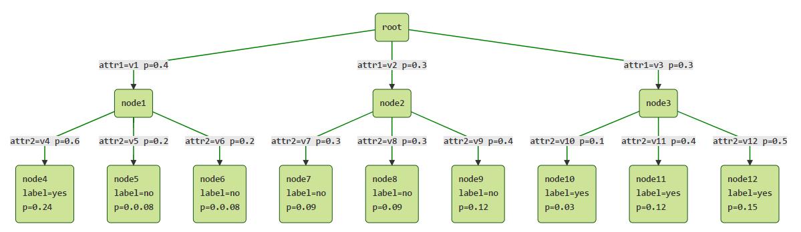

#
C4.5(weka又称为J48)算法原理详解
#

#1. 信息增益率
ID3算法有以下几个缺点:
+ 1个属性取值越多,则此属性的信息增益率越大,越有可能被ID3选为当前分类属性。然而取值较多的属性并不一定最优。(例如一个属性的每个子节点都只有1个样本,此时信息增益率达到最大,但是用这样的属性却没有任何意义)

+ ID3只能处理离散型属性

+ 可以处理缺失数据

+ 可以对树进行剪枝

针对ID3算法的不足,Quinlan又提出了C4.5，C4.5算法采用信息增益率来取代信息增益作为当前最优决策属性的度量标准。

仍然选择weka中天气的数据集为例子:

|outlook |temperature|humidity|windy|play|
|:------:|:---------:|:------:|:---:|:--:|
|sunny   |hot        |high    |FALSE|no  |
|sunny   |hot        |high    |TRUE |no  |
|overcast|hot        |high    |FALSE|yes |
|rainy   |mild       |high    |FALSE|yes |
|rainy   |cool       |normal  |FALSE|yes |
|rainy   |cool       |normal  |TRUE |no  |
|overcast|cool       |normal  |TRUE |yes |
|sunny   |mild       |high    |FALSE|no  |
|sunny   |cool       |normal  |FALSE|yes |
|rainy   |mild       |normal  |FALSE|yes |
|sunny   |mild       |normal  |TRUE |yes |
|overcast|mild       |high    |TRUE |yes |
|overcast|hot        |normal  |FALSE|yes |
|rainy   |mild       |high    |TRUE |no  |

##1.1 计算属性outlook的信息增益:
$$
IG(outlook) = Entropy(S)-Entropy(S|outlook)=0.24675
$$

##1.2 计算分裂信息(SplitInfo)来将信息增益规范化
>一个属性取值情况越多，$SplitInfo$越大,实际我们需要属性的$SplitInfo$越小越好

$$
SplitInfo_{outlook}(S)=-\sum_{v=v_0}^{v_n}(\frac {|S_v|}S\times log_2\frac{S_v}S)
$$
通过Outlook将样本分为以下几个部分:

故$SplitInfo_{outlook}$为:
$$
SplitInfo_{outlook}(S)=-\frac 5{14}\times log_2\frac 5{14}-\frac 4{14}\times log_2\frac 4{14}-\frac 5{14}\times log_2\frac 5{14}=1.577
$$
同理计算其他属性的$SplitInfo$
$$
SplitInfo_{temperature}(S)=1.556
$$
$$
SplitInfo_{humidity}(S)=1.0
$$
$$
SplitInfo_{windy}(S)=0.985
$$

##1.3 计算属性的信息增益率
$$
IGR(outlook)=\frac {IG(outlook)}{SplitInfo(outlook)}=\frac {0.24675}{1.577}=0.155
$$
$$
IGR(temperature)=\frac {IG(temperature)}{SplitInfo(temperature)}=\frac {0.029}{1.556}=0.0186
$$
$$
IGR(humidity)=\frac {IG(humidity)}{SplitInfo(humidity)}=\frac {0.151}{1.0}=0.151
$$
$$
IGR(windy)=\frac {IG(windy)}{SplitInfo(windy)}=\frac {0.048}{0.985}=0.048
$$
>IGR: Information Gain Ratio,即信息增益率

由此可见,属性$outlook$信息增益率越大，故第一步选择该属性为分类属性。在分裂之后的子节点中，如果该子节点只有一种$label$,则停止继续分类。否则重复上述步骤,继续分裂下去。

##1.4 C4.5算法总结
选择$IGR$(信息增益率)作为$ID3$算法中$IG$(信息增益)的代替来选择更好的分类属性:
$$
IGR(attr)=\frac {IG(attr)}{SplitInfo(attr)}
$$
然后用此公式遍历每个属性,选择$IGR$最大的属性作为当前的分类属性来产生树。对于分类不纯的节点，继续重复上述方法选择其他属性继续分类。

#2. C4.5处理连续型属性
对于连续型属性,C4.5先把它当转换成离散型属性再进行处理。本质上属性取值连续,但对于有限的采样数据它是离散的。例如某连续型属性有N个不同取值,则有N-1种离散化的方法: <=$v_j$的分到左子树, >$v_j$的分到右子树,然后计算N-1种情况下最大的信息增益率。

对于离散型属性只需计算1次信息增益率,但连续型属性却需要计算N-1次。为了减少计算量,可对连续属性先进行排序,在只有label发生变化的地方才需要切开。比如:

原本需要计算13种情况,现在仅需计算7种。
+ 利用信息增益率来选择连续值属性的分界点存在的问题
由于C4.5对于连续值属性,每次选取一个分裂点进行分裂,即二分裂。此时
$$
IGR(attr)=\frac {IG(attr)}{SplitInfo(attr)}
$$
假设分裂结果为

而

$$
SplitInfo(attr) = -\frac aN\times log_2\frac aN-\frac bN\times log_2\frac bN
$$
当$a=b=\frac 2N$的时候$SplitInfo(attr)$达到最大值$1$(具体计算过程省略)。$SplitInfo$越大,$IGR$就越小。故而等分分界点被抑制。此时子集样本个数能够影响分界点,显然不合理。因此在决定分界点时，还是采用了信息增益这个指标，而在选择具体属性的时候才选择信息增益率这个指标。(注意选择分裂点和选择具体属性的区别)

对于离散型属性,C4.5一次进行分裂后，后续不再使用该属性。但是对于连续型属性，由于进行的是二分裂，故下一次分裂可能还会继续用到该属性。例如:

连续属性attr1会被用到多次。
#3. C4.5处理缺失数据

###3.1 缺失属性的增益值和增益率求解
####3.1.1 离散型属性
仍然以下表为例说明:

|Day|Outlook |Temperature|Humidity|Wind	 |play|
|---|--------|-----------|--------|------|----|
|D1 |Sunny   |Hot	     |High	  |Weak  |No  |
|D2 |?	     |Hot        |High    |Strong|No  |
|D3 |?       |?          |High    |?     |Yes |
|D4 |Rain    |Mild       |High    |Weak  |Yes |
|D5 |Rain    |Cool       |?		  |Weak  |Yes |
|D6 |Rain    |Cool       |Normal  |Strong|No  |
|D7 |Overcast|Cool       |Normal  |Strong|Yes |
|D8 |?       |Mild       |High	  |?     |No  |
|D9 |?       |Cool       |Normal  |Weak  |Yes |
|D10|?       |?			 |Normal  |?     |Yes |
|D11|?       |Mild		 |Normal  |?     |Yes |
|D12|Overcast|Mild		 |?		  |Strong|Yes |
|D13|Overcast|Hot		 |?		  |Weak  |Yes |
|D14|Rain    |Mild		 |High	  |Strong|No  |

以属性$outlook$为例,共有14个样本，其中6个样本$outlook$值缺失,8个样本()不缺失。首先计算信息增益

+ 原始信息熵为:(8个无缺失值样本, 5个yes, 3个no)
$$
Entropy(S) = -(\frac 58\times log_2\frac 58+\frac 38\times log_2\frac 38)=0.954
$$
+ 属性outlook的信息熵为(只计算属性不为空的样本):
$$
\sum_{v=v_i}-Plog_2P=[-\frac 18\times (-1)]_{sunny}+[-\frac 38\times (-1)]_{overcast}+[-\frac 24\times log_2\frac24-\frac 24\times log_2\frac 24]_{rain}=0.5
$$
+ 属性outlook的信息增益为:
$$
IG(outlook)=\frac 8{14}\times (0.954-0.5)=0.259
$$

+ 计算属性outlook的$SplitInfo$,此时将缺失值当作一种单独的属性:
$$
SplitInfo(outlook)=-\frac 1{14}log_2\frac 1{14}-\frac 3{14}log_2\frac 3{14}-\frac 4{14}log_2\frac 4{14}-\frac 6{14}log_2\frac 6{14}=1.659
$$

+ 属性outlook的信息增益率为
$$
IGR(outlook)=\frac {0.259}{1.659}=0.156
$$

####3.1.1 连续型属性
以下表为例进行说明:

后面的计算步骤与上面完全相同,此处省略

###3.2 将含有缺失值的样本分配给子节点
在C4.5算法中,带有缺失属性的样本会被分配到所有的子节点中,但是带有一个权值。即普通样本的权值为1,但缺失属性的样本权值为小数。如下图:

后面再继续分裂时,计算信息增益和增益率与上面的方法相同,只有样本个数中含有小数,计算过程此处省略。

###	3.3 预测含有缺失属性的样本的label
遇到一个未知label样本需要预测,但属性值中含有缺失数据时,按照3.2中的方法将该属性分别归类到所有子节点中,最后计算为各个标签的概率,取概率最大的标签作为最终的标签。如下图:

先假设碰到了一个需要预测的样本,但是attr1和attr2都不知,因此该样本为标签为yes的概率为:
$$
P(yes)=0.24+0.03+0.12+0.15=0.54
$$
该样本标签为no的概率为:
$$
P(yes)=0.08+0.08+0.09+0.09+0.12=0.48
$$
由于$P(yes)>P(no)$,故最终该样本(attr1和attr2均缺失)的标签为yes
>参考文献: [C4.5缺失值处理方法](http://inferate.blogspot.com/2015/06/c45-decision-trees-with-missing-data.html)

#4. C4.5的剪枝处理
为了防止C4.5分裂过度，造成过拟合现象，ross quinlan提出了两种剪枝方法：
+	pessimistic pruning
+	far more pessimistic estimate

##4.1 早期的pessimistic pruning方法
把一颗子树(有多个叶子节点)用一个叶子节点代替，在训练集上的误判率肯定是上升的，但在新的数据集上不一定。于是需要将叶子节点的错误率加上一个惩罚因子，此处取为0.5[Quinlan, 1987e]。如果一个叶子节点有N个样本，其中E个被误判，则该叶子节点的误判率为$\frac {E+0.5}N$。对于一颗子树，如果有L个叶子节点，则剪枝前该子树的误判率为:
$$
e_1 = \frac {\sum_{i=0}^L{E_i}+0.5\times L }{\sum_{i=0}^LN_i}
$$
由于加上了惩罚因子，因此一颗子树虽有多个叶子，但也未能占到便宜。剪枝后子树变成内部节点，因此也需要加上惩罚因子，因此剪枝后的误判率为:
$$
\frac {E+0.5}{N}
$$
树的误判次数服从二项分布，因此剪枝前的均值为
$$
E=\sum_{i=0}^LN_i\times e_1
$$
剪枝前的方差为:
$$
std = \sqrt{N\times e_1\times (1-e_1)}
$$
因此剪枝前误判的上限数量为:
$$
E_{error\_before}=E+std
$$
剪枝后的误判数量为:
$$
E_{error\_after}=E'+0.5
$$
因此由于采用悲观剪枝法，剪枝的条件是:
$$
E_{error\_after} < E_{error\_before}
$$
这也是为何称之为悲观剪枝的原因。
以下面的例子来计算一遍:

$t_1$、$t_2$、$t_3$、$t_4$、$t_5$5个节点可能会被剪枝。
此处仅计算$t_4$节点的情况，其余省略。
$$
e_1=\frac {1+2+0.5\times 2}{50}=0.08
$$
$$
E=\sum_{i=0}^LN_i\times e_1=50\times 0.08=4
$$
$$
std=\sqrt{\sum_{i=0}^LN_i\times e_1\times (1-e_1)}=\sqrt{50\times 0.08\times 0.92}=1.92
$$
因此$E_{error\_before}=E+std=5.92$。剪枝后:
$$
E_{error\_after}=E'+0.5=4.5
$$
由于$E_{error\_after} < E_{error\_before}$，因此应该对$t_4$节点进行剪枝，所有样本全部标为A。
##4.2 后来的far more pessimistic estimate
###EBP(Error-Based Pruning)剪枝法
首先取置信度为0.25(根据统计经验)。对于N个样本，错分E个，则置信区间上限为:
$$
upper\_limit=U_{cf}(E,N)
$$
错分样本率可以看出是$n_{(t)}$次试验中某事件发生$e_{(t)}$次，服从二项分布，因此置信区间上限
$$
P(\frac {e_{(t)}}{n_{(t)}} <= U_{cf}) = CF
$$
故:
$$
CF=\sum_{x=0}^{e}(C_n^xp^x(1-p)^{n-x})=0.25
$$
只需据此求出错误率$p$即可。令
$$
f(p)=\sum_{x=0}^{e}(C_n^xp^x(1-p)^{n-x})-0.25
$$
例如6个样本中0个被错分，要求错误率置信区间上限$U_{25\%}(0,6)$,则令$f(p)=0$。则$(1-p)^6=0.25=>p=0.206$。即$U_{25\%}(0,6)=0.206$。同理要求$U_{25\%}(1,16)$，令$f(p)=0$，则：
$$
16p(1-p)^{15}+(1-p)^{16}=0.25
$$
可用二分法求得$p=0.157$
求导，得：$f'(p)$。求得函数单调性之后，再用牛顿二分法求得p的近似值即可。下面以著名的国会投票数据(1984 United States Congressional Voting Records Database)为例进行说明。

考虑下面这个局部:

由于$U_{25\%}(0,6)=0.206$，$U_{25\%}(0,9)=0.143$，$U_{25\%}(0,1)=0.75$，故剪枝前的错分的样本数目上限为:
$$
6\times {0.206}+9\times {0.143}+1\times {0.75}=3.273
$$
而剪枝后应该16个样本全部变为democrat，但此时其实错分了1个republican。因此错分上限为:
$$
16\times U_{25\%}(1,16)=16\times 0.157=2.512
$$
因为$2.512<3.273$，此处应该剪枝。然后继续进行下一步剪枝判断，剪枝前:
$$
Error=151\times U_{25\%}(0,151)+1\times U_{25\%}(0,1)+2.512=4.642
$$
剪枝后
$$
Error'=168\times U_{25\%}(1,168)=2.610
$$
因为$Error' < Error$，因此此处应该继续剪枝。后面的计算仿照前面的步骤，此处省略。至此，C4.5的关键步骤全部完成。

>参看文献: Quinlan J R. C4. 5: Programs for Machine Learning[M]:35-43. 1993.