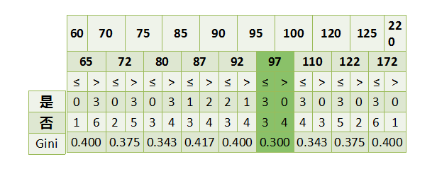
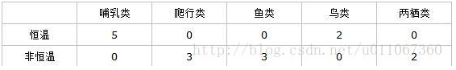
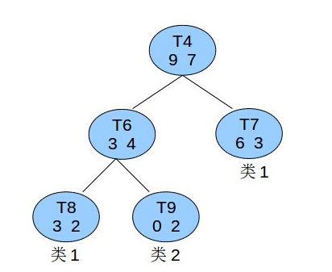

#
CART(Classification And Regression Tree)算法原理详解
#

##1. Gini指数
CART决策树是用"吉尼指数"来选择属性划分。数据集D的纯度可用基尼值来度量：
$$
Gini(D)=\sum_{k=1}^n\sum_{k'\not=k}p_kp_{k'}=1-\sum_{k=1}^np_k^2
$$
直观来说，$Gini(D)$反映了从数据集D中随机抽取两个样本，其类别标记不一致的概率。因此$Gini(D)$越小，数据集D纯度越高。因此属性$\alpha$的基尼指数定义为：
$$
Gini(D,\alpha)=\sum_{v=1}^V\frac {|D^v|}{|D|}Gini(D^v)
$$
假设数据集D在属性$\alpha$上有$V$个不同的取值，则用属性$\alpha$来划分时，一共有$v$个不同的分支。$D^v$指的是D中在$\alpha$属性上取值为$\alpha^v$的所有样本集合。$Gini(D^v)$指的是前面划分的子样本集合$D^v$在标签$label$上的$Gini$不纯度。

因此我们要做的就是在属性集合$A=\{\alpha_1,\alpha_2...,\alpha_n\}$中，我们需要找出使得$Gini(D,\alpha_i)$最小的$\alpha_i$，即：
$$
\alpha_*=\arg\min_{\alpha \in A}Gini(D,\alpha)
$$
下面以一个简单的例子来进行说明：

|ID|有房|婚姻状况|年收入|label(是否拖欠贷款)|
|--|---|-------|-----|-----------------|
|1 |是  |单身   |125K |否               |
|2 |否  |已婚   |100K |否               |
|3 |否  |单身   |70K  |否               |
|4 |是  |已婚   |120K |否               |
|5 |否  |离异   |95K  |是               |
|6 |否  |已婚   |60K  |否               |
|7 |是  |离异   |220K |否               |
|8 |否  |单身   |85K  |是               |
|9 |否  |已婚   |75K  |否               |
|10|否  |单身   |90K  |是               |

若采用是否有房作为分裂属性，则:

|     |有房|无房|
|-----|----|---|
|未拖欠|3   |4  |
|拖欠  |0   |3  |
则:
$$
Gini_{有房}=1-({\frac33})^2-({\frac 03})^2=0$；$Gini_{无房}=1-({\frac47})^2-({\frac 37})^2=0.4849
$$
故
$$
Gini_{house}=\frac 7{10}\times Gini_{无房}=\frac 7{10}\times 0.4849=0.343
$$
对于婚姻状况，有3种情况:

+ 是否离异
|     |单身或已婚|离异|
|-----|--------|    |
|未拖欠|6       |1   |
|拖欠  |2       |1   |
此时
$$
Gini_{t1}=1-(\frac 68)^2-(\frac 28)^2=0.375$，$Gini_{t2}=1-(\frac 12)^2-(\frac 12)^2=0.5
$$
则
$$
Gini_1=0.8\times 0.375+0.2\times 0.5=0.4
$$

+ 是否已婚
|     |单身或离异|已婚|
|-----|--------|    |
|未拖欠|3       |4   |
|拖欠  |3       |0   |

此时
$$
Gini_{t1}=1-(\frac 33)^2-(\frac 33)^2=0.5$，$Gini_{t2}=1-(\frac 44)^2=0
$$
则
$$
Gini_2=0.6\times 0.5=0.3
$$

+ 是否单身
|     |离异或已婚|单身|
|-----|--------|    |
|未拖欠|5       |2   |
|拖欠  |1       |2   |

此时
$$
Gini_{t1}=1-(\frac 56)^2-(\frac 16)^2=0.2778$，$Gini_{t2}=1-(\frac 22)^2-(\frac 22)^2=0.5
$$
则
$$
Gini_3=0.6\times 0.2778+0.4\times 0.5=0.3667
$$
对于连续属性年收入，假设个样本的集合一个属性有个连续的值，那么则会有个分裂点，每个分裂点为相邻两个连续值的均值，每个属性的划分按照能减少的杂质的量来进行排序。采用如下方式来计算：

分局基尼系数最小的原则，可以选择年收入是否大于97K或者是否已婚来作为第一步的分裂条件。

##2. 分裂的终止条件
+ 节点达到完全纯度

+ 树的深度达到用户要求的深度

+ 节点中样本个数少于指定数目

+ 分类条件和列别的相关程度很弱
此时说明分裂条件和类别独立，即此时的分裂条件是没有道理的，节点应该停止分裂。这里的分裂条件是按照上面的$Gini$Gini指数最小原则得到的分裂条件。独立性检验采用$\chi^2$检验法，例如下表：

此时动物类别与是否为恒温相互独立，再继续分裂没有意义，因此停止分裂。

##3. CART树的剪枝
CART采用复杂性剪枝法，即对于每一个非叶子节点计算它的表面误差率增益值$\alpha$：
$$
\alpha=\frac {R(t)-R(T_t)}{|N_{T_t}|-1}
$$
其中$|N_{T_t}|$是子树中包含的叶子节点个数。$R(t)$是节点的误差代价。$R(t)=r(t)*p(t)$，$r(t)$是节点$t$的误差率，$p(t)$是节点t上数据所占的比率。$R(T_t)$是子树的误差代价，如果该节点不被剪枝。它等于子树Tt上所有叶子节点的误差代价之和。例如：

则节点$t_4$的误差代价为：
$$
R(t)=r(t)*p(t)=\frac 7{16}*\frac {16}{60}=\frac 7{60}
$$
节点$t_4$的子树的误差代价为：
$$
R(T_t)=\sum R(i)= \frac 2{60}+\frac 3{60}=\frac 5{60}
$$
节点$t_4$的叶子节点共有3个，故：
$$
\alpha=\frac {R(t)-R(T_t)}{|N_{T_t}|-1}=\frac {7/60-5/60}{3-1}=\frac 16
$$
继续剪枝，并找出$\alpha$最小的非叶子节点，令其左右子树均为$NULL$。当多个非叶子节点的$\alpha$值同时达到最小时，取$|N_{T_t}|$最大的进行剪枝。

###剪枝停止的条件
在CART树中，对所有的非叶子节点都要进行剪枝，直到剪枝为只有1个根节点为止。此时会得到一系列的决策树$\{T_0,T_0,...,T_n\}$.然后采用交叉验证的方法，从$\{T_0,T_0,...,T_n\}$选出最优子树$T_{\alpha}$

>参考文献：
>1. 机器学习. 周志华
>2. 统计学习方法. 李航