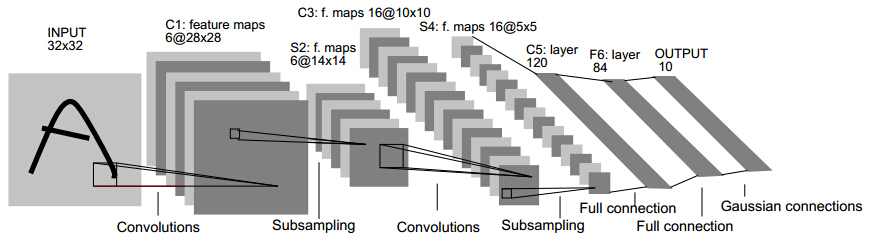
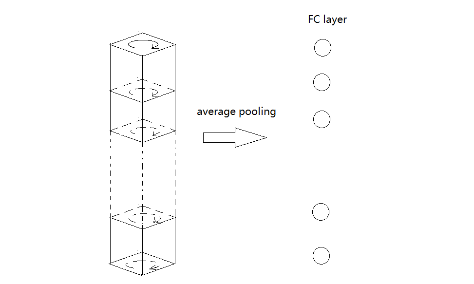
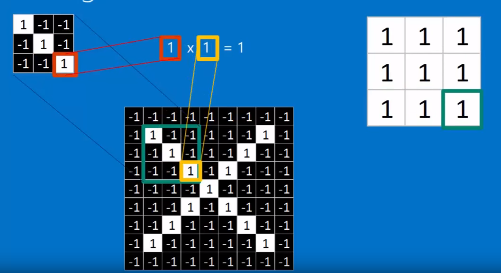

#<center>CNN简介</center>#

##1. 传统的神经网络和其他方法在图像处理方面的问题
灰度图像读入之后，就是一个单通道的矩阵，而彩色图像读入之后，就是一个3通道矩阵。当网络层数增大时，网络中的参数($weight$和$biases$)会急剧增大，给训练带来极大困难。且根据人脑的识图经验，需要识别图像中的局部特征，这些都是传统的神经网络难以做到的。传统的图像处理是提取图像中的特征，即图像的关键点，但是这种方法在图像处理中比较难以做到。基于这种情况，出现了卷积神经网络。

##2. 卷积神经网络的基本结构
传统的神经网络结构为：

从输入一直到输出，中间全部都是一维的$vector$。CNN在处理图像时，直接将图像作为3维的矩阵进行输入而不会先处理成一维的$vector$,因此保持了图像的本来空间顺序。

CNN的输入是一个3位的矩阵($width\times height\times channels$)。其中每一个像素点是一个神经元。总体上来说，CNN与传统的神经网络存在一些相似点，只不过CNN的神经元以3维矩阵的形式存在。一个CNN层包含以下3个操作：
+ convolution layer
+ pooling layer
+ activation layer(generally RELU function)


###2.1 convolution layer
卷积层的总体结构是：对于一个输入图像($n\times n\times channels$)，定义$K$个$filter(m\times m\times channels)$，$padding$为1，即在最外面的一圈加上0，每个$filter$作为一个stride从左往右从上往下划过去，没划过一次，用$filter$矩阵和图像上面划到的部分各个元素分别相乘然后求和得到新的矩阵对应元素的值，如下：

例如其中某一个计算结果为：-2+(-2)+(-1)+(2)+1=-2

在convolution操作中，例如前面一层神经元为$k\times k\times channels$，则后面的$filter$应该为$l\times l\times channels$。如果$fliter$的数目为$n$，则下一层的输出的层数为$n$，如下：

向这样不断卷积下去后，图像的宽和高会越来越小，但是通道数会越来越大。
单个卷积操作的计算示意图如下：

单个神经元的结构为：

对于一个$N\times N$的图像，如果$filter$为$f\times f$，$stride$为$s$，

则输出图像的大小为：
$$
output \hspace{0.1cm}size=\frac {N-F}{s}+1
$$
即$N-F$必须要能被$s$整除，否则不匹配。
为了防止图像$shrink$过快，通常会在外围加上$padding$，假设$padding$大小为$p$,

则输出图像大小为：
$$
output \hspace{0.1cm}size=\frac {N+2\times P-F}{s}+1
$$
对于$n$个$m\times m\times c$的filter，训练的参数个数为：
$$
m\times m\times c\times n + n=n(cm^2+1)
$$
其中后面的$n$是$biases$的数量。

###2.2 pooling layer
通常会在conv layer后面加上一个pool layer，可以逐步减小图像的大小从而来避免过拟合问题。pooling layer需要两个参数，pooling的大小$F\times F$，stride的大小$s$，因此假设pooling前的图像大小为$W_1\times H_1\times D_1$,pooling大小$F\times F$，stride为$s$,则pooling后的图像大小为：
$$
\begin{align}
W_2 &= \frac {W_1-F}s + 1\\
H_2 &= \frac {H_1-F}s + 1\\
D_2 &= D_1
\end{align}
$$
**在pooling操作中，通常不适用padding**。
pooling会在每个channel上面单独操作，常用的是$2\times 2$的filter,$stride$大小为2，因此图像会变为原来的$\frac 14$,即会丢弃掉$\%75$的数据。常用的pooling有：
+ max pooling: 取最大的元素
+ average pooling: 取平均值，可能会在最后Fully-Connected用到
+ L2 norm pooling

其中max pooling的基本操作为：


其中，最常用的是max pooling。

###2.3 Fully-Connected layer
将3维的图像转化为1维的vector的过程。假设最后一个pooling过后，图像大小为：$m\times m\times channels$，第一个Fully-Connected的神经元的数量为$n$,则此时全连接的参数数量为：
$$
N = m\times m\times channels\times n
$$
即每个神经元都和前面的神经元相连。但此时参数数量太多，因此可用的方法为，对最后一个pooling后的layer做一次average pooling之后再全连接，即将$m\times m\times channels$的图像的每一层取均值。

此时就可以极大减少参数的个数。

##3. 为何卷积神经网络能够学习出图像的特征
下面以一个例子来说明：假设要识别这样两种图像，

这是标准图形，对于下面的情况，CNN也应该能够识别出来：

在计算机当中，下面两张图并不相等：

卷积神经网络会进行下面的匹配

下面的一个filter可以选择出对角均为1的方格:

得到的新图像对应点的值也为1：

移到下个位置之后:


1个filter做完之后，得到的图为：

注意，所有的比较大的数全在正对角线上，这说明这些位置是满足filter的特性的。
对于所有的filter进行stride之后，得到的图像为：

因此一张图会变为一堆图:

以上是convolution的操作，接下来会用pooling操作来shrink每张得到的图像，步骤为：
+ 选择一个window size(通常是2或3)
+ 选择要给stride(通常是2)
+ 将选择的window一步步在图像上平移
+ 对每个移到的区域，取最大值


pooling完成之后，最大值仍然在对角线上，但此时图像大小变小了。
所有的pooling做完之后：

接下来会进行normalization操作，即RELU操作:


因此一张图做完convolution, max pooling, normalization(RELU)之后的图为:

重复几次之后的图为:

最后平铺形成FC-layer

最后的判别结果为：

如果有新的输入，则判别结果为：

还可以多加几个FC-layer：

整个的学习过程为:


**1. 卷积核(即convolution中的filter)通过BP学习得到**
**2. CNN使用场合：行和列不能随便变动的数据结构，例如时间序列(音频)，空间序列(图像)**

##4. 常见CNN网络
###4.1 Le Net

###4.1 Alex Net

注意：上面分两部分是因为当时分别用了2个CPU
###4.2 ZF Net

ZF Net只是在Alex Net上面做了一些修改，将第一个卷积层,第4、、5、6卷积层做了些变化。
###4.3 VGG Net


为减少参数数量，可以将pooling2在做一次average pooling再连到第一个FC layer上。
###4.4 Google Net


###4.5 Res Net


##5. TensorFlow实现简单的CNN手写数字识别
```python
import tensorflow as tf
from tensorflow.examples.tutorials.mnist import input_data

mnist = input_data.read_data_sets("/tmp/data/", one_hot=True)

n_classes = 10
batch_size = 128

x = tf.placeholder('float', [None, 784])
y = tf.placeholder('float')


def conv2d(x, W):
	return tf.nn.conv2d(x, W, strides=[1, 1, 1, 1], padding='SAME')


def maxpool2d(x):
	#                        size of window     movement of window
	return tf.nn.max_pool(x, ksize = [1,2,2,1], strides=[1,2,2,1],padding='SAME')


def convolutional_neural_network(x):
	weights = {'W_conv1': tf.Variable(tf.random_normal([5, 5, 1, 32])),
			   'W_conv2': tf.Variable(tf.random_normal([5, 5, 32, 64])),
			   'W_fc': tf.Variable(tf.random_normal([7*7*64, 1024])),
			   'out': tf.Variable(tf.random_normal([1024, n_classes]))}

	biases = {'b_conv1': tf.Variable(tf.random_normal([ 32])),
			   'b_conv2': tf.Variable(tf.random_normal([ 64])),
			   'b_fc': tf.Variable(tf.random_normal([1024])),
			   'out': tf.Variable(tf.random_normal([n_classes]))}

	x = tf.reshape(x, shape=[-1, 28, 28, 1])

	h_conv1 = tf.nn.relu(conv2d(x, weights['W_conv1'])+biases['b_conv1'])
	h_pool1 = maxpool2d(h_conv1)

	h_conv2 = tf.nn.relu(conv2d(h_pool1, weights['W_conv2']) + biases['b_conv2'])
	h_pool2 = maxpool2d(h_conv2)

	h_pool2_flat = tf.reshape(h_pool2, [-1, 7*7*64])
	h_fc1 = tf.nn.relu(tf.matmul(h_pool2_flat, weights['W_fc'])+biases['b_fc'])

	keep_prob = 0.8
	h_fc1_drop = tf.nn.dropout(h_fc1, keep_prob)

	output = tf.matmul(h_fc1_drop, weights['out'])+biases['out']
	return output


def train_neural_network(x):
	prediction = convolutional_neural_network(x)
	# OLD VERSION:
	# cost = tf.reduce_mean( tf.nn.softmax_cross_entropy_with_logits(prediction,y) )
	# NEW:
	cost = tf.reduce_mean(tf.nn.softmax_cross_entropy_with_logits(logits=prediction, labels=y))
	optimizer = tf.train.AdamOptimizer().minimize(cost)

	hm_epochs = 10
	with tf.Session() as sess:
		# OLD:
		# sess.run(tf.initialize_all_variables())
		# NEW:
		sess.run(tf.global_variables_initializer())

		for epoch in range(hm_epochs):
			epoch_loss = 0
			for _ in range(int(mnist.train.num_examples / batch_size)):
				epoch_x, epoch_y = mnist.train.next_batch(batch_size)
				_, c = sess.run([optimizer, cost], feed_dict={x: epoch_x, y: epoch_y})
				epoch_loss += c

			print('Epoch', epoch, 'completed out of', hm_epochs, 'loss:', epoch_loss)

		correct = tf.equal(tf.argmax(prediction, 1), tf.argmax(y, 1))

		accuracy = tf.reduce_mean(tf.cast(correct, 'float'))
		print('Accuracy:', accuracy.eval({x: mnist.test.images, y: mnist.test.labels}))


train_neural_network(x)
```