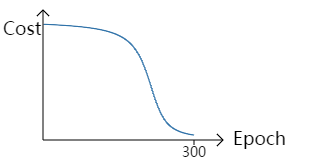
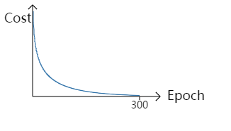

##1. 传统的损失函数存在的问题
传统二次损失函数为：
$$
J(W,b)=\frac 12(h_{W,b}(x)-y)^2+\frac \lambda{2K}\sum_{k \in K}w_{ij}^2
$$
权重和偏置的迭代方程为：
$$
\begin{align}
w_{ji}&=w_{ji}-\alpha\cdot \frac {\partial J}{\partial w_{ji}}\\
b_i^{(l)}&=b_i^{(l)}-\alpha\cdot \frac {\partial J}{\partial b_{i}^{(l)}}
\end{align}
$$
从上式可以看出，在学习率$\alpha$固定的情况下，权重和偏置的迭代快慢取决于损失对于权重$w$和偏置$b$的偏导，而损失函数对权重和偏置的偏导为：
$$
\begin{align}
\frac {\partial J}{\partial w_{ji}^{(l)}}&=\frac {\partial J}{\partial a_{j}^{(l+1)}}\cdot a_j^{(l+1)}(1-a_j^{(l+1)})a_i^{(l)}+\frac \lambda Kw_{ji}\\
&=\delta_j^{(l+1)}\cdot a_j^{(l+1)}(1-a_j^{(l+1)})a_i^{(l)}+\frac \lambda Kw_{ji}\\\\\\
\frac {\partial J}{\partial b_{i}^{(l)}}&=\frac {\partial J}{\partial a_{j}^{(l+1)}}\cdot a_j^{(l+1)}(1-a_j^{(l+1)})\\
&=\delta_j^{(l+1)}\cdot a_j^{(l+1)}(1-a_j^{(l+1)})
\end{align}
$$
从输出层一步步往输入层迭代，可以看出，$\delta_j^{(l+1)}$是后面一层已经计算过的，无法改变，而$a_i^{(l)}$是第$l$层和第$l+1$层的输入值，也无法改变。因此其实偏导的大小取决于第$l$层和第$l+1$层的输出值，即：
$$
\frac {\partial J}{\partial w_{ji}^{(l)}} \sim a_j^{(l+1)}(1-a_j^{(l+1)})\\
\frac {\partial J}{\partial b_{i}^{(l)}}  \sim a_j^{(l+1)}(1-a_j^{(l+1)})
$$
因此可以看出，当$a_j^{(l+1)}$接近$\frac 12$的时候偏导最大，学习速率最快，权重和骗到更新也最快，损失下降也最快。然而在刚开始和快要结束的时候，即$a_j^{(l+1)}$接近1和0的时候，学习速率会非常慢，因此整体的学习速率曲线为：

这可能会造成在有限的迭代次数($epochs$)内无法将损失降到一个较低的值。
##2. cross_entropy损失函数
为了解决这个问题，引入一个新的损失函数：
$$
J(W,b)=\sum_{(x^{(m)}, y^{(m)})}[y\ln h_{W,b}(x) + (1-y)\ln(1-h_{W,b}(x))] +\frac \lambda{2K}\sum_{k \in K}w_{ij}^2
$$
此时的偏导数为：
$$
\begin{align}
\frac {\partial J}{\partial w_{ji}^{(l)}}&=\sum_{(x^{(m)}, y^{(m)})}[\frac y{h_{W,b(x)}}\cdot \frac {\partial h_{W,b}(x)}{\partial w_{ji}}+\frac {1-y}{1-h_{W,b}(x)}\cdot \frac {\partial h_{W,b}(x)}{\partial w_{ji}}\cdot (-1)]+\frac \lambda{K}\sum_{k \in K}w_{ij}\\
&=\sum_{(x^{(m)}, y^{(m)})}[\frac {y-h_{W,b}(x)}{h_{W,b}(x)(1-h_{W,b}(x))}\cdot \frac {\partial h_{W,b}(x)}{\partial w_{ji}}]+\frac \lambda{2K}\sum_{k \in K}w_{ij}^2\\
\end{align}
$$
令$h_{W,b}(x)=a_j^{(l+1)}$，因此：
$$
\frac {\partial h_{W,b}(x)}{\partial w_{ji}}=a_j^{(l+1)}(1-a_j^{(l+1)})a_i^{(l)}
$$
上式为：
$$
\begin{align}
\frac {\partial J}{\partial w_{ji}^{(l)}}&=\sum_{(x^{(m)}, y^{(m)})}[\frac {y-a_j^{(l+1)}}{a_j^{(l+1)}(1-a_j^{(l+1)})}\cdot a_j^{(l+1)}(1-a_j^{(l+1)})a_i^{(l)}]+\frac \lambda{2K}\sum_{k \in K}w_{ij}\\
&=\sum_{(x^{(m)}, y^{(m)})}[a_i^{(l)}(y-a_j^{(l+1)})]+\frac \lambda{2K}\sum_{k \in K}w_{ij}
\end{align}
$$
此时$a_i^{(l)}$和$y$的值都是确定的不可改，因此此时偏导数取决于$y-a_j^{(l+1)}$，即后面一层的输出值与$y$的差值的大小，当与$y$差距较大时，偏导大，学习快，损失下降也快，当差值较小时，偏导极小，学习较慢，损失下降也较小，比较符合实际要求。整体的学习速率曲线为：

因此采用$cross\_entropy$能够解决二次损失函数的学习速率问题，被广泛采用。
##3. softmax激活函数
softmax与sigmod函数类似，一般用于输出层的激活函数：
$$
softmax(z_j)=\frac {e^{-z_j}}{\sum_{i=1}^ne^{-z_i}}
$$
其中：
$$
z_j=\sum_{i=1}^mw_{ji}^{(L-1)}a_i^{(L-1)}+b_j^{(L)}
$$
其实就是每一类占总体的比率，因此
$$
\sum_{j=1}^nsoftmax(z_j)=1
$$
$n$为输出神经元的个数。
softmax的损失函数为：
$$
J=-\ln a_j^{(L)}
$$