#<center>GAN简介</center>#
##1. Auto-Encoder
auto-encoder是一种无监督学习算法，研究的是将一个高维的向量或者矩阵进行encode，然后再decode，使得输出与输出值越接近越好。
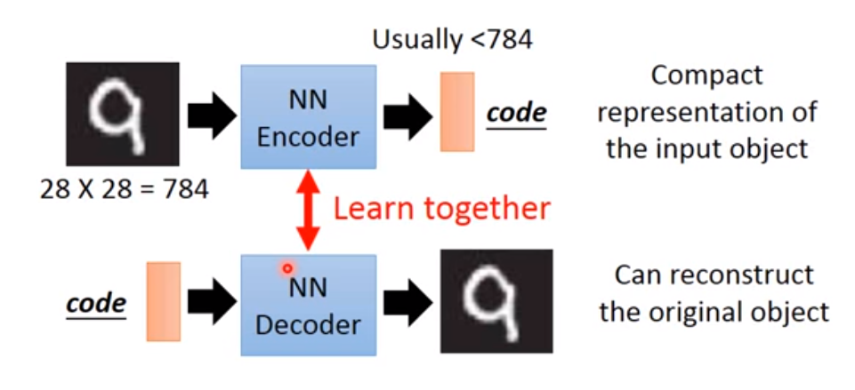
训练过程中，encoder和decoder是无法单独训练的，必须两个一起训练，然后训练完成后可以将encoder和decoder单独拿出来。
传统的PCA的过程为:
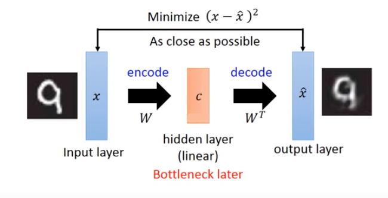
因此PCA是通过线性变换，将一个高维向量转换成一个低维的$code$，但是这里面只有一个$hidden\hspace{0.2cm}layer$。而$auto-encoder$则允许多个隐藏层：
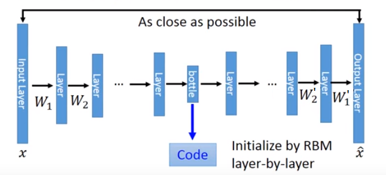
但是需要用$RBM(Restricted\hspace{0.2cm} Boltzmann\hspace{0.2cm} Machine)$来对权值进行初始化才能训练出比较好的结果。
Auto-Encoder可以用在文本检索上：
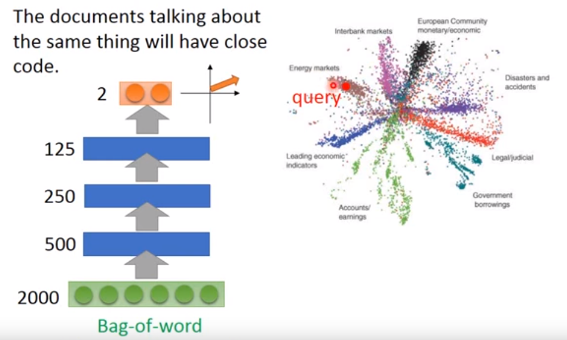
图像检索:
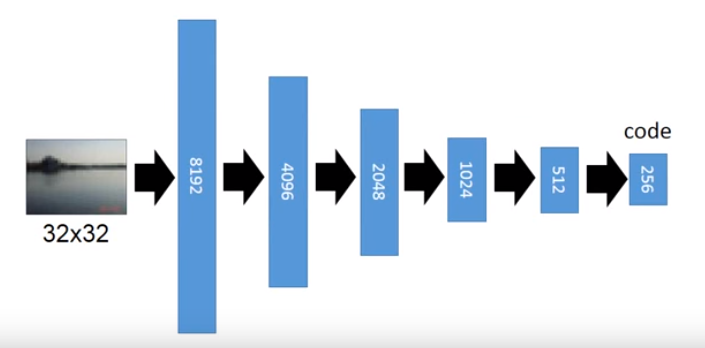
将图像压缩至256维，然后比较这256维向量的相似性，比直接比较图像的相似性效果要好。

De-noising auto-encoder：
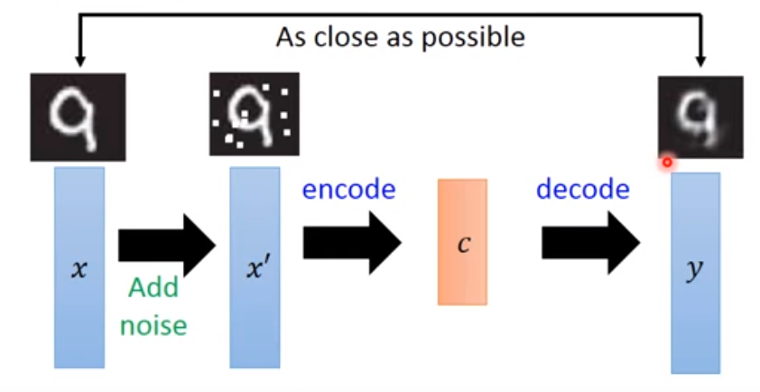
在图像上面人为加入一些噪声点，这样学习的结果鲁棒性更好。

**CNN里面的Auto-Encoder**:
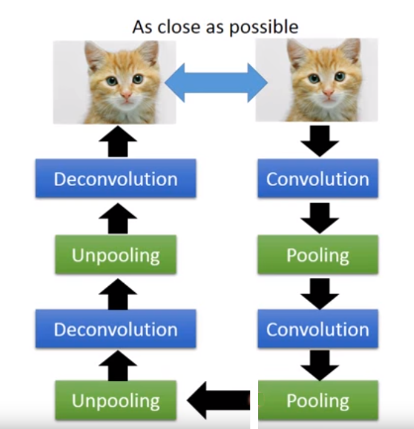
就是做unpooling和deconvolution操作，使得两个图片越相似越好。
1. unpooling操作
方法1:
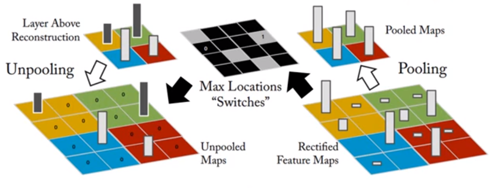
pooling的时候记住最大值的位置，unpooling的时候将其他地方填上0.
方法2:
不记住最大值的位置，unpooling的时候将其他地方填上最大值即可。
2. deconvolution操作
deconvolution操作其实就是convolution操作，由低维变高维的时候，在其他的地方填上0即可。
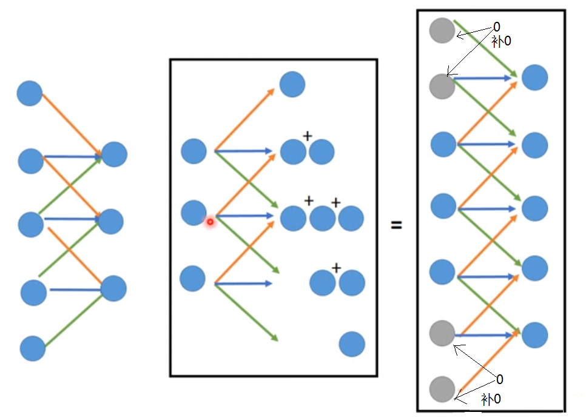

##2. VAE(Variational Auto-Encoder)
通常Auto-Encoder不能直接用来生成，需要用到VAE。
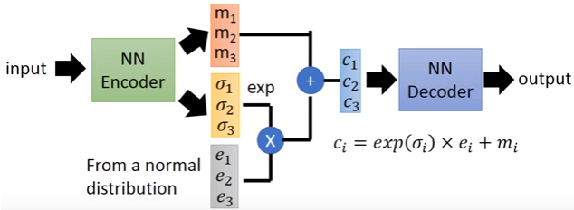
通常在学习$m_1, m_2, m_3, \cdots, m_n$之外，还会学习$\sigma_1, \sigma_2, \sigma_3, \cdots, \sigma_n$和$e_1, e_2, e_3,\cdots, e_n$。通常$e_1, e_2, e_3, \cdots, e_n$是从正太分不中取样出来的。
但这种情况最后学习的结果应该让$\sigma_i=0$。因此一般还会加上另一限制函数:
$$
l = \sum_{i=1}^n[(e^{\sigma_i}-(1+\sigma_i)+m_i^2)]
$$
因此需要使得$l$越小越好。此时$\sigma_i$会接近0。
##3. GAN的基本结构
由于VAE无法GAN类似于一个Auto-Encoder的不断演化的结构。训练过程为：
1. 首先将VAE的decoder拿出来，然后产生一组假的数据，并标记为0。然后取一些真的数据，并标记为1：
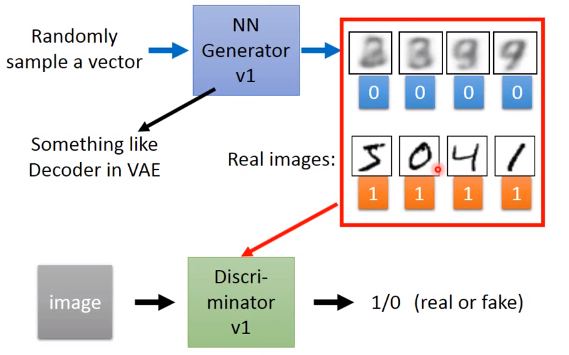
2. 训练下一个Generator
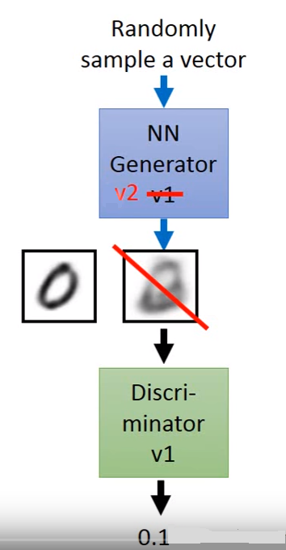
此时的Discriminator能够分辨假的数据和真实的数据，因此对于假的数据，会输出一个比较小的分数。然后固定Discriminator的参数不懂，只不断调整Generator的参数，使得Generator产生的图片无法被Discriminator判别为假即可。
3. 将Generator和Discriminator连接成一个网络
$$
Generator + Discriminator => GAN
$$
4. 注意，每次训练Generator和Discrimator的时候，只能训练一个，另一个必须要固定参数。即训练Generator的时候，Discriminator的参数不能动。训练Discriminator的时候，Generator的参数不能动。

##4. GAN的基本原理
首先从现有的数据中挑选出一批数据，组成$P_{data}(x)$，然后训练一个$P_G(x; \theta)$来产生数据(例如一个高斯混合模型)，我们希望产生的数据集$P_G(x; \theta)$与原来的数据$P_{data}(x)$越接近越好，即使得下面的似然函数达到最大值：
$$
L=\prod_{i=1}^mP_G(x^i; \theta)
$$
因此需要求得的参数为：
$$
\theta^*=\arg\max_\theta\prod_{i=1}^mP_G(x^i; \theta)
$$
取对数，得：
$$
\begin{align}
\theta^*&=\arg\max_\theta\sum_{i=1}^m\ln P_G(x^i; \theta) \hspace{1.0cm}\{x^1, x^2, \cdots, x^m\}\in P_{data}(x)\\
&\approx\arg\max_\theta E_{x\sim P_{data}}[\ln P_G(x; \theta)]\\
&=\arg\max_\theta[\int_xP_{data}(x)\ln P_G(x; \theta)dx-\int_xP_{data}(x)\ln P_{data}(x)dx]\\
&=\arg\min_\theta KL(P_{data}(x)||P_G(x; \theta))
\end{align}
$$
即最后需要使得$P_{data}(x)$和$P_G(x; \theta)$的$KL \hspace{0.2cm} divergence$达到最小，即这两个分布越相近越好。
在$GAN$当中，$P_G(x; \theta)$就是一个神经网络，$\theta$就是网络的各种参数：
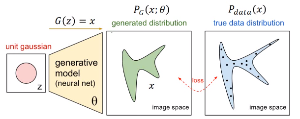
此时可以选择一个分布$z$，然后通过一个神经网络产生一组数据$P_G(x; \theta)$，使得$P_G(x; \theta)$与$P_{data}(x)$越接近越好，因此：
$$
P_G(x)=\int_zP_{prior}(z)I_{[G(z)=x]}dz
$$
表示枚举所有可能的$z$，然后对其就行求积分。其中$P_{prior}(z)$表示点$z$出现的概率，$I_{[G(z)=x]}$表示当$G(z)$与$x$相等时取$1$，否则取$0$。
但是$\int_zP_{prior}(z)I_{[G(z)=x]}dz$不好计算，因此$GAN$采用$Discriminator$来计算$KL \hspace{0.2cm} divergence$。$Discriminator$会输出一个数值$V(G, D)$来表示产生的数据和实际的数据之间的差值，因此其实要求的$G$为:
$$
G^*=\arg\min_G\max_DV(G,D)
$$
其中
$$
\begin{align}
V(G, D)&=E_{x\sim P_{data}}[\ln D(x)]+E_{x\sim P_G}[\ln(1-D(x))]\\
&=\int_x[P_{data}(x)\ln D(x)+P_G(x)\ln (1-D(x))]dx
\end{align}
$$
解得：
$$
D^*=\frac {P_{data(x)}}{P_{data}(x)+P_G(x)}
$$
最终，给定$G$，有：
$$
\begin{align}
\max_DV(G, D)&=-2\ln2+\int_xP_{data}(x)\ln \frac {P_{data}(x)}{(P_{data}(x)+P_G(x))/2}dx+\\
&\hspace{2.5cm}\int_xP_{G}(x)\ln \frac {P_{G}(x)}{(P_{data}(x)+P_G(x))/2}dx\\
&=-2\ln2+KL(P_{data}(x)||\frac {P_{data}(x)+P_G(x)}{2})+\\
&\hspace{2.5cm}KL(P_G(x)||\frac {P_{data}(x)+P_G(x)}{2})\\
&=-2\ln2+2JSD(P_{data}(x)||P_G(x))
\end{align}
$$
因此最优的$P_G(x)$就是$P_{data}(x)$,因此：
$$
G^*=\arg\min_G\max_DV(G,D)
$$
令
$$
L(G)=\max_DV(G,D)
$$
解决过程为：
$$
\theta_G=\theta-\eta\frac{\partial L(G)}{\partial \theta_G}
$$
这样得到$G$即可。
整个算法的过程为：
1. 从真实的数据分布$P_{data}(x)$中取样一些数据$\{x^1, x^2, \cdots, x^m\}$
2. 从预先的encoder中取出一些数据$\{z^1, z^2, \cdots, z^m\}$
3. 通过$\{z^1, z^2, \cdots, z^m\}$得到一些数据$\{\widetilde x^1, \widetilde x^2, \cdots, \widetilde x^m\}$，其中$\widetilde x^i=G(z^i)$
4. 改变$discriminator$的参数：
$$
\begin{align}
\widetilde V&=\frac 1m\sum_{i=1}^m\ln D(x^i)+\frac 1m\sum_{i=1}^m\ln(1-D(\widetilde x^i))\\
\theta_d&=\theta_d+\eta\nabla \widetilde V(\theta_d)
\end{align}
$$
使得失眠的$\widetilde V$到达**最大**
5. 重复2中的步骤，然后改变$generator$的参数，使得下式的$\widetilde V$到达**最小**。
$$
\begin{align}
\widetilde V&=\frac 1m\sum_{i=1}^m\ln(1-D(\widetilde x^i))\\
\theta_g&=\theta_g-\eta\nabla \widetilde V(\theta_g)
\end{align}
$$
6. 重复4，5。
**注意**
**上式中的$D(x^i)$表示的是真实图片被判别为1的概率，$D(\widetilde x^i)$表示生成的图片被判别为1的概率。因子Discriminator就是要使得$D(x^i)$接近1，$D(\widetilde x^i)$接近0。而Generator就是要使得$D(\widetilde x^i)$接近1。**
>[lan Goodfellow GAN教程](http://www.cs.toronto.edu/~dtarlow/pos14/talks/goodfellow.pdf)

##5. GAN的难点和研究现状：
###5.1 难点：
1. 不收敛(non-convergence)：很多情况下不稳定，无法收敛,即使在每一个block都是用batch normalization也是一样难收敛，因此学习出来的图片总体效果不佳。原因是容易陷入局部最优：
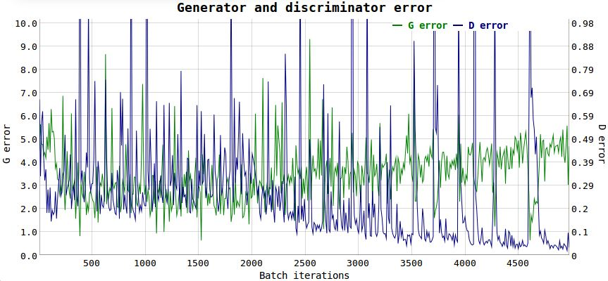

2. 模式崩溃(mode collapse):生成的东西多样性不够，基本上会带有部分的几个特征。解决办法：
2.1 使用minibatch: 把数据分成小的batch,并保证太相似的数据样本不放到一个batch里面，这样尽量保证每一次跑的数据都足够多样。
2.2 unrolling GAN: 不是每次都是用判别模型D,而是把K次的D保存起来，然后选择损失最小的那个

3. 评估困难(hard to evaluate)：很多时候生成的图片差别较大，机器无法判断这些生成的图片对不对。
Likelihood较大的模型可能生成较差的图片。有的时候生成较好的图片的model可能likelihood比较小。同时也没有一个好的方法来评价生成的图片到底好不好，目前主要还是人用肉眼来看。
4. 离散输出(Discrete outputs)：目前的输出值都是连续的，如果G想要输出离散的数值，会遇到无法微分的情况。

##5.2 研究现状：
GAN从2014年Ian Goodfellow提出以来，呈现爆炸式增长。
1. 目前图像生成领域的state-of-art的是：[PPNG]("https://arxiv.org/abs/1612.00005")
2. 各种各样的GAN:

<center>每年每个月关于GAN的定会论文数量：</center>
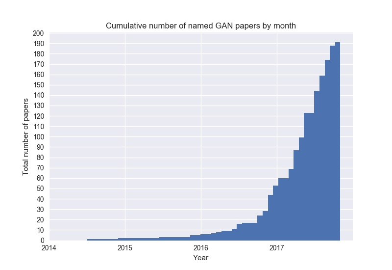
* 3D-GAN - [Learning a Probabilistic Latent Space of Object Shapes via 3D Generative-Adversarial Modeling](https://arxiv.org/abs/1610.07584) ([github](https://github.com/zck119/3dgan-release))
* 3D-IWGAN - [Improved Adversarial Systems for 3D Object Generation and Reconstruction](https://arxiv.org/abs/1707.09557) ([github](https://github.com/EdwardSmith1884/3D-IWGAN))
* 3D-RecGAN - [3D Object Reconstruction from a Single Depth View with Adversarial Learning](https://arxiv.org/abs/1708.07969) ([github](https://github.com/Yang7879/3D-RecGAN))
* ABC-GAN - [ABC-GAN: Adaptive Blur and Control for improved training stability of Generative Adversarial Networks](https://drive.google.com/file/d/0B3wEP_lEl0laVTdGcHE2VnRiMlE/view) ([github](https://github.com/IgorSusmelj/ABC-GAN))
* AC-GAN - [Conditional Image Synthesis With Auxiliary Classifier GANs](https://arxiv.org/abs/1610.09585) 
* acGAN - [Face Aging With Conditional Generative Adversarial Networks](https://arxiv.org/abs/1702.01983) 
* AdaGAN - [AdaGAN: Boosting Generative Models](https://arxiv.org/abs/1701.02386v1) 
* AE-GAN - [AE-GAN: adversarial eliminating with GAN](https://arxiv.org/abs/1707.05474) 
* AEGAN - [Learning Inverse Mapping by Autoencoder based Generative Adversarial Nets](https://arxiv.org/abs/1703.10094) 
* AffGAN - [Amortised MAP Inference for Image Super-resolution](https://arxiv.org/abs/1610.04490) 
* AL-CGAN - [Learning to Generate Images of Outdoor Scenes from Attributes and Semantic Layouts](https://arxiv.org/abs/1612.00215) 
* ALI - [Adversarially Learned Inference](https://arxiv.org/abs/1606.00704) 
* AlignGAN - [AlignGAN: Learning to Align Cross-Domain Images with Conditional Generative Adversarial Networks](https://arxiv.org/abs/1707.01400) 
* AM-GAN - [Activation Maximization Generative Adversarial Nets](https://arxiv.org/abs/1703.02000) 
* AnoGAN - [Unsupervised Anomaly Detection with Generative Adversarial Networks to Guide Marker Discovery](https://arxiv.org/abs/1703.05921v1) 
* ARAE - [Adversarially Regularized Autoencoders for Generating Discrete Structures](https://arxiv.org/abs/1706.04223) ([github](https://github.com/jakezhaojb/ARAE))
* ARDA - [Adversarial Representation Learning for Domain Adaptation](https://arxiv.org/abs/1707.01217) 
* ARIGAN - [ARIGAN: Synthetic Arabidopsis Plants using Generative Adversarial Network](https://arxiv.org/abs/1709.00938) 
* ArtGAN - [ArtGAN: Artwork Synthesis with Conditional Categorial GANs](https://arxiv.org/abs/1702.03410) 
* b-GAN - [Generative Adversarial Nets from a Density Ratio Estimation Perspective](https://arxiv.org/abs/1610.02920) 
* Bayesian GAN - [Deep and Hierarchical Implicit Models](https://arxiv.org/abs/1702.08896) 
* Bayesian GAN - [Bayesian GAN](https://arxiv.org/abs/1705.09558) 
* BCGAN - [Bayesian Conditional Generative Adverserial Networks](https://arxiv.org/abs/1706.05477) 
* BEGAN - [BEGAN: Boundary Equilibrium Generative Adversarial Networks](https://arxiv.org/abs/1703.10717) 
* BGAN - [Binary Generative Adversarial Networks for Image Retrieval](https://arxiv.org/abs/1708.04150) ([github](https://github.com/htconquer/BGAN))
* BiGAN - [Adversarial Feature Learning](https://arxiv.org/abs/1605.09782v7) 
* BS-GAN - [Boundary-Seeking Generative Adversarial Networks](https://arxiv.org/abs/1702.08431v1) 
* C-RNN-GAN - [C-RNN-GAN: Continuous recurrent neural networks with adversarial training](https://arxiv.org/abs/1611.09904) ([github](https://github.com/olofmogren/c-rnn-gan/))
* CaloGAN - [CaloGAN: Simulating 3D High Energy Particle Showers in Multi-Layer Electromagnetic Calorimeters with Generative Adversarial Networks](https://arxiv.org/abs/1705.02355) ([github](https://github.com/hep-lbdl/CaloGAN))
* CAN - [CAN: Creative Adversarial Networks, Generating Art by Learning About Styles and Deviating from Style Norms](https://arxiv.org/abs/1706.07068) 
* CatGAN - [Unsupervised and Semi-supervised Learning with Categorical Generative Adversarial Networks](https://arxiv.org/abs/1511.06390v2) 
* CausalGAN - [CausalGAN: Learning Causal Implicit Generative Models with Adversarial Training](https://arxiv.org/abs/1709.02023) 
* CC-GAN - [Semi-Supervised Learning with Context-Conditional Generative Adversarial Networks](https://arxiv.org/abs/1611.06430) ([github](https://github.com/edenton/cc-gan))
* CDcGAN - [Simultaneously Color-Depth Super-Resolution with Conditional Generative Adversarial Network](https://arxiv.org/abs/1708.09105) 
* CGAN - [Conditional Generative Adversarial Nets](https://arxiv.org/abs/1411.1784) 
* CGAN - [Controllable Generative Adversarial Network](https://arxiv.org/abs/1708.00598) 
* Chekhov GAN - [An Online Learning Approach to Generative Adversarial Networks](https://arxiv.org/abs/1706.03269) 
* CM-GAN - [CM-GANs: Cross-modal Generative Adversarial Networks for Common Representation Learning](https://arxiv.org/abs/1710.05106) 
* CoGAN - [Coupled Generative Adversarial Networks](https://arxiv.org/abs/1606.07536v2) 
* Conditional cycleGAN - [Conditional CycleGAN for Attribute Guided Face Image Generation](https://arxiv.org/abs/1705.09966) 
* constrast-GAN - [Generative Semantic Manipulation with Contrasting GAN](https://arxiv.org/abs/1708.00315) 
* Context-RNN-GAN - [Contextual RNN-GANs for Abstract Reasoning Diagram Generation](https://arxiv.org/abs/1609.09444) 
* Coulomb GAN - [Coulomb GANs: Provably Optimal Nash Equilibria via Potential Fields](https://arxiv.org/abs/1708.08819) 
* Cramèr GAN  - [The Cramer Distance as a Solution to Biased Wasserstein Gradients](https://arxiv.org/abs/1705.10743) 
* crVAE-GAN - [Channel-Recurrent Variational Autoencoders](https://arxiv.org/abs/1706.03729) 
* CS-GAN - [Improving Neural Machine Translation with Conditional Sequence Generative Adversarial Nets](https://arxiv.org/abs/1703.04887) 
* CVAE-GAN - [CVAE-GAN: Fine-Grained Image Generation through Asymmetric Training](https://arxiv.org/abs/1703.10155) 
* CycleGAN - [Unpaired Image-to-Image Translation using Cycle-Consistent Adversarial Networks](https://arxiv.org/abs/1703.10593) ([github](https://github.com/junyanz/CycleGAN))
* D2GAN - [Dual Discriminator Generative Adversarial Nets](http://arxiv.org/abs/1709.03831) 
* DAN - [Distributional Adversarial Networks](https://arxiv.org/abs/1706.09549) 
* DCGAN - [Unsupervised Representation Learning with Deep Convolutional Generative Adversarial Networks](https://arxiv.org/abs/1511.06434) ([github](https://github.com/Newmu/dcgan_code))
* DeliGAN - [DeLiGAN : Generative Adversarial Networks for Diverse and Limited Data](https://arxiv.org/abs/1706.02071) ([github](https://github.com/val-iisc/deligan))
* DiscoGAN - [Learning to Discover Cross-Domain Relations with Generative Adversarial Networks](https://arxiv.org/abs/1703.05192v1) 
* DistanceGAN - [One-Sided Unsupervised Domain Mapping](https://arxiv.org/abs/1706.00826) 
* DM-GAN - [Dual Motion GAN for Future-Flow Embedded Video Prediction](https://arxiv.org/abs/1708.00284) 
* DR-GAN - [Representation Learning by Rotating Your Faces](https://arxiv.org/abs/1705.11136) 
* DRAGAN - [How to Train Your DRAGAN](https://arxiv.org/abs/1705.07215) ([github](https://github.com/kodalinaveen3/DRAGAN))
* DSP-GAN - [Depth Structure Preserving Scene Image Generation](https://arxiv.org/abs/1706.00212) 
* DTN - [Unsupervised Cross-Domain Image Generation](https://arxiv.org/abs/1611.02200) 
* DualGAN - [DualGAN: Unsupervised Dual Learning for Image-to-Image Translation](https://arxiv.org/abs/1704.02510v1) 
* Dualing GAN - [Dualing GANs](https://arxiv.org/abs/1706.06216) 
* EBGAN - [Energy-based Generative Adversarial Network](https://arxiv.org/abs/1609.03126v4) 
* ED//GAN - [Stabilizing Training of Generative Adversarial Networks through Regularization](https://arxiv.org/abs/1705.09367) 
* EGAN - [Enhanced Experience Replay Generation for Efficient Reinforcement Learning](https://arxiv.org/abs/1705.08245) 
* ExprGAN - [ExprGAN: Facial Expression Editing with Controllable Expression Intensity](https://arxiv.org/abs/1709.03842) 
* f-GAN - [f-GAN: Training Generative Neural Samplers using Variational Divergence Minimization](https://arxiv.org/abs/1606.00709) 
* FF-GAN - [Towards Large-Pose Face Frontalization in the Wild](https://arxiv.org/abs/1704.06244) 
* Fila-GAN - [Synthesizing Filamentary Structured Images with GANs](https://arxiv.org/abs/1706.02185) 
* Fisher GAN - [Fisher GAN](https://arxiv.org/abs/1705.09675) 
* Flow-GAN - [Flow-GAN: Bridging implicit and prescribed learning in generative models](https://arxiv.org/abs/1705.08868) 
* GAMN - [Generative Adversarial Mapping Networks](https://arxiv.org/abs/1709.09820) 
* GAN - [Generative Adversarial Networks](https://arxiv.org/abs/1406.2661) ([github](https://github.com/goodfeli/adversarial))
* GAN-CLS - [Generative Adversarial Text to Image Synthesis](https://arxiv.org/abs/1605.05396) ([github](https://github.com/reedscot/icml2016))
* GAN-sep - [GANs for Biological Image Synthesis](https://arxiv.org/abs/1708.04692) ([github](https://github.com/aosokin/biogans))
* GAN-VFS - [Generative Adversarial Network-based Synthesis of Visible Faces from Polarimetric Thermal Faces](https://arxiv.org/abs/1708.02681) 
* GANCS - [Deep Generative Adversarial Networks for Compressed Sensing Automates MRI](https://arxiv.org/abs/1706.00051) 
* GAP - [Context-Aware Generative Adversarial Privacy](https://arxiv.org/abs/1710.09549) 
* GAWWN - [Learning What and Where to Draw](https://arxiv.org/abs/1610.02454) ([github](https://github.com/reedscot/nips2016))
* GeneGAN - [GeneGAN: Learning Object Transfiguration and Attribute Subspace from Unpaired Data](https://arxiv.org/abs/1705.04932) ([github](https://github.com/Prinsphield/GeneGAN))
* Geometric GAN - [Geometric GAN](https://arxiv.org/abs/1705.02894) 
* GMAN - [Generative Multi-Adversarial Networks](http://arxiv.org/abs/1611.01673) 
* GMM-GAN - [Towards Understanding the Dynamics of Generative Adversarial Networks](https://arxiv.org/abs/1706.09884) 
* GoGAN - [Gang of GANs: Generative Adversarial Networks with Maximum Margin Ranking](https://arxiv.org/abs/1704.04865) 
* GP-GAN - [GP-GAN: Towards Realistic High-Resolution Image Blending](https://arxiv.org/abs/1703.07195) ([github](https://github.com/wuhuikai/GP-GAN))
* GP-GAN - [GP-GAN: Gender Preserving GAN for Synthesizing Faces from Landmarks](https://arxiv.org/abs/1710.00962) 
* GRAN - [Generating images with recurrent adversarial networks](https://arxiv.org/abs/1602.05110) ([github](https://github.com/jiwoongim/GRAN))
* IAN - [Neural Photo Editing with Introspective Adversarial Networks](https://arxiv.org/abs/1609.07093) ([github](https://github.com/ajbrock/Neural-Photo-Editor))
* IcGAN - [Invertible Conditional GANs for image editing](https://arxiv.org/abs/1611.06355) ([github](https://github.com/Guim3/IcGAN))
* ID-CGAN - [Image De-raining Using a Conditional Generative Adversarial Network](https://arxiv.org/abs/1701.05957v3) 
* iGAN - [Generative Visual Manipulation on the Natural Image Manifold](https://arxiv.org/abs/1609.03552v2) ([github](https://github.com/junyanz/iGAN))
* Improved GAN - [Improved Techniques for Training GANs](https://arxiv.org/abs/1606.03498) ([github](https://github.com/openai/improved-gan))
* InfoGAN - [InfoGAN: Interpretable Representation Learning by Information Maximizing Generative Adversarial Nets](https://arxiv.org/abs/1606.03657v1) ([github](https://github.com/openai/InfoGAN))
* IRGAN - [IRGAN: A Minimax Game for Unifying Generative and Discriminative Information Retrieval models](https://arxiv.org/abs/1705.10513v1) 
* IWGAN - [On Unifying Deep Generative Models](https://arxiv.org/abs/1706.00550) 
* l-GAN - [Representation Learning and Adversarial Generation of 3D Point Clouds](https://arxiv.org/abs/1707.02392) 
* LAGAN - [Learning Particle Physics by Example: Location-Aware Generative Adversarial Networks for Physics Synthesis](https://arxiv.org/abs/1701.05927) 
* LAPGAN - [Deep Generative Image Models using a Laplacian Pyramid of Adversarial Networks](https://arxiv.org/abs/1506.05751) ([github](https://github.com/facebook/eyescream))
* LD-GAN - [Linear Discriminant Generative Adversarial Networks](https://arxiv.org/abs/1707.07831) 
* LDAN - [Label Denoising Adversarial Network (LDAN) for Inverse Lighting of Face Images](https://arxiv.org/abs/1709.01993) 
* LeakGAN - [Long Text Generation via Adversarial Training with Leaked Information](https://arxiv.org/abs/1709.08624) 
* LeGAN - [Likelihood Estimation for Generative Adversarial Networks](https://arxiv.org/abs/1707.07530) 
* LR-GAN - [LR-GAN: Layered Recursive Generative Adversarial Networks for Image Generation](https://arxiv.org/abs/1703.01560v1) 
* LS-GAN - [Loss-Sensitive Generative Adversarial Networks on Lipschitz Densities](https://arxiv.org/abs/1701.06264) 
* LSGAN - [Least Squares Generative Adversarial Networks](https://arxiv.org/abs/1611.04076v3) 
* MAD-GAN - [Multi-Agent Diverse Generative Adversarial Networks](https://arxiv.org/abs/1704.02906) 
* MAGAN - [MAGAN: Margin Adaptation for Generative Adversarial Networks](https://arxiv.org/abs/1704.03817v1) 
* MalGAN - [Generating Adversarial Malware Examples for Black-Box Attacks Based on GAN](https://arxiv.org/abs/1702.05983v1) 
* MaliGAN - [Maximum-Likelihood Augmented Discrete Generative Adversarial Networks](https://arxiv.org/abs/1702.07983) 
* MARTA-GAN - [Deep Unsupervised Representation Learning for Remote Sensing Images](https://arxiv.org/abs/1612.08879) 
* McGAN - [McGan: Mean and Covariance Feature Matching GAN](https://arxiv.org/abs/1702.08398v1) 
* MD-GAN - [Learning to Generate Time-Lapse Videos Using Multi-Stage Dynamic Generative Adversarial Networks](https://arxiv.org/abs/1709.07592) 
* MDGAN - [Mode Regularized Generative Adversarial Networks](https://arxiv.org/abs/1612.02136) 
* MedGAN - [Generating Multi-label Discrete Electronic Health Records using Generative Adversarial Networks](https://arxiv.org/abs/1703.06490v1) 
* MGAN - [Precomputed Real-Time Texture Synthesis with Markovian Generative Adversarial Networks](https://arxiv.org/abs/1604.04382) ([github](https://github.com/chuanli11/MGANs))
* MGGAN - [Multi-Generator Generative Adversarial Nets](https://arxiv.org/abs/1708.02556) 
* MIX+GAN - [Generalization and Equilibrium in Generative Adversarial Nets (GANs)](https://arxiv.org/abs/1703.00573v3) 
* MMD-GAN - [MMD GAN: Towards Deeper Understanding of Moment Matching Network](https://arxiv.org/abs/1705.08584) ([github](https://github.com/dougalsutherland/opt-mmd))
* MMGAN - [MMGAN: Manifold Matching Generative Adversarial Network for Generating Images](https://arxiv.org/abs/1707.08273) 
* MoCoGAN - [MoCoGAN: Decomposing Motion and Content for Video Generation](https://arxiv.org/abs/1707.04993) ([github](https://github.com/sergeytulyakov/mocogan))
* MPM-GAN - [Message Passing Multi-Agent GANs](https://arxiv.org/abs/1612.01294) 
* MuseGAN - [MuseGAN: Symbolic-domain Music Generation and Accompaniment with Multi-track Sequential Generative Adversarial Networks](https://arxiv.org/abs/1709.06298) 
* MV-BiGAN - [Multi-view Generative Adversarial Networks](https://arxiv.org/abs/1611.02019v1) 
* OptionGAN - [OptionGAN: Learning Joint Reward-Policy Options using Generative Adversarial Inverse Reinforcement Learning](https://arxiv.org/abs/1709.06683) 
* ORGAN - [Objective-Reinforced Generative Adversarial Networks (ORGAN) for Sequence Generation Models ](https://arxiv.org/abs/1705.10843) 
* PAN - [Perceptual Adversarial Networks for Image-to-Image Transformation](https://arxiv.org/abs/1706.09138) 
* PassGAN - [PassGAN: A Deep Learning Approach for Password Guessing](https://arxiv.org/abs/1709.00440) 
* Perceptual GAN - [Perceptual Generative Adversarial Networks for Small Object Detection](https://arxiv.org/abs/1706.05274) 
* PGAN - [Probabilistic Generative Adversarial Networks](https://arxiv.org/abs/1708.01886) 
* pix2pix - [Image-to-Image Translation with Conditional Adversarial Networks](https://arxiv.org/abs/1611.07004) ([github](https://github.com/phillipi/pix2pix))
* PixelGAN - [PixelGAN Autoencoders](https://arxiv.org/abs/1706.00531) 
* Pose-GAN - [The Pose Knows: Video Forecasting by Generating Pose Futures](https://arxiv.org/abs/1705.00053) 
* PPGN - [Plug & Play Generative Networks: Conditional Iterative Generation of Images in Latent Space](https://arxiv.org/abs/1612.00005) 
* PrGAN - [3D Shape Induction from 2D Views of Multiple Objects](https://arxiv.org/abs/1612.05872) 
* PSGAN - [Learning Texture Manifolds with the Periodic Spatial GAN](http://arxiv.org/abs/1705.06566) 
* RankGAN - [Adversarial Ranking for Language Generation ](https://arxiv.org/abs/1705.11001) 
* RCGAN - [Real-valued (Medical) Time Series Generation with Recurrent Conditional GANs](https://arxiv.org/abs/1706.02633) 
* RefineGAN - [Compressed Sensing MRI Reconstruction with Cyclic Loss in Generative Adversarial Networks](https://arxiv.org/abs/1709.00753) 
* RenderGAN - [RenderGAN: Generating Realistic Labeled Data](https://arxiv.org/abs/1611.01331) 
* ResGAN - [Generative Adversarial Network based on Resnet for Conditional Image Restoration](https://arxiv.org/abs/1707.04881) 
* RNN-WGAN - [Language Generation with Recurrent Generative Adversarial Networks without Pre-training](https://arxiv.org/abs/1706.01399) ([github](https://github.com/amirbar/rnn.wgan))
* RPGAN - [Stabilizing GAN Training with Multiple Random Projections](https://arxiv.org/abs/1705.07831) ([github](https://github.com/ayanc/rpgan))
* RTT-GAN - [Recurrent Topic-Transition GAN for Visual Paragraph Generation](https://arxiv.org/abs/1703.07022v2) 
* RWGAN - [Relaxed Wasserstein with Applications to GANs](https://arxiv.org/abs/1705.07164) 
* SAD-GAN - [SAD-GAN: Synthetic Autonomous Driving using Generative Adversarial Networks](https://arxiv.org/abs/1611.08788v1) 
* SalGAN - [SalGAN: Visual Saliency Prediction with Generative Adversarial Networks](https://arxiv.org/abs/1701.01081) ([github](https://github.com/imatge-upc/saliency-salgan-2017))
* SBADA-GAN - [From source to target and back: symmetric bi-directional adaptive GAN](https://arxiv.org/abs/1705.08824) 
* SD-GAN - [Semantically Decomposing the Latent Spaces of Generative Adversarial Networks](https://arxiv.org/abs/1705.07904) 
* SEGAN - [SEGAN: Speech Enhancement Generative Adversarial Network](https://arxiv.org/abs/1703.09452v1) 
* SeGAN - [SeGAN: Segmenting and Generating the Invisible](https://arxiv.org/abs/1703.10239) 
* SegAN - [SegAN: Adversarial Network with Multi-scale L1 Loss for Medical Image Segmentation](https://arxiv.org/abs/1706.01805) 
* SeqGAN - [SeqGAN: Sequence Generative Adversarial Nets with Policy Gradient](https://arxiv.org/abs/1609.05473v5) ([github](https://github.com/LantaoYu/SeqGAN))
* SGAN - [Texture Synthesis with Spatial Generative Adversarial Networks](https://arxiv.org/abs/1611.08207) 
* SGAN - [Stacked Generative Adversarial Networks](https://arxiv.org/abs/1612.04357v4) ([github](https://github.com/xunhuang1995/SGAN))
* SGAN - [Steganographic Generative Adversarial Networks](https://arxiv.org/abs/1703.05502) 
* SimGAN - [Learning from Simulated and Unsupervised Images through Adversarial Training](https://arxiv.org/abs/1612.07828) 
* SketchGAN - [Adversarial Training For Sketch Retrieval](https://arxiv.org/abs/1607.02748) 
* SL-GAN - [Semi-Latent GAN: Learning to generate and modify facial images from attributes](https://arxiv.org/abs/1704.02166) 
* SN-GAN - [Spectral Normalization for Generative Adversarial Networks](https://drive.google.com/file/d/0B8HZ50DPgR3eSVV6YlF3XzQxSjQ/view) ([github](https://github.com/pfnet-research/chainer-gan-lib))
* Softmax-GAN - [Softmax GAN](https://arxiv.org/abs/1704.06191) 
* Splitting GAN - [Class-Splitting Generative Adversarial Networks](https://arxiv.org/abs/1709.07359) 
* SRGAN - [Photo-Realistic Single Image Super-Resolution Using a Generative Adversarial Network](https://arxiv.org/abs/1609.04802) 
* SS-GAN - [Semi-supervised Conditional GANs](https://arxiv.org/abs/1708.05789) 
* ss-InfoGAN - [Guiding InfoGAN with Semi-Supervision](https://arxiv.org/abs/1707.04487) 
* SSGAN - [SSGAN: Secure Steganography Based on Generative Adversarial Networks](https://arxiv.org/abs/1707.01613) 
* SSL-GAN - [Semi-Supervised Learning with Context-Conditional Generative Adversarial Networks](https://arxiv.org/abs/1611.06430v1) 
* ST-GAN - [Style Transfer Generative Adversarial Networks: Learning to Play Chess Differently](https://arxiv.org/abs/1702.06762) 
* StackGAN - [StackGAN: Text to Photo-realistic Image Synthesis with Stacked Generative Adversarial Networks](https://arxiv.org/abs/1612.03242v1) 
* SteinGAN - [Learning Deep Energy Models: Contrastive Divergence vs. Amortized MLE](https://arxiv.org/abs/1707.00797) 
* S^2GAN - [Generative Image Modeling using Style and Structure Adversarial Networks](https://arxiv.org/abs/1603.05631v2) 
* TAC-GAN - [TAC-GAN - Text Conditioned Auxiliary Classifier Generative Adversarial Network](https://arxiv.org/abs/1703.06412v2) ([github](https://github.com/dashayushman/TAC-GAN))
* TAN - [Outline Colorization through Tandem Adversarial Networks](https://arxiv.org/abs/1704.08834) 
* TextureGAN - [TextureGAN: Controlling Deep Image Synthesis with Texture Patches](https://arxiv.org/abs/1706.02823) 
* TGAN - [Temporal Generative Adversarial Nets](https://arxiv.org/abs/1611.06624v1) 
* TP-GAN - [Beyond Face Rotation: Global and Local Perception GAN for Photorealistic and Identity Preserving Frontal View Synthesis](https://arxiv.org/abs/1704.04086) 
* Triple-GAN - [Triple Generative Adversarial Nets](https://arxiv.org/abs/1703.02291v2) 
* Unrolled GAN - [Unrolled Generative Adversarial Networks](https://arxiv.org/abs/1611.02163) ([github](https://github.com/poolio/unrolled_gan))
* VAE-GAN - [Autoencoding beyond pixels using a learned similarity metric](https://arxiv.org/abs/1512.09300) 
* VariGAN - [Multi-View Image Generation from a Single-View](https://arxiv.org/abs/1704.04886) 
* VAW-GAN - [Voice Conversion from Unaligned Corpora using Variational Autoencoding Wasserstein Generative Adversarial Networks](https://arxiv.org/abs/1704.00849) 
* VEEGAN - [VEEGAN: Reducing Mode Collapse in GANs using Implicit Variational Learning](https://arxiv.org/abs/1705.07761) ([github](https://github.com/akashgit/VEEGAN))
* VGAN - [Generating Videos with Scene Dynamics](https://arxiv.org/abs/1609.02612) ([github](https://github.com/cvondrick/videogan))
* VGAN - [Generative Adversarial Networks as Variational Training of Energy Based Models](https://arxiv.org/abs/1611.01799) ([github](https://github.com/Shuangfei/vgan))
* ViGAN - [Image Generation and Editing with Variational Info Generative Adversarial Networks](https://arxiv.org/abs/1701.04568v1) 
* VIGAN - [VIGAN: Missing View Imputation with Generative Adversarial Networks](https://arxiv.org/abs/1708.06724) 
* VRAL - [Variance Regularizing Adversarial Learning](https://arxiv.org/abs/1707.00309) 
* WaterGAN - [WaterGAN: Unsupervised Generative Network to Enable Real-time Color Correction of Monocular Underwater Images](https://arxiv.org/abs/1702.07392v1) 
* WGAN - [Wasserstein GAN](https://arxiv.org/abs/1701.07875v2) ([github](https://github.com/martinarjovsky/WassersteinGAN))
* WGAN-GP - [Improved Training of Wasserstein GANs](https://arxiv.org/abs/1704.00028) ([github](https://github.com/igul222/improved_wgan_training))
* WS-GAN - [Weakly Supervised Generative Adversarial Networks for 3D Reconstruction ](https://arxiv.org/abs/1705.10904) 
* α-GAN - [Variational Approaches for Auto-Encoding Generative Adversarial Networks](https://arxiv.org/abs/1706.04987) ([github](https://github.com/victor-shepardson/alpha-GAN))
* Δ-GAN - [Triangle Generative Adversarial Networks](https://arxiv.org/abs/1709.06548) 

##6. GAN的TensorFlow简单实现
```python
import tensorflow as tf #machine learning
import numpy as np #matrix math
import datetime #logging the time for model checkpoints and training
import matplotlib.pyplot as plt #visualize results
%matplotlib inline

#Step 1 - Collect dataset
#MNIST - handwritten character digits ~50K training and validation images + labels, 10K testing
from tensorflow.examples.tutorials.mnist import input_data
#will ensure that the correct data has been downloaded to your 
#local training folder and then unpack that data to return a dictionary of DataSet instances.
mnist = input_data.read_data_sets("MNIST_data/")

def discriminator(x_image, reuse=False):
    if (reuse):
        tf.get_variable_scope().reuse_variables()

    # First convolutional and pool layers
    # These search for 32 different 5 x 5 pixel features
    #We’ll start off by passing the image through a convolutional layer. 
    #First, we create our weight and bias variables through tf.get_variable. 
    #Our first weight matrix (or filter) will be of size 5x5 and will have a output depth of 32. 
    #It will be randomly initialized from a normal distribution.
    d_w1 = tf.get_variable('d_w1', [5, 5, 1, 32], initializer=tf.truncated_normal_initializer(stddev=0.02))
    #tf.constant_init generates tensors with constant values.
    d_b1 = tf.get_variable('d_b1', [32], initializer=tf.constant_initializer(0))
    #tf.nn.conv2d() is the Tensorflow’s function for a common convolution.
    #It takes in 4 arguments. The first is the input volume (our 28 x 28 x 1 image in this case). 
    #The next argument is the filter/weight matrix. Finally, you can also change the stride and 
    #padding of the convolution. Those two values affect the dimensions of the output volume.
    #"SAME" tries to pad evenly left and right, but if the amount of columns to be added is odd, 
    #it will add the extra column to the right,
    #strides = [batch, height, width, channels]
    d1 = tf.nn.conv2d(input=x_image, filter=d_w1, strides=[1, 1, 1, 1], padding='SAME')
    #add the bias
    d1 = d1 + d_b1
    #squash with nonlinearity (ReLU)
    d1 = tf.nn.relu(d1)
    ##An average pooling layer performs down-sampling by dividing the input into 
    #rectangular pooling regions and computing the average of each region. 
    #It returns the averages for the pooling regions.
    d1 = tf.nn.avg_pool(d1, ksize=[1, 2, 2, 1], strides=[1, 2, 2, 1], padding='SAME')

    #As with any convolutional neural network, this module is repeated, 
    # Second convolutional and pool layers
    # These search for 64 different 5 x 5 pixel features
    d_w2 = tf.get_variable('d_w2', [5, 5, 32, 64], initializer=tf.truncated_normal_initializer(stddev=0.02))
    d_b2 = tf.get_variable('d_b2', [64], initializer=tf.constant_initializer(0))
    d2 = tf.nn.conv2d(input=d1, filter=d_w2, strides=[1, 1, 1, 1], padding='SAME')
    d2 = d2 + d_b2
    d2 = tf.nn.relu(d2)
    d2 = tf.nn.avg_pool(d2, ksize=[1, 2, 2, 1], strides=[1, 2, 2, 1], padding='SAME')

     #and then followed by a series of fully connected layers. 
    # First fully connected layer
    d_w3 = tf.get_variable('d_w3', [7 * 7 * 64, 1024], initializer=tf.truncated_normal_initializer(stddev=0.02))
    d_b3 = tf.get_variable('d_b3', [1024], initializer=tf.constant_initializer(0))
    d3 = tf.reshape(d2, [-1, 7 * 7 * 64])
    d3 = tf.matmul(d3, d_w3)
    d3 = d3 + d_b3
    d3 = tf.nn.relu(d3)

    #The last fully-connected layer holds the output, such as the class scores.
    # Second fully connected layer
    d_w4 = tf.get_variable('d_w4', [1024, 1], initializer=tf.truncated_normal_initializer(stddev=0.02))
    d_b4 = tf.get_variable('d_b4', [1], initializer=tf.constant_initializer(0))

    #At the end of the network, we do a final matrix multiply and 
    #return the activation value. 
    #For those of you comfortable with CNNs, this is just a simple binary classifier. Nothing fancy.
    # Final layer
    d4 = tf.matmul(d3, d_w4) + d_b4
    # d4 dimensions: batch_size x 1

    return d4
    
#You can think of the generator as being a kind of reverse ConvNet. With CNNs, the goal is to 
#transform a 2 or 3 dimensional matrix of pixel values into a single probability. A generator, 
#however, seeks to take a d-dimensional noise vector and upsample it to become a 28 x 28 image. 
#ReLUs are then used to stabilize the outputs of each layer.
#example of CNN blocks http://cs231n.github.io/convolutional-networks/#fc

#it takes random inputs, and eventually mapping them down to a [1,28,28] pixel to match the MNIST data shape.  
#Be begin by generating a dense 14×14 set of values, and then run through a handful of filters of
#varying sizes and numbers of channels
#weight matrices get progressively smaller

def generator(batch_size, z_dim):
    z = tf.truncated_normal([batch_size, z_dim], mean=0, stddev=1, name='z')
    #first deconv block
    g_w1 = tf.get_variable('g_w1', [z_dim, 3136], dtype=tf.float32, initializer=tf.truncated_normal_initializer(stddev=0.02))
    g_b1 = tf.get_variable('g_b1', [3136], initializer=tf.truncated_normal_initializer(stddev=0.02))
    g1 = tf.matmul(z, g_w1) + g_b1
    g1 = tf.reshape(g1, [-1, 56, 56, 1])
    g1 = tf.contrib.layers.batch_norm(g1, epsilon=1e-5, scope='bn1')
    g1 = tf.nn.relu(g1)

    # Generate 50 features
    g_w2 = tf.get_variable('g_w2', [3, 3, 1, z_dim/2], dtype=tf.float32, initializer=tf.truncated_normal_initializer(stddev=0.02))
    g_b2 = tf.get_variable('g_b2', [z_dim/2], initializer=tf.truncated_normal_initializer(stddev=0.02))
    g2 = tf.nn.conv2d(g1, g_w2, strides=[1, 2, 2, 1], padding='SAME')
    g2 = g2 + g_b2
    g2 = tf.contrib.layers.batch_norm(g2, epsilon=1e-5, scope='bn2')
    g2 = tf.nn.relu(g2)
    g2 = tf.image.resize_images(g2, [56, 56])

    # Generate 25 features
    g_w3 = tf.get_variable('g_w3', [3, 3, z_dim/2, z_dim/4], dtype=tf.float32, initializer=tf.truncated_normal_initializer(stddev=0.02))
    g_b3 = tf.get_variable('g_b3', [z_dim/4], initializer=tf.truncated_normal_initializer(stddev=0.02))
    g3 = tf.nn.conv2d(g2, g_w3, strides=[1, 2, 2, 1], padding='SAME')
    g3 = g3 + g_b3
    g3 = tf.contrib.layers.batch_norm(g3, epsilon=1e-5, scope='bn3')
    g3 = tf.nn.relu(g3)
    g3 = tf.image.resize_images(g3, [56, 56])

    # Final convolution with one output channel
    g_w4 = tf.get_variable('g_w4', [1, 1, z_dim/4, 1], dtype=tf.float32, initializer=tf.truncated_normal_initializer(stddev=0.02))
    g_b4 = tf.get_variable('g_b4', [1], initializer=tf.truncated_normal_initializer(stddev=0.02))
    g4 = tf.nn.conv2d(g3, g_w4, strides=[1, 2, 2, 1], padding='SAME')
    g4 = g4 + g_b4
    g4 = tf.sigmoid(g4)

    # No batch normalization at the final layer, but we do add
    # a sigmoid activator to make the generated images crisper.
    # Dimensions of g4: batch_size x 28 x 28 x 1

    return g4
    
sess = tf.Session()

batch_size = 50
z_dimensions = 100

x_placeholder = tf.placeholder("float", shape = [None,28,28,1], name='x_placeholder')
# x_placeholder is for feeding input images to the discriminator

#One of the trickiest parts about understanding GANs is that the loss function is a little bit more complex than that
#of a traditional CNN classifiers (For those, a simple MSE or Hinge Loss would do the trick). 
#If you think back to the introduction, a GAN can be thought of as a zero sum minimax game. 
#The generator is constantly improving to produce more and more realistic images, while the discriminator is 
#trying to get better and better at distinguishing between real and generated images.
#This means that we need to formulate loss functions that affect both networks. 
#Let’s take a look at the inputs and outputs of our networks.

Gz = generator(batch_size, z_dimensions)
# Gz holds the generated images
#g(z)

Dx = discriminator(x_placeholder)
# Dx hold the discriminator's prediction probabilities
# for real MNIST images
#d(x)

Dg = discriminator(Gz, reuse=True)
# Dg holds discriminator prediction probabilities for generated images
#d(g(z))


#So, let’s first think about what we want out of our networks. We want the generator network to create 
#images that will fool the discriminator. The generator wants the discriminator to output a 1 (positive example).
#Therefore, we want to compute the loss between the Dg and label of 1. This can be done through 
#the tf.nn.sigmoid_cross_entropy_with_logits function. This means that the cross entropy loss will 
#be taken between the two arguments. The "with_logits" component means that the function will operate 
#on unscaled values. Basically, this means that instead of using a softmax function to squish the output
#activations to probability values from 0 to 1, we simply return the unscaled value of the matrix multiplication.
#Take a look at the last line of our discriminator. There's no softmax or sigmoid layer at the end.
#The reduce mean function just takes the mean value of all of the components in the matrixx returned 
#by the cross entropy function. This is just a way of reducing the loss to a single scalar value, 
#instead of a vector or matrix.
#https://datascience.stackexchange.com/questions/9302/the-cross-entropy-error-function-in-neural-networks

g_loss = tf.reduce_mean(tf.nn.sigmoid_cross_entropy_with_logits(logits=Dg, labels=tf.ones_like(Dg)))


#Now, let’s think about the discriminator’s point of view. Its goal is to just get the correct labels 
#(output 1 for each MNIST digit and 0 for the generated ones). We’d like to compute the loss between Dx 
#and the correct label of 1 as well as the loss between Dg and the correct label of 0.
d_loss_real = tf.reduce_mean(tf.nn.sigmoid_cross_entropy_with_logits(logits=Dx, labels=tf.fill([batch_size, 1], 0.9)))
d_loss_fake = tf.reduce_mean(tf.nn.sigmoid_cross_entropy_with_logits(logits=Dg, labels=tf.zeros_like(Dg)))
d_loss = d_loss_real + d_loss_fake

tvars = tf.trainable_variables()

d_vars = [var for var in tvars if 'd_' in var.name]
g_vars = [var for var in tvars if 'g_' in var.name]

# Train the discriminator
# Increasing from 0.001 in GitHub version
with tf.variable_scope(tf.get_variable_scope(), reuse=False) as scope:
    #Next, we specify our two optimizers. In today’s era of deep learning, Adam seems to be the
    #best SGD optimizer as it utilizes adaptive learning rates and momentum. 
    #We call Adam's minimize function and also specify the variables that we want it to update.
    d_trainer_fake = tf.train.AdamOptimizer(0.0001).minimize(d_loss_fake, var_list=d_vars)
    d_trainer_real = tf.train.AdamOptimizer(0.0001).minimize(d_loss_real, var_list=d_vars)

    # Train the generator
    # Decreasing from 0.004 in GitHub version
    g_trainer = tf.train.AdamOptimizer(0.0001).minimize(g_loss, var_list=g_vars)
    
#Outputs a Summary protocol buffer containing a single scalar value.
tf.summary.scalar('Generator_loss', g_loss)
tf.summary.scalar('Discriminator_loss_real', d_loss_real)
tf.summary.scalar('Discriminator_loss_fake', d_loss_fake)

d_real_count_ph = tf.placeholder(tf.float32)
d_fake_count_ph = tf.placeholder(tf.float32)
g_count_ph = tf.placeholder(tf.float32)

tf.summary.scalar('d_real_count', d_real_count_ph)
tf.summary.scalar('d_fake_count', d_fake_count_ph)
tf.summary.scalar('g_count', g_count_ph)

# Sanity check to see how the discriminator evaluates
# generated and real MNIST images
d_on_generated = tf.reduce_mean(discriminator(generator(batch_size, z_dimensions)))
d_on_real = tf.reduce_mean(discriminator(x_placeholder))

tf.summary.scalar('d_on_generated_eval', d_on_generated)
tf.summary.scalar('d_on_real_eval', d_on_real)

images_for_tensorboard = generator(batch_size, z_dimensions)
tf.summary.image('Generated_images', images_for_tensorboard, 10)
merged = tf.summary.merge_all()
logdir = "tensorboard/gan/"
writer = tf.summary.FileWriter(logdir, sess.graph)
print(logdir)

saver = tf.train.Saver()

sess.run(tf.global_variables_initializer())

#During every iteration, there will be two updates being made, one to the discriminator and one to the generator. 
#For the generator update, we’ll feed in a random z vector to the generator and pass that output to the discriminator
#to obtain a probability score (this is the Dg variable we specified earlier).
#As we remember from our loss function, the cross entropy loss gets minimized, 
#and only the generator’s weights and biases get updated.
#We'll do the same for the discriminator update. We’ll be taking a batch of images 
#from the mnist variable we created way at the beginning of our program.
#These will serve as the positive examples, while the images in the previous section are the negative ones.

gLoss = 0
dLossFake, dLossReal = 1, 1
d_real_count, d_fake_count, g_count = 0, 0, 0
for i in range(50000):
    real_image_batch = mnist.train.next_batch(batch_size)[0].reshape([batch_size, 28, 28, 1])
    if dLossFake > 0.6:
        # Train discriminator on generated images
        _, dLossReal, dLossFake, gLoss = sess.run([d_trainer_fake, d_loss_real, d_loss_fake, g_loss],
                                                    {x_placeholder: real_image_batch})
        d_fake_count += 1

    if gLoss > 0.5:
        # Train the generator
        _, dLossReal, dLossFake, gLoss = sess.run([g_trainer, d_loss_real, d_loss_fake, g_loss],
                                                    {x_placeholder: real_image_batch})
        g_count += 1

    if dLossReal > 0.45:
        # If the discriminator classifies real images as fake,
        # train discriminator on real values
        _, dLossReal, dLossFake, gLoss = sess.run([d_trainer_real, d_loss_real, d_loss_fake, g_loss],
                                                    {x_placeholder: real_image_batch})
        d_real_count += 1

    if i % 10 == 0:
        real_image_batch = mnist.validation.next_batch(batch_size)[0].reshape([batch_size, 28, 28, 1])
        summary = sess.run(merged, {x_placeholder: real_image_batch, d_real_count_ph: d_real_count,
                                    d_fake_count_ph: d_fake_count, g_count_ph: g_count})
        writer.add_summary(summary, i)
        d_real_count, d_fake_count, g_count = 0, 0, 0

    if i % 1000 == 0:
        # Periodically display a sample image in the notebook
        # (These are also being sent to TensorBoard every 10 iterations)
        images = sess.run(generator(3, z_dimensions))
        d_result = sess.run(discriminator(x_placeholder), {x_placeholder: images})
        print("TRAINING STEP", i, "AT", datetime.datetime.now())
        for j in range(3):
            print("Discriminator classification", d_result[j])
            im = images[j, :, :, 0]
            plt.imshow(im.reshape([28, 28]), cmap='Greys')
            plt.show()

    if i % 5000 == 0:
        print(i)
    print(i)
#         save_path = saver.save(sess, "models/pretrained_gan.ckpt", global_step=i)
#         print("saved to %s" % save_path)

test_images = sess.run(generator(10, 100))
test_eval = sess.run(discriminator(x_placeholder), {x_placeholder: test_images})

real_images = mnist.validation.next_batch(10)[0].reshape([10, 28, 28, 1])
real_eval = sess.run(discriminator(x_placeholder), {x_placeholder: real_images})

# Show discriminator's probabilities for the generated images,
# and display the images
for i in range(10):
    print(test_eval[i])
    plt.imshow(test_images[i, :, :, 0], cmap='Greys')
    plt.show()

# Now do the same for real MNIST images
for i in range(10):
    print(real_eval[i])
    plt.imshow(real_images[i, :, :, 0], cmap='Greys')
    plt.show()
```