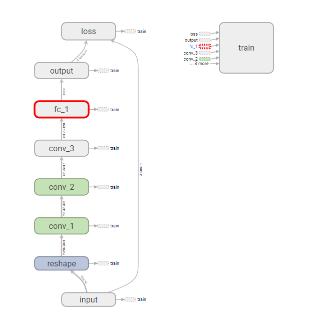

#<center>LeNet详解</center>#
鉴于网上很多的LeNet讲解，但是有没有指明这时LeNet的简化版，本文特对Yann Lecun的原文进行一点讲解，原文地址:[Gradient-Based Learning Applied to Document Recognition]("http://yann.lecun.com/exdb/publis/pdf/lecun-98.pdf")
##1. LeNet的网络结构

以下用Cx代表convolutional layer，用Sx代表sub-sampling layer，用Fx代表fully-connected layer。
+ C1:
C1是convolutional layer，有6个filter map,卷积核大小为$5\times 5$，stride大小为$1\times 1$，输入大小是$32\times 32$，输出的feature map大小是$28\times 28\times 6$。C1有156个训练参数，122,304个连接。(注意:如果输入大小为$28\times 28$，则需要加上2的padding将输入增加到$32\times32$)
+ S2:
S2是一个sub-sampling，pooling_size的大小为(2,2), stride的大小为(2,2), 与现在的max pooling不同。LeNet是把$2\times 2$的一个unit的所有数值相加，然后乘以一个系数$coefficient$，最后加上一个偏置$bias$，得出的结果再送入一个$sigmoid$函数作为最终这一层的输出。这里的$coefficient$和$bias$都是可以训练的，因此有12个训练参数。因此现在的max_pooling是没有参数的，但是LeNet的sub-sampling是有训练参数的。
+ C3:
C3是convolutional layer，有16个filter map, 卷积核大小为$5\times 5$，stride大小为$1\times 1$，没有padding，输入大小是$14\times 14\times 6$，输出大小是$10\times 10\times 16$。C3有1516个训练参数，有156000个连接。
+ S4:
和S2相同，S2拥有32个训练参数和2000个连接。
+ C5：
C5是一个convolutional layer，卷积核的大小为$5\times 5$，stride大小为$1\times 1$，没有padding，拥有120个filter。由于S4的输出为$5\times 5\times 16$，因此C5的输出大小为$1\times 1\times 120$。C5设置为convolutional layer的原因是如果LeNet-5的输入变大，而其他的保持不变，那么此时特征图的维数就会比1*1大，就不能说是一个全连接层了。而且C5的由来也符合卷积的方法，只不过最后刚好是$1\times 1$而已。
+ F6:
F6是一个全连接层，有84个神经元元(之所以选这个数字的原因来自于输出层的设计，下面会有说明)，与C5层构成相连。有10164个可训练参数。
+ output：
output是一个Gaussian连接，与全连接不同的是，全连接是将F6的输出与权重进行点积，再加上一个偏置。然后将结果传入sigmoid函数单元产生一个状态。而gaussian连接的计算方式为：
$$
y_i = \sum_{j=1}^n(x_j-w_{ji})^2 \hspace{1.0cm} i\in\{0,1,\cdots, 9\}
$$
对于本例而言，$i\in\{0,1,\cdots,83\}$。即计算ERBF距离，最后的输出层是由欧式径向基单元（Euclidean Radial Badi）组成，每类一个单元，每个有84个输入。每个输出ERBF单元计算输入向量和参数向量之间的欧式距离。输入离参数向量越远，ERBF输出越大。因此，一个ERBF输出可以被理解为衡量输入模式和与ERBF相关联类的一个模型的匹配程度的惩罚项。同时ERBF参数向量起着F6层目标向量的角色。这些向量的成分是+1或者-1，也可以防止F6层的Sigmoid函数饱和。

+ 损失函数：
使用MLE(最大似然估计)和MSE(最小均方差)。

##2. LeNet的TensorFlow实现
最接近原始的LeNet-5：
###2.1 代码
```python
import tensorflow as tf
from tensorflow.examples.tutorials.mnist import input_data
from tqdm import tqdm

mnist = input_data.read_data_sets("MNIST_data", one_hot=True)
batch_size = 128
epochs = 100
with tf.variable_scope("input"):
    x = tf.placeholder(shape=(None, 784), dtype=tf.float32, name="input_x")
    y = tf.placeholder("float", name="input_y")

def lenet(input):
    with tf.variable_scope("reshape"):
        input = tf.reshape(input, [-1, 28, 28, 1], name="reshape_input_x")

    with tf.variable_scope("conv_1"):
        weights1 = tf.Variable(tf.truncated_normal(shape=[5, 5, 1, 6], mean=0, stddev=0.1), name="weights1")
        bias1 = tf.Variable(tf.truncated_normal(shape=[6], mean=0, stddev=0.1), name="bias1")
        c1 = tf.nn.conv2d(input=input, filter=weights1, strides=[1,1,1,1], padding="SAME")+bias1
        s2 = tf.nn.max_pool(c1, ksize=(1,2,2,1),strides=[1,2,2,1], padding="VALID")

    with tf.variable_scope("conv_2"):
        weights2 = tf.Variable(tf.truncated_normal(shape=[5, 5, 6, 16], mean=0, stddev=0.1), name="weights2")
        bias2 = tf.Variable(tf.truncated_normal(shape=[16]))
        c3 = tf.nn.conv2d(input=s2, filter=weights2, strides=[1,1,1,1], padding="VALID")+bias2
        s4 = tf.nn.max_pool(c3, ksize=(1,2,2,1),strides=[1,2,2,1], padding="VALID")

    with tf.variable_scope("conv_3"):
        weights3 = tf.Variable(tf.truncated_normal(shape=[5,5,16,120], mean=0, stddev=0.1))
        bias3 = tf.Variable(tf.truncated_normal(shape=[120], mean=0, stddev=0.1))
        c5 = tf.nn.conv2d(input=s4, filter=weights3, strides=[1,1,1,1], padding="VALID")+bias3

    c5_shape_li = c5.get_shape().as_list()
    with tf.variable_scope("fc_1"):
        weights4 = tf.Variable(tf.truncated_normal(shape=[120, 84], mean=0, stddev=0.1))
        bias4 = tf.Variable(tf.truncated_normal(shape=[84], mean=0, stddev=0.1))
        with tf.variable_scope("flatten"):
            o5_flatten = tf.reshape(tensor=c5, shape=[-1, c5_shape_li[1] * c5_shape_li[2] * c5_shape_li[3]], name="flatten")
        f6 = tf.matmul(o5_flatten, weights4) + bias4

    with tf.variable_scope("output"):
        weights5 = tf.Variable(tf.truncated_normal(shape=[84, 10], mean=0, stddev=0.1))
        bias5 = tf.Variable(tf.truncated_normal(shape=[10], mean=0, stddev=0.1))
        output = tf.matmul(f6, weights5) + bias5

    return output

predict = lenet(x)
with tf.variable_scope("loss"):
    loss = tf.reduce_mean(tf.nn.softmax_cross_entropy_with_logits(logits=predict, labels=y))

with tf.variable_scope("train"):
    optimizer = tf.train.AdamOptimizer(learning_rate=0.0001).minimize(loss)
    correct_train = tf.equal(tf.arg_max(predict, 1), tf.arg_max(y, 1))
    accuracy_train = tf.reduce_mean(tf.cast(correct_train, "float"))

with tf.Session() as sess:
    saver = tf.summary.FileWriter("../log/", sess.graph)
    sess.run(tf.global_variables_initializer())
    for epoch in tqdm(range(10)):
        epoch_loss = 0
        for _ in range(int(mnist.train.num_examples / batch_size)):
            epoch_x, epoch_y = mnist.train.next_batch(batch_size)
            _, c = sess.run([optimizer, loss], feed_dict={x: epoch_x, y: epoch_y})
            epoch_loss += c
        print("accuracy", sess.run(accuracy_train, feed_dict={x: mnist.test.images, y:mnist.test.labels}),
              'loss:', epoch_loss)

    correct = tf.equal(tf.argmax(predict, -1), tf.argmax(y, -1))

    accuracy = tf.reduce_mean(tf.cast(correct, 'float'))
    print('Accuracy:', accuracy.eval({x: mnist.test.images, y: mnist.test.labels}))
```

###2.2 结构图：
