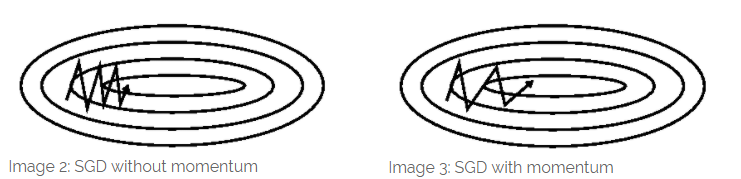
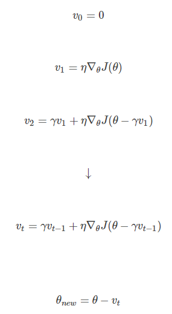

##
神经网络中各种优化器介绍
##
###1. SGD
####1.1 batch-GD
每次更新使用全部的样本，注意会对所有的样本取均值，这样每次更新的速度慢。计算量大。

####1.2 SGD
每次随机取一个样本。这样更新速度更快。SGD算法在于每次只去拟合一个训练样本，这使得在梯度下降过程中不需去用所有训练样本来更新Theta。BGD每次迭代都会朝着最优解逼近，而SGD由于噪音比BGD多，多以SGD并不是每次迭代都朝着最优解逼近，但大体方向是朝着最优解，SGD大约要遍历1-10次数据次来获取最优解。

但是 SGD 因为更新比较频繁，会造成 cost function 有严重的震荡。

####1.3. MBGD(Mini-batch Gradient Descent)
MBGD有时候甚至比SGD更高效。MBGD不像BGD每次用m（所有训练样本数）个examples去训练，也不像SGD每次用一个example。MBGD使用中间值b个examples
经典的b取值大约在2-100。例如 b=10，m=1000。

###2. Momentum

SGD存在的一个主要问题是：在沟壑处无法正常收敛的问题。如果初始化不好不幸陷入沟壑区，则会出现下面左图的震荡问题：即在一个方向上梯度很大，且正负交替出现。而momentum会加上前面的一次迭代更新时的梯度。让与上一次同方向的值更大，反方向的更小，如下面右图所示。momentum公式为：
$$
\begin{align}
v_t&=\gamma v_{t-1}+\eta\Delta_\theta J(\theta)\\
\theta &= \theta-v_t
\end{align}
$$
+ 下降初期时，使用上一次参数更新，下降方向一致，乘上较大的\$mu$能够进行很好的加速。
+ 下降中后期时，在局部最小值来回震荡的时候，$gradient\to 0$，$\mu$使得更新幅度增大，跳出陷阱。
+ 在梯度改变方向的时候，$\mu$能够减少更新 总而言之，momentum项能够在相关方向加速SGD，抑制振荡，从而加快收敛。
正确的方向上让他更快，错误的方向上让他更慢。如果上次的momentum(v)与这次的负梯度方向是相同的，那这次下降的幅度就会加大，从而加速收敛。
momentum的更新方式为：

momentum设置太小动量效果不明显，设置太大容器使得本来收敛很好的地方震动太大，特别是训练的后期,一般取0.9。

###3. NAG(Nesterov accelerated gradient)
动量法每下降一步都是由前面下降方向的一个累积和当前点的梯度方向组合而成。于是一位大神（Nesterov）就开始思考，既然每一步都要将两个梯度方向（历史梯度、当前梯度）做一个合并再下降，那为什么不先按照历史梯度往前走那么一小步，按照前面一小步位置的“超前梯度”来做梯度合并呢？如此一来，小球就可以先不管三七二十一先往前走一步，在靠前一点的位置看到梯度，然后按照那个位置再来修正这一步的梯度方向。如此一来，有了超前的眼光，小球就会更加”聪明“, 这种方法被命名为Nesterov accelerated gradient 简称 NAG。

NAG的更新方式为:

与momentum不同的是，NAG是先往前走一步，谈谈路，用超前的梯度来进行修正。
更新公式为:

实现证明，比momentum更快。

###4. AdaGrad
SGD+Momentum的问题是：
+ 设置初始的学习率比较难
+ 所有的参数都使用相同的学习率
Adam采用累加前面梯度的平方和的方式。能够对每个参数自适应不同的学习速率。因此对于稀疏特征，学习率会大一点。对非稀疏特征，学习率会小一点。因此次方法适合处理稀疏特征。公式为:
$$
\theta_{t+1, i}=\theta_{t, i}-\frac {\eta}{\sqrt{G_{t,i}+\epsilon}}g_{t,i}
$$

其中 同样是当前的梯度，连加和开根号都是元素级别的运算。 是初始学习率，由于之后会自动调整学习率，所以初始值就不像之前的算法那样重要了。而是一个比较小的数，用来保证分母非0。

其含义是，对于每个参数，随着其更新的总距离增多，其学习速率也随之变慢。

$g_t$从1到t进行一个递推形成一个约束项,$\epsilon$保证分母非0。
$$
G_{t, i}=\sum_{r=1}^t(g_{r,i}^2)
$$
为前面的参数的梯度平方和。特点为:
+ 前期梯度较小的时候，叠加的梯度平方和也比较小，能够加快梯度。
+ 后期梯度叠加项比较大uo，梯度也会变小，能够以小步幅更新。
+ 对于不同的变量可以用不同的学习率。
+ 适合处理稀疏的数据。

缺点：
+ 依赖一个全局学习率
+ 中后期，梯度的平方和累加会越来越大，会使得$gradient\to 0$,使得后期训练很慢，甚至接近0。

###5. AdaDelta
Adadelta是对于Adagrad的扩展。最初方案依然是对学习率进行自适应约束，但是进行了计算上的简化。 Adagrad会累加之前所有的梯度平方，而Adadelta只累加固定大小的项(Adagrad需要存储)，并且也不直接存储这些项，仅仅是近似计算对应的平均值。即：
$$
\begin{align}
E[g^2]_t&=\gamma E[g^2]_{t-1}+(1-\gamma)g_t^2\\
\Delta\theta_t&=-\frac{\eta}{\sqrt{E[g^2]_t+\epsilon}}g_t
\end{align}
$$

因为AdaDelta需要计算$R[g_t-w:t]$,需要存储前面$w$个状态，比较麻烦。因此AdaDelta采用了类似momtemum的平均话方法,如果$\gamma=0.5$，则相当于前面的均方根RMS。其中Inception-V3的初始化建议为1。

此处AdaDelta还是依赖于全局学习率，因此作者做了一定的处理来近似：
经过二阶海森矩阵近似之后，得到$\Delta x\sim x$
$$
\Delta_{x_t}=-\frac{\sqrt{\sum_{r=1}^{t-1}\Delta x_r^2}}{\sqrt{E[g^2]_t+\epsilon}}
$$
这样的话，AdaDelta已经不依赖于全局学习率了。
+ 训练初中期，加速效果不错，很快
+ 训练后期，反复在局部最小值附近抖动

###6. RMSProp
RMSProp是AdaDelta的一种扩展。当$\gamma=0.5$的时候就变成了RMSProp。但是RMSProp仍然依赖于全局学习率。效果介于AdaGrad和AdaDelta之间。

###7. Adam
Adam(Adaptive Moment Estimation)本质上是带有动量项的RMSprop，它利用梯度的一阶矩估计和二阶矩估计动态调整每个参数的学习率。Adam的优点主要在于经过偏置校正后，每一次迭代学习率都有个确定范围，使得参数比较平稳。公式如下：
$$
\begin{align}
g_t&=\Delta_\theta J(\theta_{t-1})\\
m_t&=\beta_1m_{t-1}+(1-\beta_1)g_t\\
v_t&=\beta_2 v_{t-1}+(1-\beta_2)g_t^2\\
\hat m_t&=\frac{m_t}{1-\beta_1^t}\\
\hat v_t&=\frac{v_t}{1-\beta_2^t}\\
\theta&=\theta-\alpha \frac{\hat m_t}{\sqrt{\hat v^t}+\epsilon}
\end{align}
$$
然后对$m_t$和$n_t$进行无偏估计。因为$m_0$和$n_0$初始化都是0，我们希望能够快点从0中调出来。因为如果$\beta$比较大的话，原来的$m_t$可能会调不出来。因此进行无偏估计后能够放大。$\beta_1$和$\beta_2$两个超参数一般设置为0.9和0.999。:
$$
\hat m_t=\frac{m_t}{1-\beta_1^t}
$$
接下来更新参数，初始的学习率$\alpha$(默认0.001)乘以梯度均值与梯度方差的平方根之比。**由表达式可以看出，对更新的步长计算，能够从梯度均值及梯度平方两个角度进行自适应地调节，而不是直接由当前梯度决定。**

直接对梯度的矩进行估计对内存没有额外的要求，而且可以根据梯度进行动态调整。而且后面的一项比值可以对学习率形成一个动态约束，因为它是有范围的。

目前来讲，效果最好的是Adam。但是经典的论文搞上去的方式都是先用Adam，然后再用SGD+momentum死磕上去。

Adam看作是Momentum+RMSProp的结合体。

