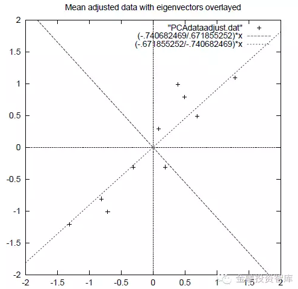
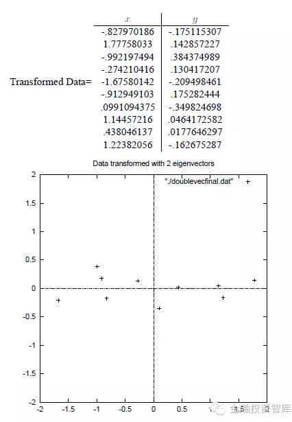

# <center>主成成分分析(Principal Component Analysis)</center> #
PCA是一种无监督的降低数据维度的方法。降维的过程当中，只需要特征X而不需要标签y。
## 1. 为什么需要PCA
如果数据的维度很少，则可以将数据直接用于分类计算。但是如果数据量比较大，比如图像处理中，数据的维度常常达到上万甚至更高。这是计算的成本就会很高。对于两个冗余的特征，也需要进行提出。如果特征的数量远远大于样本的数量，也很有可能会形成过拟合问题。因此需要对一些具有强相关性的特征进行剔除。比如学生的成绩排名和分数等等。

PCA正是一种能够将n维度特征映射到k维上的方法(k < n)。PCA寻求一种方法，能够在损失信息量最少的情况下实现维度的降低。这k维是全新的正交特征，是重新构造出来的k维新特征，而不是简单地从n维特征中取出n-k维特征。
## 2. PCA计算过程
### 2.1 按照特征来计算每个特征的平均值和标准差
假设拿到的数据为$abc$:
$$
data = \begin{bmatrix}
x_{11}, x_{12}, \cdots,x_{1n}\\
x_{21}, x_{22}, \cdots,x_{2n}\\
 \vdots \\
x_{m1}, x_{m2}, \cdots,x_{mn}\\
\end{bmatrix}
$$
即每行代表一个样本，每列代表一个特征。因此该数据有m行n列。因此我们需要计算每个特征的平均值和标准差：
$$
\bar x_j = \frac 1m\sum_{i=1}^mx_{ij} \hspace{0.5cm}j \in [1, n]\\
\sigma_j = \sqrt {\frac 1m\sum_{i=1}^m(x_{ij}-\bar x_j)^2}
$$
然后将每个样本对应的特征减去对应的均值，得到
$$
data' = \begin{bmatrix}
\frac {x_{11}-\bar x_1}{\sigma_1}, \frac{x_{12}-\bar x_2}{\sigma_2}, \cdots,\frac{x_{1n}-\bar x_n}{\sigma_n}\\
\frac{x_{21}-\bar x_1}{\sigma_1}, \frac{x_{22}-\bar x_2}{\sigma_2}, \cdots,\frac{x_{2n}-\bar x_n}{\sigma_n}\\
 \vdots \\
\frac{x_{m1}-\bar x_1}{\sigma_1}, \frac{x_{m2}-\bar x_2}{\sigma_2}, \cdots,\frac{x_{mn}-\bar x_n}{\sigma_n}\\
\end{bmatrix}
$$
###2.2 对于转化后的数据$data'$求协方差矩阵
假设有n个特征，则协方差矩阵为：
$$
COV=\begin{bmatrix}
cov(x_1, x_1), cov(x_1, x_2),\cdots, cov(x_1, x_n)\\
cov(x_2, x_1), cov(x_2, x_2),\cdots, cov(x_2, x_n)\\
\cdots\\
cov(x_n, x_1), cov(x_n, x_2),\cdots, cov(x_n, x_n)\\
\end{bmatrix}
$$
是一个$n\times n$的对称方阵，对角为$cov(x_i, x_i)$,是特征$x_i$的方差，非对角线为特征$x_i$和$x_j$的协方差。
###2.3 计算协方差矩阵的特征值和特征向量
通过对矩阵$COV$求特征值$Eigen\hspace{0.2cm} Value$和特征向量$Eigen\hspace{0.2cm} Vector$
特征值和特征向量求法及意义见:
+ [求矩阵特征值和特征向量]("https://en.wikipedia.org/wiki/Eigenvalues_and_eigenvectors")

+	[特征值和特征向量的理解]("https://www.zhihu.com/question/21874816")

###2.4 选择k维向量
将矩阵的特征值按照从大到小排序，选择其中最大的k个特征值，然后将k个特征值对应的特征向量分别作为列向量组成特征向量矩阵，再将样本点投影到选取的特征向量上，新得到的数据矩阵为：
$$
data''(m\times k) = data'(m\times n) \times Eigen\hspace{0.2cm} Vector(n\times k)
$$
其中$m$为样本数量，$n$为特征数量，$k$为需要降到的维度。$data''$为降维以后的数据，$data'$为原始数据减去均值以后的矩阵，$Eigen\hspace{0.2cm} Vector(n\times k)$为k个特征向量组成的矩阵。则新的数据矩阵$data''$即为$PCA$降维之后的矩阵。
###2.5 计算实例
设原始数据为：

|x  |y  |
|:-:|:-:|
|2.5|2.4|
|0.5|0.7|
|2.2|2.9|
|1.9|2.2|
|3.1|3.0|
|2.3|2.7|
|2  |1.6|
|1  |1.1|
|1.5|1.6|
|1.1|0.9|
经过均值和方差处理后的数据为：

|x  |y  |
|:-:|:-:|
|0.69|0.49|
|-1.31|-1.21|
|0.39|0.99|
|0.09|0.29|
|1.29|1.09|
|0.49|0.79|
|0.19|-0.31|
|-0.81|-0.81|
|-0.31|-0.31|
|0.71|-1.01|
协方差矩阵为：
$$
COV = \begin{bmatrix}
0.6166, 0.6154\\
0.6154,0.7166
\end{bmatrix}
$$
求得特征值为:
$$
Eigen\hspace{0.2cm} Value=
\begin{bmatrix}
0.0491\\
1.2840
\end{bmatrix}
$$
特征向量为：
$$
Eigen\hspace{0.2cm} Vector(2\times 1)=
Eigen\hspace{0.2cm} Value=
\begin{bmatrix}
-0.7352, -0.6779\\
0.6779, -0.7352
\end{bmatrix}
$$
降维后的矩阵为：
$$
\begin{align}
data'' &= data'(10\times 2) \times Eigen\hspace{0.2cm} Vector(2\times 1)\\
&=\begin{bmatrix}
-0.828\\
1.778\\
-0.992\\
-0.274\\
-1.675\\
-0.913\\
0.991\\
1.145\\
0.438\\
1.1.224
\end{bmatrix}
\end{align}
$$
这样就将原始的n维特征变成了k维，这k维就是原始特征在k维上的投影。如下图：

斜着的两条线就分别是正交的特征向量（由于协方差矩阵是对称的，因此其特征向量正交），最后一步的矩阵乘法就是将原始样本点分别往特征向量对应的轴上做投影。
如果取k=2,则结果为:

整个过程看起来就像将坐标系做了旋转，当然二维可以图形化表示，高维就不行了。上面的如果k=1，那么只会留下这里的水平轴，轴上是所有点在该轴的投影。

##3. PCA的理论意义
###3.1 最大方差理论
在信号处理中认为信号具有较大的方差，噪声有较小的方差，信噪比就是信号与噪声的方差比，越大越好。如前面的图，样本在横轴上的投影方差较大，在纵轴上的投影方差较小，那么认为纵轴上的投影是由噪声引起的。

因此我们认为，最好的k维特征是将n维样本点转换为k维后，每一维上的样本方差都很大。并且方差越大，携带的信息量就越大。
###3.2 最小平方误差
假设有这样的二维样本点（红色点），回顾我们前面探讨的是求一条直线，使得样本点投影到直线上的点的方差最大。本质是求直线，那么度量直线求的好不好，不仅仅只有方差最大化的方法。再回想我们最开始学习的线性回归等，目的也是求一个线性函数使得直线能够最佳拟合样本点，那么我们能不能认为最佳的直线就是回归后的直线呢？回归时我们的最小二乘法度量的是样本点到直线的坐标轴距离。比如这个问题中，特征是x，类标签是y。回归时最小二乘法度量的是距离d。如果使用回归方法来度量最佳直线，那么就是直接在原始样本上做回归了，跟特征选择就没什么关系了。

##4. PCA的优缺点
根据上面对PCA的数学原理的解释，我们可以了解到一些PCA的能力和限制。PCA本质上是将方差最大的方向作为主要特征，并且在各个正交方向上将数据“离相关”，也就是让它们在不同正交方向上没有相关性。
###4.1 优点：
PCA技术的一大好处是对数据进行降维的处理。我们可以对新求出的“主元”向量的重要性进行排序，根据需要取前面最重要的部分，将后面的维数省去，可以达到降维从而简化模型或是对数据进行压缩的效果。同时最大程度的保持了原有数据的信息。

PCA技术的一个很大的优点是，它是完全无参数限制的。在PCA的计算过程中完全不需要人为的设定参数或是根据任何经验模型对计算进行干预，最后的结果只与数据相关，与用户是独立的。

PCA是一种无参数技术，也就是说面对同样的数据，如果不考虑清洗，谁来做结果都一样，没有主观参数的介入，所以PCA便于通用实现，但是本身无法个性化的优化。
###4.2 缺点
如果用户对观测对象有一定的先验知识，掌握了数据的一些特征，却无法通过参数化等方法对处理过程进行干预，可能会得不到预期的效果，效率也不高。

因此，PCA也存在一些限制，例如它可以很好的解除线性相关，但是对于高阶相关性就没有办法了，对于存在高阶相关性的数据，可以考虑Kernel PCA，通过Kernel函数将非线性相关转为线性相关，关于这点就不展开讨论了。另外，PCA假设数据各主特征是分布在正交方向上，如果在非正交方向上存在几个方差较大的方向，PCA的效果就大打折扣了。

pca只关注了输入之间的correlation。(supervised) learning寻求的是输入和输出之间的联系。
想象一个极端情况：输入的snr很低且噪声强相关，但是被学习的系统有超强能力完全忽略噪声。如果使用pca，估计很可能只保留了噪声。

但是这个主要信息，仍然是只针对训练集的，为了更好的满足训练集。过拟合就是对训练集表现的很好，但是对测试集表现的很差。同时，PCA保留的是训练集的主要信息，可能这未必是重要信息，但是舍弃了一些看似无用的信息，那些信息仍可能是重要信息，只是在训练集上没有很大的表现。所以，降维可能加剧了过拟合，而没有避免过拟合。

PCA是一种无监督学习，其存在的假设是：方差越大信息量越多。但是信息（方差）小的特征并不代表表对于分类没有意义，可能正是某些方差小的特征直接决定了分类结果，而PCA在降维过程中完全不考虑目标变量的做法会导致一些关键但方差小的分类信息被过滤掉。

由于PCA整个方案都没用到y，所以过拟合问题并不能用PCA来降维攻击。

类似于PCA和auto-encoder这样的无监督方法，提取的特征不会太差、但也不会太好，它最大的作用，是总结出一些关于X的较高层次的抽象知识、为之后的有监督训练提供一个比原始特征空间更好的起点。实际上，无监督最具优势之处，就在于它的通用性：不管y是什么，只要有X就行，之后可以在各种各样的y上进一步训练。有证据显示，人类在婴儿时期也是先有一个无监督学习阶段，然后才是各种有监督学习。

PCA是高维环境下能想到的最直接的方案。比如人脸识别，维度往往成千上万，但识别身份的话，每个人样本最多也就几十，过拟合现象是很严重的。由此产生了人脸识别早期研究中影响力极大的工作eigenface，其实就是先用PCA对人脸图像进行降维，然后再训练分类器。


>参考资料:
>[PCA解释]("https://mp.weixin.qq.com/s?__biz=MzI2MzAxMTA1Ng==&mid=2649499654&idx=2&sn=23f750ea4c67ac366e60067d8eb448ec&chksm=f25ae799c52d6e8fb2caf0c43e0b47cb4b0df55b1c627186baefad97b3a6deee190400d992de&mpshare=1&scene=2&srcid=0927Ddf4Tr7vrTgZCKdUVyF2&from=timeline&isappinstalled=0#wechat_redirect")
>[PCA数学解释]("https://mp.weixin.qq.com/s?__biz=MzA5ODUxOTA5Mg==&mid=2652551576&idx=1&sn=17a125bb29001b3d8d5e3964dcc599a3&chksm=8b7e48c3bc09c1d55dbab168011cba2a853af5623a24a499a2ae110a4facb07c2a4bd033da36&mpshare=1&scene=2&srcid=0123V8FT7YEhcDXZco9gT4Vf&from=timeline&key=e4aa053ffd46a2720096fdf7de2840d48e8716d03c5dd165e9247c7dcd05d35f32c5a56481c26829d4d3e5dbef395c4877e96528fe3a518bd34d91906f6403e0d63776163f6d172ca17cfb6ba5ea8ad2&ascene=2&uin=MTgwOTU2NjU0MQ%3D%3D&devicetype=android-24&version=26050430&nettype=WIFI&abtest_cookie=AQABAAgAAQBChh4AAAA%3D&pass_ticket=sNCtedDpTEPBC88xUKXM3tzXl%2F606nFOdOXtXdJOeRZjV7St1JAOwsumIcivZwOd&wx_header=1")
>[为什么PCA不被推荐用来避免过拟合]("https://www.zhihu.com/question/47121788/answer/104471170")

##5. 使用scikit-learn实现PCA
```python
import numpy as np
import matplotlib.pyplot as plt
from scipy import stats
import seaboran as sns
sns.set()
%matplotlib inline
from skleran.decomposition import PCA

np.random.seed(1)
X = np.dot(np.random.random(size=(2,2)), np.random.normal(size=(2, 200)))
plt.plot(X[:, 0], X[:, 1], "og")
plt.axis("equal")

# 如果n_components为float，表示的是要保存多少的数据量，最终会保留的特征数量为比total_components*float(n_components)小的最大整数
pca = PCA(n_components=2)
pca.fit(X)
print(pca.explained_variance_)  # 按照从大到小排序的n_components个特征值
print(pca.components_)  # 主成分轴，是Eigen Vector的转置，shape为(n_component, n_features)，按照特征向量(Eigen Value)来排序

plt.plot(X[:, 0], X[:, 1], "og", alpha=0.3)

X_trans = pca.fit_transform(X)  # 得到降维后的数据
X_new = pca.inverse_trainsform(X_trans)  #还原回原来的坐标轴
```


<script type="text/javascript" src="http://cdn.mathjax.org/mathjax/latest/MathJax.js?config=default"></script>
