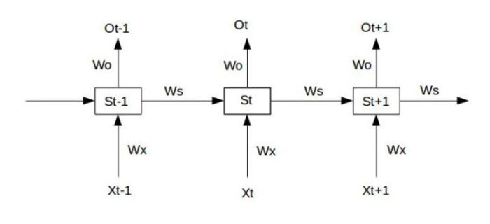
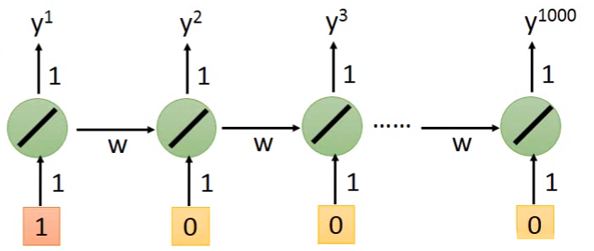

#<center>RNN简介</center>#
##1. RNN的提出背景
对于序列类型的数据，比如翻译问题，时间序列预测问题，由于前后样本之间有顺序之间的先后关系，而传统的神经网络无法体现这一关系，因此出现了RNN(Recurrent Neural Network)。RNN会记住之前的输入值，因此对于RNN而言，即时后面有相同的输入，输出值也会不同，这是与传统的NN不同的地方。序列数据的类型有:


+ one to one: Vanilla Neural Networks,最简单的BP网络
+ one to many: Image Captioning，可将图像转换成文字
+ many to one:Sentiment Classification，情感分类
+ many to many-1: Machine Translation,机器翻译
+ many to many-2:Video classification,视频分类

##2. RNN的基本结构
对于RNN神经元，其输出结果考虑的东西除了输入值之外，还会考虑存在内存当中的其他值，这些值是先前计算的结果：

首先在初始的时候，会给Memory单元的$a_1$、$a_2$一个初始值。下一步，绿色的神经元的输入既有$x_1$、$x_2$的贡献，又有$a_1$和$a_2$的贡献。然后据此计算出$y_1$、$y_2$。一轮计算完成之后，会将绿色的神经元的输出保存到memory的$a_1$和$a_2$单元中。因此整个计算过程当中$a_1$、$a_2$的值会不断变化。
例如: 令所有的权值都是1，$a_1$、$a_2$初始都为0，则对应的输入输出和memory分别为：

|$x_1$|$x_2$|$a_1$|$a_2$|$y_1$|$y_2$|
|:---:|:---:|:---:|:---:|:---:|:---:|
|1    |1    |0    |0    |4    |4    |
|1    |1    |2    |2    |12   |12   |
|2    |2    |6    |6    |32   |32   |
因此输出样本的顺序会对结果产生影响。因此下一时刻的输出值会受到前面所有时刻的输入值的影响：
$$
h_t = f_W(h_{t-1}, x_t)
$$
如果令$f_W(x) = \tanh(x)$，则：
$$
\begin{align}
h_t&=\tanh(W_{hh}h_{t-1}+W_{xh}x_t)\\
y_t&=W_{hy}h_t
\end{align}
$$
例如对于词汇来将，每个单词都是一个输入的x,对于其他时间序列数据，每个时间点的输入都是一个输入样本：

更一般的情况，会将输出值存入memory中：


##3. Bidirectional RNN(双向RNN)
将输入的数字，从前到后训练一个RNN，从后往前训练一个RNN。对于单向的RNN，由于只能看到前面已经输入的样本数据，因此无法看到全局。而对于双向RNN，既能看到全面的样本数据，又能看到后面的样本数据，准确性更好。

##4. RNN中的梯度爆炸(gradient explode)和梯度消失(gradient vanishing)
先看下面一个简单的例子:

假设$S_0$为给定值，则最简单的前向传播为:
$$
\begin{align}
S_1&=W_xX_1+W_sS_0+b_1O_1 = W_0S_1+b_2\\
S_2&=W_xX_2+W_sS_1+b_1O_2 = W_0S_2+b_2\\
S_3&=W_xX_3+W_sS_2+b_1O_3 = W_0S_3+b_2
\end{align}
$$
假设$t=3$时刻，损失为：$L_3=\frac 12(Y_3-O_3)^2$，则总的损失为：
$$
L=\sum_{t=0}^TL_t
$$
即每一时刻的损失之和。RNN的训练过程其实就是对$W_x, W_s, W_o$和$b_1, b_2$求偏导，并不断调整它们使得$L$达到最小。
在$t=3$时刻对$W_x, W_s, W_o$求偏导，得：

因此对于$W_0$求偏导没有长期以来，但是对于$W_x$、$W_s$求偏导数则会产生长期依赖。$S_t$会随着时间序列向前传播，而$S_t$是$W_x$和$W_s$的函数。
因此任意时刻损失对于$W_x$和$W_s$的偏导为:
$$
\frac {\partial L_t}{\partial W_x}=\sum_{k=0}^t\frac {\partial L_t}{\partial O_t}\frac {\partial O_t}{\partial S_t}(\prod_{j=k+1}^t\frac {\partial S_j}{\partial S_{j-1}})\frac {\partial S_k}{\partial W_x}
$$
对于$W_s$同理。加上激活函数之后，有：
$$
S_j = activate(W_xX_j+W_sS_{j-1}+b_1)
$$
因此：
$$
\prod_{j=k+1}^t\frac {\partial S_j}{\partial S_{j-1}}=\prod_{j=k+1}^t=activate'(S_j)\times W_s
$$
如果激活函数为$y=\tanh(x)$，图像为：

如果激活函数为$y=sigmod(x)$,则图像为：

由上图可以看出$activate' \le 1$，对于训练中大部分都是$activate$都是小于1的。因此$\prod_{j=k+1}^t=activate'(S_j)\times W_s$就会趋近0。同理，如果存在$activate' > 1$，$\prod_{j=k+1}^t=activate'(S_j)\times W_s$会趋近无穷，这就是梯度消失(vanishing gradient)和梯度爆炸(explode gradient)现象。要解决这一现象，就要使得$\prod_{j=k+1}^t=activate'(S_j)\times W_s$趋近1或者趋近0，这就是$LSTM$出现的原因。
##5 LSTM的基本结构
每个LSTM神经元有4个$input$，3个$gate$，1个$output$M神经元有4个$input$，3个$gate$，1个$output$

对于传统的RNN神经元，$t$时刻会立刻把$t-1$时刻存储在$memory$中的值冲刷掉，因此只能做到短期记忆，即$Short\hspace{0.2cm} Short-Term\hspace{0.2cm} Memory$。LSTM的cell为：

Z是外界的input,其中哦那个的3个gate分别为**input gate, forget gate, output gate**，控制参数分别为$Z_i, Z_f, Z_o$,都是通过$Z$学习产生，注意$Z_i,Z_f,Z_o$都是数值(标量)。然后$Z, Z_i, Z_f, Z_o$分别通过激活函数(通常是$sigmod$函数)分别得到$g(z), f(Z_i), f(Z_f), f(Z_o)$，代表相应gate的打开程度，如果$f(Z)$为1，表示完全打开，若为0则为完全关闭。设原来存储的值为$c$,则经过一个$Z$之后，$memory$里面的值变为：
$$
c'=g(Z)f(Z_i)+cf(z_f)
$$
$f(Z_i)$表示是否允许$Z$的输入, $f(Z_f)$表示是否要将存在$memory$里面的值$c$冲洗掉。
LSTM与传统的神经网络相同，只需将传统的网络中的神经元换成$LSTM\hspace{0.2cm} Cell$即可：

因此对于一个序列$x_1, x_2$，需要乘以几个权值分别得到$Z, Z_i, Z_f, Z_o$，然后分别控制3个$gate$。
通常情况下LSTM的神经网络图为

假设该网络有$n$个LSTM的cell，其中$c^{(t-1)}$是一个$n$维的$vector$，表示$t-1$时刻存放在LSTM的Cell中的值组成的向量。$X^t$也是一个向量，是由$n$个输入的$x$组成的向量，作为LSTM的输入值。$x^t$乘以分别乘以权值$W_f$、$W_i$、$W_o$得到$n$维向量$Z^f$、$Z^i$、$Z^o$，分别用来控制$n$个LSTM的3个gate。**注意：每个LSTM Cell的gate控制值都只是一个标量。**
单个Cell的计算过程为:

整个LSTM的计算过程为：

以上只是最简单的LSTM，实际使用过程中会将$c^t$和$y^t$拿过来和$x^{t+1}$同时作为控制LSTM的输入：

多层的LSTM结构为:


##6. 为何LSTM能解决Gradient Vanishing问题
实际工作过程当中，RNN的训练Loss变化为：

>即图中绿线所示，蓝线为理想状态下Loss变化图。

训练过程中，Loss与参数变化示意图为:

可以看出，图中的Loss会剧烈震荡，因此在通过Gradient Descent参数参数的过程当中，由于learning rate的原因，导致参数跳动太大。因此一般采用clip的方法，即当Gradient大于某个阈值的时候，就以该阈值作为此时的Gradient。
RNN能产生Gradient Vanishing主要是由于RNN本身的特征产生的。对于传统的RNN来讲，假设有以下的一个简单的例子：

如果输入序列为$(1, 0,\cdots, 0)$，则得到的输出$y^{1000}$为$y^{1000}=w^{999}$。当$w=1$时，$y^{1000}=1$。当$w=1.01$时，$y^{1000}\thickapprox 20000$。当$w=0.99$时，$y^{1000}\thickapprox 0$。当$w=0.01$时，$y^{1000}\thickapprox 0$。因此$w$从$1$到$1.01$的时候$\frac {\partial L}{\partial w}$特别大，此时应该用一个比较小的$learning\hspace{0.2cm}rate$。但从$1$到$0.99$和从$0.99$到$0.01$，此时$\frac {\partial L}{\partial w}$特别小，此时需要一个大一点的$learning\hspace{0.2cm}rate$。因此以上两种情况会矛盾。这主要是因为RNN有着一个比较长的$sequence$，同样的$weight$在不同的时间点会被不断被反复使用。

而对于LSTM来讲，在处理$memory$里面的值的时候，采用的方法是不同的。在RNN里面，每一个新的时间点,$memory$里面的值都会被冲洗掉。而在LSTM里面，$c^t=c^{t-1}\times Z_f+f(Z)$，因此和原来的值是相加关系。虽然在训练过程中有$forget \hspace{0.2cm}gate$，但通常会给$forget \hspace{0.2cm}gate$一个较大的$biases$，这样$forget\hspace{0.2cm}gate$在多数情况下会开启，此时只需要调整$learning\hspace{0.2cm}rate$到一个比较小的值即可。因此LSTM可以解决$Gradient\hspace{0.2cm}Vanishing$问题，但是无法解决$Gradient\hspace{0.2cm}Explode$问题。

另一方面，RNN无法解决长期记忆问题，假设我们试着去预测“I grew up in France... I speak fluent French”最后的词。当前的信息建议下一个词可能是一种语言的名字，但是如果我们需要弄清楚是什么语言，我们是需要先前提到的离当前位置很远的 France 的上下文的。这说明相关信息和当前预测位置之间的间隔就肯定变得相当的大。不幸的是，在这个间隔不断增大时，RNN 会丧失学习到连接如此远的信息的能力。但是LSTM因为拥有$forgate \hspace{0.2cm}gate$，是可以解决长期记忆问题的。

其他的解释LSTM解决$Gradient \hspace{0.2cm}Vanishing$问题:
1. [LSTM如何来避免梯度弥散和梯度爆炸？](https://www.zhihu.com/question/34878706)
2. [为什么相比于RNN，LSTM在梯度消失上表现更好？](https://www.zhihu.com/question/44895610/answer/98003820)
3. [LSTM如何解决梯度消失问题](https://zhuanlan.zhihu.com/p/28749444)

##7. LSTM解决问题举例:
###7.1. 机器翻译

但此时翻译会一直继续下去，因此需要定义一个终止符号：

其余都是通过$Auto-Encoder$来实现:

###7.2. 语音辨识：


训练结果为：

###7.3. 聊天机器人：

通过不断收集对话的$Data$，然后丢入$RNN$中不断训练。
###7.4. visual question answer


###7.4. 英语听力测试：

##6 LSTM的TensorFlow简单实现
```python
import tensorflow as tf
from tensorflow.examples.tutorials.mnist import input_data
from tensorflow.contrib import rnn

mnist = input_data.read_data_sets("/tmp/data/", one_hot = True)

hm_epochs = 3
n_classes = 10
batch_size = 128
chunk_size = 28
n_chunks = 28
rnn_size = 128

x = tf.placeholder('float', [None, n_chunks,chunk_size])
y = tf.placeholder('float')


def recurrent_neural_network(x):
	layer = {'weights':tf.Variable(tf.random_normal([rnn_size,n_classes])),
             'biases':tf.Variable(tf.random_normal([n_classes]))}

	x = tf.transpose(x, [1,0,2])
	x = tf.reshape(x, [-1, chunk_size])
	x = tf.split(x, axis=0, num_or_size_splits = n_chunks)

	lstm_cell = rnn.BasicLSTMCell(rnn_size,state_is_tuple=True)
	outputs, states = rnn.static_rnn(lstm_cell, x, dtype=tf.float32)

	output = tf.matmul(outputs[-1],layer['weights']) + layer['biases']

	return output


def train_neural_network(x):
	prediction = recurrent_neural_network(x)

	cost = tf.reduce_mean(tf.nn.softmax_cross_entropy_with_logits(logits=prediction, labels=y))

	optimizer = tf.train.AdamOptimizer().minimize(cost)

	with tf.Session() as sess:
		sess.run(tf.global_variables_initializer())

		for epoch in range(hm_epochs):
			epoch_loss = 0
			for _ in range(int(mnist.train.num_examples / batch_size)):
				epoch_x, epoch_y = mnist.train.next_batch(batch_size)
				epoch_x = epoch_x.reshape((batch_size, n_chunks, chunk_size))

				_, c = sess.run([optimizer, cost], feed_dict={x: epoch_x, y: epoch_y})
				epoch_loss += c

			print('Epoch', epoch, 'completed out of', hm_epochs, 'loss:', epoch_loss)

		correct = tf.equal(tf.argmax(prediction, 1), tf.argmax(y, 1))

		accuracy = tf.reduce_mean(tf.cast(correct, 'float'))
		print('Accuracy:',
			  accuracy.eval({x: mnist.test.images.reshape((-1, n_chunks, chunk_size)), y: mnist.test.labels}))

train_neural_network(x)
```
