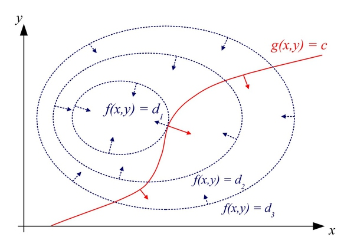
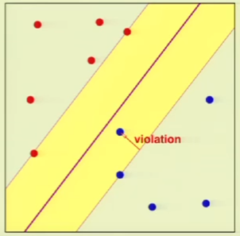
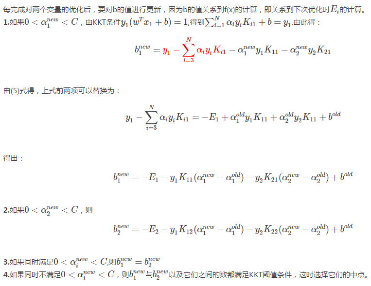

#
SVM(Support Vector Machine)分类器详解
#

##1. 拉格朗日乘子(Lagrange multiplier)法求解条件极值

###1.1 拉格朗日乘子的简单描述
简单的条件极值问题可以描述为：求函数$z=f(x,y)$的最大值，且$x,y$满足约束条件$\varphi (x,y)=M$($M$已知)。
拉格朗日乘子的求解步骤为：

+ 设置一个联合函数，令：
$$
F(x,y,\lambda)=f(x,y)+\lambda (M-\varphi (x,y))
$$

+ $F(x,y,\lambda)$分别对变量$x, y, \lambda$求偏导，然后令偏导数为0
$$
\frac {\partial F(x,y,\lambda)}{\partial x}=0
$$
$$
\frac {\partial F(x,y,\lambda)}{\partial y}=0
$$
$$
\frac {\partial F(x,y,\lambda)}{\partial \lambda}=0
$$

+ 根据上式分别求解出所有满足条件的$(x,y,\lambda)$，然后将所有的$(x,y)$值对代入函数$f(x,y)$中，取其最大最小值分别为函数在满足约束条件下的最大最小值。

简单的求解例子：
1. 给定椭球$\frac {x^2}{a^2}+\frac {y^2}{b^2}+\frac {z^2}{c^2}=1$，求椭球的最大内接长方体体积。
椭球内接长方体体积为$f(x,y,z)=xyz$，因此可以转换为求函数$f(x,y,z)$的最大值。通过拉格朗日乘子法转化为：
$$
\begin{align}
F(x,y,z,\lambda)&=f(x,y,z)+\lambda (M-\varphi (x,y,z))\\
&=8xyz+\lambda(1-\frac {x^2}{a^2}+\frac {y^2}{b^2}+\frac {z^2}{c^2})
\end{align}
$$
分别对$x,y,z,\lambda$求偏导，得：
$$
\begin{align}
&\frac {\partial F(x,y,z,\lambda)}{\partial x}=8yz-\frac {2\lambda x}{a^2}=0 \\
&\frac {\partial F(x,y,z,\lambda)}{\partial y}=8xz-\frac {2\lambda y}{a^2}=0 \\
&\frac {\partial F(x,y,z,\lambda)}{\partial z}=8xy-\frac {2\lambda z}{a^2}=0 \\
&\frac {\partial F(x,y,z,\lambda)}{\partial \lambda}=1-\frac {x^2}{a^2}+\frac {y^2}{b^2}+\frac {z^2}{c^2}=0
\end{align}
$$
最后解得：
$$
\begin{align}
x=\frac {\sqrt 3}{3}a \hspace{0.5cm} &y=\frac {\sqrt 3}{3}b  \hspace{0.5cm}	z=\frac {\sqrt 3}{3}c \hspace{0.5cm} \lambda=\frac {4\sqrt 3}{3}abc\\
&f_{max}(x,y,z)=\frac {\sqrt 3}{9}abc
\end{align}
$$

2. 求抛物旋转面$z=x^2+y^2$与平面$x+y+z=1$的交线到坐标原点的最近最远点。
目标函数为$f(x,y,z)=x^2+y^2+z^2$，限制条件为$\varphi_1(x,y,z)=z-x^2-y^2$，$\varphi_2(x,y,z)=1-x-y-z$令
$$
F(x,y,z,\lambda_1,\lambda_2)=x^2+y^2+z^2+\lambda_1(z-x^2-y^2)+\lambda_2(1-x-y-z)
$$
分别对$x,y,z,\lambda_1,\lambda_2$求偏导，得：
$$
\begin{align}
&\frac {\partial F(x,y,z,\lambda_1,\lambda_2)}{\partial x}=2x-2\lambda_1 x-\lambda_2=0 \\
&\frac {\partial F(x,y,z,\lambda_1,\lambda_2)}{\partial y}=2y-2\lambda_1 y-\lambda_2=0 \\
&\frac {\partial F(x,y,z,\lambda_1,\lambda_2)}{\partial z}=2z-2\lambda_1 z-\lambda_2=0 \\
&\frac {\partial F(x,y,z,\lambda_1,\lambda_2)}{\partial \lambda_1}=z-x^2-y^2=0 \\
&\frac {\partial F(x,y,z,\lambda_1,\lambda_2)}{\partial \lambda_2}=1-x-y-z=0 \\
\end{align}
$$
解得两个候选点为：
$$
\begin{align}
&M_1(-\frac {1+\sqrt 3}{2},-\frac {1+\sqrt 3}{2},2+\sqrt 3)\\
&M_2(\frac {\sqrt 3-1}{2},\frac {\sqrt 3-1}{2},2-\sqrt 3)
\end{align}
$$
求得
$$
OM_1=\sqrt {9+5\sqrt 3}	\hspace{2cm} OM_2=\sqrt {9-5\sqrt 3}
$$
因此$f(x,y,z)$的最大值为$\sqrt {9+5\sqrt 3}$，最小值为$\sqrt {9-5\sqrt 3}$

###1.2 拉格朗日乘子法的一般性描述
当$\vec x=(x_1,x_2,\cdots,x_m)$满足约束条件：
$$
h_i(\vec x)=H_i \hspace{1cm} i=1,2,\cdots,n
$$
求$f(\vec x)$的极值问题。
此时，令：
$$
F(\vec x,\lambda_1,\lambda_2,\cdots,\lambda_n)=f(\vec x)+\lambda_1(H_1-h_1(\vec x))-\lambda_2(H_2-h_2(\vec x))-\cdots-\lambda_n(H_n-h_n(\vec x))
$$
然后$F(\vec x,\lambda_1,\lambda_2,\cdots,\lambda_n)$分别对$x_1,x_2,\cdots,x_n,\lambda_1,\lambda_2,\cdots,\lambda_n$求偏导，得：
$$
\frac {\partial F(\vec x, \vec \lambda)}{x_i} =0 \hspace{1cm} i=1,2\cdots,m \\
\frac {\partial F(\vec x, \vec \lambda)}{\lambda_j} =0 \hspace{1cm} j=1,2\cdots,n
$$
最后求出$\vec x$的候选值，代入$f(\vec x)$取其最小值即可。

##2. 具有不等式约束条件(Karush–Kuhn–Tucker conditions  KKT)下的极值问题
当$\vec x$满足不等式约束条件时，求$f(\vec x)$的极值，即当$x$满足$g_k(\vec x) \le 0$求$f(x)$的极值，$k=1,2,\cdots,n$
下面先定义一个函数$L(x,\mu)$来将$f(x)$和$g_k(x)$结合到一起：
$$
L(x, \mu)=f(x)+\sum_{k=1}^n\mu_kg_k(x)
$$
注意$x, \mu$都是向量，其满足如下两个约束条件：
$$
\begin{equation}
\left\{
\begin{aligned}
&u_k\ge 0\\
&g_k(x)\le 0\\
\end{aligned}
\right. \hspace{1cm}=> \mu_kg_k(x)\le 0 \hspace{1cm} k=1,2,\cdots,n
\end{equation}
$$
因此
$$
\max \limits_uL(x,\mu)=f(x)
$$
则：
$$
\min\limits_xf(x)=\min\limits_x\max\limits_\mu L(x,\mu)
$$
接下来，先求$\max\limits_\mu\min\limits_xL(x,\mu)$的值。
$$
\begin{align}
\max\limits_\mu\min\limits_xL(x,\mu)&=\max\limits_\mu[\min\limits_xf(x)+\min\limits_x\sum_{k=1}^n\mu_kg_k(x)]\\
&=\max\limits_\mu\min\limits_xf(x)+\max\limits_\mu\min\limits_x\sum_{k=1}^n\mu_kg_k(x)\\
&=\min\limits_xf(x)+\max\limits_\mu\min\limits_x\sum_{k=1}^n\mu_kg_k(x)
\end{align}
$$
又由于：
$$
\begin{equation}
\left\{
\begin{aligned}
&u_k\ge 0\\
&g_k(x)\le 0\\
\end{aligned}
\right. \hspace{1cm}=> \min\limits_xu_kg_k(x)=\{
\begin{aligned}
&0 \hspace{2.0cm} u_k=0 \hspace{0.2cm} or \hspace{0.2cm} g_k(x)=0\\
&-\infty \hspace{1.45cm} u_k > 0\hspace{0.2cm} and \hspace{0.2cm} g_k(x)<0
\end{aligned}
\end{equation}
$$
因此：
$$
\max\limits_\mu\min\limits_x\sum_{k=1}^nu_kg_k(x)=0
$$
当且仅当$\mu=0$或者$g(x)=0$，故：
$$
\begin{align}
\max\limits_\mu\min\limits_xL(x,\mu)&=\min\limits_xf(x)+\max\limits_\mu\min\limits_x\sum_{k=1}^n\mu_kg_k(x)\\
&=\min\limits_xf(x)
\end{align}
$$
由上面的式子可得：
$$
\min\limits_xf(x)=\min\limits_x\max\limits_\mu L(x,\mu)=\max\limits_\mu\min\limits_xL(x,\mu)
$$
因此我们把$\max\limits_\mu\min\limits_xL(x,\mu)$称为**原问题**$\min\limits_x\max\limits_\mu L(x,\mu)$的**对偶问题(dual problem)**。
更一般的，求$\min f(x)$，我们同时加上等式约束和不等式约束：
$$
\begin{align}
h_i(x)=0\\
g_j(x)\le0
\end{align}
$$
令：
$$
L(x,\alpha,\beta)=f(x)+\alpha h_i(x)+\beta g_j(x)
$$
我们对$g(x)$加上一个松弛变量$t$，即令$g'_j(x)=g_j(x)+t^2$，且满足：
$$
g'_j(x)=g_j(x)+t^2=0
$$
则：
$$
L(x,\alpha,\beta,t)=f(x)+\alpha h_i(x)+\beta (g_j(x)+t^2)
$$
接下来使用拉格朗日乘子法解决之：
$$
\begin{align}
\frac {\partial L(x,\alpha,\beta,t)}{\partial x}&=\frac {\partial f(x)}{\partial x}+\alpha \frac{\partial h_i(x)}{\partial x}+\beta \frac{\partial g_i(x)}{\partial x}=0\\
\frac {\partial L(x,\alpha,\beta,t)}{\partial \alpha}&=h_i(x)=0\\
\frac {\partial L(x,\alpha,\beta,t)}{\partial \beta}&=g_i(x)+t^2=0\\
\frac {\partial L(x,\alpha,\beta,t)}{\partial t}&=2t\beta=0
\end{align}
$$
代入求得：
$$
\max\limits_\mu\min\limits_xL(x,\alpha, \beta)=\min\limits_xf(x)=f(x^*)
$$
但$x^*$满足条件：
$$
h_i(x)=0\\
\beta g_j(x)=0
$$
又由于$g_j(x)\le 0$，则必须要满足$\beta=0$或者$g_j(x)=0$。

##3. 为何拉格朗日乘子法和$KKT$条件能够得到最优值
设目标函数$z=f(x)$，$x$是向量，先将$f(x)$投影到$x$所在的平面上，因此可以得到一系列等高线：

其中虚线是等高线，现假设红线是约束$g(x)=M$，其中红线与等高线的交点就是满足约束条件的所有$x$，但交点肯定不是最优值，因为相交意味着肯定还存在其它的等高线在该条等高线的内部或者外部，使得新的等高线与目标函数的交点的值更大或者更小，只有到等高线与目标函数的曲线相切的时候，可能取得最优值，即等高线和目标函数的曲线在该点的法向量必须有相同方向，所以最优值必须满足：$\frac {\partial f(x)}{x}=\alpha \frac {\partial g_i(x)}{x}$，$\alpha$是常数，表示左右两边同向。这个等式就是$L(x,\alpha)$对参数求导的结果。
至于$KKT$由于可以使用朗格朗日法求解，方法同上。

##4. 求解$support\hspace{0.1cm}vector$和超平面$hyperplane$
在样本空间中，超平面上的点都满足以下条件：
$$
w^Tx+b=0
$$
其中$w$是一个向量，表示超平面的方向，$b$是一个标量，决定超平面和坐标原点之间的距离，因此超平面可以被$w$和$b$唯一确定。空间中$x$到超平面的距离为：
$$
d=\frac {|w^Tx+b|}{|w|}
$$
详情请见高中数学课本~^_^~。
假设超平面可对样本正确分类，则对于正类$y^{(i)}=1$的情况，有$w^Tx+b\ge\gamma_1$，对于负类$y^{(i)}=-1$的情况，有$w^Tx+b \le -\gamma_2$。由于超平面到两边样本的正中间，所以$\gamma_1=\gamma_2=\gamma$。故：
$$
\begin{equation}
\left\{
\begin{aligned}
&w^Tx+b\ge +\gamma \hspace{1cm} y^{(i)}=+1\\
&w^Tx+b\le -\gamma \hspace{1cm} y^{(i)}=-1\\
\end{aligned}
\right. \hspace{1cm} \hspace{1cm} i=1,2,\cdots,n
\end{equation}
$$
距离超平面最近的几个训练样本使得上面的式子取等号，这些样本被称为**支持向量(support vector)**。两类样本到超平面的距离之和为：
$$
d=\frac {2\gamma}{|w|}
$$
要求最大间隔$d$，就是要求最小的|w|，为了计算方便，将问题归结为求解：
$$
\min\limits_{w,b}\frac 12|w|^2\\
s.t. \hspace{0.5cm}y^{(i)}(w^Tx+b) \ge 1
$$
此处将常数项$\gamma$进行了缩放，不会影响组后的结果。
令
$$
f(w)=\frac 12 w^2
$$
满足约束条件
$$
1-y^{(i)}(w^Tx+b) \le 0
$$
注意，此处自变量是$w$而非$x$，且$w$是向量。
利用上面的$KKT$和拉格朗日乘子，令：
$$
\begin{align}
L(w,b,\alpha)&=f(w)+\sum_{i=1}^m\alpha_i(1-y^{(i)}(w^Tx+b))\\
&=\frac 12 w^2+\sum_{i=1}^m\alpha_i(1-y^{(i)}(w^Tx+b))
\end{align}
$$
分别对$w,b,\alpha$求偏导数，得：
$$
\begin{align}
\frac {\partial L(w,b,\alpha)}{\partial w}&=w-\sum_{i=1}^m\alpha_iy_ix_i=0\\
\frac {\partial L(w,b,\alpha)}{\partial b}&=\sum_{i=1}^n-(\alpha_iy_i)=0\\
\frac {\partial L(w,b,\alpha)}{\partial \alpha}&=\sum_{i=1}^n(1-y^{(i)}(w^Tx+b))=0
\end{align}
$$
最后解得：
$$
\begin{align}
L(w,b,\alpha)&=\frac 12\sum_{i=1}^m\sum_{j=1}^my^{(i)}y^{(j)}\alpha_i\alpha_jx^{(i)^T}x^{(j)}-\sum_{i=1}^m\sum_{j=1}^my^{(i)}y^{(j)}\alpha_i\alpha_jx^{(i)^T}x^{(j)}+\sum_{i=1}^m\alpha_iy^{(i)}b+\sum_{i=1}^n\alpha_i\\
&=\sum_{i=1}^n\alpha_i-\frac 12\sum_{i=1}^n\sum_{j=1}^ny^{(i)}y^{(j)}\alpha_i\alpha_jx^{(i)^T}x^{(j)}
\end{align}
$$
根据上面的定理，有：
$$
\min\limits_xf(x)=\min\limits_x\max\limits_\mu
L(x,\mu)=\max\limits_\mu\min\limits_xL(x,\mu)
$$
因此现在要求的是$\max\limits_\mu\min\limits_xL(x,\mu)$，即求$L(w,b,\alpha)$的最大值，$w,b,\alpha$满足下面的约束条件(详情见2中说明)：
$$
\begin{equation}
\left\{
\begin{aligned}
&\alpha_i\ge 0\\
&\alpha_i(1-y^{(i)}(w^Tx^{(i)}+b))=0\\
&1-y^{(i)}(w^Tx^{(i)}+b)\le 0
\end{aligned}
\right. \hspace{1cm} \hspace{1cm} i=1,2,\cdots,n
\end{equation}
$$
最后还可以求得：
$$
b= \frac {\max\limits_{y^{(i)}=-1}w^Tx^{(i)}+\min\limits_{y^{(i)}=1}w^Tx^{(i)}}2
$$
最后解得的超平面为：
$$
f(x)=b+\sum_{i=1}^m\alpha_iy_ix^{(i)^T}x^{(i)}
$$
对于训练样本$(x^{(i)},y^{(i)})$，总有$\alpha_i=0$或者$1-y_i(w^Tx+b)=0$(注意，此处有多少训练样本，就有多少个$\alpha$参数)。若$\alpha_i=0$，则第$i$个样本不是支持向量，也不会在上面的求和公式中出现。若$\alpha_i>0$，此时$(x^{(i)},y^{(i)})$是一个支持向量，必有$y^{(i)}(w^Tx^{(i)}+b)=1$。这表示，最终的模型仅与支持向量有关。
至此完成的超平面的全部计算。
##5. 核函数(kernels)
由于SVM的核心工作是找到一个超平面来正确地将正负样本分开，这就要求原来的数据本来就应该是线性可分的(可有少量误分类)。但是对于某些线性不可分问题，就不能直接这样求解，因此就需要用到核函数(kernel function)。核函数的功能是：将数据从原来的维度映射到一个更高的维度，在这个维度里面，数据是线性可分的。如果不考虑过拟合问题，对于任何数据，总能找到一个高维的空间，使得映射后的数据完全线性可分(准确率达到100%)。
根据上面的推导，SVM的目标函数为：
$$
L(w,b,\alpha)=\sum_{i=1}^n\alpha_i-\frac 12\sum_{i=1}^n\sum_{j=1}^ny^{(i)}y^{(j)}\alpha_i\alpha_jx^{(i)^T}x^{(j)}
$$
由于$(x^{(i)}, y^{(i)})$都是已知值，因此上式是一个关于$\alpha_i$的函数，记为：
$$
W(\vec \alpha)=\sum_{i=1}^n\alpha_i-\frac 12\sum_{i=1}^n\sum_{j=1}^ny^{(i)}y^{(j)}\alpha_i\alpha_jx^{(i)^T}x^{(j)}
$$
为了方便，记$x^{(i)^T}x^{(j)}$为：$\langle x^{(i)} , x^{(j)} \rangle$，表示向量内积。
假设我们需要将向量$\vec a$映射为$\vec a'$，其中$\vec a \in R^m, \vec b \in R^n, n>m$，令这个映射为：
$$
\Phi(x): \{x|x\in R^m\}->\{x'|x' \in R^n\}
$$
那么加入这种映射以后，目标函数为：
$$
W(\vec \alpha)=\sum_{i=1}^n\alpha_i-\frac 12\sum_{i=1}^n\sum_{j=1}^ny^{(i)}y^{(j)}\alpha_i\alpha_j\langle \Phi(x^{(i)}),\Phi(x^{(j)})\rangle
$$
在高维空间中，要想计算$\langle \Phi(x^{(i)}),\Phi(x^{(j)}) \rangle$，我们就需要核函数：Kernel。
定义:
$$
Kernel(x,z)=\langle \Phi(x),\Phi(z)\rangle
$$
核函数是一个非常抽象的东西，一般情况下，我们只需要将$W(\vec \alpha)$计算出来即可，并不需要深入到那个映射以后的高维空间中去看看映射后的数据是什么样子，某些情况下这甚至是不可能的。打个比方，你要计算$a_1+b_1+c_1+d_1+...-(a_1+b_1+c_1+d_1+...)$，你不需要深入到把前后两个加法全算出来，相反，只需要计算其中部分即可(事实上结果为0)。虽然不太贴切，但是思想差不多，就是通过$x,z$直接计算出$\langle \Phi(x),\Phi(z)\rangle$，但你却并不需要知道$\Phi(x)$和$\Phi(z)$到底是什么。事实上，如果最后的计算涉及到求$\langle x^{(i)},x^{(j)}\rangle$，都可以使用核函数。
下面来计算一个式子：
$$
\begin{align}
K(x,z)=(x^T,z)^2&=(\sum_{i=1}^nx_iz_i)(\sum_{j=1}^nx_jz_j)\\
&=\sum_{i=1}^n\sum_{j=1}^n(x_ix_j)(z_iz_j)
\end{align}
$$
因此令
$$
\Phi(x)=
\begin{bmatrix}
x_1x_1\\
x_1x_2\\
x_1x_3 \\
x_2x_1\\
x_2x_2\\
x_2x_3\\
x_3x_1\\
x_3x_2\\
x_3x_3
\end{bmatrix}
$$
假设$K(x,z)=(x^Tz+c)^2$，则：
$$
\begin{align}
K(x,z)&=\sum_{i=1}^n\sum_{j=1}^n(x_ix_j)(z_iz_j)+\sum_{i=1}^n(\sqrt {2c}x_i)(\sqrt {2c}z_i)+c^2\\
&=\langle \Phi(x),\Phi(z) \rangle
\end{align}
$$
则：
$$
\Phi(x)=
\begin{bmatrix}
x_1x_1\\
x_1x_2\\
x_1x_3 \\
x_2x_1\\
x_2x_2\\
x_2x_3\\
x_3x_1\\
x_3x_2\\
x_3x_3\\
\sqrt{2c}x1\\
\sqrt{2c}x2\\
\sqrt{2c}x3\\
c
\end{bmatrix}
\Phi(z)=
\begin{bmatrix}
z_1z_1\\
z_1z_2\\
z_1z_3 \\
z_2z_1\\
z_2z_2\\
z_2z_3\\
z_3x_1\\
z_3z_2\\
z_3z_3\\
\sqrt{2c}z1\\
\sqrt{2c}z2\\
\sqrt{2c}z3\\
c
\end{bmatrix}
$$
假设
$$
K(x,z)=e^{-||\vec x-\vec z||^2}
$$
泰勒展开，得：
$$
K(x,z)=e^{-x^2}e^{-z^2}\sum_{k=1}^\infty \frac{2^k(x)^k(z)^k}{k!}
$$
这样得到的$\Phi(x)$是一个无穷维度：
$$
\Phi(x)=
\begin{bmatrix}
\sqrt 2e^{-x^2}x\\
\sqrt 2e^{-x^2}x^2\\
\vdots\\
\sqrt{\frac {2^k}{k!}}e^{-x^2}x^k
\end{bmatrix}
$$
此时$\Phi(x)$是一个无穷维的向量(当然这里$x,k$假设只是一个一维的，更高维度的情况复杂，此处不列举)。对于一般的$K(x,z)=(x^Tz+c)^d$，此处$x$的维度将会由$n$变成$\sum_{i=1}^ni^d$维度，将会呈现爆炸性增长。

判断一个$Kernel$是一个合法的$Kernel$:
假设数据点为$\{x^{(1)},\cdots,x^{(m)}\}$设计矩阵：
$$
M=
\begin{bmatrix}
k(x^{(1)},x^{(2)}),k(x^{(1)},x^{(3)}),\cdots,k(x^{(1)},x^{(m)})\\
k(x^{(2)},x^{(1)}),k(x^{(2)},x^{(2)}),\cdots,k(x^{(2)},x^{(m)})\\
\vdots \\
k(x^{(i)},x^{(j)})\\
\vdots\\
k(x^{(m)},x^{(1)}),k(x^{(m)},x^{(2)}),\cdots,k(x^{(m)},x^{(m)})

\end{bmatrix}
$$
则：
$$
\begin{align}
z^TMz&=\sum_{i=1}^m\sum_{j=1}^mz_ik_{ij}z_j\\
&=\sum_{i=1}^m\sum_{j=1}^mz_i\Phi(x^{(i)^T})\Phi(x^{(j)^T})z_j\\
&=\sum_{t=1}^n(\sum_{i=1}^m\Phi(x^{(i)})z_i)^2 \ge 0
\end{align}
$$
因此$Valid \hspace{0.1cm}Kernel$的充要条件是：矩阵M(由m个点中的任意个点组成的矩阵)是一个半正定矩阵，即$k(x,x)\ge 0$。
常用的核函数有：

+ Linear Kernel(线性核)
$$
k(x,z)=x^Ty+c
$$
+ Polynomial Kernel(多项式核)
$$
k(x,z)=(ax^Ty+c)^d
$$
+ RBF(Radial Basis Function 径向基核函数)
$$
k(x,z)=e^{-\gamma||x-z||^2}
$$
+ Gaussian Kernel(高斯核)
$$
k(x,z)=e^{-\frac {||x-z||^2}{2\sigma^2}}
$$
+ Laplacian Kernel(拉普拉斯核)
$$
k(x,z)=e^{-\frac {||x-z||}{\sigma}}
$$
+ sigmod核
$$
k(x,z)=\tanh(ax^T+c)
$$

##6. 允许误差的$Soft \hspace{0.1cm} margin$
原问题为：
$$
\min \frac 12|w|^2 \hspace{1.0cm} s.t.\hspace{0.4cm}y^{(i)}(w^T+b)\ge 1
$$
假设我们允许某些样本被错误分类，在每个样本点后面加上了一个宽松条件，允许这个点违反一点点$\xi_i$大小的误差，对于没有违反的点，则$\xi_i$为0。同时为了最优化，需要最小化所有误差的和，因此在最小化的项后面加上了误差和。因此加上一个惩罚因子：
$$
\begin{align}
\min \frac 12|w|^2+C\sum_{i=1}^m\xi_i\hspace{1.0cm}s.t.\hspace{0.4cm}&y^{(i)}(w^T+b)\ge 1-\xi_i\\
&\xi_i \ge 0
\end{align}
$$
上式子中，在$\xi_i$前面加了权重C，这个可以由使用SVM的用户指定，可以看出，如果C很大，对错误的惩罚越大，模型会倾向于尽量将样本分割开；如果C越小，则会有更多的违反边界的点存在。
类似于下图：

因此上面的拉格朗日函数变为：
$$
L(w,b,\xi,\alpha,\beta)=\frac 12w^Tw+C\sum_{i=1}^n\xi_i-\sum_{i=1}^n\alpha_i(y_i(w^Tx_i+b)-1+\xi_i)-\sum_{i=1}^n\beta_i\xi_i
$$
求偏导：
$$
\begin{align}
\frac {\partial L}{\partial w}&=w-\sum_{i=1}^n\alpha_iy_ix_i=0\\
\frac {\partial L}{\partial b}&=\sum_{i=1}^n\alpha_iy_i=0\\
\frac {\partial L}{\partial \xi_i}&=C-\alpha_i-\beta_i=0 \hspace{1.0cm} =>\alpha_i \le C
\end{align}
$$
将$\beta_i=C-\alpha_i$代入到上面的式子可以把$\beta_i,\xi_i$全部消掉，得：
$$
L=\max_{0\le\alpha_i\le C}(\min_{b,w,\xi}\frac 12w^Tw+\sum_{i=1}^n\alpha_i(1-y_i(w^Tx_i+b)))
$$
Hard margin的KKT条件为：$\alpha_i(1-y_i(w^Tx_i+b))=0$，而Soft Margin的KKT条件根据前面的最大最小化两个过程得出(具体过程见周志华西瓜书P404页)：
$$
\alpha_i(1-\xi_i-y_i(w^Tx_i+b))=0\\
\beta_i\xi_i=0
$$
由上面的式子得出：$0\le \alpha_i \le C$。如果$\alpha_i=0$，则该样本不是支持向量，不参与计算。若$\alpha_i< C$，则$\beta_i>0$。由于$\beta_i\xi_i=0$，因此$\xi_i=0$，此时向量刚好落在边界上。如果：$\alpha_i=C$，则如果$\xi_i\le1$，此时样本落在最大间隔内部，如果$\xi_i\ge1$，则样本被错误分类。

##7. SMO算法求解$\alpha_i$
###7.1 SMO算法的基本原理
由上面的式子可知，目标函数为：
$$
W(\vec \alpha)=\sum_{i=1}^n\alpha_i-\frac 12\sum_{i=1}^n\sum_{j=1}^ny^{(i)}y^{(j)}\alpha_i\alpha_jx^{(i)^T}x^{(j)}
$$
约束条件为：
$$
\sum_{i=1}^n\alpha_iy^{(i)}=0\\
0\le \alpha_i \le C
$$
SMO算法的核心思想是：
1. 用启发式方法(heuristic method)选出两个变量$\alpha_s, \alpha_t$，并保持其他的$\alpha$不变。此时有：
$$
\alpha_sy^{(s)}+\alpha_ty^{(t)}=-\sum_{k=1, k\not=s,k\not=t}^n\alpha_ky^{(k)}=\xi\\
0\le \alpha_i \le C
$$
此时我们求得:
$$
\alpha_t=\frac {\xi-\alpha_sy^{(s)}}{y^{(t)}}
$$
2. 然后将其带入$W(\vec \alpha)$中，可以看出，$W(\vec \alpha)$是一个关于$\alpha_s$的二次函数。为：
$$
W(\alpha_s)=a\alpha_s^2+b\alpha_s+c
$$
限制条件是：$0\le \alpha_s \le C$，因此很容易就能求出$\alpha_s,\alpha_t$的值。虽然此算法需要迭代次数比较多，但是每次迭代的计算量很小，因此速度很快。
3. 不断重复1、2步骤，直到再也选不出任意的$\alpha_s,\alpha_t$满足限制条件却又为到达最优为止(算法收敛)。

###7.2 每次迭代变量$\alpha_s,\alpha_t$的选择
+ 第一个变量$\alpha_s$的选择：

	第一个变量的选择称为外循环，首先遍历整个样本集，选择违反$KKT$条件的$\alpha_i$作为第一个变量，接着依据相关规则选择第二个变量(见下面分析),对这两个变量采用上述方法进行优化。当遍历完整个样本集后，遍历非边界样本集( $ 0<\alpha_i < C$ 中违反$KKT$的$\alpha_i$作为第一个变量，同样依据相关规则选择第二个变量，对此两个变量进行优化。当遍历完非边界样本集后，再次回到遍历整个样本集中寻找，即在整个样本集与非边界样本集上来回切换，寻找违反$KKT$条件的$\alpha_i$作为第一个变量。直到遍历整个样本集后，没有违反$KKT$条件$\alpha_i$，然后退出。

	边界上的样本对应的$\alpha_i$或者$\alpha_i=C$，在优化过程中很难变化，然而非边界样本$0<\alpha_i< C$会随着对其他变量的优化会有大的变化。

+ 第二个变量$\alpha_t$的选择：

	SMO称第二个变量的选择过程为内循环，假设在外循环中找个第一个变量记为$\alpha_i$，第二个变量的选择希望能使$\alpha_j$有较大的变化，由于$\alpha_j$是依赖于$|E_1−E_2|$($E_1$和$E_2$分别为预测值和实际值之间的误差),当$E_1$为正时，那么选择最小的$E_i$作为$E_2$,如果$E_1$为负，选择最大$E_i$作为$E_2$，通常为每个样本的$E_i$保存在一个列表中，选择最大的$|E_1−E_2|$来近似最大化步长。
有时按照上述的启发式选择第二个变量，不能够使得函数值有足够的下降，这时按下述步骤:
	+ 首先在非边界集上选择能够使函数值足够下降的样本作为第二个变量，
	+ 如果非边界集上没有，则在整个样本集上选择第二个变量，
	+ 如果整个样本集依然不存在，则重新选择第一个变量。

###7.3 b值的计算
