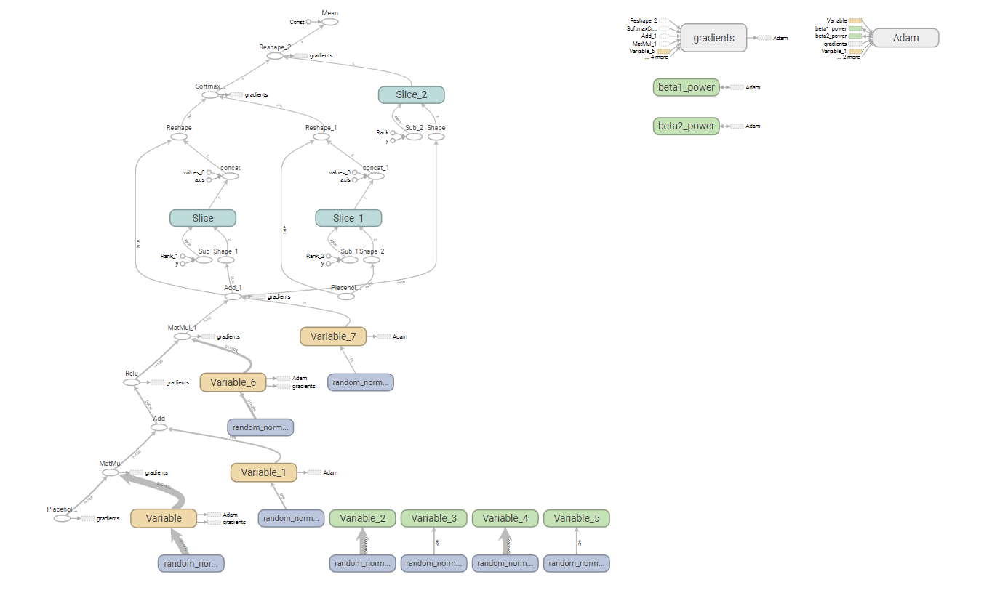
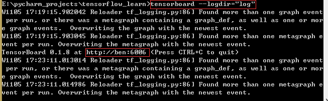
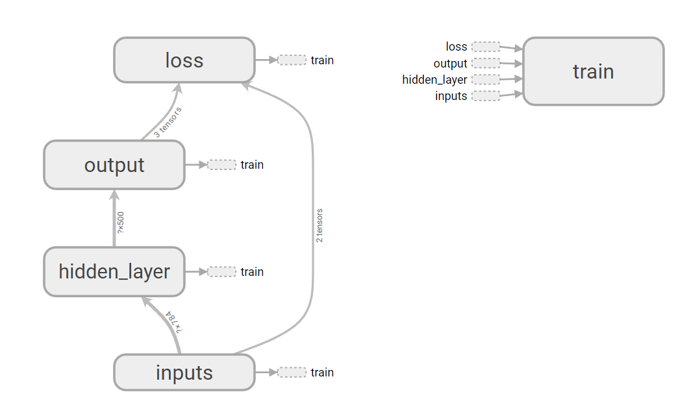
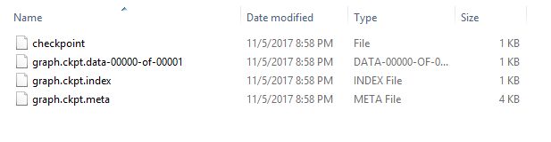

#<center>tensor flow学习笔记</center>#
#####1. **Tensor的概念**
在TensorFlow中，一切数据都是张量(tensor)，是vector和matrices的泛化，例如：vector是一个1D的tensor, matrix是一个2维的tensor
```python
tf.constant(value, dtype=None, shape=None, name='const')
```

创建一个常量tensor, 按照给出的value赋值，value可以是一个数，也可以是一个list。如果是一个数，该常量中所有值按照该数来赋值。如果是list,那么len(value)一定要小于shape展开后的长度。赋值时，先将value中的值逐个存入。不够的部分，则全部存入value的最后一个值。

```python
a = tf.constant(2, shape=[2])
# output:[2,2]

b = tf.constant(2, shape=[2, 2])
# output:[[2,2][3,3]]

c = tf.constant([1, 2, 3], shape=[6])
# output:[1,2,3,3,3,3]

# value的长度3小于shape全部展开后的长度6,前面赋值1,2,3,后面全部赋值3
d = tf.constant([1, 2, 3], shape=[3, 2])
# output: [[1,2][3,3][3,3]]
```

```python
tf.random_normal(shape,mean=0.0, stddev=1.0, dtype=tf.float32, seed=None, name=None)

tf.truncated_normal(shape, mean=0.0, stddev=1.0, dtype=tf.float32, seed=None, name=None)

tf.random.uniform(shape, minval=0, maxval=None, dtype=tf.float32, seed=None, name=None)
```
以上3个都是用于生成随机数tensor，尺寸为shape
+ random_normal:正态分布(高斯分布)，均值mean,标准差stddev

+ truncated_normal:截断正态分布随机数，均值mean,标准差stddev,但是只保留[mean-2*stddev, mean+2*stddev]范围内的随机数

+ random_uniform:均匀分布随机数，范围为[minval, maxval]


```python
a=tf.random_normal(shape=[1,5], mean=0, stddev=1)
print(sess.run(a))
# 输出1行3列的随机数[[a,b,c]]
```
```python
tf.get_variable(name, shape=None, dtype=dtype.float32, initializer=None,
regularizer=None, trainable=True, collections=None,
caching_device=None, partitioner=None, validate_shape=True,
custom_getter=None)
```
如果在该命名域之前已经有名字为name的变量，则调用那个变量，否则根据输入的参数重新创建一个名字为name的变量。
+ name:变量名字
+ shape:变量的形状,[]表示一个数，[3]表示长度为3的向量，[2，3]表示矩阵或者张量
+ dtype:变量的数据格式，主要有tf.int32,tf.float32,tf.float64
+ initializer:初始化工具，有tf.zero_initializer, tf.ones_initializer, tf.constant_initializer ,tf.random_uniform_initializer

tf.shape(Tensor)返回张量的形状，返回值本身也是一个张量，在tensorflow中，张量需要用Session.run(tensor)来获得具体数值
```python
labels=[1,2,3]
shape=tf.shape(labels)
print(sess.run(shape))
# 输出[3]
```

```python
tf.expand_dims(Tensor, dim)为张量+1维,返回添加维度后的张量 dim大小为-2~1
labels=[1,2,3]
x=tf.expand_dims(labels, 1)
print(sess.run(x))
```
例如原来的张量shape [a, b],添加后的张量shape [a, 1, 1..., b]

```python
tf.pack(values, axis=0, name='pack')
x=[1,4]
y=[2,5]
z=[3,6]
tf.pack([x, y, z]) => [[1,4],[2,5], [3,6]]
tf.pack([x, y, z], axis=1) => [[1,2,3],[4,5,6]]
```

```python
tf.conat(concat_dim, values, name='concat')
# 将张量沿着指定维度拼接起来。与前面的tf.pack用法类似
t1 = [[1,2,3],[4,5,6]]
tf = [[7,8,9],[10,11,12]]
tf.concat(0, [t1, t2])
tf.concat(0, [t1, t2]) => [[1,2,3],[4,5,6],[7,8,9],[10,11,12]]
tf.concat(1, [t1, t2]) => [[1,2,3,7,8,9],[4,5,6,10,11,12]]
```

将稀疏矩阵转换为密集矩阵
```python
tf.sparse_to_dense(sparse_indices, output_shape, sparse_values, default_value=0, validate_indices=True, name=None)
```
参数：
+ sparse_indices: 元素的坐标[[0,0],[1,2]] 表示(0,0)，和(1,2)处有值 
+ output_shape: 得到的密集矩阵的shape
+ sparse_values: sparse_indices坐标表示的点的值，可以是0维或1维。若是0维，则所有稀疏值都一样。若是1维，则len(sparse_values)应该等于len(sparse_indices)
+ default_values:缺省点的默认值

```python
tf.random_shuffle(value, seed=None, name=None)
# 沿着value的第一维进行随机重新排列
```

```python
sess = tf.Session()
a = [[1, 2],[3,4],[5,6]]
x = tf.random_shuffle(a)
print(sess.run(x)) => [[3,4],[5,6],[1,2]]
```

找到给定张量tensor中在指定轴axis上的最大值/最小值的位下标
```python
tf.argmax(input=tensor, dimention=axis)
tf.argmin(input=tensor, dimention=axis)
```

```python
a=tf.get_variable(name='a',shape=[3,4],dtype=tf.float32,
                  initializer=tf.random_uniform_initializer(minval=-1,maxval=1))
b=tf.argmax(input=a, dimension=0)
c=tf.argmin(input=a, dimension=1)
sess = tf.Session()
sess.run(tf.initialize_all_variables())
print(sess.run(a)) =>
[[ 0.04261756 -0.34297419 -0.87816691 -0.15430689]
 [0.18663144  0.86972666 -0.06103253  0.38307118]
 [0.84588599 -0.45432305 -0.39736366  0.38526249]]
print(sess.run(b)) => [2, 1, 1, 2]
print(sess.run(c)) => [2, 2, 1]
```

判断两个tensor是否相等，返回一个格式为bool的tensor
```python
tf.equal(tensor1, tensor2, name=None)
```

tf.cast(tensor, dtype, name=None)
将tensor的数据格式转化为dtype, 例如，原来的tensor为bool, 那么将其转化为float以后，就能将其转化为0和1的序列。反之也可以。

```python
a=tf.Variable([1, 0, 0, 1, 1])
b=tf.case(a, dtype=tf.bool)
sess.run(tf.initialize_all_variables())
print(sess.run(b)) => [True, False, False, True, True]
```

```python
tf.matmul(a, b, transpose_a=False, transpose_b=False, a_is_sparse=False, b_is_sparse=False, name=None)
```

用来做矩阵乘法，若a为l*m的矩阵， b为m*n的矩阵， 通过tf.matmul(a, b)可以得到一个l*n的矩阵
如果对应的transpose为True，那么计算前会先将矩阵转置一下。
如果对应的is_sparse为True,那么a会被当做稀疏矩阵来参与运算。

```python
tf.reshape(tensor, shape, name=None)
```

将tensor按照新的shape重新排列。shape有以下三种:
+ shape=[-1],表示将tensor展开为一个list
+ shape=[a, b, c,...]，其中每个a, b, c>0，就是常规用法
+ shape=[a, -1, c...]此时b=-1, a,c...>0，此时会根据tensor的原尺寸，自动计算b的值。

```python
# tensor 't' is [1, 2, 3, 4, 5, 6, 7, 8, 9]
# tensor 't' has shape [9]
reshape(t, [3, 3]) ==> [[1, 2, 3],
                        [4, 5, 6],
                        [7, 8, 9]]

# tensor 't' is [[[1, 1], [2, 2]],
#                [[3, 3], [4, 4]]]
# tensor 't' has shape [2, 2, 2]
reshape(t, [2, 4]) ==> [[1, 1, 2, 2],
                        [3, 3, 4, 4]]

# tensor 't' is [[[1, 1, 1],
#                 [2, 2, 2]],
#                [[3, 3, 3],
#                 [4, 4, 4]],
#                [[5, 5, 5],
#                 [6, 6, 6]]]
# tensor 't' has shape [3, 2, 3]
# pass '[-1]' to flatten 't'
reshape(t, [-1]) ==> [1, 1, 1, 2, 2, 2, 3, 3, 3, 4, 4, 4, 5, 5, 5, 6, 6, 6]

# -1 can also be used to infer the shape
# -1 is inferred to be 9:
reshape(t, [2, -1]) ==> [[1, 1, 1, 2, 2, 2, 3, 3, 3],
                         [4, 4, 4, 5, 5, 5, 6, 6, 6]]

# -1 is inferred to be 2:
reshape(t, [-1, 9]) ==> [[1, 1, 1, 2, 2, 2, 3, 3, 3],
                         [4, 4, 4, 5, 5, 5, 6, 6, 6]]

# -1 is inferred to be 3:
reshape(t, [ 2, -1, 3]) ==> [[[1, 1, 1],
                              [2, 2, 2],
                              [3, 3, 3]],
                             [[4, 4, 4],
                              [5, 5, 5],
                              [6, 6, 6]]]
```

```python
tf.linspace(start, stop, num, name=None)
tf.range(start, limit=None, delta=1, name='range')
```


以上两个都用于产生等差数列

+ tf.linspace在start, stop范围内产生num个数的等差数列。start和stop都要用浮点数表示，否则报错

+ tf.range在[start, limit)范围内以步值delta产生等差数列。注意不包括limit在内。

```python
sess=tf.Session()
x = tf.linspace(start=1.0,stop=5.0,num=5,name=None)  # 注意1.0和5.0
y = tf.range(start=1,limit=5,delta=1)
print(sess.run(x))
print(sess.run(y))
#===>[ 1.  2.  3.  4.  5.]
#===>[1 2 3 4]
```

```python
tf.assign(ref, value, validate_shape=None, use_locking=None, name=None)
```

用来更新模型中变量的值。ref是待赋值的变量，value是要更新的值。相当于ref = value
```python
 sess = tf.InteractiveSession()
 a = tf.Variable(0.0)
 b = tf.placeholder(dtype=tf.float32,shape=[])
 op = tf.assign(a,b) # 注意是更新a的值，此时b为placeholder，因此后面需要给出feed_dict
 sess.run(tf.initialize_all_variables())
 print(sess.run(a))
 # 0.0
 sess.run(op,feed_dict={b:5.})
 print(sess.run(a))
 # 5.0
```


为变量添加命名域

```python
tf.variable_scope(name_or_space, reuse=None, initializer=None, regularizer=None, caching_device=None, partitioner=None, custom_getter=None)

```
```python
with tf.variable_scope('foo'):
    with tf.variable_scope('abr'):
        v = tf.get_variable('v', [1])
            assert v.name == 'foo/bar/v:0'
```
Dropout:从每层中以某个概率丢掉某些节点，注意只在train的时候dropout，test的时候不要dropout
data_flow = tf.nn.dropout(data_flow, 0.9, seed=4926) 每层丢掉90%的节点

##2. 优化器
+ SGD: 普通的梯度下降Gradient Descent,由于学习率取值问题，很难直接到达最低点。
+ Momentum Update: 类似于四边形受力法则
+ Adam Update:

使用方法:
```python
if self.optimizeMethod=='gradient':
self.optimizer = tf.train.GradientDescentOptimizer(learning_rate=0.0001).minimize(self.loss)
elif self.optimizeMethod=='momentum':
self.optimizer = tf.train.MomentumOptimizer(learning_rate=0.0001, momentum=0.5).minimize(loss) # 每次加入的另外一个向量的大小
elif self.optimizeMethod=='adam':
self.optimizer = tf.train.AdamOptimizer(learning_rate=0.0001).minimize(self.loss)
```

learn_rate decay: 随着时间推移，学习效率应该是不断下降的。
```python
tf.train.exponential_decay(learning_rate, global_step, decay_steps, decay_rate, staircase=False, name=None)
```

给定下降速率0.9，学习率类似于1，0.9， 0.81， 0.729....
learning_rate是基础的leaning_rate, global_steps是表示当前走了多少步，decay_steps表示每多次次缩减一次learning_rate，
decay_learning_rate = learning_rate * decay_rate ^ (global_step / decay_steps)
用法：
```python
learnging_rate = tf.train.exponential_decay(
learning_rate = 0.001,
global_step=0,
decay_rates=0.99,
staircase=True
)
self.optimizer = tf.train.AdamOptimizer(learning_rate).minimize(loss)
```

调参优化与模型的保存
保存模型的方法：
self.saver = None
当模型定义并调试完毕之后

```python
self.saver = tf.train.Saver(tf.all_variables())
save_path = self.saver.save(session, self.save_path) # 将session保存在指定路径中，并返回该路径
# 最后在文件中读入模型：
with tf.Session(graph=tf.get_default_graph()) as session:
	self.saver.restore(session, self.save_path) # 从save_path的模型文件当中读入模型，放入到session中
session.run(test_prediction...)
```

##3. TensorFlow的基本概念:
使用图(graph)来表示计算任务，图中的节点被称之为op(operation)。一个op获得0或多个Tensor来执行计算，并产生0或者多个Tensor。每个 Tensor 是一个类型化的多维数组. 例如, 你可以将一小组图像集表示为一个四维浮点数数组, 这四个维度分别是 [batch, height, width, channels].

一个 TensorFlow 图描述了计算的过程. 为了进行计算, 图必须在 会话 里被启动. 会话 将图的 op 分发到诸如 CPU 或 GPU 之类的 设备 上, 同时提供执行 op 的方法. 这些方法执行后, 将产生的 tensor 返回. 在 Python 语言中, 返回的 tensor 是 numpy ndarray 对象; 在 C 和 C++ 语言中, 返回的 tensor 是 tensorflow::Tensor 实例.在被称之为 会话(Session)的上下文中执行图,使用tensor表示数据。通过 变量(Variable)维护状态，使用feed和fetch可以为任意的操作(arbitrary operation)赋值或者从其中获取数据。


###3.1 图的训练和计算：
####3.1计算图
TensorFlow 程序通常被组织成一个构建阶段和一个执行阶段。在构建阶段, op 的执行步骤 被描述成一个图。在执行阶段, 使用会话执行执行图中的 op。例如, 通常在构建阶段创建一个图来表示和训练神经网络, 然后在执行阶段反复执行图中的训练 op。

####3.2构建图
构建图的第一步, 是创建源 op (source op). 源 op 不需要任何输入, 例如 常量 (Constant). 源 op 的输出被传递给其它 op 做运算。Python 库中, op 构造器的返回值代表被构造出的 op 的输出, 这些返回值可以传递给其它 op 构造器作为输入。TensorFlow Python 库有一个默认图 (default graph), op 构造器可以为其增加节点. 这个默认图对 许多程序来说已经足够用了。
```python
import tensorflow as tf
# 创建一个常量 op, 产生一个 1x2 矩阵. 这个 op 被作为一个节点
# 加到默认图中.
#
# 构造器的返回值代表该常量 op 的返回值.
matrix1 = tf.constant([[3., 3.]])

# 创建另外一个常量 op, 产生一个 2x1 矩阵.
matrix2 = tf.constant([[2.],[2.]])
# 创建一个矩阵乘法 matmul op , 把 'matrix1' 和 'matrix2' 作为输入.
# 返回值 'product' 代表矩阵乘法的结果.
product = tf.matmul(matrix1, matrix2)
```

默认图现在有三个节点, 两个constant() op, 和一个matmul() op。为了真正进行矩阵相乘运算, 并得到矩阵乘法的 结果, 你必须在会话里启动这个图。在一个会话中启动图，构造阶段完成后, 才能启动图. 启动图的第一步是创建一个 Session 对象, 如果无任何创建参数,会话构造器将启动默认图。
```python
#启动默认图
sess = tf.Session()
# 调用 sess 的 'run()' 方法来执行矩阵乘法 op, 传入 'product' 作为该方法的参数. 
# 上面提到, 'product' 代表了矩阵乘法 op 的输出, 传入它是向方法表明, 我们希望取回
# 矩阵乘法 op 的输出.
#
# 整个执行过程是自动化的, 会话负责传递 op 所需的全部输入. op 通常是并发执行的.
# 函数调用 'run(product)' 触发了图中三个 op (两个常量 op 和一个矩阵乘法 op) 的执行.
#
# 返回值 'result' 是一个 numpy `ndarray` 对象.
result = sess.run(product)
print result
# ==> [[ 12.]]
# 任务完成, 关闭会话.
sess.close()
Session 对象在使用完后需要关闭以释放资源. 除了显式调用 close 外, 也可以使用 "with" 代码块 来自动完成关闭动作.

with tf.Session() as sess:
  result = sess.run([product])
  print result
```

在实现上, TensorFlow 将图形定义转换成分布式执行的操作, 以充分利用可用的计算资源(如 CPU 或 GPU). 一般你不需要显式指定使用 CPU 还是 GPU, TensorFlow 能自动检测. 如果检测到 GPU, TensorFlow 会尽可能地利用找到的第一个 GPU 来执行操作。

如果机器上有超过一个可用的 GPU, 除第一个外的其它 GPU 默认是不参与计算的. 为了让 TensorFlow 使用这些 GPU, 你必须将 op 明确指派给它们执行. with...Device 语句用来指派特定的 CPU 或 GPU 执行操作:
```python
with tf.Session() as sess:
  with tf.device("/gpu:1"):
    matrix1 = tf.constant([[3., 3.]])
    matrix2 = tf.constant([[2.],[2.]])
    product = tf.matmul(matrix1, matrix2)
    ...
```

设备用字符串进行标识. 目前支持的设备包括:
+ "/cpu:0": 机器的 CPU.
+ "/gpu:0": 机器的第一个 GPU, 如果有的话.
+ "/gpu:1": 机器的第二个 GPU, 以此类推.
Python使用Session来启动图，使用session.run()来执行图。为了便于IPython等交互环境，可使用InteractiveSession来代替Session类，使用Tensor.eval()和Operation.run()来代替Session.run().这样可以避免一个变量来持有会话。

```python
#进入一个交互式TensorFlow会话。
import tensorflow as tf
sess = tf.InteractiveSession()
x = tf.Variable([1.0, 2.0])
a = tf.constant([3.0, 3.0])

#使用初始化器initializer op的run()方法初始化 'x'
x.initializer.run()，注意此时一定要使用sess=tf.InteractiveSession()否则会出错

#增加一个减法 sub op,从 'x'减去 'a'. 运行减法op, 输出结果
sub = tf.sub(x, a)
print sub.eval()
```

TensorFlow程序使用tensor数据结构来代表所有的数据，计算图中，操作间传递的数据都是tensor,使用Variable变量维护图执行过程中的状态信息。

使用TensorFlow实现一个计数器:

```python
# 创建一个变量, 初始化为标量 0.
state = tf.Variable(0, name="counter")

# 创建一个 op, 其作用是使 state 增加 1
one = tf.constant(1)
new_value = tf.add(state, one)
update = tf.assign(state, new_value)

# 启动图后, 变量必须先经过`初始化` (init) op 初始化,
# 首先必须增加一个`初始化` op 到图中.
init_op = tf.initialize_all_variables()


# 启动图, 运行 op
with tf.Session() as sess:
  # 运行 'init' op
  sess.run(init_op)
  # 打印 'state' 的初始值
  print sess.run(state)
  # 运行 op, 更新 'state', 并打印 'state'
  for _ in range(3):
    sess.run(update)
    print sess.run(state)
```

通常会将一个统计模型中的参数表示为一组变量. 例如, 你可以将一个神经网络的权重作为某个变量存储在一个 tensor 中. 在训练过程中, 通过重复运行训练图, 更新这个 tensor.为了取回操作的输出内容, 可以在使用 Session 对象的 run() 调用 执行图时, 传入一些 tensor, 这些 tensor 会帮助你取回结果. 在之前的例子里, 我们只取回了单个节点 state, 但是你也可以取回多个 tensor:
```python
input1 = tf.constant(3.0)
input2 = tf.constant(2.0)
input3 = tf.constant(5.0)
intermed = tf.add(input2, input3)
mul = tf.mul(input1, intermed)

with tf.Session():
  result = sess.run([mul, intermed])
  print result
# 输出:
# [array([ 21.], dtype=float32), array([ 7.], dtype=float32)]
需要获取的多个 tensor 值，在 op 的一次运行中一起获得（而不是逐个去获取 tensor）。
```

####3.3 Feed机制

上述示例在计算图中引入了 tensor, 以常量或变量的形式存储. TensorFlow 还提供了 feed 机制, 该机制 可以临时替代图中的任意操作中的 tensor 可以对图中任何操作提交补丁, 直接插入一个 tensor。

feed 使用一个 tensor 值临时替换一个操作的输出结果. 你可以提供 feed 数据作为 run() 调用的参数. feed 只在调用它的方法内有效, 方法结束,feed 就会消失. 最常见的用例是将某些特殊的操作指定为 "feed" 操作, 标记的方法是使用 tf.placeholder() 为这些操作创建占位符.
```python
input1 = tf.placeholder(tf.types.float32)
input2 = tf.placeholder(tf.types.float32)
output = tf.mul(input1, input2)

with tf.Session() as sess:
  print sess.run([output], feed_dict={input1:[7.], input2:[2.]})

# 输出:
# [array([ 14.], dtype=float32)]
for a larger-scale example of feeds. 如果没有正确提供 feed, placeholder() 操作将会产生错误
```

使用交叉熵：
```python
y_=tf.placeholder('float', [None, 10])
cross_entropy=-tf.reduce_sum(y_*tf.log(y))
```

使用梯度下降来最优化:
```python
train_step = tf.train.GradientDescentOptimizer(0.01).minimize(cross_entropy)
```

训练模型:
```python
for i in range(1000):
	batch_xs, batch_ys = mnist.train.next_batch(100)
sess.run(train_step, feed_dict={x:batch_xs, y_:batch_ys})

```

注意：训练时，每次迭代不会使用上全部数据。在循环的每个步骤中，我们都会随机抓取训练数据中的100个批处理数据点，然后用这些数据点作为参数
替换之前的占位符来运行train_step。
理想情况下，我们希望我们所有的数据来进行每一步训练，因为这能带来更好的训练结果，但是开销太大。所以每一次训练可以使用不同的数据子集，这样做既可以减少计算开销，又可以最大化学习到数据集的总体特性。


模型预测：

首先让我们找出那些预测正确的标签。tf.argmax 是一个非常有用的函数，它能给出某个tensor对象在某一维上的其数据最大值所在的索引值。由于标签向量是由0,1组成，因此最大值1所在的索引位置就是类别标签，比如tf.argmax(y,1)返回的是模型对于任一输入x预测到的标签值，而 tf.argmax(y_,1) 代表正确的标签，我们可以用 tf.equal 来检测我们的预测是否真实标签匹配(索引位置一样表示匹配)。
```python
correct_prediction = tf.equal(tf.argmax(y,1), tf.argmax(y_,1))
```

这行代码会给我们一组布尔值。为了确定正确预测项的比例，我们可以把布尔值转换成浮点数，然后取平均值。例如，[True, False, True, True] 会变成 [1,0,1,1] ，取平均值后得到 0.75.
```python
accuracy = tf.reduce_mean(tf.cast(correct_prediction, "float"))
```

最后，我们计算所学习到的模型在测试数据集上面的正确率。
```python
print sess.run(accuracy, feed_dict={x: mnist.test.images, y_: mnist.test.labels})
```

##4. 关于tensorflow的reduce_*函数
reduce_\*函数的意思就是降维，所以使用了reduce这个单词。后面的*是指按照什么手段来降维，比如reduce_mean就是指使用求均值的方式来降维，reduce_max使用求最大值的方式降维，reduce_sum使用求和的方式来降维。下面具体说明:

```python
reduce_mean(
    input_tensor,
    axis=None,
    keep_dims=False,
    name=None,
    reduction_indices=None
)
```
计算张量在维度上的元素的平均值，并沿着给定的轴来减小input_tensor，类似于numpy.mean。
参数:
+ input_tensor: 需要降维的tensor
+ axis: 按照哪一个维度来降维度。0是按照列来降维，每列求均值。1是按照行来降维，求每行的均值。如果不指定，则所有元素求均值。
+ keep_dims: 如果True,则按照多行输出，即不管如何降维，降维后的返回值的维度不变。
+ name: 操作名称
+ reduction_indices: axis的旧名，已经停用。

返回：
+ 降维后的tensor。

例子：
```python
import tensorflow as tf
x = tf.constant([[1., 2., 3.], [4., 5., 6.]])
with tf.Session() as sess:
	mean1 = sess.run(tf.reduce_mean(x))
    mean2 = sess.run(tf.reduce_mean(x, keep_dims=True))
	mean3 = sess.run(tf.reduce_mean(x, axis=0))
    mean4 = sess.run(tf.reduce_mean(x, keep_dims=True, axis=0))
	mean5 = sess.run(tf.reduce_mean(x, axis=1))
    mean6 = sess.run(tf.reduce_mean(x, keep_dims=True, axis=1))
    print(mean1)
    print(mean2)

#输出分别为：
#mean1
#  3.5

#mean2
#  array([[3.5]], dtype=float32) mean是一个2维的向量,mean2.shape=(1,1)

#mean3
#  array([2.5, 3.5, 4.5], dtype=float32), mean3是一个(3,)的向量

#mean4
#  array([[[2.5, 3.5, 4.5]]], dtype=float32) mean4是一个2维(1,3)的向量,mean2.shape=(1,3)

#mean5
#  array([ 2.,  5.], dtype=float32) mean5是一个(2,)的向量

#mean6
#  array([[ 2.],[ 5.]], dtype=float32) mean6是一个2维的向量,mean2.shape=(2,1)
```

其他reduce_*函数见[官网]("www.tensorflow.org")

#5. tensorflow常见其他函数

对tensorflow按逐个元素求平方：
```python
tf.square(tensor, name)
```

```python
x = tf.constant([[1,2],[3,4]])
y=tf.square(x)
tf.Sesseion().run(y)
#输出为[[1,4],[9,16]]
```

##6. 训练流程
```python
#激活函数的activation都在tf.nn包中，例如relu, dropout等。而sigmoid和hanh则直接使用tf.sigmoid和tf.tanh即可
loss = tf.reduce_mean(tf.nn.relu(tf.square(y_true-y_pred)))
# optimizer都在tf.train包当中，优化器如下：
optimizer = tf.train.AdamOptimizer(learning_rate=1e-4)

# 使用指定的optimizer来使得loss最小
train = optimizer.minimize(loss)

sess.run(init) #初始化Variables

# 训练50个epoch
for epoch in range(50):
	sess.run(train) #训练过程当中会不断更新权值
```

常用的optimizer有以下：
+ tf.train.Optimizer
+ tf.train.GradientDescentOptimizer
+ tf.train.AdadeltaOptimizer
+ tf.train.AdagradOptimizer
+ tf.train.AdagradDAOptimizer
+ tf.train.MomentumOptimizer
+ tf.train.AdamOptimizer
+ tf.train.FtrlOptimizer
+ tf.train.ProximalGradientDescentOptimizer
+ tf.train.ProximalAdagradOptimizer
+ tf.train.RMSPropOptimizer

##7. Variable中name和scope的作用
在tensorflow当中，使用Variable时候，一般会使用name参数指定一个名字，主要目的是为了以后的参数共享和重用。可以使用tf.get_variable(name)来按名字搜索之前的Variable而不会新建新的变量。

另一方面，在TensorBoard当中，也是通过name和scope来给graph的Variable和placeholder命名。

##8. 定义神经网络:
###8.1 简单的BP网络
```python
import tensorflow as tf
from tensorflow.examples.tutorials.mnist import input_data

mnist = input_data.read_data_sets("/tmp/data/", one_hot=True)

n_nodes_hl1 = 500
n_nodes_hl2 = 500
n_nodes_hl3 = 500
n_classes = 10
batch_size = 100

x = tf.placeholder("float", [None, 784])
y = tf.placeholder("float", [None, n_classes])

def neural_network_model(data):
    # 创建第一个隐藏层节点500个
    hidden_1_layer = {"weight": tf.Variable(tf.random_normal([784, n_nodes_hl1])), "biases": tf.Variable(tf.random_normal([n_nodes_hl1]))}

    # 创建第二个隐藏层节点500个
    hidden_2_layer = {"weight": tf.Variable(tf.random_normal([n_nodes_hl1, n_nodes_hl2])),"biases": tf.Variable(tf.random_normal([n_nodes_hl2]))}

    # 创建第三个隐藏层节点500个
    hidden_3_layer = {"weight": tf.Variable(tf.random_normal([n_nodes_hl2, n_nodes_hl3])),"biases": tf.Variable(tf.random_normal([n_nodes_hl3]))}

    # 创建输出层节点10个
    output_layer = {"weight": tf.Variable(tf.random_normal([n_nodes_hl3, n_classes])),"biases": tf.Variable(tf.random_normal([n_classes]))}

    # 连接输入层
    l1 = tf.add(tf.matmul(data, hidden_1_layer["weight"]), hidden_1_layer["biases"])
    l1 = tf.nn.relu(l1)

    # 连接hidden layer 1和hidden layer 2
    l2 = tf.add(tf.matmul(l1, hidden_2_layer["weight"]), hidden_2_layer["biases"])
    l2 = tf.nn.relu(l2)

    # 连接hidden layer 2和hidden layer 3
    l3 = tf.add(tf.matmul(l2, hidden_3_layer["weight"]), hidden_3_layer["biases"])
    l3 = tf.nn.relu(l3)

    # 连接hidden layer 3和output layer
    output = tf.add(tf.matmul(l3, output_layer["weight"]), output_layer["biases"])
    # output = tf.nn.softmax(output)
    return output

def train(x):
    # 获取输出值
    predict = neural_network_model(x)
    # 定义对数损失函数,损失函数都是直接调用tf
    cost = tf.reduce_mean(tf.nn.softmax_cross_entropy_with_logits(logits=predict, labels=y))

    # 定义最优化损失的计算方法
    optimizer = tf.train.AdamOptimizer().minimize(cost)

    hm_epochs = 10
    with tf.Session() as sess:  # 真正运行在这里面
        sess.run(tf.global_variables_initializer())
        for epoch in range(hm_epochs):
            epoch_loss = 0
            for _ in range(int(mnist.train.num_examples / batch_size)):
                epoch_x, epoch_y = mnist.train.next_batch(batch_size)
                _, c = sess.run([optimizer, cost], feed_dict={x: epoch_x, y: epoch_y})
                epoch_loss += c  # 叠加所有样本的损失
            print("Epoch", epoch, "completed out of ", hm_epochs, "loss: ", epoch_loss)

        correct = tf.equal(tf.arg_max(predict, 1), tf.arg_max(y, 1))

        accuracy = tf.reduce_mean(tf.cast(correct, "float"))  # 所有元素取均值
        print("Accuracy:", accuracy.eval({x: mnist.test.images, y: mnist.test.labels}))

train(x)
```

###8.2 定义CNN

```python

import tensorflow as tf

def conv2d(input, weight):
	return tf.nn.conv2d(input, weight, strides=[1,1,1,1], padding="SAME")

def max_pooling(x):
	return tf.nn.max_pool(x, ksize=[1,2,2,1], strides=[1,2,2,1], padding="SAME")
```

函数原型为：
```python
conv2d(
    input,
    filter,
    strides,
    padding,
    use_cudnn_on_gpu=None,
    data_format=None,
    name=None
)

```
参数：
+ input: 输入tensor

+ filter: 和input的shape相同，一般是一个4-D的tensor，即[filter_height, filter_width, in_channels, out_channels]，其中out_channels其实是filter的数量

+ strides: filter滑动步长，一般是[1, stride_x, stride_y, 1]，因为不需要再batch和channel上滑动，因此第1维和第4维取1.

+ padding: 字符串，是否进行填充，SAME表示填充, VALID不填充

+ use_cudnn_on_gpu: 是否使用cudnn和gpu,默认为True

+ data_format: 字符串，数据格式，默认是NHWC,即[batch, heigth, width, channels]，另外的NCHW,即[batch, channels, height, width]

+ name: 名称

返回值：

返回tensor, 是一个4-D的tensor,即[batch, out_height, out_width, out_channels]

```python
max_pool(
    value,
    ksize,
    strides,
    padding,
    data_format='NHWC',
    name=None
)

```
参数:
+ value: 一个4-D的tensor

+ ksize: 池化窗口的大小，取一个四维向量，一般是[1, height, width, 1]，因为我们不想在batch和channels上做池化，所以这两个维度设为了1

+ stides: 和卷积类似，窗口在每一个维度上滑动的步长，一般也是[1, stride,stride, 1]

+ padding: string, 为VALID或者SAME

+ data_format: 同上

+ name: 同上


```python
#将高位矩阵变成一维度向量
def flatten(x):
	return tf.reshape(x, [-1, x.shape[1]*x.shape[2]*x.shape[3]])

#定义dropout
def dropout(x, keep_prob):
	return tf.nn.drop(x, keep_prob)
```

##9. TensorBoard可视化
如果不使用任何的name和namescope的话，输出的graph如下:

tensorflow当中在initial所有的Variable之前使用tf.summary.FileWriter(savepath, sess.graph)来保存对应的graph到savepath目录下，然后再terminal或者command下，先进入savepath所在目录，然后运行

```

tensorboard --logdir="savepath"
```

根据提示在浏览器中打开对应的url即可看到对应的graph。


对应的代码如下：
```python
import tensorflow as tf

n_nodes_hl1 = 500
n_nodes_hl2 = 500
n_nodes_hl3 = 500
n_classes = 10
batch_size = 100

x = tf.placeholder("float", [None, 784])
y = tf.placeholder("float", [None, n_classes])

def neural_network_model(data):
    # 创建第一个隐藏层节点500个
    hidden_1_layer = {"weight": tf.Variable(tf.random_normal([784, n_nodes_hl1])),"biases": tf.Variable(tf.random_normal([n_nodes_hl1]))}

    # 创建输出层节点10个
    output_layer = {"weight": tf.Variable(tf.random_normal([n_nodes_hl3, n_classes])), "biases": tf.Variable(tf.random_normal([n_classes]))}

    # 连接输入层
    l1 = tf.add(tf.matmul(data, hidden_1_layer["weight"]), hidden_1_layer["biases"])
    l1 = tf.nn.relu(l1)

    # 连接hidden layer 1和output layer
    output = tf.add(tf.matmul(l1, output_layer["weight"]), output_layer["biases"])
    # output = tf.nn.softmax(output)
    return output

def train(x):
    # 获取输出值
    predict = neural_network_model(x)
    # 定义对数损失函数,损失函数都是直接调用tf
    cost = tf.reduce_mean(tf.nn.softmax_cross_entropy_with_logits(logits=predict, labels=y))
    # 定义最优化损失的计算方法
    optimizer = tf.train.AdamOptimizer().minimize(cost)

    hm_epochs = 10
    with tf.Session() as sess:  # 真正运行在这里面
        # 使用这一行代码来保存graph
        writer = tf.summary.FileWriter("../log/", sess.graph)
        sess.run(tf.global_variables_initializer())
train(x)
```

可以看出，在没有指定name和scope的情况下，整个graph看起来没有层次，比较乱，因此需要使用name和scope使得graph看起来更有层次，更美观。改进如下：
```python
import tensorflow as tf
n_nodes_hl1 = 500
n_nodes_hl2 = 500
n_nodes_hl3 = 500
n_classes = 10
batch_size = 100
with tf.name_scope("inputs"):
    x = tf.placeholder("float", [None, 784], name="x_input")
    y = tf.placeholder("float", [None, n_classes], name="y_input")

def neural_network_model(data):
    # 创建第一个隐藏层节点500个
    with tf.name_scope("hidden_layer"):
            hidden_1_layer = {"weight": tf.Variable(tf.random_normal([784, n_nodes_hl1]), name="weight"),"biases": tf.Variable(tf.random_normal([n_nodes_hl1]), name="biases")}

            l1 = tf.add(tf.matmul(data, hidden_1_layer["weight"], name="multiply"), hidden_1_layer["biases"], name="add")
            l1 = tf.nn.relu(l1, name="relu")

    # 创建输出层节点10个
    with tf.name_scope("output"):
        output_layer = {"weight": tf.Variable(tf.random_normal([n_nodes_hl3, n_classes]), name="weight"),"biases": tf.Variable(tf.random_normal([n_classes]), name="biases")}

        # 连接hidden layer 3和output layer
        with tf.name_scope("output"):
            output = tf.add(tf.matmul(l1, output_layer["weight"], name="multiply"), output_layer["biases"], name="add")

            # output = tf.nn.softmax(output)
    return output

def train(x):
    # 获取输出值
    predict = neural_network_model(x)
    # 定义对数损失函数,损失函数都是直接调用tf
    with tf.name_scope("loss"):
        cost = tf.reduce_mean(tf.nn.softmax_cross_entropy_with_logits(logits=predict, labels=y))

    # 定义最优化损失的计算方法

    with tf.name_scope("train"):
        optimizer = tf.train.AdamOptimizer().minimize(cost)
    hm_epochs = 10
    with tf.Session() as sess:  # 真正运行在这里面
        writer = tf.summary.FileWriter("../log/", sess.graph)
        sess.run(tf.global_variables_initializer())
        writer.close()
train(x)

```

经过改进之后，层次感明显加强。
**注意：
在scope定义的变量并不是局部变量，而是全局变量。
**

##10. tensorflow保存和加载模型
tensorflow中通过saver来存储模型，变量，权值等。
```python
# 保存模型
import tensorflow as tf

# 需要指定name, 因为后面提取变量的时候根据的是name
weight = tf.Variable([[1,2,3],[4,5,6]], dtype=tf.float32, name="weight")
biases = tf.Variable([7,8,9], dtype=tf.float32, name="biases")

saver = tf.train.Saver()
with tf.Session() as sess:
	sess.run(tf.global_variables_initializer())
    # 通过Session来保存运行在Session上的模型
    save_path = saver.save(sess, "save_path/graph.ckpt")
    print(save_path)
    # 打印的path 为save_path/graph.ckpt
```

在指定的目录下会生成4个文件,虽然文件后缀不一样，但是tensorflow在恢复时会自动识别。


```python
import tensorflow as tf

# 需要指定name, 因为后面提取变量的时候根据的是前面的name来恢复
weight = tf.Variable(tf.zeros(shape=[2,3], dtype=tf.float32), name="weight")
biases = tf.Variable(tf.zeros(shape=[3], dtype=tf.float32), name="biases")

saver = tf.train.Saver()
with tf.Session() as sess:
    # 此处不需要进行初始化
    # 通过Session来恢复运行在Session上的模型
    saver.restore(sess, "save_path/graph.ckpt") #直接通过保存的前缀来导入即可，导入时根据name来恢复
    print(sess.run(weight), sess.run(biases))
```

##11. tensorflow加载pre-trained model
tensor slim中提供了很多模型，模型地址:[tensorflow model github]("https://github.com/tensorflow/models/tree/master/research")

使用前，先安装tensorflow model库：
```
python setup.py install
```

然后就可以使用预训练的模型，此处以目前image classify的start-of-art的nasnet为例说明：

```python
import tensorflow as tf
from skimage import io
from preprocessing import vgg_preprocessing
from nets import vgg
from datasets import imagenet

slim = tf.contrib.slim
image_size = vgg.vgg_16.default_image_size
cp_file = "vgg_16_2016_08_28/vgg_16.ckpt"
print(image_size)

with tf.Graph().as_default():
    _image = io.imread("First_Student_IC_school_bus_202076.jpg")
    image = vgg_preprocessing.preprocess_image(_image, image_size, image_size, is_training=False)
    image = tf.expand_dims(image, axis=0)
    logits, end_points = vgg.vgg_16(image, num_classes=1000, is_training=False)

    probabilities = tf.nn.softmax(logits=logits)

    saver = tf.train.Saver()
    with slim.arg_scope(vgg.vgg_arg_scope()):
        with tf.Session() as sess:
            saver.restore(sess, cp_file)
            probabilities = probabilities[0, 0:]
            probabilities = sess.run(probabilities)
            print(probabilities)
            sorted_inds = [i[0] for i in sorted(enumerate(-probabilities), key=lambda x: x[1])]
            names = imagenet.create_readable_names_for_imagenet_labels()
            for i in range(5):
                index = sorted_inds[i]
                print('Probability %0.2f => [%s]' % (probabilities[index], names[index + 1]))
```

a

a

a

a

a

a

a

a

a

a

a

a

aa

a

a

a

a

a

a

a

a

a

a

a


a

a

a

a

a

a

a

a


a