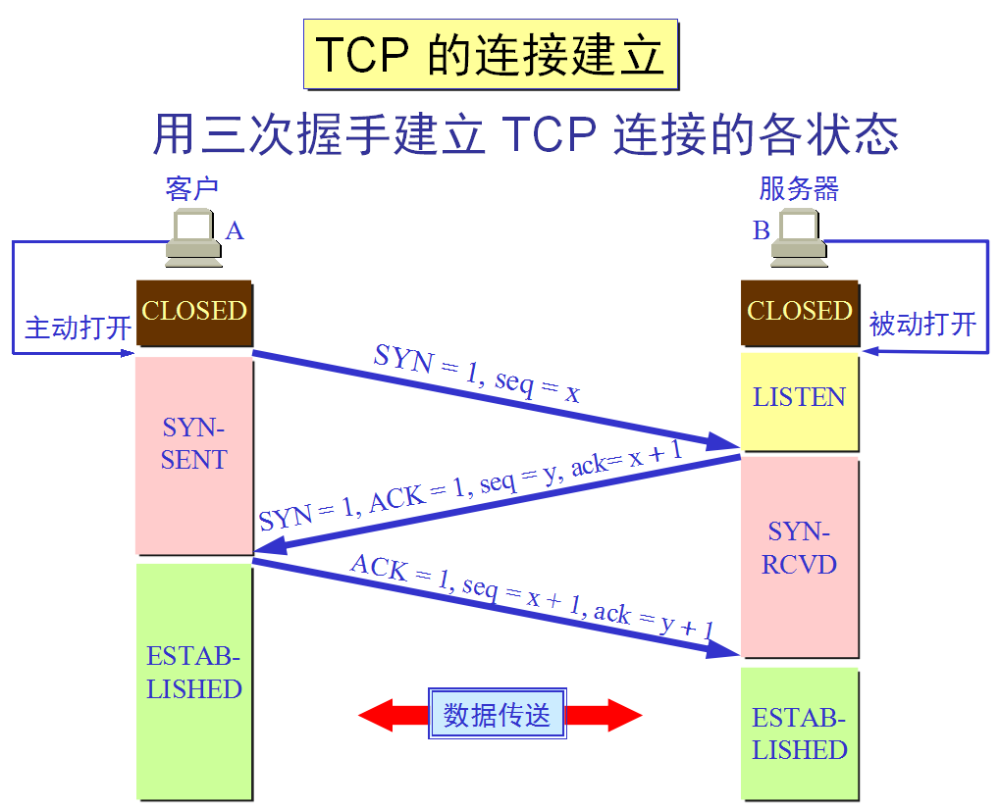
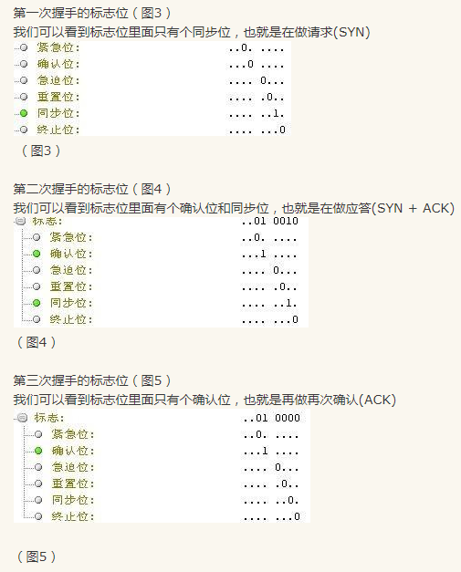
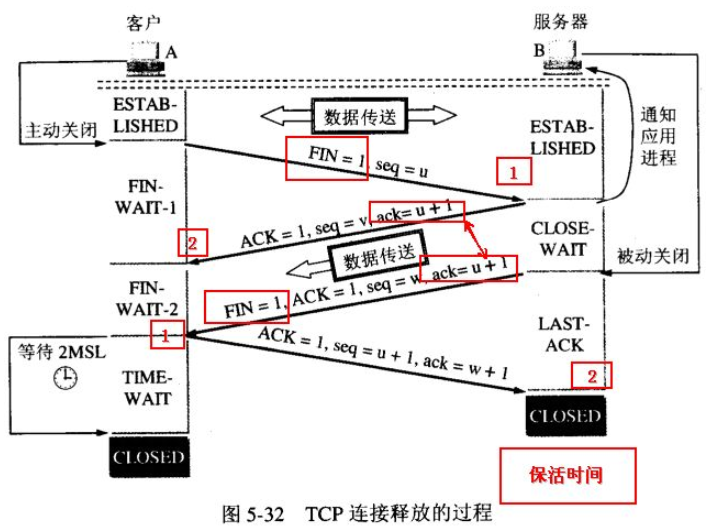

#
计算机网路常见知识点
#
##1. TCP建立的3次握手和断开的4次握手
###1.1 TCP建立连接
TCP报文的头部信息如下所示:

连接建立和断开需要的信息有:
+ ACK(acknowledgement 确认):TCP协议规定，只有ACK=1时有效，也规定连接建立后所有发送的报文的ACK必须为1
+ SYN(synchronous 建立联机): 在连接建立时用来同步序号。当SYN=1而ACK=0时，表明这是一个连接请求报文。对方若同意建立连接，则应在响应报文中使SYN=1和ACK=1. 因此,  SYN置1就表示这是一个连接请求或连接接受报文。
+ PSH(push 传送):
+ FIN(finish 结束):用来释放一个连接。当 FIN = 1 时，表明此报文段的发送方的数据已经发送完毕，并要求释放连接。
+ URG(urgent 紧急):
+ RST(reset 重置):

报文中的序号: 占4个字节。序号范围是$[0, 2^{32}-1]$，共$2^{32}$(即4 284 967 296)个序号。序号增加到$2^{32}-1$后，下一个序号就回到0。也就是说，序号使用$mod 2^{32}$运算。TCP面向字节流，在一个TCP连接中传送的字节流中的每一个字节都按顺序编号。整个要传送的字节流的起始序号必须在连接建立时设置。首部中的序号字段值则指的是本报文所发送的数据的第一个字节的序号。
真个传送过程为:

1. 首先A的TCP客户进程向B发出连接请求报文段，这时首部中的同步位SYN=1，同时选择一个初始序号seq=x(一般随机生成)。TCP规定，SYN报文段(即SYN=1的报文段)不能携带数据，但要消耗掉一个序号。这时，A的客户进程就进入SYN-SENT(同步已发送)状态。
2. B收到连接请求报文段后，向A发送确认。在确认报文段中把SYN和ACK位都置为1，确认号是ack=x+1,同时也为自己选择一个初始序号seq=y。请注意，这个报文段也不能携带数据，但同样要消耗掉一个序号。这时B的TCP服务器进程就进入SYN-RCVD(同步已收到)状态。
3. A的TCP客户进程收到B的确认后，还要向B给出确认。确认报文段的ACK置为1，确认号ack=y+1，而自己的序号seq=x+1。这时，TCP连接已经建立，A进入ESTABLISHED(已建立连接)状态，当B收到A的确认后，也会进入ESTABLISHED状态。

为什么A还要发送一次确认呢?

这主要是为了防止已失效的连接请求报文段突然又传送到了B，因而产生错误。假定A发出的某一个连接请求报文段在传输的过程中并没有丢失，而是在某个网络节点长时间滞留了，以致延误到连接释放以后的某个时间才到达B。本来这是一个早已失效的报文段。但B收到此失效的连接请求报文段后，就误以为A又发了一次新的连接请求，于是向A发出确认报文段，同意建立连接。假如不采用三次握手，那么只要B发出确认，新的连接就建立了。由于A并未发出建立连接的请求，因此不会理睬B的确认，也不会向B发送数据。但B却以为新的运输连接已经建立了，并一直等待A发来数据，因此白白浪费了许多资源。采用TCP三次握手的方法可以防止上述现象发生。例如在刚才的情况下，由于A不会向B的确认发出确认，B由于收不到确认，就知道A并没有要求建立连接。

##1.2 TCP断开连接

1. 当客户端A没有东西要发送的时候就要释放A的连接,，A会发送一个报文（没有数据），其中 FIN 设置为1,  服务器B收到后会给应用程序一个信，这时A那边的连接已经关闭，即A不再发送信息（但仍可接收信息）。  A收到B的确认后进入等待状态，等待B请求释放连接， B数据发送完成后就向A请求连接释放，也是用FIN=1 表示， 并且用 ack = u+1(如图）， A收到后回复一个确认信息，并进入 TIME_WAIT 状态， 等待 2MSL 时间。

为什么要等待呢？

为了这种情况： B向A发送 FIN = 1 的释放连接请求，但这个报文丢失了， A没有接到不会发送确认信息， B 超时会重传，这时A在 WAIT_TIME 还能够接收到这个请求，这时再回复一个确认就行了。（A收到 FIN = 1 的请求后 WAIT_TIME会重新记时）
