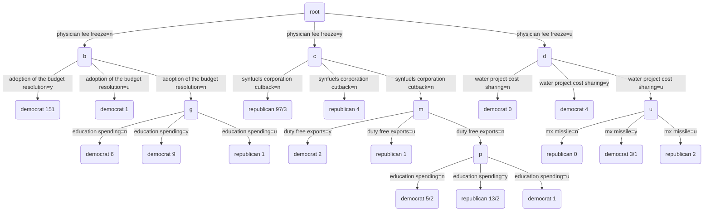

u-- mx missile=n -->v(republican 0)
u-- mx missile=y -->w(democrat 3/1)
u-- mx missile=u -->x(republican 2)

graph TD
a(root)-- attr1=v1 p=0.4-->b(node1)
a(root)-- attr1=v2 p=0.3-->c(node2)
a(root)-- attr1=v3 p=0.3-->d(node3)
b--attr2=v4 p=0.6-->e(node4 label=yes p=0.24)
b--attr2=v5 p=0.2-->f(node5 label=no p=0.0.08)
b--attr2=v6 p=0.2-->g(node6 label=no p=0.0.08)
c--attr2=v7 p=0.3-->h(node7 label=no p=0.09)
c--attr2=v8 p=0.3-->i(node8 label=no p=0.09)
c--attr2=v9 p=0.4-->j(node9 label=no p=0.12)
d--attr2=v10 p=0.1-->k(node10 label=yes p=0.03)
d--attr2=v11 p=0.4-->l(node11 label=yes p=0.12)
d--attr2=v12 p=0.5-->m(node12 label=yes p=0.15)

后面再继续分裂时,计算信息增益和增益率与上面的方法相同,只有样本个数中含有小数,计算过程此处省略。

graph TD
a(root)--sunny-->b(D1 	1	no D2	0.125	no D3	0.125	yes D8	0.125	no D9	0.125	yes D10	0.125	yes D11	0.125	yes)
a(root)-- overcast-->c(D7 	1	yes D12 	1	yes D13	1	yes D2	0.375	no D3	0.375	yes D8	0.125	no D9	0.375	yes D10	0.125	yes D11	0.375	yes)
a(root)--rain-->d(D4 	1	yes D5 	1	yes D6	1	no D14	1	no D2	0.5	no D3	0.5	yes D8	0.5	no D9	0.5	yes D10	0.5	yes D11	0.5	yes)

graph TD
a(N个样本)-- attr1 < vi -->b(a个样本)
a-- attr1 >= attri -->c(b个样本)
b-- attr2=male-->d(c个样本)
b-- attr2=female-->e(d个样本)
d-- attr1 < vj -->f(e个样本)
d-- attr1 >= vj -->g(f个样本)