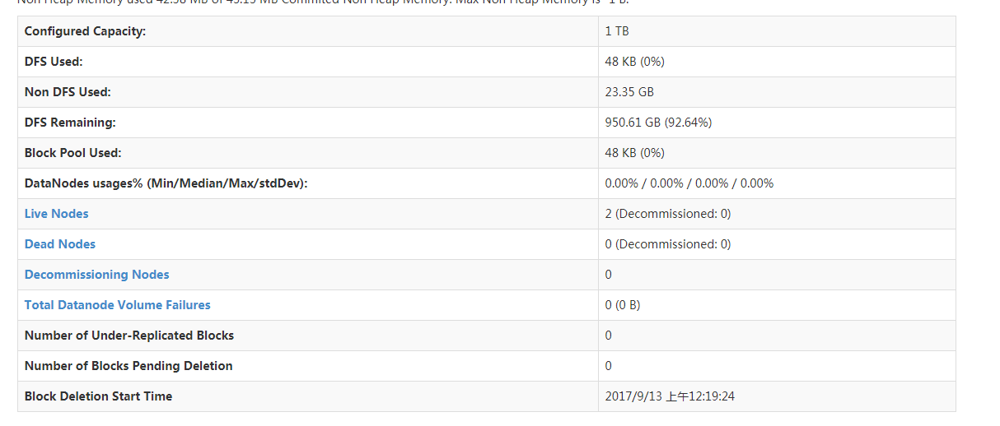
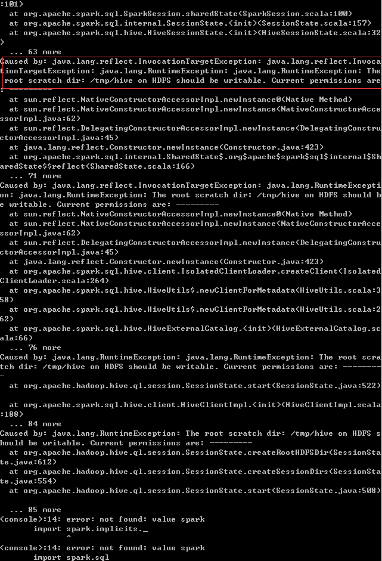

#
hadoop搭建问题汇总
#
1. 搭建后出现如下情况

2. 启动spark报错:

解决方法：
	1. 下载winutils.exe放到hadoop/bin/目录下，下载地址[winutils.ext](https://raw.githubusercontent.com/steveloughran/winutils/master/hadoop-2.7.1/bin/winutils.exe)
	2. 在hadoop所在盘符下面建立文件夹tmp/hive，例如hadoop安装在D盘，则建立文件夹D:/tmp/hive，然后执行如下命令:
	winutils.exe chmod 777 D:/tmp/hive
    3. 执行spark-shell恢复正常
	
    解决详情见地址：[Windows上搭建Standalone模式的Spark环境](https://yq.aliyun.com/articles/96424?t=t1)