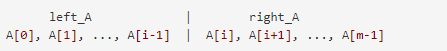
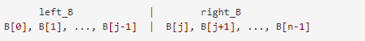
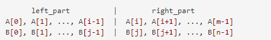
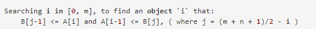
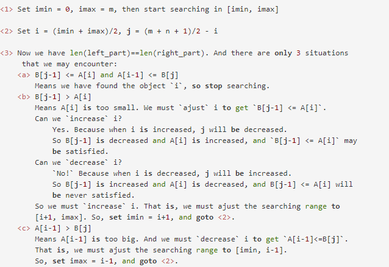
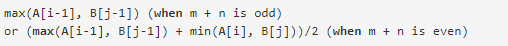
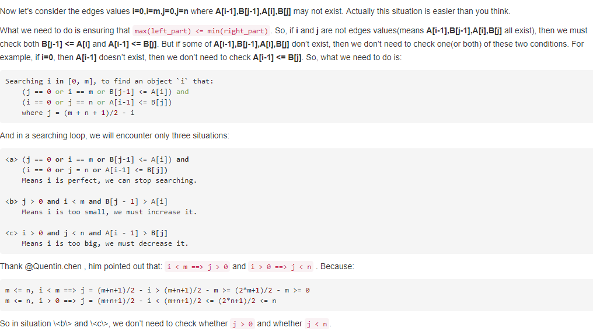
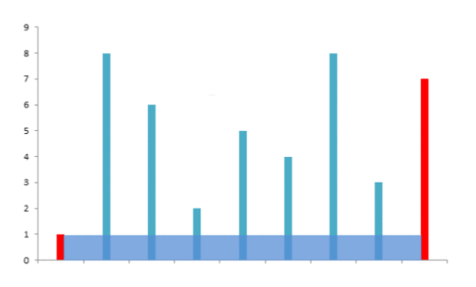

#<center>leetcode总结</center>#
###1. two sum
给定一个整数数组，返回两个数字的索引，使它们加起来成为一个特定的目标。您可能会认为每个输入都只有一个解决方案，而且您可能不会使用相同的元素两次。

思路：使用c++里面的hash表。首先从前到后遍历给定的vector, 对于访问到的数，在map中查找是否存在target-visit这个数，如果有，则直接返回该数的下标和已经找到的target-visit的数的下标。如果没有找到，则讲该数插入到map当中。
```cpp
#include <vector>

using namespace std;

class Solution {
public:
    vector<int> twoSum(vector<int>& nums, int target) {
        map<int, int> hmap;
		vector<int> result;
		for (int i = 0; i < nums.size(); i++){
			if (hmap.count(target - nums[i])){
				result.push_back(i);
				result.push_back(hmap[target-nums[i]]);
				return result;
			}
			hmap[nums[i]] = i;
		}
		return result;
    }
};
```

###2. 

###4. Median of Two Sorted Arrays
给定两个排序好的数组nums1和numns2,求合并后的数组的中位数，时间复杂度为$O(\log(m+n))$。

思路：在统计学当中，中位数的目的是为了将一个数组分成两个部分，其中一部分的元素值始终大于另一部分的元素值。首先将数组A在位置i分成两部分:

对数组B也是一样：

然后把$left_A$和$left_B$放到一起，把$right_A$和$right_B$放到一起：

如果能够保证：
1. len(left_part) == len(right_part)
2. max(left_part) <= min(right_part)

这样我们就把数组$\{A, B\}$分成了两部分，因此中位数就是:
$$
median=\frac {\max(left\_part)+\min(right\_part)}{2}
$$
为满足以上两个条件，只需要：
1. $i+j==m-i+n-j(or: m-i+n-j+1)$,如果$n>=m$，只需设置$i=0\sim m, j=\frac{m+n+1}{2} - i$
2. $B[j-1] <= A[i]$且$A[i-1] <= B[j]$

设置$n>=m$的原因是避免j为负数。因此只需要进行如下的二分查找即可：

二分查找过程为：

最终的中位数为:

对于边界值的考虑：

完整C++代码：

```cpp
int m = nums1.size(), n = nums2.size();  // 获取数组长度m, n
		if (m > n) 
			return findMedianSortedArrays(nums2, nums1); //保证数组nums2的长度大于或等于nums1
		if (n == 0)
			cout << "array nums2 is invalid";
		int i=0, j=0, imin = 0, imax = m, half = (m + n + 1) / 2;
		std::numeric_limits<int>::max();
		int max_of_left = -inf, min_of_right = inf;
		while (imin <= imax) {  //在imin和imax之间进行二分查找
			i = (imin + imax) / 2;
			j = half - i;
			if (i < m && nums2[j - 1] > nums1[i]) // i is too small, must increase it
				imin = i + 1;
			else if (i > 0 && nums1[i - 1] > nums2[j]) // i is too big, must decrease it
				imax = i - 1;
			else // i is perfect
			{
				if (i == 0)
					max_of_left = nums2[j - 1];
				else if (j == 0)
					max_of_left = nums1[i - 1];
				else
					max_of_left = max(nums1[i - 1], nums2[j - 1]);

				if ((m + n) % 2 == 1)
					return max_of_left;

				if (i == m)
					min_of_right = nums2[j];
				else if (j == n)
					min_of_right = nums1[i];
				else
					min_of_right = min(nums1[i], nums2[j]);

				return (max_of_left + min_of_right) / 2.0;
			}
		}
```

###11. Container with Most Water
给定n个非负整数$a_1, a_2,\cdots, a_n$，每个数代表坐标$(i, a_i)$。画n条垂直线连接点$(i, a_i)$和点$(i, 0)$。现在要求找出两条线，其与X轴围成一个容器，使得容器中的水最多。

假设n最小值为2。

思路：
假定是下面这样的情况：

设置两个指针，分别从前往后扫，从后往前扫，获取其中最大的面积。如果前面的指针对应的长度短，则前面的指针加1，否则后面的指针减1.
```cpp
class Solution {
public:
	int maxArea(vector<int>& height) {
		int max_area = 0;
		int begin = 0, end = height.size()-1;
		while (end > begin)
		{
			if (max_area < (end - begin)* min(height.at(begin), height.at(end)))
				max_area = (end - begin)* min(height.at(begin), height.at(end));
			if (height.at(begin) < height.at(end))
				begin += 1;
			else
				end -= 1;
		}
		return max_area;
	}
};
```

15. 3sum
