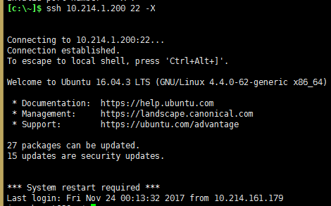

linux常见包的安装

1. protobuff-c

2. libcap
sudo apt-get install libpcap-dev

3. "error while loading shared libraries: xxx.so.x" 错误的原因和解决办法
["error while loading shared libraries: xxx.so.x" 错误的原因和解决办法]("http://blog.csdn.net/sahusoft/article/details/7388617")
一般我们在Linux下执行某些外部程序的时候可能会提示找不到共享库的错误, 比如:

tmux: error while loading shared libraries: libevent-1.4.so.2: cannot open shared object file: No such file or directory

原因一般有两个, 一个是操作系统里确实没有包含该共享库(lib*.so.*文件)或者共享库版本不对, 遇到这种情况那就去网上下载并安装上即可. 

另外一个原因就是已经安装了该共享库, 但执行需要调用该共享库的程序的时候, 程序按照默认共享库路径找不到该共享库文件. 

所以安装共享库后要注意共享库路径设置问题, 如下:

1) 如果共享库文件安装到了/lib或/usr/lib目录下, 那么需执行一下ldconfig命令

ldconfig命令的用途, 主要是在默认搜寻目录(/lib和/usr/lib)以及动态库配置文件/etc/ld.so.conf内所列的目录下, 搜索出可共享的动态链接库(格式如lib*.so*), 进而创建出动态装入程序(ld.so)所需的连接和缓存文件. 缓存文件默认为/etc/ld.so.cache, 此文件保存已排好序的动态链接库名字列表.

2) 如果共享库文件安装到了/usr/local/lib(很多开源的共享库都会安装到该目录下)或其它"非/lib或/usr/lib"目录下, 那么在执行ldconfig命令前, 还要把新共享库目录加入到共享库配置文件/etc/ld.so.conf中, 如下:

```
# cat /etc/ld.so.conf
include ld.so.conf.d/*.conf
# echo "/usr/local/lib" >> /etc/ld.so.conf
# ldconfig
```

3) 如果共享库文件安装到了其它"非/lib或/usr/lib" 目录下,  但是又不想在/etc/ld.so.conf中加路径(或者是没有权限加路径). 那可以export一个全局变量LD_LIBRARY_PATH, 然后运行程序的时候就会去这个目录中找共享库. 

LD_LIBRARY_PATH的意思是告诉loader在哪些目录中可以找到共享库. 可以设置多个搜索目录, 这些目录之间用冒号分隔开. 比如安装了一个mysql到/usr/local/mysql目录下, 其中有一大堆库文件在/usr/local/mysql/lib下面, 则可以在.bashrc或.bash_profile或shell里加入以下语句即可:

export LD_LIBRARY_PATH=/usr/local/mysql/lib:$LD_LIBRARY_PATH    

一般来讲这只是一种临时的解决方案, 在没有权限或临时需要的时候使用.

远程画图，并在本地显示：
1. 安装[Xming](https://sourceforge.net/projects/xming/?source=typ_redirect)
2. 打开Xshell, 选择properties->tunnel
然后按照如下配置：

3. 利用如下命令登陆远程服务器:
```
ssh ip port(22) -X  # 登陆XShell，然后运行绘图程序即可
```



