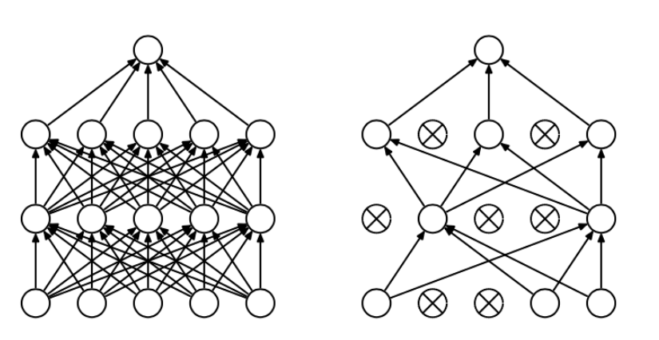

#<center>常见网络结构的详解和代码实现</center>#
##1. AlexNet
论文地址:[ImageNet Classification with Deep Convolutional Neural Networks](https://papers.nips.cc/paper/4824-imagenet-classification-with-deep-convolutional-neural-networks.pdf)
2012年提出的AlexNet的网络结构为：

结构说明如下：
###1.1 ReLu(Rectified Linear Units)激活函数：
Relu函数为
$$
relu(x) = max\{0, x\}=\left\{
\begin{aligned}
x && x \ge 0 \\
y && x = 0
\end{aligned}
\right.
$$
图像为：

relu函数作为激活函数，相对于$sigmoid$和$tanh$的优点：
1. 采用sigmoid等函数，算激活函数时（指数运算），计算量大，反向传播求误差梯度时，求导涉及除法，计算量相对大，而采用Relu激活函数，整个过程的计算量节省很多。并且计算的过程当中只需要判断输入是或大于0，因此Relu函数的收敛速度会快很多。
2. 对于深层网络，sigmoid函数反向传播时，很容易就会出现梯度消失的情况（在sigmoid接近饱和区时，变换太缓慢，导数趋于0，这种情况会造成信息丢失），从而无法完成深层网络的训练。vanishing gradient在网络层数多的时候尤其明显，是加深网络结构的主要障碍之一。相反，Relu的gradient大多数情况下是常数，有助于解决深层网络的收敛问题。
3. Relu会使一部分神经元的输出为0，这样就造成了网络的稀疏性，并且减少了参数的相互依存关系，缓解了过拟合问题的发生。
4. 在生物上的合理性，它是单边的，相比sigmoid和tanh，更符合生物神经元的特征。

relu存在的一些问题：
1. ReLU的输出不是zero-centered。如果所有均为正数或负数，那么其对的导数总是正数或负数，这会导致如下图红色箭头所示的阶梯式更新，这显然并非一个好的优化路径。深度学习往往需要大量时间来处理大量数据，模型的收敛速度是尤为重要的。所以，总体上来讲，训练深度学习网络尽量使用zero-centered数据 (可以经过数据预处理实现) 和zero-centered输出(如tanh)。如下图：


2. Dead ReLU Problem，指的是某些神经元可能永远不会被激活，导致相应的参数永远不能被更新。有两个主要原因可能导致这种情况产生: (1) 非常不幸的参数初始化，这种情况比较少见 (2) learning rate太高导致在训练过程中参数更新太大，不幸使网络进入这种状态。解决方法是可以采用Xavier初始化方法，以及避免将learning rate设置太大或使用adagrad等自动调节learning rate的算法。

relu作为激活函数，本身看起来是一个线性的函数，但是对于普通的其他任意函数来讲，都可以看成是一个个小小的线段组成的。因此当网络层数很少，比如只有一个隐藏层的时候，relu很难达到非线性的效果，此时应该使用sigmoid等函数。但是如果网络层数增到比较大的时候，此时的relu就可以达到非线性的效果。就类似于用多个线性的小线段组成一个非线性的函数。

###1.2 多GPU并行训练
单个GPU的显存有限，这回限制能够在其上训练的网络的大小。因此AlexNet使用了2个GPU进行分布式并行计算。这2个GPU能够彼此之间直接进行读写操作，而无需通过宿主机来进行存储。
AlexNet采用的这种并行模式主要是将各一半的网络内核（或神经元）放在每个GPU上，然后再采用一个小技巧：将GPU通信限制在某些特定的层上。这意味着，比如，第三层的内核从所有的第二层内核映射（kernel map）中获得输入，但是，第四层的内核只从和自己在同一个GPU上的第三层内核中获得输入。
选择一种连接模式对于交互验证是个问题，但这允许精确调整连接的数量，直到计算量落入一个可接受的范围内。

###1.3 LRN(Local Response Normalization:局部响应归一化)：
在生物神经学上面，有一个叫做侧抑制的概念，就是兴奋的神经元会抑制其相邻的神经元。因此我们需要一个很高的峰值(兴奋)来形成一个局部最大，这往往会在该神经元所在的一定区域内形成对比反差，因此才会增加感官知觉，这时一个好事。因此我们希望CNN也拥有这样的能力。
LRN就是一个可以实现上面的侧抑制的方法，特别是对于使用了Relu这样的激活函数之后使用很有效。因为ReLU神经元可以无限的激活，我们需要LRN来标准化。 我们想要以高响应来检测高频特征。 如果我们围绕兴奋神经元的局部邻域进行归一化，则与邻居相比，它会变得对这种高响应的特征更加敏感。
同时，这将抑制在任何当地邻里均匀分布的反应。 如果所有的值都很大，那么对这些值进行标准化就会减少所有这些值。 所以基本上我们要鼓励某种抑制，并用相对较大的激活来提升神经元。

caffe里面有两种类型的LRN。在一个channel里面的normalization以及跨channel的normalization。这两种方法都倾向于放大兴奋的神经元，抑制周围的神经元。当在同一个channel内进行norm的时候，考虑的就是一个$N\times N$的二维域，其中N是归一化窗口的大小，可以使用者个邻域的值标准化这个窗口。如果是跨channel的标准化，则会考虑沿着第3维的一个邻域，但是在不同的channel间都是同一个位置，即不同斜对角抑制。考虑的区域为$N\times 1\times 1$。这里的$1\times 1$指的是@D矩阵中的单个值，$N$指的是归一化窗口的大小。

LRN的计算过程为：

计算公式为：
$$
b_{x, y}^i=a_{x, y}^i/[k+\alpha \sum_{j=max(0,i-\frac n2)}^{min(N-1, i+\frac n2)}(a_{x, y}^j)^2]^\beta
$$
+ $a_{x,y}^i$：指的是经过第$i$个conv的kernel层，然后经过Reluh函数的第(x,y)位置在feature map的输出，此处作为LRN的输入。
+ $a_{x,y}^i$：指的是LRN对应的输出，也是下一层的输入
+ $N$：卷积核的数量
+ $n$：归一化邻域的大小，自己指定
+ $k, \alpha, \beta$：超参数，论文中$k=2, \alpha=10^{-4}, \beta=0.75$
其实这里采用的是跨channel的LRN方式。由于$n$表示的是归一化邻域的大小。因此将N个Kernrl按照$\{0,1,\cdots,N-1\}$排列，因此其实并不是严格的取$n$个邻域。而是以第$i$层位置$(x, y)$的神经元为中心向两边扩张，各扩张$\frac n2$个单位，如果扩张出了边界，即往低处扩张超出了0，$i-\frac n2 < 0$或者往高处扩张超出了$N-1$，$i+\frac n2 > N-1$，则需要截断。因此只有中间的数值才会严格到邻域为$n$个单位。

LRN的实际输出图大概为:

y值对应的是$\frac {b_{x,y}^i}{a_{x,y}^i}$,因此真正的$b_{x,y}^i$应该是纵坐标的值乘以$a_{x,y}^i$。如果两个$a$被放入这个函数，由于刚开始的坡度很陡，非常小的变化也会被放大，这就是LRN为什么能起作用的原因。

**LRN后来有人说并不能提升效果，因此现在基本已经被废弃，用batch normalization取而代之。**

###1.4 Overlapping Pooling(有重叠的池化)
为了更加精确，一个池化层可以看做由相隔s个像素占据的池化单元组成的网格所构成，每个单元负责对相邻的$z\times z$范围的中心区域进行总结。若设$s=z$，我们就能够获得用于大多数CNN的传统的局部池化方法。若设$s < z $，我们就得到了有重叠的池化。(其实$s$就是stride，$z$就是池化窗口的大小。)

这就是我们在自己的网络中使用的方法，$s=2，z=3$.与无重叠的$s=z=2$相比，这一模式在产生相同维度的输出时分别将$TOP1$和$TOP5$降低了$0.4\%$和$0.3\%$。还观察到，采用有重叠的池化能稍稍让模型更难过拟合。
###1.5 Dropout的使用
神经网络有两个难题：
+ 费时
+ 容易过拟合

过拟合是很多机器学习的通病，过拟合了，得到的模型基本就废了。而为了解决过拟合问题，一般会采用ensemble方法，即训练多个模型做组合，此时，费时就成为一个大问题，不仅训练起来费时，测试起来多个模型也很费时。
Dropout的出现很好的可以解决这个问题，每次做完dropout，相当于从原始的网络中找到一个更瘦的网络：

因而，对于一个有N个节点的神经网络，有了dropout后，就可以看做是$2^n$个模型的集合了，但此时要训练的参数数目却是不变的，这就解决了费时的问题。dropout强迫一个神经单元，和随机挑选出来的其他神经单元共同工作，达到好的效果。消除减弱了神经元节点间的联合适应性，增强了泛化能力。而为了达到ensemble的特性，有了dropout后，神经网络的训练和预测就会发生一些变化。
+ 训练层面：无可避免的，训练网络的每个单元要添加一道概率流程。

对应的公式变化如下如下：
	+ 没有dropout的网络：
	$$
    \begin{align}
    z_i^{(l+1)}&=w_i^{(l+1)}y^l+b_i^{(l+1)}\\
    y_i^{(l+1)}&=f(z_i^{(l+1)})
    \end{align}
    $$
	+ 有dropout的网络：
	$$
    \begin{align}
    r_j^{(l)} && &\thicksim && Bernoulli(p)\\
    \widetilde{y}^{(l)} && &= && r^{(l)}\times y^{(l)}\\
    z_i^{(l+1)} && &= && w_i^{(l+1)}\widetilde{y}^{l}+b_i^{(l+1)}\\
    y_i^{(l+1)}&& &= && f(z_i^{(l+1)})
    \end{align}
    $$
+ 测试层面
预测的时候，每一个单元的参数要预乘以p。


dropout概率的选择：经过交叉验证，隐含节点dropout率等于0.5的时候效果最好，原因是0.5的时候dropout随机生成的网络结构最多。dropout也可以被用作一种添加噪声的方法，直接对input进行操作。输入层设为更接近1的数。使得输入变化不会太大（0.8）。

附加注意点：
+ 对参数w的训练进行球形限制(max-normalization)，对dropout的训练非常有用。
+ 球形半径c是一个需要调整的参数。可以使用验证集进行参数调优
+ dropout自己虽然也很牛，但是dropout、max-normalization、large decaying learning rates and high momentum组合起来效果更好，比如max-norm regularization就可以防止大的learning rate导致的参数blow up。
+ 使用pretraining方法也可以帮助dropout训练参数，在使用dropout时，要将所有参数都乘以1/p。
+ 文本分类上，dropout效果提升有限，分析原因可能是Reuters-RCV1数据量足够大，过拟合并不是模型的主要问题
+ 标准神经网络，节点之间的相关性使得他们可以合作去fix其他节点中得噪声，但这些合作并不能在unseen data上泛化，于是，过拟合，dropout破坏了这种相关性。在autoencoder上，有dropout的算法更能学习有意义的特征（不过只能从直观上，不能量化）。
+ dropout产生的向量具有稀疏性。
+ 数据量小的时候，dropout效果不好，数据量大了，dropout效果好。
+ 可使用使用高斯分布的dropout而不是伯努利模型dropout。
+ dropout的缺点就在于训练时间是没有dropout网络的2-3倍。

###1.6 网络的整体结构
这个网络包含8个加权的层：前五个是卷积层，后三个是全连接层。最后一个全连接层输出一个1000维的softmax来表达对于1000个类别的预测。我们的网络采取取最大值的多目标逻辑回归。

第2、4、5个卷积层的内核只与前一层与自己同在一个GPU上的内核映射相连接。第3层的内核与全部的第二层内核映射相连接。全连接层的神经元与上层神经元全都有连接。

反应归一化层跟在第1个卷积层和第2个卷积层后面。最大值池化层跟在反应归一化层后面和第五个卷积层后面。ReLU非线性被应用在每个卷积层和全连接层。因此总共有2个LRN和3个max pooling。

第一个卷积层的输入是$224 × 224 × 3$的图像，用96个$11 × 11 × 3$的步长为$4$的内核去过滤（步长是相邻神经元感知区域中心之间的距离）。
第二个卷积层将第一个卷积层的输出作为输入（反应归一化并池化），然后用256个$5 × 5 × 48$的内核进行过滤。
第三、四、五层卷积层前后相连，之间没有池化层和归一化层。第三个卷积层有384个$3 × 3 × 256$的内核，连接着第二个卷积层的输出（归一化+池化）。第四个卷积层有384个$3 × 3 × 192$的内核，第五个卷积层有256个$3 × 3 × 192$的内核。每个全连接层各有4096个神经元。

一个GPU运行某一个层画在这幅图上部的那部分的同时，另一个GPU会运行同一层画在这幅图下部的那部分。两个GPU只在特定的层通讯。
网络的输入是150,528维的，而除输入层外，余下五个卷积层和三个全连接层分别有253440，186624，64896，64896，43264，4096，4096，1000个神经元。网络的结构图为：


###1.7 TensorFlow代码实现
```python
import tensorflow as tf
# from keras.datasets import cifar10
from tensorflow.examples.tutorials.mnist import input_data
from tqdm import tqdm
import skimage.io as io
import skimage.transform as transform
import os
import pandas as pd
import numpy as np

mnist = input_data.read_data_sets("MNIST_data", one_hot=True)
batch_size = 128
epochs = 100
img_path = "../data/jpg"
label_file = "../data/img_label.csv"
img_df = pd.read_csv(label_file)
# (X_train, y_train), (X_test, y_test) = cifar10.load_data()

def load_data():
    #use oxford flower17 dataset
    X_imgs = []
    y_label = []
    for i in tqdm(range(len(img_df))):
        img = transform.resize(image=io.imread(os.path.join(img_path, img_df.iloc[i, 0])), output_shape=(224,224))
        X_imgs.append(img)
        y_label.append(img_df.iloc[i,1]-1)
    X_imgs = np.array(X_imgs)
    y_label = tf.one_hot(y_label, depth=17)
    return X_imgs, y_label

def alexnet(x):
    with tf.variable_scope("conv1") as scope:
        kernel1 = tf.Variable(tf.truncated_normal(shape=[11, 11, 3, 96],stddev=0.1, name="kernel1"))
        biases1 = tf.Variable(tf.constant(0, shape=[96], dtype=tf.float32), name="biases1")
        c1 = tf.nn.conv2d(input=x, filter=kernel1, strides=[1,4,4,1], padding="VALID", name="conv")
        c1 = tf.nn.bias_add(c1, biases1)

        c1 = tf.nn.relu(c1)

        lrn1 = tf.nn.local_response_normalization(c1)
        m1 = tf.nn.max_pool(lrn1, ksize=(1, 3, 3, 1), strides=[1, 2, 2, 1], padding="VALID")

    with tf.variable_scope("conv2") as scope:
        kernel2 = tf.Variable(tf.truncated_normal(shape=[5,5,96,256], stddev=0.1), name="kernel2")
        biases2 = tf.Variable(tf.constant(0, shape=[256], dtype=tf.float32), name="biases2")

        c2 = tf.nn.conv2d(m1, filter=kernel2, strides=[1,1,1,1], padding="SAME")
        c2 = tf.nn.bias_add(c2, biases2)

        c2 = tf.nn.relu(c2)

        lrn2 = tf.nn.local_response_normalization(c2)
        m2 = tf.nn.max_pool(lrn2, ksize=(1, 3, 3, 1), strides=[1, 2, 2, 1], padding="VALID")

    with tf.variable_scope("conv3") as scope:
        kernel3 = tf.Variable(tf.truncated_normal(shape=[3,3,256,384], stddev=0.1), name="kernel3")
        biases3 = tf.Variable(tf.constant(0, shape=[384], dtype=tf.float32), name="biases3")

        c3 = tf.nn.conv2d(m2, filter=kernel3, strides=[1,1,1,1], padding="SAME")
        c3 = tf.nn.bias_add(c3, biases3)

        r3 = tf.nn.relu(c3)

    with tf.variable_scope("conv4"):
        kernel4 = tf.Variable(tf.truncated_normal(shape=[3, 3, 384, 384], stddev=0.1), name="kernel4")
        biases4 = tf.Variable(tf.constant(0, shape=[384], dtype=tf.float32), name="biases4")

        c4 = tf.nn.conv2d(r3, filter=kernel4, strides=[1, 1, 1, 1], padding="SAME")
        c4 = tf.nn.bias_add(c4, biases4)

        r4 = tf.nn.relu(c4)

    with tf.variable_scope("conv5"):
        kernel5 = tf.Variable(tf.truncated_normal(shape=[3, 3, 384, 256], stddev=0.1), name="kernel5")
        biases5 = tf.Variable(tf.constant(0, shape=[256], dtype=tf.float32), name="biases5")

        c5 = tf.nn.conv2d(r4, filter=kernel5, strides=[1, 1, 1, 1], padding="SAME")
        c5 = tf.nn.bias_add(c5, biases5)

        r5 = tf.nn.relu(c5)

        m5 = tf.nn.max_pool(r5, ksize=(1,3,3,1),strides=[1,2,2,1], padding="VALID")

    with tf.variable_scope("fc6"):
        m5_shape_li = m5.get_shape().as_list()
        with tf.variable_scope("flatten"):
            flatten = tf.reshape(m5, shape=[-1, m5_shape_li[1]*m5_shape_li[2]*m5_shape_li[3]], name="flatten")
        weight6 = tf.Variable(tf.truncated_normal(shape=[m5_shape_li[1]*m5_shape_li[2]*m5_shape_li[3], 4096]))
        biases6 = tf.Variable(tf.constant(0, shape=[4096], dtype=tf.float32), name="biases6")

        f6 = tf.matmul(flatten, weight6)+biases6
        r6 = tf.nn.relu(f6)
        d6 = tf.nn.dropout(r6, keep_prob=0.5)

    with tf.variable_scope("fc7"):
        weight7 = tf.Variable(tf.truncated_normal(shape=[4096, 4096]))
        biases7 = tf.Variable(tf.constant(0, shape=[4096], dtype=tf.float32), name="biases6")

        f7 = tf.matmul(d6, weight7) + biases7
        r7 = tf.nn.relu(f7)
        d7 = tf.nn.dropout(r7, keep_prob=0.5)

    with tf.variable_scope("output"):
        weight8 = tf.Variable(tf.truncated_normal(shape=[4096, 17]))
        biases8 = tf.Variable(tf.constant(0, shape=[17], dtype=tf.float32), name="biases8")

        f8 = tf.matmul(d7, weight8) + biases8
        output = tf.nn.relu(f8)

    return output

if __name__ == "__main__":
    with tf.variable_scope("input"):
        x = tf.placeholder(dtype=tf.float32, shape=[None, 224, 224, 3])
        y = tf.placeholder(dtype=tf.float32, shape=[None, 17])

    predict = alexnet(x)
    with tf.variable_scope("loss"):
        loss = tf.reduce_mean(tf.nn.softmax_cross_entropy_with_logits(logits=predict, labels=y))

    with tf.variable_scope("train"):
        optimizer = tf.train.AdamOptimizer().minimize(loss)
        correct_train = tf.equal(tf.arg_max(predict, 1), tf.arg_max(y, 1))
        accuracy_train = tf.reduce_mean(tf.cast(correct_train, "float"))

        with tf.Session() as sess:
            saver = tf.summary.FileWriter("../log/", sess.graph)
            sess.run(tf.global_variables_initializer())
            X_all, y_all = load_data()
            y_all = sess.run(y_all)
            for epoch in tqdm(range(10)):
                epoch_loss = 0
                for i in range(int((len(img_df)-1) / batch_size) + 1):
                    min_end = min(batch_size*(i+1), len(img_df))
                    epoch_x, epoch_y = X_all[i*batch_size:min_end, :, :, :], y_all[i*batch_size:min_end,:]
                    _, c = sess.run([optimizer, loss], feed_dict={x: epoch_x, y: epoch_y})
                    epoch_loss += c
                print "loss", epoch_loss
```
结构图为：


##2. ZFNet
论文地址:[Visualizing and Understanding Convolutional Networks](https://cs.nyu.edu/~fergus/papers/zeilerECCV2014.pdf)
ZFNet在AlexNet的基础上进行了改进，获得了LSVRC 2013冠军。然而ZFNet的意义不仅仅是准去率进一步提升，更重要的是提供了一种方法来可视化深度卷积网络，并解释了卷积神经网络为什么能取得很好的效果。
###2.1 基本结构
ZFNet的结构如下：

任然使用了8层的卷积网络模型，只是调整了卷积核的大小和卷积核的数量。输入层为$224\times 224$的RGB图像，从原始图像中裁剪产生。第1个卷积层包含了96个卷积核(上图红色区域)，每个核大小$7\times 7$，x和y上stride大小均为2。获得的卷积图进行如下操作：使用relu(x)=max(x,0)进行矫正，然后进行max pooling的操作。max pooling的大小为$3\times 3$，stride为$2\times 2$。进行对比度归一化操作。最红会产生96个$55\times 55$的图层。第2个卷积核为$5\times 5$，卷积核数量为256个，没有padding，stride大小为$2\times 2$，因此输出为$26\times 26\times 256$，然后经过max pooling，pooling窗口大小为$3\times 3$,stride为$1\times 1$，输出大小为$13\times 13\times 256$。然后再经过4、5两个$3\times 3\times 384$的卷积操作，注意只有卷积没有池化层。最后到第5个卷积层，先使用$3\times 3\times 384$的卷积核过来，然后使用$3\times 3$和stride为$s\times 2$的max pooling进行池化，最终得到$6\times 6\times 256$的输出。最后两层为全连接，最终层是一个1000类的softmax分类器。

相比于AlexNet，主要改进地方为：
+ 将Conv1有原来的$11\times 11, stride 4$改为了$7\times 7, stride 2$。
+ 后来作者又对模型进行了进一步改进，将Conv2,4,5的filter数量由原来的384,384,256改为了512，1024，512。并最终取得了11%的top5错误率的好成绩。
+ 使用了contrast norm的方法：
	1. 首先，对于特征映射中的每个像素，找到其相邻像素。 假设半径为1，则目标像素周围有8个像素（如果目标位于特征映射的边缘，则执行零填充）。
	2. 计算这9个像素（8个相邻像素和目标像素本身）的均值，然后对于这9个像素，每个像素都减去均值。
	3. 接下来，计算这9个像素的标准差。 并判断标准差是否大于1.如果大于1，则将目标像素值（减去均值后）除以标准差。 如果不大于1，则保持目标值不变（减去均值后）。
	4. 最后，将目标像素值保存为空白特征映射的相同空间位置，作为后续CNN阶段的输入。

###2.2 可视化的过程
本文使用Deconvnet(反卷积网)实现可视化。即通过由高到低，由输出到输入进行重构，并将中间层特征反向映射到像素空间。反卷积可以看作是卷积网的逆函数，将特征映射成输入。每一层都加一个反卷积。输入图像通过卷积网，每层都会产生特定特征。然后将反卷积网中其他权值全部置零，将卷积网观测产生的特征当作输入，送给反卷积层。依次进行:
1. unpooling
由于pooling不可逆。因此可以在max pooling的过程中，用一个max locations switches表格记录下每个最大值的位置，在unpooling过程中，将最大值标注回记录所在位置，其余位置填0.
2. relu
保证非负。
3. deconv
使用相同的卷积核，与relu之后的特征进行卷积运算。

在unpooling过程中，由于switches表格只记录最大值的位置信息，其余位置填0，因此重构图片不连续，只是原图中的一些碎片，但这些碎片正是卷积网产生特定输入特征的关键，也是高性能卷积网的关键。

对于某些卷积核值过大的情况，如果这个核的均方根超过0.1，则需要重新归一化使得它们的均方根为0.1。

通过观察，发现特定的输入特征将刺激卷积网产生固定的输出特征。因此即使输入存在畸变，输入结果保持不变。有的特征重构后发现是一些背景而没有前景。

对于ZFNet，第5层会提取背景信息而忽略前景，第2层提取边缘和轮廓信息，以及与颜色的组合。第3层有着更复杂的不变性，这要提取了纹理信息。第4层则是提取更重大的差异性，开始体现类与类之间的差异。

另外，当输入图片的最强刺激发生变化时，对应的输出特征轮廓会发生跳变。另外卷积网无法对旋转操作产生不变性，除非物体对称性强。

此方法还展示出，分类器其实是一句图像的某些关键区域来提取最强特征。当这些关键区域发生遮挡时，分类会发生极大变化。

当ZFNet的第6、7层被删除，错误率轻微上升。删除2个隐含卷积层，错误率轻微上升。当所有的卷积层都被删除，仅仅只有4层的网络分类性能极具下降。因此说明模型的深度与分类效果密切相关。深度越大，效果越好。改变全连接层的节点个数对分类性能影响不大。扩大中间卷积层节点个数对训练效果有提升，但是也会加大过拟合的可能性。

另外，卷积网络在ImageNet上训练的结构由很好的特征泛化能力。对于其他数据集，可以只训练最后的softmax分类器也能达到很好的效果。也可以用在ImageNet训练好的网络来提取特征，即保留训练后模型的前n层，后端连接线性SVM或者softmax分类器。随着保留层的增多，分类能力稳步上升。当保留全部层时，分类效果最好。因此深度越大，网络学到的特征越好。并且后端连接softmax分类器一般比SVM要好。

##3. VGG
论文地址：[Very Deep Convolutional Networks for Large-Scale Image Recognition](https://arxiv.org/pdf/1409.1556.pdf)
###3.1 整体架构

这里作者对不同深度、不同filter大小、数量等进行了比较。因此作者总共设计了5款模型进行比较。其中的con3-64表示filter的大小为$3\times 3$，数量为64个。注意这里所有的filterd的步长都是$1\times 1$。对于max pooling，使用了$2\times 2$的窗口，$2\times 2$的stride。中间的的relu和pooling操作省略。由于作者发现LRN并没有什么用，因此最后的模型里面并没有使用LRN。

两个3×3卷积层堆叠（没有空间池化）相当于1个5×5的有效感受野；三个这样的层相当于具有7×7的有效感受野。相对于原来大的感受野，首先，结合了三个Relu，而不是一个Relu，这使得决策函数更具判别性。其次，减少了参数的数量：假设三层3×3卷积堆叠的输入和输出有$C$个通道，堆叠卷积层的参数为$3(3^2C^2)=27C^2$个权重；同时，单个7×7卷积层将需要$7^2C^2=49C^2$个参数，即参数多$81\%$。这可以看作是对7×7卷积滤波器进行正则化，迫使它们通过3×3滤波器（在它们之间注入非线性）进行分解。

结合$1×1$卷积层(model A)，是增加决策函数非线性而不影响卷积层感受野的一种方式。1×1卷积基本上是在相同维度空间上的线性投影（输入和输出通道的数量相同），由Relu函数引入附加的非线性。

网络权重的初始化是重要的，因为由于深度网络中梯度的不稳定，不好的初始化可能会阻碍学习。为了规避这个问题，首先训练配置A，它足够浅因此可以随机初始化进行训练。当训练更深的架构时，用网络A的层初始化前四个卷积层和最后三个全连接层（中间层被随机初始化）。并且不减少预初始化层的学习率，允许他们在学习过程中改变。对于随机初始化，我们从均值为0和方差为$10^{−2}$的正态分布中采样权重。偏置初始化为零。值得注意的是，

>**可以通过使用Glorot＆Bengio（2010）的随机初始化程序来初始化权重而不进行预训练。**

注意Relu会用在每个conv之后，由上图也可以看出VGG16和VGG19的区别。

作者也做了一些对比：
1. 单尺度评估：

2. 多尺度评估：

3. 多裁剪图像评估

4. 卷积网络融合


> VGG也使用了dropout策略，dropout使用在前面两个全连接层。即前两个全连接层之后连接relu和dropout层。

###3.2 代码实现：
####3.2.1 VGG16
各层输入输出大小为：

```python
import tensorflow as tf
import pandas as pd
from skimage import io, transform
from tqdm import tqdm
import os
import numpy as np

batch_size = 128
epochs = 100
img_path = "../data/jpg"
label_file = "../data/img_label.csv"
img_df = pd.read_csv(label_file)
# (X_train, y_train), (X_test, y_test) = cifar10.load_data()

def load_data():
    #use oxford flower17 dataset
    X_imgs = []
    y_label = []
    for i in tqdm(range(len(img_df))):
        img = transform.resize(image=io.imread(os.path.join(img_path, img_df.iloc[i, 0])), output_shape=(224,224))
        X_imgs.append(img)
        y_label.append(img_df.iloc[i,1]-1)
    X_imgs = np.array(X_imgs)
    y_label = tf.one_hot(y_label, depth=17)
    return X_imgs, y_label

def vgg16(x):
    with tf.variable_scope("block1"):
        with tf.variable_scope("block1_conv1"):
            weight1 = tf.Variable(tf.truncated_normal(shape=[3, 3, 3, 64], stddev=0.1), name="weight1")
            biases1 = tf.Variable(tf.constant(0, dtype=tf.float32, shape=[64]), name="biases1")
            c1 = tf.nn.bias_add(tf.nn.conv2d(x, filter=weight1, strides=[1, 1, 1, 1], padding="SAME"),
                                biases1) # 左右各padding_1
            r1 = tf.nn.relu(c1)

        with tf.variable_scope("block1_conv2"):
            weight2 = tf.Variable(tf.truncated_normal(shape=[3, 3, 64, 64], stddev=0.1), name="weight2")
            biases2 = tf.Variable(tf.constant(0, dtype=tf.float32, shape=[64]), name="biases2")
            c2 = tf.nn.bias_add(tf.nn.conv2d(r1, filter=weight2, strides=[1, 1, 1, 1], padding="SAME"),
                                biases2) # 左右各padding_1
            r2 = tf.nn.relu(c2)

        with tf.variable_scope("block1_pool"):
            m1 = tf.nn.max_pool(r2, ksize=(1, 2, 2, 1), strides=[1, 2, 2, 1], padding="VALID", name="pool_1")

    with tf.variable_scope("block2"):
        with tf.variable_scope("block2_conv1"):
            weight3 = tf.Variable(tf.truncated_normal(shape=[3, 3, 64, 128], stddev=0.1), name="weight3")
            biases3 = tf.Variable(tf.constant(0, dtype=tf.float32, shape=[128]), name="biases3")
            c3 = tf.nn.bias_add(tf.nn.conv2d(m1, filter=weight3, strides=[1, 1, 1, 1], padding="SAME"), biases3)
            r3 = tf.nn.relu(c3)

        with tf.variable_scope("block2_conv2"):
            weight4 = tf.Variable(tf.truncated_normal(shape=[3, 3, 128, 128], stddev=0.1), name="weight4")
            biases4 = tf.Variable(tf.constant(0, dtype=tf.float32, shape=[64]), name="biases4")
            c4 = tf.nn.bias_add(tf.nn.conv2d(r3, filter=weight4, strides=[1, 1, 1, 1], padding="SAME"), biases4)
            r4 = tf.nn.relu(c4)

        with tf.variable_scope("block2_pool"):
            m2 = tf.nn.max_pool(r4, ksize=(1, 2, 2, 1), strides=[1, 2, 2, 1], padding="VALID", name="pooling_2")

    with tf.variable_scope("block3"):
        with tf.variable_scope("block3_conv1"):
            weight5 = tf.Variable(tf.truncated_normal(shape=[3, 3, 128, 256], stddev=0.1), name="weight5")
            biases5 = tf.Variable(tf.constant(0, dtype=tf.float32, shape=[256]), name="biases5")
            c5 = tf.nn.bias_add(tf.nn.conv2d(m2, filter=weight5, strides=[1, 1, 1, 1], padding="SAME"), biases5)
            r5 = tf.nn.relu(c5)

        with tf.variable_scope("block3_conv2"):
            weight6 = tf.Variable(tf.truncated_normal(shape=[3, 3, 256, 256], stddev=0.1), name="weight6")
            biases6 = tf.Variable(tf.constant(0, dtype=tf.float32, shape=[256]), name="biases6")
            c6 = tf.nn.bias_add(tf.nn.conv2d(r5, filter=weight6, strides=[1, 1, 1, 1], padding="SAME"), biases6)
            r6 = tf.nn.relu(c6)

        with tf.variable_scope("block3_conv3"):
            weight7 = tf.Variable(tf.truncated_normal(shape=[3, 3, 256, 256], stddev=0.1), name="weight7")
            biases7 = tf.Variable(tf.constant(0, dtype=tf.float32, shape=[256]), name="biases7")
            c7 = tf.nn.bias_add(tf.nn.conv2d(r6, filter=weight7, strides=[1, 1, 1, 1], padding="SAME"), biases7)
            r7 = tf.nn.relu(c7)

        with tf.variable_scope("block3_pool"):
            m3 = tf.nn.max_pool(r7, ksize=(1, 2, 2, 1), strides=[1, 2, 2, 1], padding="VALID", name="pooling_3")

    with tf.variable_scope("block4"):
        with tf.variable_scope("block4_conv1"):
            weight8 = tf.Variable(tf.truncated_normal(shape=[3, 3, 256, 512], stddev=0.1), name="weight8")
            biases8 = tf.Variable(tf.constant(0, dtype=tf.float32, shape=[512]), name="biases8")
            c8 = tf.nn.bias_add(tf.nn.conv2d(m3, filter=weight8, strides=[1, 1, 1, 1], padding="SAME"), biases8)
            r8 = tf.nn.relu(c8)

        with tf.variable_scope("block4_conv2"):
            weight9 = tf.Variable(tf.truncated_normal(shape=[3, 3, 512, 512], stddev=0.1), name="weight9")
            biases9 = tf.Variable(tf.constant(0, dtype=tf.float32, shape=[512]), name="biases9")
            c9 = tf.nn.bias_add(tf.nn.conv2d(r8, filter=weight9, strides=[1, 1, 1, 1], padding="SAME"), biases9)
            r9 = tf.nn.relu(c9)

        with tf.variable_scope("block3_conv3"):
            weight10 = tf.Variable(tf.truncated_normal(shape=[3, 3, 512, 512], stddev=0.1), name="weight10")
            biases10 = tf.Variable(tf.constant(0, dtype=tf.float32, shape=[512]), name="biases10")
            c10 = tf.nn.bias_add(tf.nn.conv2d(r9, filter=weight10, strides=[1, 1, 1, 1], padding="SAME"), biases10)
            r10 = tf.nn.relu(c10)

        with tf.variable_scope("block4_pool"):
            m4 = tf.nn.max_pool(r10, ksize=(1, 2, 2, 1), strides=[1, 2, 2, 1], padding="VALID", name="pooling_4")

    with tf.variable_scope("block5"):
        with tf.variable_scope("block5_conv1"):
            weight11 = tf.Variable(tf.truncated_normal(shape=[3, 3, 512, 512], stddev=0.1), name="weight11")
            biases11 = tf.Variable(tf.constant(0, dtype=tf.float32, shape=[512]), name="biases11")
            c11 = tf.nn.bias_add(tf.nn.conv2d(m4, filter=weight11, strides=[1, 1, 1, 1], padding="SAME"), biases11)
            r11 = tf.nn.relu(c11)

        with tf.variable_scope("block5_conv2"):
            weight12 = tf.Variable(tf.truncated_normal(shape=[3, 3, 512, 512], stddev=0.1), name="weight12")
            biases12 = tf.Variable(tf.constant(0, dtype=tf.float32, shape=[512]), name="biases12")
            c12 = tf.nn.bias_add(tf.nn.conv2d(r11, filter=weight12, strides=[1, 1, 1, 1], padding="SAME"), biases12)
            r12 = tf.nn.relu(c12)

        with tf.variable_scope("block5_conv3"):
            weight13 = tf.Variable(tf.truncated_normal(shape=[3, 3, 512, 512], stddev=0.1), name="weight13")
            biases13 = tf.Variable(tf.constant(0, dtype=tf.float32, shape=[512]), name="biases13")
            c13 = tf.nn.bias_add(tf.nn.conv2d(r12, filter=weight13, strides=[1, 1, 1, 1], padding="SAME"), biases13)
            r13 = tf.nn.relu(c13)

        with tf.variable_scope("block5_pool"):
            m5 = tf.nn.max_pool(r13, ksize=(1, 2, 2, 1), strides=[1, 2, 2, 1], padding="VALID", name="pooling_5")

    with tf.variable_scope("flatten"):
        m5_shape_li = m5.get_shape().as_list()
        f5 = tf.reshape(tensor=m5, shape=[-1, m5_shape_li[1] * m5_shape_li[2] * m5_shape_li[3]], name="flatten")

    with tf.variable_scope("fc1"):
        weight14 = tf.Variable(tf.truncated_normal(shape=[m5_shape_li[1] * m5_shape_li[2] * m5_shape_li[3], 4096],
                                                   stddev=0.1), name="weight14")
        biases14 = tf.Variable(tf.constant(0, dtype=tf.float32, shape=[4096]), name="biases14")
        o14 = tf.matmul(f5, weight14) + biases14
        r14 = tf.nn.relu(o14)
        d14 = tf.nn.dropout(r14, keep_prob=0.5)

    with tf.variable_scope("fc2"):
        weight15 = tf.Variable(tf.truncated_normal(shape=[4096, 4096], stddev=0.1), name="weight15")
        biases15 = tf.Variable(tf.constant(0, dtype=tf.float32, shape=[4096]), name="biases15")
        o15 = tf.matmul(d14, weight15) + biases15
        r15 = tf.nn.relu(o15)
        d15 = tf.nn.dropout(r15, keep_prob=0.5)

    with tf.variable_scope("predictions"):
        weight16 = tf.Variable(tf.truncated_normal(shape=[4096, 1000]), name="weight16")
        biases16 = tf.Variable(tf.constant(0, shape=[1000], dtype=tf.float32), name="biases16")

        o16 = tf.matmul(d15, weight16) + biases16
        output = tf.nn.relu(o16)

    return output

if __name__ == "__main__":
    with tf.variable_scope("input"):
        x = tf.placeholder(dtype=tf.float32, shape=[None, 224, 224, 3])
        y = tf.placeholder(dtype=tf.float32, shape=[None, 1000])

    predict = vgg16(x)
    with tf.variable_scope("loss"):
        loss = tf.reduce_mean(tf.nn.softmax_cross_entropy_with_logits(logits=predict, labels=y))

    with tf.variable_scope("train"):
        optimizer = tf.train.AdamOptimizer().minimize(loss)
        correct_train = tf.equal(tf.arg_max(predict, 1), tf.arg_max(y, 1))
        accuracy_train = tf.reduce_mean(tf.cast(correct_train, "float"))

        with tf.Session() as sess:
            saver = tf.summary.FileWriter("../log/", sess.graph)
            sess.run(tf.global_variables_initializer())
            X_all, y_all = load_data()
            y_all = sess.run(y_all)
            for epoch in tqdm(range(10)):
                epoch_loss = 0
                for i in range(int((len(img_df) - 1) / batch_size) + 1):
                    min_end = min(batch_size * (i + 1), len(img_df))
                    epoch_x, epoch_y = X_all[i * batch_size:min_end, :, :, :], y_all[i * batch_size:min_end, :]
                    _, c = sess.run([optimizer, loss], feed_dict={x: epoch_x, y: epoch_y})
                    epoch_loss += c
                print "loss", epoch_loss
```

####3.2.2 VGG19
各层输入输出大小为：

```python
import tensorflow as tf
import pandas as pd
from skimage import io, transform
from tqdm import tqdm
import os
import numpy as np

batch_size = 128
epochs = 100
img_path = "../data/jpg"
label_file = "../data/img_label.csv"
img_df = pd.read_csv(label_file)
# (X_train, y_train), (X_test, y_test) = cifar10.load_data()

def load_data():
    #use oxford flower17 dataset
    X_imgs = []
    y_label = []
    for i in tqdm(range(len(img_df))):
        img = transform.resize(image=io.imread(os.path.join(img_path, img_df.iloc[i, 0])), output_shape=(224,224))
        X_imgs.append(img)
        y_label.append(img_df.iloc[i,1]-1)
    X_imgs = np.array(X_imgs)
    y_label = tf.one_hot(y_label, depth=17)
    return X_imgs, y_label

def vgg19(x):
    with tf.variable_scope("block1"):
        with tf.variable_scope("block1_conv1"):
            weight1 = tf.Variable(tf.truncated_normal(shape=[3, 3, 3, 64], stddev=0.1), name="weight1")
            biases1 = tf.Variable(tf.constant(0, dtype=tf.float32, shape=[64]), name="biases1")
            c1 = tf.nn.bias_add(tf.nn.conv2d(x, filter=weight1, strides=[1, 1, 1, 1], padding="SAME"),
                                biases1) # 左右各padding_1
            r1 = tf.nn.relu(c1)

        with tf.variable_scope("block1_conv2"):
            weight2 = tf.Variable(tf.truncated_normal(shape=[3, 3, 64, 64], stddev=0.1), name="weight2")
            biases2 = tf.Variable(tf.constant(0, dtype=tf.float32, shape=[64]), name="biases2")
            c2 = tf.nn.bias_add(tf.nn.conv2d(r1, filter=weight2, strides=[1, 1, 1, 1], padding="SAME"),
                                biases2) # 左右各padding_1
            r2 = tf.nn.relu(c2)

        with tf.variable_scope("block1_pool"):
            m1 = tf.nn.max_pool(r2, ksize=(1, 2, 2, 1), strides=[1, 2, 2, 1], padding="VALID", name="pool_1")

    with tf.variable_scope("block2"):
        with tf.variable_scope("block2_conv1"):
            weight3 = tf.Variable(tf.truncated_normal(shape=[3, 3, 64, 128], stddev=0.1), name="weight3")
            biases3 = tf.Variable(tf.constant(0, dtype=tf.float32, shape=[128]), name="biases3")
            c3 = tf.nn.bias_add(tf.nn.conv2d(m1, filter=weight3, strides=[1, 1, 1, 1], padding="SAME"), biases3)
            r3 = tf.nn.relu(c3)

        with tf.variable_scope("block2_conv2"):
            weight4 = tf.Variable(tf.truncated_normal(shape=[3, 3, 128, 128], stddev=0.1), name="weight4")
            biases4 = tf.Variable(tf.constant(0, dtype=tf.float32, shape=[64]), name="biases4")
            c4 = tf.nn.bias_add(tf.nn.conv2d(r3, filter=weight4, strides=[1, 1, 1, 1], padding="SAME"), biases4)
            r4 = tf.nn.relu(c4)

        with tf.variable_scope("block2_pool"):
            m2 = tf.nn.max_pool(r4, ksize=(1, 2, 2, 1), strides=[1, 2, 2, 1], padding="VALID", name="pooling_2")

    with tf.variable_scope("block3"):
        with tf.variable_scope("block3_conv1"):
            weight5 = tf.Variable(tf.truncated_normal(shape=[3, 3, 128, 256], stddev=0.1), name="weight5")
            biases5 = tf.Variable(tf.constant(0, dtype=tf.float32, shape=[256]), name="biases5")
            c5 = tf.nn.bias_add(tf.nn.conv2d(m2, filter=weight5, strides=[1, 1, 1, 1], padding="SAME"), biases5)
            r5 = tf.nn.relu(c5)

        with tf.variable_scope("block3_conv2"):
            weight6 = tf.Variable(tf.truncated_normal(shape=[3, 3, 256, 256], stddev=0.1), name="weight6")
            biases6 = tf.Variable(tf.constant(0, dtype=tf.float32, shape=[256]), name="biases6")
            c6 = tf.nn.bias_add(tf.nn.conv2d(r5, filter=weight6, strides=[1, 1, 1, 1], padding="SAME"), biases6)
            r6 = tf.nn.relu(c6)

        with tf.variable_scope("block3_conv3"):
            weight7 = tf.Variable(tf.truncated_normal(shape=[3, 3, 256, 256], stddev=0.1), name="weight7")
            biases7 = tf.Variable(tf.constant(0, dtype=tf.float32, shape=[256]), name="biases7")
            c7 = tf.nn.bias_add(tf.nn.conv2d(r6, filter=weight7, strides=[1, 1, 1, 1], padding="SAME"), biases7)
            r7 = tf.nn.relu(c7)

        with tf.variable_scope("block3_conv4"):
            weight8 = tf.Variable(tf.truncated_normal(shape=[3, 3, 256, 256], stddev=0.1), name="weight8")
            biases8 = tf.Variable(tf.constant(0, dtype=tf.float32, shape=[256]), name="biases8")
            c8 = tf.nn.bias_add(tf.nn.conv2d(r7, filter=weight8, strides=[1, 1, 1, 1], padding="SAME"), biases8)
            r8 = tf.nn.relu(c8)

        with tf.variable_scope("block3_pool"):
            m3 = tf.nn.max_pool(r8, ksize=(1, 2, 2, 1), strides=[1, 2, 2, 1], padding="VALID", name="pooling_3")

    with tf.variable_scope("block4"):
        with tf.variable_scope("block4_conv1"):
            weight9 = tf.Variable(tf.truncated_normal(shape=[3, 3, 256, 512], stddev=0.1), name="weight9")
            biases9 = tf.Variable(tf.constant(0, dtype=tf.float32, shape=[512]), name="biases9")
            c9 = tf.nn.bias_add(tf.nn.conv2d(m3, filter=weight9, strides=[1, 1, 1, 1], padding="SAME"), biases9)
            r9 = tf.nn.relu(c9)

        with tf.variable_scope("block3_conv2"):
            weight10 = tf.Variable(tf.truncated_normal(shape=[3, 3, 512, 512], stddev=0.1), name="weight10")
            biases10 = tf.Variable(tf.constant(0, dtype=tf.float32, shape=[512]), name="biases10")
            c10 = tf.nn.bias_add(tf.nn.conv2d(r9, filter=weight10, strides=[1, 1, 1, 1], padding="SAME"), biases10)
            r10 = tf.nn.relu(c10)

        with tf.variable_scope("block4_conv3"):
            weight11 = tf.Variable(tf.truncated_normal(shape=[3, 3, 512, 512], stddev=0.1), name="weight11")
            biases11 = tf.Variable(tf.constant(0, dtype=tf.float32, shape=[512]), name="biases11")
            c11 = tf.nn.bias_add(tf.nn.conv2d(r10, filter=weight11, strides=[1, 1, 1, 1], padding="SAME"), biases11)
            r11 = tf.nn.relu(c11)

        with tf.variable_scope("block4_conv4"):
            weight12 = tf.Variable(tf.truncated_normal(shape=[3, 3, 512, 512], stddev=0.1), name="weight12")
            biases12 = tf.Variable(tf.constant(0, dtype=tf.float32, shape=[512]), name="biases12")
            c12 = tf.nn.bias_add(tf.nn.conv2d(r11, filter=weight12, strides=[1, 1, 1, 1], padding="SAME"), biases12)
            r12 = tf.nn.relu(c12)

        with tf.variable_scope("block4_pool"):
            m4 = tf.nn.max_pool(r12, ksize=(1, 2, 2, 1), strides=[1, 2, 2, 1], padding="VALID", name="pooling_4")

    with tf.variable_scope("block5"):
        with tf.variable_scope("block5_conv1"):
            weight13 = tf.Variable(tf.truncated_normal(shape=[3, 3, 512, 512], stddev=0.1), name="weight13")
            biases13 = tf.Variable(tf.constant(0, dtype=tf.float32, shape=[512]), name="biases13")
            c13 = tf.nn.bias_add(tf.nn.conv2d(m4, filter=weight13, strides=[1, 1, 1, 1], padding="SAME"), biases13)
            r13 = tf.nn.relu(c13)

        with tf.variable_scope("block5_conv2"):
            weight14 = tf.Variable(tf.truncated_normal(shape=[3, 3, 512, 512], stddev=0.1), name="weight14")
            biases14 = tf.Variable(tf.constant(0, dtype=tf.float32, shape=[512]), name="biases14")
            c14 = tf.nn.bias_add(tf.nn.conv2d(r13, filter=weight14, strides=[1, 1, 1, 1], padding="SAME"), biases14)
            r14 = tf.nn.relu(c14)

        with tf.variable_scope("block5_conv3"):
            weight15 = tf.Variable(tf.truncated_normal(shape=[3, 3, 512, 512], stddev=0.1), name="weight15")
            biases15 = tf.Variable(tf.constant(0, dtype=tf.float32, shape=[512]), name="biases15")
            c15 = tf.nn.bias_add(tf.nn.conv2d(r14, filter=weight15, strides=[1, 1, 1, 1], padding="SAME"), biases15)
            r15 = tf.nn.relu(c15)

        with tf.variable_scope("block5_conv4"):
            weight16 = tf.Variable(tf.truncated_normal(shape=[3, 3, 512, 512], stddev=0.1), name="weight16")
            biases16 = tf.Variable(tf.constant(0, dtype=tf.float32, shape=[512]), name="biases16")
            c16 = tf.nn.bias_add(tf.nn.conv2d(r15, filter=weight16, strides=[1, 1, 1, 1], padding="SAME"), biases16)
            r16 = tf.nn.relu(c16)

        with tf.variable_scope("block5_pool"):
            m5 = tf.nn.max_pool(r16, ksize=(1, 2, 2, 1), strides=[1, 2, 2, 1], padding="VALID", name="pooling_5")

    with tf.variable_scope("flatten"):
        m5_shape_li = m5.get_shape().as_list()
        f5 = tf.reshape(tensor=m5, shape=[-1, m5_shape_li[1] * m5_shape_li[2] * m5_shape_li[3]], name="flatten")

    with tf.variable_scope("fc1"):
        weight17 = tf.Variable(tf.truncated_normal(shape=[m5_shape_li[1] * m5_shape_li[2] * m5_shape_li[3], 4096],
                                                   stddev=0.1), name="weight17")
        biases17 = tf.Variable(tf.constant(0, dtype=tf.float32, shape=[4096]), name="biases17")
        o17 = tf.matmul(f5, weight17) + biases17
        r17 = tf.nn.relu(o17)
        d17 = tf.nn.dropout(r17, keep_prob=0.5)

    with tf.variable_scope("fc2"):
        weight18 = tf.Variable(tf.truncated_normal(shape=[4096, 4096], stddev=0.1), name="weight18")
        biases18 = tf.Variable(tf.constant(0, dtype=tf.float32, shape=[4096]), name="biases18")
        o18 = tf.matmul(d17, weight18) + biases18
        r18 = tf.nn.relu(o18)
        d18 = tf.nn.dropout(r18, keep_prob=0.5)

    with tf.variable_scope("predictions"):
        weight19 = tf.Variable(tf.truncated_normal(shape=[4096, 1000]), name="weight19")
        biases19 = tf.Variable(tf.constant(0, shape=[1000], dtype=tf.float32), name="biases19")

        o19 = tf.matmul(d18, weight19) + biases19
        output = tf.nn.relu(o19)

    return output


if __name__ == "__main__":
    with tf.variable_scope("input"):
        x = tf.placeholder(dtype=tf.float32, shape=[None, 224, 224, 3])
        y = tf.placeholder(dtype=tf.float32, shape=[None, 1000])

    predict = vgg19(x)
    with tf.variable_scope("loss"):
        loss = tf.reduce_mean(tf.nn.softmax_cross_entropy_with_logits(logits=predict, labels=y))

    with tf.variable_scope("train"):
        optimizer = tf.train.AdamOptimizer().minimize(loss)
        correct_train = tf.equal(tf.arg_max(predict, 1), tf.arg_max(y, 1))
        accuracy_train = tf.reduce_mean(tf.cast(correct_train, "float"))

        with tf.Session() as sess:
            saver = tf.summary.FileWriter("../log/", sess.graph)
            sess.run(tf.global_variables_initializer())
            X_all, y_all = load_data()
            y_all = sess.run(y_all)
            for epoch in tqdm(range(10)):
                epoch_loss = 0
                for i in range(int((len(img_df) - 1) / batch_size) + 1):
                    min_end = min(batch_size * (i + 1), len(img_df))
                    epoch_x, epoch_y = X_all[i * batch_size:min_end, :, :, :], y_all[i * batch_size:min_end, :]
                    _, c = sess.run([optimizer, loss], feed_dict={x: epoch_x, y: epoch_y})
                    epoch_loss += c
                print "loss", epoch_loss
```
##4. GoogLeNet
###4.1 Inception V1
论文地址:[Going Deeper with Convolutions]("https://arxiv.org/pdf/1409.4842.pdf")
####4.1.1 网络结构

整个网络的架构为：

每个inception单元为:

InceptionV1总共22层，网络各个层的filter的数量为：

其中#3×3 reduce和#3×3是一组, #5×5 reduce和#5×5是一组。1×1 convolutions的作用是为了降维，后面会仔细介绍。
####4.1.2代码实现
```python
import tensorflow as tf
from tqdm import tqdm
from tensorflow.examples.tutorials.mnist import input_data
import pandas as pd
import skimage.transform as transform
import os
import skimage.io as io
import numpy as np

mnist = input_data.read_data_sets("MNIST_data", one_hot=True)
batch_size = 128
epochs = 100
img_path = "../data/jpg"
label_file = "../data/img_label.csv"
img_df = pd.read_csv(label_file)

def load_data():
    #use oxford flower17 dataset
    X_imgs = []
    y_label = []
    for i in tqdm(range(len(img_df))):
        img = transform.resize(image=io.imread(os.path.join(img_path, img_df.iloc[i, 0])), output_shape=(224,224))
        X_imgs.append(img)
        y_label.append(img_df.iloc[i,1]-1)
    X_imgs = np.array(X_imgs)
    y_label = tf.one_hot(y_label, depth=17)
    return X_imgs, y_label

def inception_v1(x):
    with tf.variable_scope("block_1"):
        weight1 = tf.Variable(tf.truncated_normal(shape=[7,7,3,64],stddev=0.01), name="conv_1")
        biases1 = tf.Variable(tf.constant(0,shape=[64], dtype=tf.float32))
        c1 = tf.nn.bias_add(tf.nn.conv2d(x, weight1, strides=[1,2,2,1], padding="SAME"), biases1)
        r1 = tf.nn.relu(c1)
        m1 = tf.nn.max_pool(r1, ksize=(1,3,3,1),strides=[1,2,2,1], padding="VALID")
        o1 = tf.nn.local_response_normalization(m1)

    with tf.variable_scope("block_2"):
        weight2 = tf.Variable(tf.truncated_normal(shape=[1,1,64,64], stddev=0.01), name="conv_2")
        biases2 = tf.Variable(tf.constant(0, shape=[64], dtype=tf.float32))
        c2 = tf.nn.bias_add(tf.nn.conv2d(o1, weight2, strides=[1,1,1,1], padding="SAME"), biases2)
        r2 = tf.nn.relu(c2)

        weight3 = tf.Variable(tf.truncated_normal(shape=[3, 3, 64, 192], stddev=0.01), name="conv_3")
        biases3 = tf.Variable(tf.constant(0, shape=[192], dtype=tf.float32))
        c3 = tf.nn.bias_add(tf.nn.conv2d(r2, weight3, strides=[1, 1, 1, 1], padding="SAME"), biases3)
        r3 = tf.nn.relu(c3)

        m2 = tf.nn.max_pool(r3, ksize=(1,3,3,1), strides=[1,2,2,1], padding="VALID")
        o2 = tf.nn.local_response_normalization(m2)

    with tf.variable_scope("inception_3a"):
        with tf.variable_scope("branch_3a_1"):
            weight3a_1 = tf.Variable(tf.truncated_normal(shape=[1,1,192,64], stddev=0.01), name="branch_3a_1")
            biases3a_1 = tf.Variable(tf.constant(0, shape=[64], dtype=tf.float32))
            branch_3a_1 = tf.nn.bias_add(tf.nn.conv2d(o2,weight3a_1,strides=[1,1,1,1], padding="SAME"), biases3a_1)
            r_3a_1 = tf.nn.relu(branch_3a_1)

        with tf.variable_scope("branch_3a_2"):
            weight3a_2_1 = tf.Variable(tf.truncated_normal(shape=[1,1,192,96], stddev=0.01), name="branch_3a_2_1")
            biases3a_2_1 = tf.Variable(tf.constant(0, shape=[96], dtype=tf.float32))

            weight3a_2_2 = tf.Variable(tf.truncated_normal(shape=[3,3,96,128], stddev=0.01), name="branch_3a_2_2")
            biases3a_2_2 = tf.Variable(tf.constant(0, shape=[128], dtype=tf.float32))

            branch3a_2_1 = tf.nn.bias_add(tf.nn.conv2d(o2,weight3a_2_1,strides=[1,1,1,1], padding="SAME"), biases3a_2_1)
            r_3a_2_1 = tf.nn.relu(branch3a_2_1)

            branch3a_2_2 = tf.nn.bias_add(tf.nn.conv2d(r_3a_2_1, weight3a_2_2, strides=[1,1,1,1], padding="SAME"), biases3a_2_2)
            r_3a_2_2 = tf.nn.relu(branch3a_2_2)

        with tf.variable_scope("branch_3a_3"):
            weight3a_3_1 = tf.Variable(tf.truncated_normal(shape=[1,1,192,16], stddev=0.01), name="branch_3a_3_1")
            biases3a_3_1 = tf.Variable(tf.constant(0, shape=[16], dtype=tf.float32))

            weight3a_3_2 = tf.Variable(tf.truncated_normal(shape=[5,5,16,32], stddev=0.01), name="branch3_3a_3_2")
            biases3a_3_2 = tf.Variable(tf.constant(0, shape=[32], dtype=tf.float32))

            branch3a_3_1 = tf.nn.bias_add(tf.nn.conv2d(o2,weight3a_3_1,strides=[1,1,1,1], padding="SAME"), biases3a_3_1)
            r_3a_3_1 = tf.nn.relu(branch3a_3_1)

            branch3a_3_2 = tf.nn.bias_add(tf.nn.conv2d(r_3a_3_1, weight3a_3_2, strides=[1,1,1,1], padding="SAME"), biases3a_3_2)
            r_3a_3_2 = tf.nn.relu(branch3a_3_2)

        with tf.variable_scope("branch_3a_4"):
            m3a_4_1 = tf.nn.max_pool(o2,ksize=(1,3,3,1),strides=[1,1,1,1], padding="SAME")
            weight3a_4_1 = tf.Variable(tf.truncated_normal(shape=[1,1,192,32], stddev=0.01), name="branch_3a_4_1")
            biases3a_4_1 = tf.Variable(tf.constant(0, shape=[32], dtype=tf.float32))

            branch3a_4_2 = tf.nn.bias_add(tf.nn.conv2d(m3a_4_1, weight3a_4_1, strides=[1,1,1,1], padding="SAME"), biases3a_4_1)
            r_3a_4_2 = tf.nn.relu(branch3a_4_2)

        with tf.variable_scope("concat_3a"):
            concat_3a = tf.concat(values=[r_3a_1, r_3a_2_2, r_3a_3_2, r_3a_4_2], axis=3)

    with tf.variable_scope("inception_3b"):
        with tf.variable_scope("branch_3b_1"):
            weight3b_1 = tf.Variable(tf.truncated_normal(shape=[1,1,256,128], stddev=0.01), name="branch_3b_1")
            biases3b_1 = tf.Variable(tf.constant(0, shape=[128], dtype=tf.float32))
            branch_3b_1 = tf.nn.bias_add(tf.nn.conv2d(concat_3a,weight3b_1,strides=[1,1,1,1], padding="SAME"), biases3b_1)
            r_3b_1 = tf.nn.relu(branch_3b_1)

        with tf.variable_scope("branch_3b_2"):
            weight3b_2_1 = tf.Variable(tf.truncated_normal(shape=[1,1,256,128], stddev=0.01), name="branch_3b_2_1")
            biases3b_2_1 = tf.Variable(tf.constant(0, shape=[128], dtype=tf.float32))

            weight3b_2_2 = tf.Variable(tf.truncated_normal(shape=[3,3,128,192], stddev=0.01), name="branch_3b_2_2")
            biases3b_2_2 = tf.Variable(tf.constant(0, shape=[192], dtype=tf.float32))

            branch3b_2_1 = tf.nn.bias_add(tf.nn.conv2d(concat_3a,weight3b_2_1,strides=[1,1,1,1], padding="SAME"), biases3b_2_1)
            r_3b_2_1 = tf.nn.relu(branch3b_2_1)

            branch3b_2_2 = tf.nn.bias_add(tf.nn.conv2d(r_3b_2_1, weight3b_2_2, strides=[1,1,1,1], padding="SAME"), biases3b_2_2)
            r_3b_2_2 = tf.nn.relu(branch3b_2_2)

        with tf.variable_scope("branch_3b_3"):
            weight3b_3_1 = tf.Variable(tf.truncated_normal(shape=[1,1,256,32], stddev=0.01), name="branch_3b_3_1")
            biases3b_3_1 = tf.Variable(tf.constant(0, shape=[32], dtype=tf.float32))

            weight3b_3_2 = tf.Variable(tf.truncated_normal(shape=[5,5,32,96], stddev=0.01), name="branch3_3b_3_2")
            biases3b_3_2 = tf.Variable(tf.constant(0, shape=[96], dtype=tf.float32))

            branch3b_3_1 = tf.nn.bias_add(tf.nn.conv2d(concat_3a,weight3b_3_1,strides=[1,1,1,1], padding="SAME"), biases3b_3_1)
            r_3b_3_1 = tf.nn.relu(branch3b_3_1)

            branch3b_3_2 = tf.nn.bias_add(tf.nn.conv2d(r_3b_3_1, weight3b_3_2, strides=[1,1,1,1], padding="SAME"), biases3b_3_2)
            r_3b_3_2 = tf.nn.relu(branch3b_3_2)

        with tf.variable_scope("branch_3b_4"):
            m3b_4_1 = tf.nn.max_pool(concat_3a,ksize=(1,3,3,1),strides=[1,1,1,1], padding="SAME")
            weight3b_4_1 = tf.Variable(tf.truncated_normal(shape=[1,1,256,64], stddev=0.01), name="branch_3b_4_1")
            biases3b_4_1 = tf.Variable(tf.constant(0, shape=[64], dtype=tf.float32))

            branch3b_4_2 = tf.nn.bias_add(tf.nn.conv2d(m3b_4_1, weight3b_4_1, strides=[1,1,1,1], padding="SAME"), biases3b_4_1)
            r_3b_4_2 = tf.nn.relu(branch3b_4_2)

        with tf.variable_scope("concat_3b"):
            concat_3b = tf.concat(values=[r_3b_1, r_3b_2_2, r_3b_3_2, r_3b_4_2], axis=3)

    concat_3b = tf.nn.max_pool(concat_3b,ksize=(1,3,3,1),strides=[1,2,2,1], padding="SAME")

    with tf.variable_scope("inception_4a"):
        with tf.variable_scope("branch_4a_1"):
            weight4a_1 = tf.Variable(tf.truncated_normal(shape=[1,1,480,192], stddev=0.01), name="branch_4a_1")
            biases4a_1 = tf.Variable(tf.constant(0, shape=[192], dtype=tf.float32))
            branch_4a_1 = tf.nn.bias_add(tf.nn.conv2d(concat_3b,weight4a_1,strides=[1,1,1,1], padding="SAME"), biases4a_1)
            r_4a_1 = tf.nn.relu(branch_4a_1)

        with tf.variable_scope("branch_4a_2"):
            weight4a_2_1 = tf.Variable(tf.truncated_normal(shape=[1,1,480,96], stddev=0.01), name="branch_4a_2_1")
            biases4a_2_1 = tf.Variable(tf.constant(0, shape=[96], dtype=tf.float32))

            weight4a_2_2 = tf.Variable(tf.truncated_normal(shape=[3,3,96,208], stddev=0.01), name="branch_4a_2_2")
            biases4a_2_2 = tf.Variable(tf.constant(0, shape=[208], dtype=tf.float32))

            branch4a_2_1 = tf.nn.bias_add(tf.nn.conv2d(concat_3b,weight4a_2_1,strides=[1,1,1,1], padding="SAME"), biases4a_2_1)
            r_4a_2_1 = tf.nn.relu(branch4a_2_1)

            branch4a_2_2 = tf.nn.bias_add(tf.nn.conv2d(r_4a_2_1, weight4a_2_2, strides=[1,1,1,1], padding="SAME"), biases4a_2_2)
            r_4a_2_2 = tf.nn.relu(branch4a_2_2)

        with tf.variable_scope("branch_4a_3"):
            weight4a_3_1 = tf.Variable(tf.truncated_normal(shape=[1,1,480,16], stddev=0.01), name="branch_4a_3_1")
            biases4a_3_1 = tf.Variable(tf.constant(0, shape=[16], dtype=tf.float32))

            weight4a_3_2 = tf.Variable(tf.truncated_normal(shape=[5,5,16,48], stddev=0.01), name="branch_4a_3_2")
            biases4a_3_2 = tf.Variable(tf.constant(0, shape=[48], dtype=tf.float32))

            branch4a_3_1 = tf.nn.bias_add(tf.nn.conv2d(concat_3b,weight4a_3_1,strides=[1,1,1,1], padding="SAME"), biases4a_3_1)
            r_4a_3_1 = tf.nn.relu(branch4a_3_1)

            branch4a_3_2 = tf.nn.bias_add(tf.nn.conv2d(r_4a_3_1, weight4a_3_2, strides=[1,1,1,1], padding="SAME"), biases4a_3_2)
            r_4a_3_2 = tf.nn.relu(branch4a_3_2)

        with tf.variable_scope("branch_4a_4"):
            m4a_4_1 = tf.nn.max_pool(concat_3b,ksize=(1,3,3,1),strides=[1,1,1,1], padding="SAME")
            weight4a_4_1 = tf.Variable(tf.truncated_normal(shape=[1,1,480,64], stddev=0.01), name="branch_4a_4_1")
            biases4a_4_1 = tf.Variable(tf.constant(0, shape=[64], dtype=tf.float32))

            branch4a_4_2 = tf.nn.bias_add(tf.nn.conv2d(m4a_4_1, weight4a_4_1, strides=[1,1,1,1], padding="SAME"), biases4a_4_1)
            r_4a_4_2 = tf.nn.relu(branch4a_4_2)

        with tf.variable_scope("concat_4a"):
            concat_4a = tf.concat(values=[r_4a_1, r_4a_2_2, r_4a_3_2, r_4a_4_2], axis=3)

    with tf.variable_scope("inception_4b"):
        with tf.variable_scope("branch_4b_1"):
            weight4b_1 = tf.Variable(tf.truncated_normal(shape=[1,1,512,160], stddev=0.01), name="branch_4b_1")
            biases4b_1 = tf.Variable(tf.constant(0, shape=[160], dtype=tf.float32))
            branch_4b_1 = tf.nn.bias_add(tf.nn.conv2d(concat_4a,weight4b_1,strides=[1,1,1,1], padding="SAME"), biases4b_1)
            r_4b_1 = tf.nn.relu(branch_4b_1)

        with tf.variable_scope("branch_4b_2"):
            weight4b_2_1 = tf.Variable(tf.truncated_normal(shape=[1,1,512,112], stddev=0.01), name="branch_4b_2_1")
            biases4b_2_1 = tf.Variable(tf.constant(0, shape=[112], dtype=tf.float32))

            weight4b_2_2 = tf.Variable(tf.truncated_normal(shape=[3,3,112,224], stddev=0.01), name="branch_4b_2_2")
            biases4b_2_2 = tf.Variable(tf.constant(0, shape=[224], dtype=tf.float32))

            branch4b_2_1 = tf.nn.bias_add(tf.nn.conv2d(concat_4a,weight4b_2_1,strides=[1,1,1,1], padding="SAME"), biases4b_2_1)
            r_4b_2_1 = tf.nn.relu(branch4b_2_1)

            branch4b_2_2 = tf.nn.bias_add(tf.nn.conv2d(r_4b_2_1, weight4b_2_2, strides=[1,1,1,1], padding="SAME"), biases4b_2_2)
            r_4b_2_2 = tf.nn.relu(branch4b_2_2)

        with tf.variable_scope("branch_4b_3"):
            weight4b_3_1 = tf.Variable(tf.truncated_normal(shape=[1,1,512,24], stddev=0.01), name="branch_4b_3_1")
            biases4b_3_1 = tf.Variable(tf.constant(0, shape=[24], dtype=tf.float32))

            weight4b_3_2 = tf.Variable(tf.truncated_normal(shape=[5,5,24,64], stddev=0.01), name="branch3_4b_3_2")
            biases4b_3_2 = tf.Variable(tf.constant(0, shape=[64], dtype=tf.float32))

            branch4b_3_1 = tf.nn.bias_add(tf.nn.conv2d(concat_4a,weight4b_3_1,strides=[1,1,1,1], padding="SAME"), biases4b_3_1)
            r_4b_3_1 = tf.nn.relu(branch4b_3_1)

            branch4b_3_2 = tf.nn.bias_add(tf.nn.conv2d(r_4b_3_1, weight4b_3_2, strides=[1,1,1,1], padding="SAME"), biases4b_3_2)
            r_4b_3_2 = tf.nn.relu(branch4b_3_2)

        with tf.variable_scope("branch_4b_4"):
            m4b_4_1 = tf.nn.max_pool(concat_4a,ksize=(1,3,3,1),strides=[1,1,1,1], padding="SAME")
            weight4b_4_1 = tf.Variable(tf.truncated_normal(shape=[1,1,512,64], stddev=0.01), name="branch_4b_4_1")
            biases4b_4_1 = tf.Variable(tf.constant(0, shape=[64], dtype=tf.float32))

            branch4b_4_2 = tf.nn.bias_add(tf.nn.conv2d(m4b_4_1, weight4b_4_1, strides=[1,1,1,1], padding="SAME"), biases4b_4_1)
            r_4b_4_2 = tf.nn.relu(branch4b_4_2)

        with tf.variable_scope("concat_4b"):
            concat_4b = tf.concat(values=[r_4b_1, r_4b_2_2, r_4b_3_2, r_4b_4_2], axis=3)

    with tf.variable_scope("inception_4c"):
        with tf.variable_scope("branch_4c_1"):
            weight4c_1 = tf.Variable(tf.truncated_normal(shape=[1,1,512,128], stddev=0.01), name="branch_4c_1")
            biases4c_1 = tf.Variable(tf.constant(0, shape=[128], dtype=tf.float32))
            branch_4c_1 = tf.nn.bias_add(tf.nn.conv2d(concat_4b,weight4c_1,strides=[1,1,1,1], padding="SAME"), biases4c_1)
            r_4c_1 = tf.nn.relu(branch_4c_1)

        with tf.variable_scope("branch_4c_2"):
            weight4c_2_1 = tf.Variable(tf.truncated_normal(shape=[1,1,512,128], stddev=0.01), name="branch_4c_2_1")
            biases4c_2_1 = tf.Variable(tf.constant(0, shape=[128], dtype=tf.float32))

            weight4c_2_2 = tf.Variable(tf.truncated_normal(shape=[3,3,128,256], stddev=0.01), name="branch_4c_2_2")
            biases4c_2_2 = tf.Variable(tf.constant(0, shape=[256], dtype=tf.float32))

            branch4c_2_1 = tf.nn.bias_add(tf.nn.conv2d(concat_4b,weight4c_2_1,strides=[1,1,1,1], padding="SAME"), biases4c_2_1)
            r_4c_2_1 = tf.nn.relu(branch4c_2_1)

            branch4c_2_2 = tf.nn.bias_add(tf.nn.conv2d(r_4c_2_1, weight4c_2_2, strides=[1,1,1,1], padding="SAME"), biases4c_2_2)
            r_4c_2_2 = tf.nn.relu(branch4c_2_2)

        with tf.variable_scope("branch_4c_3"):
            weight4c_3_1 = tf.Variable(tf.truncated_normal(shape=[1,1,512,24], stddev=0.01), name="branch_4c_3_1")
            biases4c_3_1 = tf.Variable(tf.constant(0, shape=[24], dtype=tf.float32))

            weight4c_3_2 = tf.Variable(tf.truncated_normal(shape=[5,5,24,64], stddev=0.01), name="branch_4c_3_2")
            biases4c_3_2 = tf.Variable(tf.constant(0, shape=[64], dtype=tf.float32))

            branch4c_3_1 = tf.nn.bias_add(tf.nn.conv2d(concat_4b,weight4c_3_1,strides=[1,1,1,1], padding="SAME"), biases4c_3_1)
            r_4c_3_1 = tf.nn.relu(branch4c_3_1)

            branch4c_3_2 = tf.nn.bias_add(tf.nn.conv2d(r_4c_3_1, weight4c_3_2, strides=[1,1,1,1], padding="SAME"), biases4c_3_2)
            r_4c_3_2 = tf.nn.relu(branch4c_3_2)

        with tf.variable_scope("branch_4c_4"):
            m4c_4_1 = tf.nn.max_pool(concat_4b,ksize=(1,3,3,1),strides=[1,1,1,1], padding="SAME")
            weight4c_4_1 = tf.Variable(tf.truncated_normal(shape=[1,1,512,64], stddev=0.01), name="branch_4c_4_1")
            biases4c_4_1 = tf.Variable(tf.constant(0, shape=[64], dtype=tf.float32))

            branch4c_4_2 = tf.nn.bias_add(tf.nn.conv2d(m4c_4_1, weight4c_4_1, strides=[1,1,1,1], padding="SAME"), biases4c_4_1)
            r_4c_4_2 = tf.nn.relu(branch4c_4_2)

        with tf.variable_scope("concat_4c"):
            concat_4c = tf.concat(values=[r_4c_1, r_4c_2_2, r_4c_3_2, r_4c_4_2], axis=3)

    with tf.variable_scope("inception_4d"):
        with tf.variable_scope("branch_4d_1"):
            weight4d_1 = tf.Variable(tf.truncated_normal(shape=[1,1,512,112], stddev=0.01), name="branch_4d_1")
            biases4d_1 = tf.Variable(tf.constant(0, shape=[112], dtype=tf.float32))
            branch_4d_1 = tf.nn.bias_add(tf.nn.conv2d(concat_4c,weight4d_1,strides=[1,1,1,1], padding="SAME"), biases4d_1)
            r_4d_1 = tf.nn.relu(branch_4d_1)

        with tf.variable_scope("branch_4d_2"):
            weight4d_2_1 = tf.Variable(tf.truncated_normal(shape=[1,1,512,144], stddev=0.01), name="branch_4d_2_1")
            biases4d_2_1 = tf.Variable(tf.constant(0, shape=[144], dtype=tf.float32))

            weight4d_2_2 = tf.Variable(tf.truncated_normal(shape=[3,3,144,288], stddev=0.01), name="branch_4d_2_2")
            biases4d_2_2 = tf.Variable(tf.constant(0, shape=[288], dtype=tf.float32))

            branch4d_2_1 = tf.nn.bias_add(tf.nn.conv2d(concat_4c,weight4d_2_1,strides=[1,1,1,1], padding="SAME"), biases4d_2_1)
            r_4d_2_1 = tf.nn.relu(branch4d_2_1)

            branch4d_2_2 = tf.nn.bias_add(tf.nn.conv2d(r_4d_2_1, weight4d_2_2, strides=[1,1,1,1], padding="SAME"), biases4d_2_2)
            r_4d_2_2 = tf.nn.relu(branch4d_2_2)

        with tf.variable_scope("branch_4d_3"):
            weight4d_3_1 = tf.Variable(tf.truncated_normal(shape=[1,1,512,32], stddev=0.01), name="branch_4d_3_1")
            biases4d_3_1 = tf.Variable(tf.constant(0, shape=[32], dtype=tf.float32))

            weight4d_3_2 = tf.Variable(tf.truncated_normal(shape=[5,5,32,64], stddev=0.01), name="branch3_4d_3_2")
            biases4d_3_2 = tf.Variable(tf.constant(0, shape=[64], dtype=tf.float32))

            branch4d_3_1 = tf.nn.bias_add(tf.nn.conv2d(concat_4c,weight4d_3_1,strides=[1,1,1,1], padding="SAME"), biases4d_3_1)
            r_4d_3_1 = tf.nn.relu(branch4d_3_1)

            branch4d_3_2 = tf.nn.bias_add(tf.nn.conv2d(r_4d_3_1, weight4d_3_2, strides=[1,1,1,1], padding="SAME"), biases4d_3_2)
            r_4d_3_2 = tf.nn.relu(branch4d_3_2)

        with tf.variable_scope("branch_4d_4"):
            m4d_4_1 = tf.nn.max_pool(concat_4c,ksize=(1,3,3,1),strides=[1,1,1,1], padding="SAME")
            weight4d_4_1 = tf.Variable(tf.truncated_normal(shape=[1,1,512,64], stddev=0.01), name="branch_4d_4_1")
            biases4d_4_1 = tf.Variable(tf.constant(0, shape=[64], dtype=tf.float32))

            branch4d_4_2 = tf.nn.bias_add(tf.nn.conv2d(m4d_4_1, weight4d_4_1, strides=[1,1,1,1], padding="SAME"), biases4d_4_1)
            r_4d_4_2 = tf.nn.relu(branch4d_4_2)

        with tf.variable_scope("concat_4d"):
            concat_4d = tf.concat(values=[r_4d_1, r_4d_2_2, r_4d_3_2, r_4d_4_2], axis=3)

    with tf.variable_scope("inception_4e"):
        with tf.variable_scope("branch_4e_1"):
            weight4e_1 = tf.Variable(tf.truncated_normal(shape=[1,1,528,256], stddev=0.01), name="branch_4e_1")
            biases4e_1 = tf.Variable(tf.constant(0, shape=[256], dtype=tf.float32))
            branch_4e_1 = tf.nn.bias_add(tf.nn.conv2d(concat_4d,weight4e_1,strides=[1,1,1,1], padding="SAME"), biases4e_1)
            r_4e_1 = tf.nn.relu(branch_4e_1)

        with tf.variable_scope("branch_4e_2"):
            weight4e_2_1 = tf.Variable(tf.truncated_normal(shape=[1,1,528,160], stddev=0.01), name="branch_4e_2_1")
            biases4e_2_1 = tf.Variable(tf.constant(0, shape=[160], dtype=tf.float32))

            weight4e_2_2 = tf.Variable(tf.truncated_normal(shape=[3,3,160,320], stddev=0.01), name="branch_4e_2_2")
            biases4e_2_2 = tf.Variable(tf.constant(0, shape=[320], dtype=tf.float32))

            branch4e_2_1 = tf.nn.bias_add(tf.nn.conv2d(concat_4d,weight4e_2_1,strides=[1,1,1,1], padding="SAME"), biases4e_2_1)
            r_4e_2_1 = tf.nn.relu(branch4e_2_1)

            branch4e_2_2 = tf.nn.bias_add(tf.nn.conv2d(r_4e_2_1, weight4e_2_2, strides=[1,1,1,1], padding="SAME"), biases4e_2_2)
            r_4e_2_2 = tf.nn.relu(branch4e_2_2)

        with tf.variable_scope("branch_4e_3"):
            weight4e_3_1 = tf.Variable(tf.truncated_normal(shape=[1,1,528,32], stddev=0.01), name="branch_4e_3_1")
            biases4e_3_1 = tf.Variable(tf.constant(0, shape=[32], dtype=tf.float32))

            weight4e_3_2 = tf.Variable(tf.truncated_normal(shape=[5,5,32,128], stddev=0.01), name="branch3_4e_3_2")
            biases4e_3_2 = tf.Variable(tf.constant(0, shape=[128], dtype=tf.float32))

            branch4e_3_1 = tf.nn.bias_add(tf.nn.conv2d(concat_4d,weight4e_3_1,strides=[1,1,1,1], padding="SAME"), biases4e_3_1)
            r_4e_3_1 = tf.nn.relu(branch4e_3_1)

            branch4e_3_2 = tf.nn.bias_add(tf.nn.conv2d(r_4e_3_1, weight4e_3_2, strides=[1,1,1,1], padding="SAME"), biases4e_3_2)
            r_4e_3_2 = tf.nn.relu(branch4e_3_2)

        with tf.variable_scope("branch_4e_4"):
            m4e_4_1 = tf.nn.max_pool(concat_4d,ksize=(1,3,3,1),strides=[1,1,1,1], padding="SAME")
            weight4e_4_1 = tf.Variable(tf.truncated_normal(shape=[1,1,528,128], stddev=0.01), name="branch_4e_4_1")
            biases4e_4_1 = tf.Variable(tf.constant(0, shape=[128], dtype=tf.float32))

            branch4e_4_2 = tf.nn.bias_add(tf.nn.conv2d(m4e_4_1, weight4e_4_1, strides=[1,1,1,1], padding="SAME"), biases4e_4_1)
            r_4e_4_2 = tf.nn.relu(branch4e_4_2)

        with tf.variable_scope("concat_4e"):
            concat_4e = tf.concat(values=[r_4e_1, r_4e_2_2, r_4e_3_2, r_4e_4_2], axis=3)

    concat_4e = tf.nn.max_pool(concat_4e,ksize=(1,2,2,1),strides=[1,2,2,1], padding="SAME")

    with tf.variable_scope("inception_5a"):
        with tf.variable_scope("branch_5a_1"):
            weight5a_1 = tf.Variable(tf.truncated_normal(shape=[1,1,832,256], stddev=0.01), name="branch_5a_1")
            biases5a_1 = tf.Variable(tf.constant(0, shape=[256], dtype=tf.float32))
            branch_5a_1 = tf.nn.bias_add(tf.nn.conv2d(concat_4e,weight5a_1,strides=[1,1,1,1], padding="SAME"), biases5a_1)
            r_5a_1 = tf.nn.relu(branch_5a_1)

        with tf.variable_scope("branch_5a_2"):
            weight5a_2_1 = tf.Variable(tf.truncated_normal(shape=[1,1,832,160], stddev=0.01), name="branch_5a_2_1")
            biases5a_2_1 = tf.Variable(tf.constant(0, shape=[160], dtype=tf.float32))

            weight5a_2_2 = tf.Variable(tf.truncated_normal(shape=[3,3,160,320], stddev=0.01), name="branch_5a_2_2")
            biases5a_2_2 = tf.Variable(tf.constant(0, shape=[320], dtype=tf.float32))

            branch5a_2_1 = tf.nn.bias_add(tf.nn.conv2d(concat_4e,weight5a_2_1,strides=[1,1,1,1], padding="SAME"), biases5a_2_1)
            r_5a_2_1 = tf.nn.relu(branch5a_2_1)

            branch5a_2_2 = tf.nn.bias_add(tf.nn.conv2d(r_5a_2_1, weight5a_2_2, strides=[1,1,1,1], padding="SAME"), biases5a_2_2)
            r_5a_2_2 = tf.nn.relu(branch5a_2_2)

        with tf.variable_scope("branch_5a_3"):
            weight5a_3_1 = tf.Variable(tf.truncated_normal(shape=[1,1,832,32], stddev=0.01), name="branch_5a_3_1")
            biases5a_3_1 = tf.Variable(tf.constant(0, shape=[32], dtype=tf.float32))

            weight5a_3_2 = tf.Variable(tf.truncated_normal(shape=[5,5,32,128], stddev=0.01), name="branch3_5a_3_2")
            biases5a_3_2 = tf.Variable(tf.constant(0, shape=[128], dtype=tf.float32))

            branch5a_3_1 = tf.nn.bias_add(tf.nn.conv2d(concat_4e,weight5a_3_1,strides=[1,1,1,1], padding="SAME"), biases5a_3_1)
            r_5a_3_1 = tf.nn.relu(branch5a_3_1)

            branch5a_3_2 = tf.nn.bias_add(tf.nn.conv2d(r_5a_3_1, weight5a_3_2, strides=[1,1,1,1], padding="SAME"), biases5a_3_2)
            r_5a_3_2 = tf.nn.relu(branch5a_3_2)

        with tf.variable_scope("branch_5a_4"):
            m5a_4_1 = tf.nn.max_pool(concat_4e,ksize=(1,3,3,1),strides=[1,1,1,1], padding="SAME")
            weight5a_4_1 = tf.Variable(tf.truncated_normal(shape=[1,1,832,128], stddev=0.01), name="branch_5a_4_1")
            biases5a_4_1 = tf.Variable(tf.constant(0, shape=[128], dtype=tf.float32))

            branch5a_4_2 = tf.nn.bias_add(tf.nn.conv2d(m5a_4_1, weight5a_4_1, strides=[1,1,1,1], padding="SAME"), biases5a_4_1)
            r_5a_4_2 = tf.nn.relu(branch5a_4_2)

        with tf.variable_scope("concat_5a"):
            concat_5a = tf.concat(values=[r_5a_1, r_5a_2_2, r_5a_3_2, r_5a_4_2], axis=3)

    with tf.variable_scope("inception_5b"):
        with tf.variable_scope("branch_5b_1"):
            weight5b_1 = tf.Variable(tf.truncated_normal(shape=[1,1,832,384], stddev=0.01), name="branch_5b_1")
            biases5b_1 = tf.Variable(tf.constant(0, shape=[384], dtype=tf.float32))
            branch_5b_1 = tf.nn.bias_add(tf.nn.conv2d(concat_5a,weight5b_1,strides=[1,1,1,1], padding="SAME"), biases5b_1)
            r_5b_1 = tf.nn.relu(branch_5b_1)

        with tf.variable_scope("branch_5b_2"):
            weight5b_2_1 = tf.Variable(tf.truncated_normal(shape=[1,1,832,192], stddev=0.01), name="branch_5b_2_1")
            biases5b_2_1 = tf.Variable(tf.constant(0, shape=[192], dtype=tf.float32))

            weight5b_2_2 = tf.Variable(tf.truncated_normal(shape=[3,3,192,384], stddev=0.01), name="branch_5b_2_2")
            biases5b_2_2 = tf.Variable(tf.constant(0, shape=[384], dtype=tf.float32))

            branch5b_2_1 = tf.nn.bias_add(tf.nn.conv2d(concat_5a,weight5b_2_1,strides=[1,1,1,1], padding="SAME"), biases5b_2_1)
            r_5b_2_1 = tf.nn.relu(branch5b_2_1)

            branch5b_2_2 = tf.nn.bias_add(tf.nn.conv2d(r_5b_2_1, weight5b_2_2, strides=[1,1,1,1], padding="SAME"), biases5b_2_2)
            r_5b_2_2 = tf.nn.relu(branch5b_2_2)

        with tf.variable_scope("branch_5b_3"):
            weight5b_3_1 = tf.Variable(tf.truncated_normal(shape=[1,1,832,48], stddev=0.01), name="branch_5b_3_1")
            biases5b_3_1 = tf.Variable(tf.constant(0, shape=[48], dtype=tf.float32))

            weight5b_3_2 = tf.Variable(tf.truncated_normal(shape=[5,5,48,128], stddev=0.01), name="branch3_5b_3_2")
            biases5b_3_2 = tf.Variable(tf.constant(0, shape=[128], dtype=tf.float32))

            branch5b_3_1 = tf.nn.bias_add(tf.nn.conv2d(concat_5a,weight5b_3_1,strides=[1,1,1,1], padding="SAME"), biases5b_3_1)
            r_5b_3_1 = tf.nn.relu(branch5b_3_1)

            branch5b_3_2 = tf.nn.bias_add(tf.nn.conv2d(r_5b_3_1, weight5b_3_2, strides=[1,1,1,1], padding="SAME"), biases5b_3_2)
            r_5b_3_2 = tf.nn.relu(branch5b_3_2)

        with tf.variable_scope("branch_5b_4"):
            m5b_4_1 = tf.nn.max_pool(concat_5a,ksize=(1,3,3,1),strides=[1,1,1,1], padding="SAME")
            weight5b_4_1 = tf.Variable(tf.truncated_normal(shape=[1,1,832,128], stddev=0.01), name="branch_5b_4_1")
            biases5b_4_1 = tf.Variable(tf.constant(0, shape=[128], dtype=tf.float32))

            branch5b_4_2 = tf.nn.bias_add(tf.nn.conv2d(m5b_4_1, weight5b_4_1, strides=[1,1,1,1], padding="SAME"), biases5b_4_1)
            r_5b_4_2 = tf.nn.relu(branch5b_4_2)

        with tf.variable_scope("concat_5b"):
            concat_5b = tf.concat(values=[r_5b_1, r_5b_2_2, r_5b_3_2, r_5b_4_2], axis=3)

    concat_5b = tf.nn.avg_pool(concat_5b,ksize=(1,7,7,1),strides=[1,1,1,1], padding="VALID")

    with tf.variable_scope("dropout"):
        dp = tf.nn.dropout(concat_5b, keep_prob=0.8)

    with tf.variable_scope("linear_layer"):
        weight_ll = tf.Variable(tf.truncated_normal(shape=[1, 1, 1024,17],stddev=0.01), name="weight_ll")
        biases_ll = tf.Variable(tf.constant(0, shape=[17], dtype=tf.float32), name="biases_ll")

        out = tf.nn.bias_add(tf.nn.conv2d(dp, weight_ll, strides=[1,1,1,1], padding="SAME"), biases_ll)
        out = tf.squeeze(out, axis=[1,2], name='SpatialSqueeze')
    print(out.shape)
    return out

if __name__ == "__main__":
    with tf.variable_scope("input"):
        x = tf.placeholder(dtype=tf.float32, shape=[None, 224, 224, 3])
        y = tf.placeholder(dtype=tf.float32, shape=[None, 17])

    predict = inception_v1(x)
    with tf.variable_scope("loss"):
        loss = tf.reduce_mean(tf.nn.softmax_cross_entropy_with_logits(logits=predict, labels=y))

    with tf.variable_scope("train"):
        optimizer = tf.train.AdamOptimizer().minimize(loss)
        correct_train = tf.equal(tf.arg_max(predict, 1), tf.arg_max(y, 1))
        accuracy_train = tf.reduce_mean(tf.cast(correct_train, "float"))

        with tf.Session() as sess:
            saver = tf.summary.FileWriter("../log/", sess.graph)
            sess.run(tf.global_variables_initializer())
            X_all, y_all = load_data()
            y_all = sess.run(y_all)
            for epoch in tqdm(range(10)):
                epoch_loss = 0
                for i in range(int((len(img_df)-1) / batch_size) + 1):
                    min_end = min(batch_size*(i+1), len(img_df))
                    epoch_x, epoch_y = X_all[i*batch_size:min_end, :, :, :], y_all[i*batch_size:min_end,:]
                    _, c = sess.run([optimizer, loss], feed_dict={x: epoch_x, y: epoch_y})
                    epoch_loss += c
                print "loss", epoch_loss
```

###4.2 Inception V2
根据作者后面的总结，Inception V2的最大共享是加入了Batch Normalization。
####4.2.1 mini-batch的好处
+  mini-batch的损失的梯度是对整个训练集上梯度的估计，梯度估计的质量会随着mini-batch大小的提高而提高。
+  随着现代计算水平并行性的提高，计算一个批次的计算量比计算m次单个样本的计算效率更高

InceptionV2的两个重大变化是：
+ 加入了Batch Normalization层，论文地址: [Batch Normalization: Accelerating Deep Network Training by Reducing Internal Covariate Shift](https://arxiv.org/pdf/1502.03167.pdf)
+ 用一系列更小的卷积核(3x3)替代了原来的大卷积核(5x5)。

####4.2.2 网络结构
由于仅仅加入了Batch Normalization层，整体改动比较简单，网络结构基本不变。原来的Inception在concat之后直接送入Relu激活函数。此处的区别是每次进行convolution之后，先进行BN,然后将BN之后的结果送入Relu激活函数,然后进行concat,将concat的结果作为下一次操作的输入。因此每个inception结构为：

整体网络结构图为:

###4.3 Inception V3
根据作者后面的总结，Inception V3的最大共享是卷积层的factorization，即将$n\times n$的卷积核分解为$1\times n$和$n\times 1$的两个卷积核。既减小了计算量，又增加了网络的深度，从而增加了非线性程度。论文地址: [Rethinking the Inception Architecture for Computer Vision](https://arxiv.org/pdf/1512.00567.pdf)
####4.3.1 在InceptionV2上面的改进
在InceptionV2的基础上提出了卷积分解的思想。将$7\times 7$的网络分解为$1\times 7$和$7\times 1$的两个卷积。既可以加速计算又可以加深网络深度，增大了网络的非线性。且用RMSProp替代SGD，在类别全连接层后加入 LSR层。
####4.3.2网络结构

###4.4 Inception V4
Inception V4和Inception-ResNet的论文为: [Inception-v4, Inception-ResNet and the Impact of Residual Connections on Learning](https://arxiv.org/pdf/1602.07261.pdf)
####4.4.1 网络结构

其中Stem的结构为：

Inception-A结构为:

Reduction-A结构为:

其中reduction-A是将$35\times 35$降到了$17\times 17$。参数为$k=192, l=224, m=256, n=384$
Inception-B结构为：

Reduction-B结构为:

将$17\times 17$降到了$8\times 8$。
Inception-C结构为:

###4.4 InceptionResNet
InceptionResNet在Inception module的基础上加入了MSRA的residual模块。作者认为加入residual模块可以极大加快训练速度，对于训练深层网络不一定是必要的。其中InceptionV3与InceptionResNet-V1效果相当，InceptionV4和InceptionResNet-V2效果相当。但是InceptionResNet-V1和InceptionResNet-V2训练速度更快。InceptionResNet大体框架相同，为:

其中细节有所不同。
####4.4.1 InceptionResNet V1
其中Stem结构为:

Inception-resnet-A结构为:

Reduction-A结构为(同InceptionV4):

参数为:$k=192, l=192, m=256, n=384$
Inception-resnet-B结构为:

Reduction-B结构为:

Inception-resnet-C结构为:

####4.4.2 InceptionResNet V2
对于InceptionResNet V2,大体结构与InceptionResNet差不多，细节差异如下：
Stem结构为:

Inception-resnet-A结构为:

Reduction-A结构为:

参数为:$k=256, l=256, m=384, n=384$
Inception-resnet-B结构为:

Reduction-B结构为:

Inception-resnet-C结构为:


实验结果表明效果上: Inception-ResNet-V2与Inception-v4差不多，Inception-ResNet-v2与Inception-v2差不多。且前两者都要好于后两者，全部由于ResNet-151。而在速度上,同效果的Inception-ResNet收敛速度更快。

##5. ResNet
ResNet其实是在VGG的基础上加入shortcut，整体上没有增加参数，但是却能进一步增加准确率。论文地址: [Deep Residual Learning for Image Recognition](https://arxiv.org/pdf/1512.03385.pdf)
注意ResNet中有一个操作是:

该过程当中，并没有涉及到concat操作。因此整个ResNet与前面的所有Inception网络有很大不同，就是中间没有任何的concat操作，中间全部都是简单的加法操作。
其中resnet50网络结构为:

resnet151网络结构为:

> caffe中的Elsewise就是两个相同shape的矩阵进行加减操作，默认是相加(sum),相减是diff。

ResNet中有两种类型的基本块：
+ block1

+ block2

当经过block1时，网络的输入和输出的shape必须完全一致。而当讲过block2的时候，网络的输出一半会小于输出，即经过conv操作之后可以进行降维操作。
例如下面是一个block1的操作：

下面是要给block2的操作:

每一个大的block开始的时候，先用一个block1进行降维度，然后再通过几个block2进行计算。
不同的resnet架构为:

注意刚开始的那个$7\times 7$的conv层能够将$224\times 224$降维到$56\times 56$。

##6. DenseNet
论文地址: [Densely Connected Convolutional Networks](https://arxiv.org/pdf/1608.06993.pdf)
每个Dense Block的结构为:

注意其中的每个shorto-cut的连接是concat，**而不是ResNet里面的直接相加。**

在一个$l$层的Dense Block中，总的连接数目为: $\frac {l(l+1)}{2}$。假设第$l$个block的输出为$x_l$,则对于传统的ResNet，第$l+1$个block的输出为:
$$
x_{l+1} = H_l(x_l)+x_l
$$
而对于DenseNet,假设一个Dense Block有l层，则第$l$层的输出为:
$$
x_l = H_l([x_0, x_1,\cdots, x_{l-1}])
$$
其中的$[x_0, x_1, \cdots, x_{l-1}]$为前面$0\sim l-1$层所有输出的**concat**操作。$H_l$为$Batch\hspace{0.2cm} Normalization$、$ReLU$、$Conv$的操作组合。

因此对于一个Dnse block，第l层的输出channel数目为:$k_0+k\times (l-1)$。其中$k_0$是输入层的channel数,k是一个超参数,表示网络的增长速度。

完整的网路架构为:


详细版的DenseNet 121的结构图为:

刚开始是一个conv+pool:

接下来每个小的Dense Block的一个单元为:

第一个conv会将输入弄成128个channel,第2个conv会将会再将128个channel弄成32个channel。为了维持concat时两边的shape相同(channel可不同)，因此stride均为1。

每个transition layer结构为:

DenseNet采用transition层(BN+1x1卷积+2x2AvePooling)来实现下采样，而ResNet则多采用MaxPooling以及卷积的stride。

一个长度为6的Dense Block结构为:

发现在真实的网络结构中，DenseNet原来的很多**跳接**似乎都不见了。其实是因为DenseNet的每个小的block之间使用的都是concat。比如第6个小的block其实是包含第一个小的block的，因为是通过旁边的旁路不断地直连过来。每个小的block都只为concat多贡献32个channel而已。因此最后的那个256个channel的256的来源是$256=64+32\times 6$。input为其贡献64个channel，后来的每个小的block为其贡献32个block。只不过由于是concat连接，在网络结构上并不会显示成前面的那种方式。

每个dense block的$3\times 3$卷积前面都包含了一个$1\times 1$的卷积操作，就是所谓的bottleneck layer，目的是减少输入的feature map数量，既能降维减少计算量，又能融合各个通道的特征,**用DenseNet-B表示网络增加了Bottleneck layer**。另外为了进一步压缩参数，在每两个dense block之间又增加了$1\times 1$的卷积操作,**用DenseNet-C表示网络增加了Translation layer,用$\theta$来表示压缩比率**。如果既有bottleneck layer，又有Translation layer，则用**DenseNet-BC**来表示。

###6.1 Bottleneck layers
在每个Dense Block中都包含很多个子结构，以DenseNet-121的Dense Block(1)为例，包含6个$1\times 1$和6个$3\times 3$的卷积操作，也就是第6个子结构的输入是前面5层的输出结果，每层输出的channel是32（growth rate），那么如果不做bottleneck操作，第32层的$3\times 3$卷积操作的输入就是$5\times 32+input\_channel=224$，就会变得很大了。而加上$1\times 1$的卷积，代码中的$1\times 1$ 卷积的channel是$growth\_rate\times 4=128$，也就是128，然后再作为$3\times 3$卷积的输入。这就大大减少了计算量，这就是bottleneck。

###6.2 Compression(transition layer)
transition layer放在两个Dense Block中间，是因为每个Dense Block结束后的输出channel个数很多，需要用1*1的卷积核来降维。还是以DenseNet-169的Dense Block（3）为例，虽然第32层的3*3卷积输出channel只有32个（growth rate），但是紧接着还会像前面几层一样有通道的concat操作，即将第32层的输出和第32层的输入做concat，前面说过第32层的输入是1000左右的channel，所以最后每个Dense Block的输出也是1000多的channel。因此这个transition layer有个参数reduction（范围是0到1），表示将这些输出缩小到原来的多少倍，默认是0.5，这样传给下一个Dense Block的时候channel数量就会减少一半，这就是transition layer的作用。

>文中还用到dropout操作来随机减少分支，避免过拟合，因为网络的连接确实多。

##7. NasNet
论文地址: [Learning Transferable Architectures for Scalable Image Recognition](https://arxiv.org/pdf/1707.07012.pdf)

模型比较复杂，但效果很好。是Google的learn to learn的具体实现，模型结构图如下:
