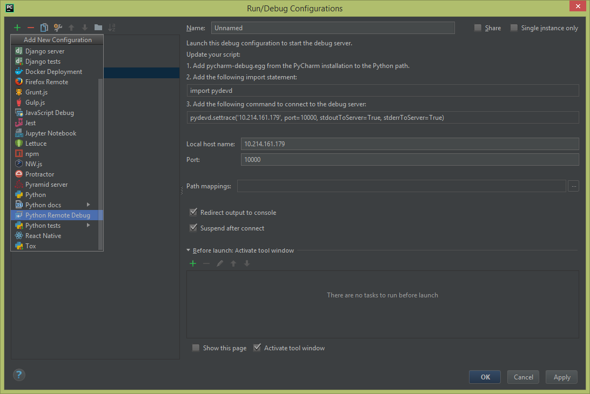
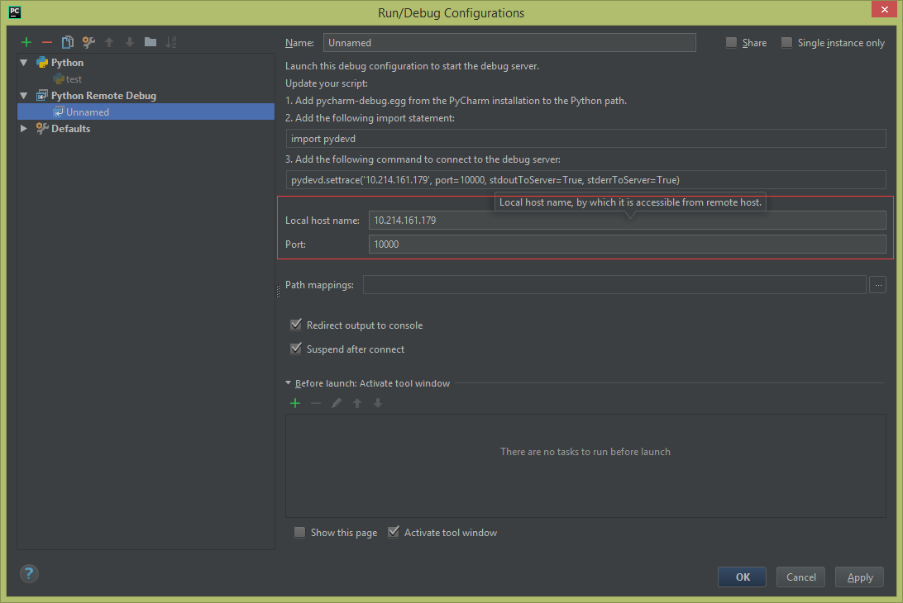

#<center>pycharm远程调试</center>#
##1. 安装pycharm-debug.egg
pycharm要实现远程调试，需要安装远程调试需要的安装包pycham-debug.egg(如果是python3,该文件为pycharm-debug-py3k.egg),通常位于pycharm安装目录下的"debug-eggs/"目录下。将该egg包拷贝到远程linux服务器上，使用easy_install来安装该包：
```
easy_install pycharm-debug.egg
```

##2. 本地机器的配置
+ Run -> Edit Configurations

	
+ Add New Configuration -> Python Remote Debug

	
填写**Local host name**和**Port**，其中Local host name指的是本机开发环境的IP地址，而Port则随便填写一个10000以上的即可；需要注意的是，由于远程计算机需要连接至本地开发环境，因此本地IP地址应该保证远程可以访问得到

##3. 远程计算机的代码配置
在远程需要调试的代码中插入如下代码：
```python
import pydevd
pydevd.settrace('10.214.161.179', port=10000, stdoutToServer=True, stderrToServer=True)
```
其中，IP地址和端口号要与PyCharm中的监听配置保持一致。

##3. pycharm远程调试的原理
在远程调试的模式下，PyCharm（IDE）扮演服务端（Server）的角色，而运行在远程计算机上的应用程序扮演客户端（Client）的角色。正因如此，进行远程调试时，需要先在本地开发环境中设定端口并启动IDE，IDE会对设定的端口开始监听，等待客户端的连接请求；

针对远程调试功能，PyCharm提供了pydevd模块，该模块以pycharm-debug.egg的形式存在于PyCharm的安装路径中。远程计算机安装该库文件后，然后就可以调用pydevd.settrace方法，该方法会指定IDE所在机器的IP地址和监听的端口号，用于与IDE建立连接；建立连接后，便可在IDE中对远程在远程计算机中的程序进行单步调试。
