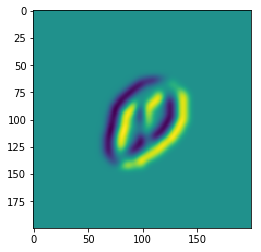
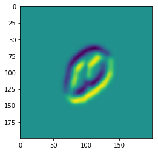

#
science rcn总结
#

Organization
论文补充材料分两部分：
1. 1-7章提供RCN模型的理论基础并建立其余经典文献和生物启示之间的联系。
2. 第8章关注RCN的应用，并距离其在多个数据集上的表现情况。

1-3章描述RCN生成模型，形状(shape)和外观(appearance)上的分解。第4章描述图像的推理。第5章描述用来学习模型参数和结构的算法。第6章描述本模型的背景以及与现有文献之间的联系。第7章详细介绍一些神经科学上的指导。

8.1和8.2节分别描述一下预处理和后处理的细节。8.3节给出RCN在不同实验中的总结。8.4-8.9节给出在数据集CAPTCHA, ICDAR, Omniglot和MNIST上的实验结果。8.10节会重点突出横向连接和反向传播的重要性。8.11讨论计算复杂性问题。8.12节展示一些3D对象渲染实验。8.13节探讨一些RCN在未来可能的改进。

##1. 对象识别问题中形状和外观的分解
当物体的形状产生剧烈变化是，人类对物体的识别是不会变的。例如，如果我们第一次看到一棵完全蓝色的树，我们就能够正确地将它识别为一棵树，并将其颜色标识为蓝色。尽管会有一些吃惊，但我们不会将其辨认为1个大的蓝色草莓。这表明人类可以独立于外观(appearance)去感受形状,并且我们对对象的分类会更依赖于形状(shape)而不是外观(appearance)。 同样，即使我们从来没有看到一棵完全蓝色的树，我们仍然能够想象它，我们的模型由树(shape)和蓝色(appearance)构成的。也就是说我们对于物体的感知，是将形状和外观分离开来，然后将它们组合成物体。

基于以上观察，具有人类识别能力的图像模型应该也是将形状和外观分离开来。此前将形状和外观进行分离的工作不多。这种分离操作能够让模型在比较小的样例上进行泛化，因此训练数据只需要包含足够多样形状和外观的图像而不需要每个shape和appearance的组合，而且这样就能表征所有的shape和appearance组合的样本空间。尽管主流的图像识别模型(CNN)取得了巨大成功，但是它们对于形状和外观的处理是相当复杂的。如果测试集中对象的外观与训练集中的样本有着明显偏离，那么这些模型就不能有效识别出来。对于这些模型，比较好的方法是增大训练集，使得其包含尽可能多的shape和appearance组合的图像。尽管在训练期间使用各种颜色的树可以解决blue-tree问题，但是会带来难以忍受的样本复杂度。

我们的模型假定形状和外观能被分解，并且通过这些形状和外观产生图片。首先生成能定义物体内部和外部边界的shape，然后在内部区域通过appearance着色(利用颜色，或者通常使用纹理来着色)。

##2. 提取形状的层次生成模型
本章描述一个概率模型，该模型能够根据物体形状(shape)产生其提取边缘后的图像(edge map)$F^{(1)}$。随后该边缘图像(edge map)$F^{(1)}$会与物体的外观(appearance)结合起来形成最终的图像$X$。我们给这个模型起名递归皮质模型(RCN, recursive cortical network),该模型是一个分层的隐变量模型,其中的隐变量都是离散的。

###2.1 分层模型
为了对边缘图像$F^{(1)}$建模,RCN使用自顶向下的方式来分层交替地配置池化层和特征层的离散隐变量。类似的方法在CNN中也有。与CNN不同的是,RCN是一个完全的生成式模型,即使是用来分类，其属性与CNN也明显不同。

我们使用$F^{(l)}$和$H^{(l}$分别表示第$l$个特征层和第$l$个池化层的所有隐变量。特征层里面的隐变量是二值变量(0,1),而池化层的隐变量是多值变量。特征层$F^{(l)}$里面的变量可以被分配到一个3维的网格中，网格中的每一个元素是$F^{(l)}_{f'r'c'}$。下标分别表示第$l$层的特征$feature$(或者channel)、行($row$)和列($row$)。池化层里面的多值变量也可以被分配到一个网格中，每个元素为$H^{(l)}_{frc}$,下标意义同上。每一个类型都有$C$层,自底向上标号,最底部是边缘提取图，最上层是分类层。

每一层的变量只取决于在它上面的那些层。因此模型的联合概率为：
$$
\log p(F^{(1)}, H^{(1)},\cdots,F^{(C)},H^{(C)})=\log p(F^{(1)}|H^{(1)})+\log p(H^{(1)}|F^{(2)})+\cdots+\log p(F^{(C)}|H^{(C)})+\log p(H^{(C)})
$$
接下来要做的就是求解单个feature layer(由其上面一层的pooling layer决定)和pooling layer(由其上面的feature layer决定)的概率

###2.2 特征层
特征层里面的每个变量表示给定特征$f$在图像$X$的指定位置$(r,c)$是否存在。例如在$F^{(3)}$这个位置有一个二值变量表示特征"图像中央的拐角"。当该变量是$ON$时，会产生一个靠近图像$X$中央的稍有点变形的拐角。给定$F^{(3)}$,图像$X$中拐角的具体形状和位置是不明确的。这个信息由它下面的层来编码,如果我们固定$F^{(3)}$的值然后产生多个$X$的样本，这个信息可能会发生变化。

给定上面一层，每一个特征变量与其他的特征变量都是互相独立的，写作:
$$
\log p(F^{(l)}|H^{(l)})=\sum_{f'r'c'}\log p(F^{(f'r'c')}|H^{(l)})
$$
通常$F^{(l)}_{f'r'c'}$只取决于$H^{(l)}$的一个比较小的子集。每一个池化层$H^{(l)}$里面的变量都是multinomial并且有几种状态，每一种状态都和$F^{(l)}$里面的变量相关联,此外还有一个额外的$OFF$状态。一个pool所关联的特征变量被称为池化成员($pool members$)。多个pool可以共享相同的池化成员。

为了使上面的说法跟具体，考虑一种从pool到feature的连接: 平移池化(translational pooling)。在平移池化中, 每一个pool变量$H^{(l)}_{frc}$都有着一些元素: $\{F^{(l)}_{f'r'c'}: |r'-r| < vps^l, |c'-c| < hps^l, f'为常量 \}$，其中$vps^l$和$hps^l$分别是垂直pool和水平pool的形状, $f'$是具有局部平移能力的pool变量$H^{l}_{frc}$所赋予的特征。通常会使用平方pool，我们使用一个单一变量来定义其高度和宽度:
$$
pool\hspace{0.2cm}size=2\times hps^l-1=2\times vps^l-1
$$
一个pool变量可以是$OFF$状态或者激活让你和一个feature变量，该变量的下标为$f'$并且在位置$(r,c)$附近。注意一个pool一次只能激活一个pool member。

一旦一个pooling layer和紧随其下的feature layer之间的连接被确定(如平移pooling)，每一个特征变量的条件概率可以简化为：
$$
p(F^{(l)}_{f'r'c'}=1|H^{(l)})=
\begin{equation}
\left\{
\begin{aligned}
&1 \hspace{0.5cm}如果H^{(l)}中的任一变量的状态和F^{(l)}_{f'r'c'}有关联\\
&0 \hspace{0.5cm}其他情况\\
\end{aligned}
\right.
\end{equation}
$$
也就是说，给定$H^{(l)}$，$F^{(l)}$是确定的。有多种$H^{(l)}$能导致相同的$F^{(l)}$，因此这种关系并不是双射(一对一)。

顶层特征$F^{(C)}$被假定是包含完整的对象的。在$F^{(C)}$，每一个channel表征不同类型的物体，该channle中的每一个位置$(r,c)$表征所生成对象的不同位置。

###2.3 池化层
与特征层不同，池化层不是确定的,所以RCN模型图像生成中的所有变化都来自于池化层。

池化层$H^{(l)}$里面的每一个多元pool变量有多种状态, 其中一种是$OFF$,其他的都是特征层$F^{(l)}$的特征变量，这些变量池化层里面的所有成员。可以将池中的成员看作是表示同一特征的轻微变化的不同替代。例如，一个平移池中的成员是一些特征，这些特征看起来完全一样，只是位置不同，这些不同的位置位于一定的半径内。

在分类特征之上还有一个隐藏的顶级pool层$H^{(C)}$。该层有1个多元变量，该变量从不同的顶层feature中产生。通过使用横向连接，RCN的性能可以显著提高。我们首先考虑没有横向连接的情况，然后转到有横向连接上。

####2.3.1 没有横向连接的模型
没有横向连接时, 对于每一个池化层,给定其上面一层, 每一个pool里面的状态相对于其他变量都是独立的,我们写作:
$$
\log p(H^{(l)}|F^{(l+1)})=\sum_{frc}\log p(H^{(l)}_{frc}|F^{(l+1)})=\sum_{frc}\log p(H^{(l)}_{frc}|F^{(l+1)}_{f'r'c'})
$$
其中$F^{(l+1)}_{f'r'c'}$是激活$H^{(l)}_{frc}$的特征($F^{(l+1)}$是$H^{(l)}_{frc}$的父节点)。注意每一个pool变量只有一个父节点(但每个feature变量有多个子节点)。

每个特征$F^{(l+1)}_{f'r'c'}$激活靠近它的某些pool，这些pool为
$$\{H^{(l)}_{frc}: |r'-r|< vfs^l, |c'-c|< hfs^l\}$$
其中$vfs^l$和$hfs^l$分别代特征层的竖直和水平shape。注意在层$l+1$和第$f$个通道的特征变量可以激活第$l$层多个不同通道的一组pool, 不同前面章节中的例子: 在平移pool中, 第$l$层底$f$个通道的pool只能激活第$l$层且位于同一通道的特征。另一个区别是：两个不同的特征不能激活相同的pool。对于需要多个特征激活同一个pool的情况，只需要做一份拷贝即可(在pooling layer中产生一个额外的通道，该通道与下面层的连接相同)然后使用这个拷贝的pool即可。

一个特征可以用它激活的pool的位置(相对于自己而言)来描述。当激活一个给定的pool变量$H^{(l)}_{frc}$的特征被设置成1时，这个pool就不能再是$OFF$状态。这样就能定义池化层的概率密度为:
$$
p(H^{(l)}_{frc}=pool\hspace{0.2cm} member_m|F^{(l+1)}_{f'r'c'})=
\begin{equation}
\left\{
\begin{aligned}
&1/M \hspace{0.5cm}如果父特征为1\\
&0 \hspace{0.5cm}父特征为0\\
\end{aligned}
\right.
\end{equation}
$$
其中$M$是该池化层中池化成员的数量。这意味着如果父特征为0，则：
$$p(H^{(l)}_{frc}=OFF|F^{(l+1)}_{f'r'c'})=1$$
这反过来表明对于一个合法的分配(不会导致联合概率为0)，隐变量的联合概率为：
$$
\log p(F^{(1)}, H^{(1)},\cdots, F^{(C)}, H^{(C)})=\sum_{active\hspace{0.2cm}pool_j}\log \frac{1}{\# pool\hspace{0.2cm}members \hspace{0.2cm}of\hspace{0.2cm}active\hspace{0.2cm} pool_j}
$$
顶层$H^{(C)}$没有父节点。该pool的$OFF$概率为0(只激活一个pool member), 并包含下一层的所有特征变量作为池成员。这表明它可以在任何位置产生任何物体(顶层特征表示一整个物体)。该池化层比较特殊，只有一个池化层，而其他的所有池化层，即使只有一个通道，在拓补上也会有多个pool。

目前所说的分层模型都是直接用来构建边缘图像模型，但是在很多情况下都是能灵活运用的。如果使用平移pool，在生成过程中，通过改变pool的shape，我们可以控制变形数量。但是我们发现如果不设定这个值(distortion)也能产生完全合理的记过：值太小会导致图像太过生硬，不能很好地适应实际图像的扭曲(corner made of many pools with close-to-zero pool shape results in two almost rigid edges)。而值太大又会导致在形状上不连续(the previous corner would look like a cloud of points with no clear edges, since each pool choice is independent of the rest)。

为了解决这个问题,我们希望得到一些特征，这些特征能够产生多个pool，并且比较协调(拐角可以变形，但是看起来仍然是一个拐角，并且边缘是连续的)。

####2.3.2 横向连接
在没有横向连接的例子中，$p(H^{(l)}|F^{(l+1)}$是能被完全拆分的。这表示在pool的选择上没有协调。我们可以通过使属于同一个父节点的不同pool之间发生联系来协调这些pool的选择。拆分公式为：
$$
\log p(H^{(l)}|F^{(l+1)})=\sum_{f'r'c'}\log p(\{H^{(l)}_{frc}: whose\hspace{0.2cm} parent\hspace{0.2cm}is\hspace{0.2cm}F^{(l+1)}_{f'r'c'}|F^{(l+1)}_{f'r'c'} \})
$$
接下来可以通过引入某些池变量状态之间的成对约束来定义拥有同一个parent的pool集合的联合概率。考虑拥有同一个父节点$F$的pool集合$\{H_j\}$(为了方便省掉层标号和位置标号)。根据前面的描述,$F$是由一些三元组$(f_1, \Delta r_1, \Delta c_1),\cdots,(f_J, \Delta r_J, \Delta c_J)$来定义，这些三元组指明该层下面层的哪些pool被激活,这些pool的位置是相对于$F$的位置来进行编码的。我们可以通过在池$i$和池$j$之间放入一些成对约束来扩充这些信息,写作$s_i$和$s_j$。$\{c_{f_{ij}}(s_i, s_j)\}$表示哪些对的状态是被允许的(constraint的值为1)。

对于每一个特征$F$，$F$都为其子集池指定了一组限制条件$\{c_{F_{ij}}(s_i,s_j)\}$,联合密度为:
$$
p(H_1=s_1, H_2=s_2,\cdots, H_J=s_J|F=1)=
\begin{equation}
\left\{
\begin{aligned}
&1/S_F \hspace{0.5cm} \forall ij, c_{F_{ij}}(s_i, s_j)=1\\
&0 \hspace{0.5cm}otherwise\\
\end{aligned}
\right.
\end{equation}
$$
其中$S_F$是$F$的约束所允许的联合状态的数量。这表示：
$$
p(H_1=OFF, H_2=OFF,\cdots, H_J=OFF|F=0)=1
$$
在这种情况下，对于一个合法的分配隐变量的联合概率为：
$$
\log p(F^{(1)}, H^{(1)},\cdots,F^{(C)},H^{(C)})=\sum_{F_j:F_j=1}-\log S_{F_j}
$$
有许多成对的约束可以产生令人满意的池协调效果。我们使用的典型的池化协调称为:扰动带(perturb laterals)。我们首先扩展池j的每个状态$s_j$(位置$(r_j, c_j)$)为一个tuple，该tuple描述该状态$s_j$所关联的成员, $s_j\equiv (\Delta r_j, \Delta c_j)$。其中$\Delta$关联的位置是pool的中心,每个成员的通道f和它的池的通道相同。然后横向扰动限制可以写成下面这样：
$$
\begin{align}
c_{ij}(s_i, s_j)&=c_{ij}((\Delta r_i, \Delta c_i), (\Delta r_i, \Delta c_j))\\
&=|\Delta r_i-\Delta r_j|<|r_i-r_j|/pf^l\land |\Delta c_i-\Delta c_j|<|c_i-c_j|/pf^l
\end{align}
$$
其中$pf^l$是第$l$层的扰动因子。这样，两个池的相对位置的最大扰动与它们的距离成正比。其中$pf^l$就是比例因子。

####2.3.4 平移不变性
让我总结一下这该构的参数：
+ 特征参数, $(f_1, \Delta r_1, \Delta c_1),\cdots, (f_J, \Delta r_J, \Delta c_J)$和$c_{F_{ij}}(s_i, s_j)$表示它下面一层pool之间的连接以及当特征激活时它们选定的pool成员之间的限制。这些参数对于整个层次结构中的每个二进制特性变量都可能不同。
+ 池化层参数, $(\Delta r_1,\Delta c_1),\cdots,(\Delta r_M, \Delta c_M)$,指定连接到下面feature层中的池成员。这些参数对于层次结构中的每个池可能都不相同。

尽管这不是上面所讲的层次上面的属性，但在视觉中，能够显示输入平移的等同性还是很有用的。这种等同性表示：给定一幅图像和隐变量集合, 如果我们将输入图像和所有隐变量的值移动相同的位置，模型的似然度是不变的。隐变量$H^{(C)}$是独一无二的不会改变，因此它的值会相应改变。

如果我们将上面的对应同一层同一通道的参数设置成相同，上面的要求就很容易达到。这时CNN所命名的卷积假设。另外，这可以导致模型中自由参数的减少。

由于子特征允许重叠，因此特征的局部平移能够在更高层次的特征或者对象层次产生尺度不变性。

上图(a)将一个矩形表示为4个pool的联合,每个pool代表一个拐角。拐角的平移能代表着矩形的大小的变化，因为RCN允许子特征的重叠。拐角特征被渲染成不同的厚度和阴影来表示它们之间的重叠。每个拐角特征本身可以进一步细分为线段特征以产生更多的局部变化。矩形的不同纵横比和平移可以从一个更高级别的特征节点来生成。pool 1和pool 4之间的因子被省去。

图(b)是带有多个矩形的输入图像。当矩形能很好地分开时,它们将由不同的顶级特征节点表示。由于每个重叠的矩形可以由单个顶级特征节点来表示，因此解释这两个矩形将需要顶层的相同特征的两份拷贝。通常可以假设相同的特征节点被复制固定的次数，从而允许同一对象的多个实例出现在大致相同的位置。实际上，通过多次使用相同的分层结构直到所有的证据被解释为止，这个效果也可以近似地实现而不需要复制特征。

##3. 形状和外观的结合
本章介绍如何结合外观模型和形状模型。上面的模型生成边缘效果图$F^{(1)}$(edge map), $F^{(1)}$是一个由$(f,r,c)$索引的数组，数组值都是二元的。每个特征$f$对应一个$patch\hspace{0.2cm}descriptor$,该特征由一组$IN$和$OUT$变量定义,并且一组边缘会排列在一个矩形patch里面。

当边缘图$F^{(1)}$位于$(f,r,c)$处的变量被打开，一个小的边缘$f$会出现在最终图像的$(r,c)$处。边缘时定向的，因为对于外边缘，一边被定义为$IN$另一边被定义为$OUT$。例如有两个单独的特征对应一个外垂直边缘，其中一个将IN定义在边缘的左侧(OUT在右侧)，而另一个特征将IN定义在边缘的右侧(OUT在左侧)。在物体中的内边缘（即，分离物体内部区域的边缘），边缘的两侧被定义为IN。图S2(c)表示对于内边缘，还有其他的信息来显示边缘每侧$IN$值之间的边界。S2(a)包含两种类型的垂直外边缘，两种额类型的水平外边缘，一条对角内边缘(如图S2(c)所示)。因此对于边缘的每次旋转，有3种可能的取向:2个对应外边缘1个对应内边缘。典型边缘图特征的数目是48,占16个不同旋转的3个取向。

用$y$来表示将要绘制边缘映射的两个定向边的画布,并且用纹理或者颜色去填充对象的内部。$Y$是一个二维数组，数组元素是多元随机变量，由$(r,c)$来索引。其中$r$和$c$索引对应于最终图像中的像素的行和列。在Y中的变量和观察到的图像像素X之间存在一对一的对应关系。Y的每个多元变量的状态代表一个颜色（或纹理）和IN或OUT状态。因此Y的每个变量的状态数目是能够表示所有颜色(或纹理)的数目的两倍。

Y是一个有4个连接变量的固定结构的条件随机场（CRF），所以每个变量都有1条边连接到4个邻近的其他变量。这些边代表成对的潜在值，并且还存在每个变量一元潜在值。潜在值取决于$F^{(1)}$的值(组成条件随机场)。

##4. 推理
上述模型生成对应于不同孤立对象的图像。一旦使用一些孤立对象的训练集合来设置分层模型的参数，图像识别就等于在概率模型中进行推理。识别孤立对象相当于推断顶级池化层$H^{(C)}$的值,这个值能够告诉我们对象的类别和位置。

当背景混乱或多个对象出现在同一个图像中时，仍然可以在外部循环的内部使用上述过程来查找图像中最显著的对象，然后以此将它们标注出来并寻找下一个显著的对象。

在这样一个复杂度逻辑模型上推理是相当棘手的。本章描述如何在此模型中进行近似推理。本节当中一个自底向上的$forward\hspace{0.2cm}pass$能够很好的找到对象的近似位置以及对象的类别,随后的一个自顶向下的$backward\hspace{0.2cm}pass$能够很好地找到识别对象的mask。

理想情况下，我们想要计算模型隐变量的完全后验概率，然而这时非常棘手的。在带有环的图上的近似推理算法(如循环置信度传播和更高级的变体)可以被用来逼近每个隐变量的边际后验概率。这些技术不能保证计算实际的边际后验概率，但即使它们是，也不适合解决手头的问题。原因在于，将真实后验逼近为边际后验概率的乘积在实际后验概率可能为零的区域中引入非零后验概率质量。换句话说，试图计算潜在变量的边际后验将导致局部有效的概率，但是不会表现出全局协调性和一致性。 相反，找到最大化观察图像概率的潜在变量的单一配置将导致观察图像的一致的，全局协调的潜在解释。 因此，我们将对最大后验推理（MAP）感兴趣。

###4.1 带环的置信度传播：最大乘积
最大乘积的置信度传播是一种能够找出使得树状结构的图模型的概率最大化的变量状态的技术。然而实验表明，当最大乘积消息传递被应用到带环的图时，它也能取得不错的表现。

所有的概率图(例如RCN)可以认为是一个因子图，变量组为：
$$
p(x)=p(x_1, x_2,\cdots, x_n)=\prod_c\phi_c(x_c)
$$

##1. preprocessing
1. 图像的扩充
先将$28\times 28$的数字resize到$112\times 112$，然后再在四周padding，上下左右各padding44，填充值为0。
2. 进行garbor滤波
每张图片有一个garbor滤波器，1个garbor滤波器由16个高斯滤波组成，这16个高斯滤波分别为:

3. garbor滤波后的操作
gaobor滤波前的图像为:

gaobor滤波后的图像为(注意有16个通道)：

然后再经过nonmax_suppression, threshold和binarize之后得到的图像为：

###2. sparsification
###2.1 lowerest layer learning
对于上面的图像经过sparsification处理，处理的具体过成为：
1. 将$200\times 200\times 16$的图像矩阵(记为bu_msg)，以channel为axis取最大值，然后将最大值大于0的变成True，最大值小于或等于0的变成False，最终得到一个$200\times 200$的二值矩阵(记为img):

2. 选择上述$200\times 200$矩阵中第一个为True的元素的位置，记为$(r, c)$,如果有这样的元素，则继续3-5的过程,如果不存在这样的元素，则执行6
3. 将$(r, c)$所在位置的最大值的通道序号和(r, c)一并加入到frcs中，即(max_channel_index, r, c)
4. 以刚刚找到的(r, c)为中心，将该位置半径为$suppress_radius$内的元素值全部设置为False
5. 重复2-4的过程
6. 结束spasification过程,返回frcs矩阵，注意frcs是一个$n\times 3$的矩阵
###2.2 中间层特征的学习
模型会生成对应于不同孤立对象的图像。一旦使用一些孤立对象的训练集合来设置分层模型的参数，识别就等于在概率模型中进行推理。识别孤立对象相当于顶层pool层$H^{(C)}$的值。$H^{(C)}$代表了对象的类别和位置。

当背景混乱或多个对象出现在同一图像中时，我们仍然可以在外部循环内部使用上述过程来查找图像中最显著的对象，然后将其隐去，然后寻找下一个最显著的对象。

在这样一个复杂的逻辑模型上的推理是棘手的。在本节中，我们将展示在这个模型中如何进行近似推理。我们将展示一个单一的自下而上的正向传递就足以找到对象的位置和类别的一个很好的近似值，并且随后的单个自上而下的反向传递将足以找到与每个对象相对应的mask对象。

理想情况下，我们想计算模型隐变量的后验概率。但是，这是棘手的。 在loopy图(loopy置信传播和更高级的变体)上的近似推理算法，可以用来逼近每个latent variable的边际后验概率。这不能保证可以计算实际的后验概率，但即使能，也不适合解决现在的问题。这是因为将真实概率逼近为边际后验概率的乘积后，如果实际后验概率为0，则会在实际后验概率可能为0的区域中引入非0后验概率mass。

计算隐变量的边际后验概率可以使得局部概率有效，但不会表现出全局的一直想和协调性。相反，找到最大化观察图像概率的隐变量的单一配置将导致观察图像的一致的，全局协调的潜在解释。因此，我们关注的是最大后验概率(MAP)。

loopy图中的MAP推断可以使用最大乘积loopy置信度传播、树重新加权的置信传播、双重分解来近似解决。我们的总体近似推理过程包括一个使用最大乘积的消息传递机制的前向和后向传播。一些消息可以很容易计算出来，另一些则需要一些近似。特别的，当涉及到解决横向连接的子问题(横向子问题)时，我们将使用loopy局部最大乘积或者更先进的双重分解技术。

###1.1 loopy置信度传播: 最大乘积
最大乘积置信度传播是一种能够找到使得树结构的图模型的概率最大化的变量状态的精确技术。实现表明，当最大乘积小弟传递机制被应用到loopy图时也能取得非常好的效果。

所有的概率模型(例如RCN)都可以表示为因子图，因子的变量组也是明确的：
$$
p(x)=p(x_1, x_2,\cdots, x_n)=\prod_c\phi_c(x_c)
$$
c会遍历图中的所有因子，$x_c$是途中一些变量$x_1, x_2,\cdots,x_n$的子集。MAP推理的目的是找出
$$
x^*=\arg\max_xp(x_1, x_2,\cdots,x_n)
$$
令$x_{c\setminus i}$为$x_c$中不包括$x_i$的变量，定义每个因子$c$到每个变量$i$的消息为:
$$
\hat m_{c\to i}(x_i)^{new}=\max_{x_{c\setminus i}}[\log\phi_c(x_i, x_{c\setminus i})+\sum_{j\in c\setminus i}(\mu(x_j)-\hat m_{c\to j}(x_j))]
$$
其中$\mu(x_i)$是变量$x_i$的最大边缘估计：
$$
\mu(x_i)=\sum_{c:i\in c}\hat m_{c\to i}(x_i)
$$
MAP问题的近似解决方案是运行loopy最大乘积后设置
$$
x_i=\arg\max_{x_i}\mu(x_i)
$$
消息更新会一直运行直到收敛(loopy图中不能保证)或者迭代一定次数。该算法对消息的重正则化是不变的，在log-domain意味着可以对每个消息添加一个任意常亮而不改变最终的结果。模型中的离散变量有一个默认状态(pools为OFF,feature为0)，因此在传播期间，我们使用如下的正则化消息：
$$
m_{c\to i}(x_i)=\hat m_{c\to i}(x_i)-\hat m_{c\to i}(x_i=default\hspace{0.2cm}value)
$$
这允许更紧凑的消息编码。例如在二值变量的情况下，需要单一的标量$m_{c\to i}(x_i=1$(因为$m_{c\to i}(x_i=0)=0$)

例如：两个二元变量$x, y$，$p(x=1)=p(y=1)=0.5$，如果$x+y=1$，则边际后验概率$p(x|x+y=1)=p(y|x+y=1)=0.5$。使用这个作为分解后验近似在不可能的配置x = 1，y = 1上放置一个显着的后验概率0.25。

###1.2 forward pass
在这个过程当中，我们从图像开始，向顶层的top pool(H(C))不断计算，并执行最大乘积更新策略。一个变量可以连接多个因子。来自下面层的所有汇总消息被称为该变量的"自上而下"消息。同样的，自上而下的消息来自于连接该变量的上面一层的所有factor。模型的forward pass从下到上每次改变一层的值，并且将所有自底向上的消息并行地更新为每层的变量。自顶向下的消息被初始化为$-\infty$

我们针对forward pass试验了不同的变量，发现在大多数情况下lateral connection会增加计算成本，但是对最终结果不会造成太大影响。所以我们运行的时候不考虑lateral connection。

####1.2.1 preprocessing layer
预处理层将观察到的自然图像$X$和离散层$F^{(1)}$对接起来，近似画布层$Y$的效果。

预处理层的输出是一个自下而上的消息，这些消息会作为$F^{(1)}$的自下而上的输入。根据最大乘积规则和自上而下的消息初始化原则，自下而上的消息应该为：
$$
m_{bu}(F_{frc}^{(1)})=\max_Y\log p(X,Y|F_{frc}^{(l)}=1, \{F^{(1)}\setminus F_{frc}^{(l)}\}=0)-\max_Y\log p(X,Y|F^{(l)}=0)
$$

$\{F^{(1)}\setminus F_{frc}^{(1)}\}$是第一层中除了$F_{frc}^{(1)}$的变量。这对应着当画布$Y$和图像$X$中所有其他边都被OFF掉时，边$F_{frc}^{(1)}$出现的似然比。我们可以对画布$Y$使用消息传播然后传播到$F^{(1)}$。然而这种检测图像中定向边缘的方法计算量大。因此我们使用两种方法来估算$m_{bu}(F_{frc}^{(1)})$

###5. learning
这一步要学习一个层次模型。算法自底向上逐层推进。例如对于深度为4的模型，先学习feature layer $F^{(1)}$的参数，然后学习$F^{(2)}$、$F^{(3)}$、$F^{(4)}$。进入$F^{(1)}$的特征是通过预处理得到，不用学习。

模型需要学习两个component: features和lateral connections。特征可以从训练数据中学习，这里使用的是无监督字典学习和稀疏编码来提取轮廓。pooling layer的横向连接是从输入的轮廓中学习，并且使用perturbation模型来参数化的生成其扰动。由于各层是独立学习的，因此单个的pieces可以被替换。

学习过程主要依赖于未标记的数据。标签只在学习top level的features的时候才会被用到，且每个分类器特征只需要一个已标注的图像。
####5.1 feature learning

上图表示当$F^{(1)}$已经被学习好，然后学习$F^{(2)}$的过程，上面层的学习过程类似。当训练图像（在这种情况下，一颗星星）被送入到网络时，我们试图将其表示为现有已经学过的F（2）特征（图中的红色，绿色和蓝色）的组合。但是，图像的某些部分（在本例中是星星的右上角）将不会被现有的F（2）特征捕捉到，这些必须用图中$F(1)$特征(图中pink和yellow)来表示。这些将会形成一个由$F(2)$和$F(1)$组成的图像的一个解析(也称为sparsification)。属于$F(1)$的active特征但不属于$F(2)$的active特征可以根据轮廓的连续性来进行分组来形成新的$F2$特征(将粉红色和黄色特征分组以创建新的 F（2）特征，如图中虚线所示)。对所有训练图像重复这一过程，可以产生一组$F(2)$特征，然后可以基于多个活动特征和重构误差之间的折衷来修剪该特征。

###5.1.1 sparsification
特征学习的很重要的一步就是sparsification。其目的是给予可变换、可重用的特征来计算一副输入图像的压缩表示。sparsification的过程为:
$$
S=\{(f_1,r_1,c_1),\cdots,(f_K,r_K,c_K\}
$$
其中每个$f_K$表示在第$l$层的一个特征。sparsification的目的是在第$l$层最小化下面的损失函数:
$$
J_{sparse}(S;X)=\alpha |S|+\log P(X|S)
$$
给定S中的特征恰好在$level\hspace{0.2cm} l$上，其中$P(X|S)$为生成模型的边缘图上的条件分布。该方法类似于matching pursuit，只是我们使用RCN来允许匹配过程中的特征失真。而其他的分层学习方法不允许学习过程中的特征失真，这是RCN的一大贡献。

在每次迭代中，该算法保持当前的稀疏表示和最低级激活的剩余未解释部分（自底向上消息到F（1））。 然后，它截取正向传递到C 1级，并选择最活跃的C级功能。 然后执行反向传递来确定相应的F（1）特征，并抑制每个这样的F（1）特征的邻域内的所有激活。 重复该过程直到整个图像被解释或者没有良好的匹配。算法过程如下：

###5.1.2 中间层特征的学习
RCN的中间层的特征是从未标记的数据中学习。第$l$层的特征包含$N$个features(N是一个确定值)。每个特征包含一组子pool，写作$\{(f_1,r_1,c_1),\cdots,(f_M, r_M, c_M)\}$。其中$(f_m, r_m,c_m)$表示以$F^{(l-1)}$特征为中心的子级$H^{(l-1)}$的pool。

###8.1 preprocess layer
PreProc（预处理）管道将图像转换为一组定向过滤器激活
####8.1.1 2D correlation
给定一组预定义的灰度边缘滤波器，每个滤波器的$L_1$的正则化范数为1.0。首先在图像上上执行标注的你的2D correlation，将强度值量化为0-255的整数值。通常使用16个edge orientsations,每个filter包含一个正高斯和负高斯，每个滤波器都有一个标准差，我们成为filter scale。高斯滤波器由2个标准差分开(见例 S10)。如果输入的X是一个彩色图像，我们对图像的每个通道执行分开的2D correlation,对于灰度化的图像也执行，然后将滤波器得分$F^{corr}=correlation2D（X）$作为每个彩色和灰度通道的元素最大值。 该过程的输出如图S11（b）所示。

2D correlation：2D correlation通常用来计算两个2D信号的相关性，结果用一个举证保存。两个矩阵a和b的2D correlation为:
$$
r(i, j)=\sum_{m=1}^M\sum_{n=1}^Na(m,n)b(m-i,n-j)
$$
计算2D correlation的方法有2种： FFT和shift-accumulation. shift accumulation计算方法与上式相同。FFT计算方法为：
+ 两个2D信号的离散傅立叶变换是使用2D FFT计算的。
+ 将第一信号的傅里叶系数与第二信号的共轭系数相乘。
+ 对产品执行逆离散傅里叶变换。

FFT可以加快计算速度，但是对于某些边界点计算不是很准确。

预处理的总体过程是：
+ 图片扩充到$200\times 200$
+ 进行一个$Gabor\hspace{0.2cm} filter$,non-max suppression, (0,1)的clip之后，输出一个$16\times 200\times 200$的矩阵作为下一步的输入。这一步的处理没有学习过程。

求frcs:

###testing
1. 先将一幅图片经过前面的预处理步骤得到buttom_up_message
2. 假设training的样本数量为n，则training步骤得到的结果是(frcs, graph, edges)的list，该list的长度为n
3. 创建一个长度为n的数组fp_scores,初始全部为0。
4. 对于每一张图片，以此取出training_result里面的每一个(frcs, graph, edges)进行forward_pass操作。
5. forward_pass的过程：
	+ 先从frcs生成一颗最小生成树，最小生成树是一个list，其中每个元素是(source_index, target_index, perturb_radius)，其中的source_index和target_index分别对应frcs的下标。这与frcs的(f, r, c)是不同的，即每一个source_index都对应的是一个frcs里面的node。
	+ 将最小生成树的每一个(source_index, target_index, perturb_radius)取出来，获取source_index对应的frcs(f,r,c),然后以(r, c)为中心，在一个平面上切片，切除大小为(vps(代码中取值25), hps(代码中取值25)),得到msg_in, msg_in是一个(25,25)的矩阵。
	+ 依照上面的方法，依次取出最小生成树的每个node，将每个node对应的frcs里面的矩阵进行切片，切除(25,25)的大小的矩阵。假设最小生成树有m个node，则会得到m个(25,25)的矩阵，然后将所有的25个矩阵相加得到最后的一个(25,25)矩阵，然后去改矩阵中的最大元素的值返回，作为fp_score的一个元素。
	+ 如果训练集有n张图片，则会得到一个长度为n的fp_score的数据
6. 取fp_score中最大的num_candicates个元素(论文中使用20)的下标，然后从大到小排序。
7. 
a
a
a
a
a
a
a
a
a
a
aa

a
a
a
a
a
a
a
a
a

a
a
a
a
a

a
a
aa

a
a
a
a
a

a
a
a
a

a
a
a
a

a
a
a

a

a
a
a
a
a

a
a
a
a

a
a
a
a
a

a
a
a
a
a

a
aa

