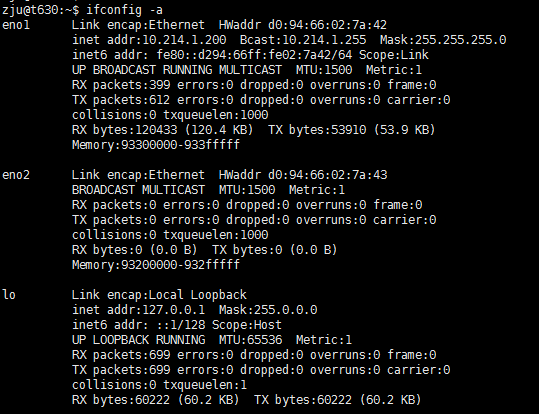
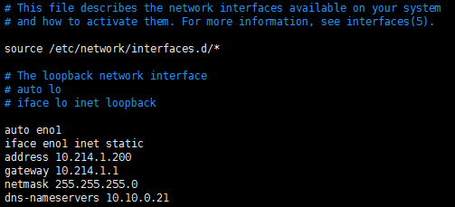
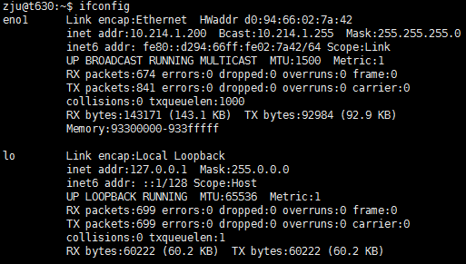

ubuntu配置静态ip地址
####1. 查看设备上的所有网卡
```
ifconfig -a
```


####2. 编辑网卡文件
```
sudo vim /etc/network/interfaces
```


####3. 重启网卡
```
sudo /etc/init.d/networking restart
```

####4. 开启或关闭某网卡
```
ifdown eno2
ifup eno1
```
此时使用如下命令查看到的就是被启用的网卡
```
ifconfig
```
