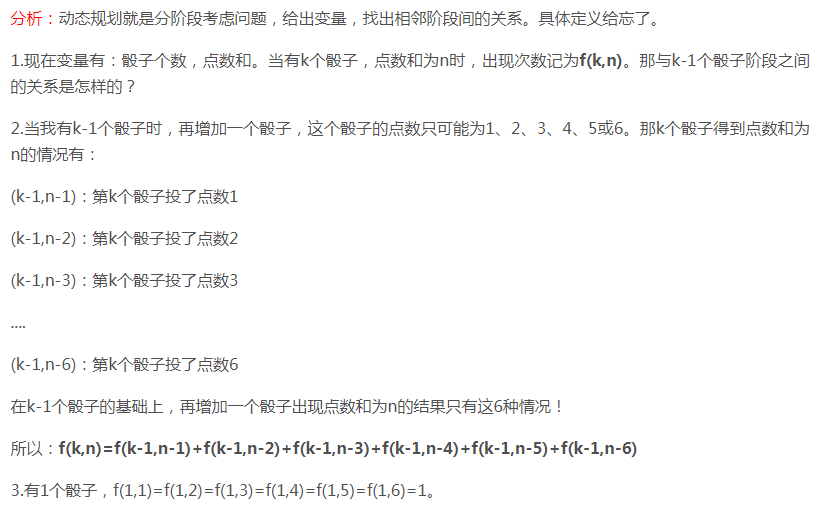

##<center>剑指Offer题目思路总结</center>##
###1. 字符串转换成整数

###1. 数组中重复的数字
在一个长度为n的数组里的所有数字都在0到n-1的范围内。 数组中某些数字是重复的，但不知道有几个数字是重复的。也不知道每个数字重复几次。请找出数组中任意一个重复的数字。 例如，如果输入长度为7的数组{2,3,1,0,2,5,3}，那么对应的输出是第一个重复的数字2。
+ Hash表来解决：从头到尾来扫描，每扫描到一个数字时，判断其是否在Hash表里。如果在，则为重复数字。如果不在，则加入Hash表。时间复杂度$O(n)$,空间复杂度$O(n)$。
+ 交换法来解决：从头到尾扫描数组每个数字，当扫描到下标为i的数字m时，首先比较m是不是等于i,如果是，继续扫描；如果不是，再拿m和第m个数字进行比较。如果他们相等，就找到第一个重复数字，如果不相等，交换两者位置。接下来重复上述过程，直到找到第一个重复数字。例子：$\{2,3,1,0,2,5,3\}$

	数组的第0个数字是2，与下标不相等，于是将其与下标为2的数字1交换。交换后为:$\{1,3,2,0,2,5,3\}$。此时第0个数字是1，与下标不等，将其与下标为1的数字3交换。交换后为:$\{3,1,2,0,2,5,3\}$。接下来再交换:$\{0,1,2,3,2,5,3\}$。接下来扫描$0，1，2，3，2...$。此时需要交换最后一个2,交换时发现前面已经相等了，所以找到一个重复数字2。代码双重循环。时间复杂度$O(n)$，空间复杂度$O(1)$。

###2. 不修改数组找出重复的数字
+ 辅助数组: 可以创建一个长度为n+1的辅助数组，然后逐一把原数组的每个数字复制到辅助数组。如果原数组中被复制的数字是m，则把它复制到辅助数组中下标为m的位置。如果下标为m的位置上已经有数字了，则说明该数字重复了。由于使用了辅助空间，故该方案的空间复杂度是O(n)。
+ 把1~n 的数字从中间的数字m分为2部分，前一部分为1~m，后面一半为m+1~n。如果1~m的数字数目超过m，那么这个区间一定包含重复数字。否则另一半里面一定包含重复数字。然后把包含重复的区间继续一分为二，直到找到一个重复的数字。这个过程和2分查找类似，只是多了一个统计区间里面数字的数目。该方法总的时间复杂度为$O(nlogn)$，空间复杂度为$O(1)$。

###3. 二维数组的查找
在一个二维数组中，每一行都按照从左到右递增的顺序排序，每一列都按照从上到下递增的顺序排序。请完成一个函数，输入这样的一个二维数组和一个整数，判断数组中是否含有该整数。

思路：从右上角开始查找。如果数字等于右上角，则找到。如果大于右上角数字，则删掉所在行。如果小于，则删掉所在列。然后继续从右上角找。

###4. 替换空格
思路：先遍历一遍字符串，然后统计空格数目，新建一个长度为strlen(str)+m*2的字符串。然后从后往前复制。这样时间复杂度是$O(n)$。

###5. 从尾到头打印链表
+ 用栈来实现
+ 用递归来实现: 先打印后面的，再打印第一个节点。

###6. 重建二叉树
用递归。先从先序遍历找到根节点。然后找到左子树和右子树。依照此规律构建左子树和右子树。

###7. 二叉树的下一个节点
分两种情况讨论：
+ 有右子树：找右子书的最左子节点
+ 没有右子树：一直向上回溯，直到节点有父节点并且该节点是其父节点的右子节点。然后返回此节点的父节点。

###8. 用两个栈实现队列

###9. 费波拉契数列
青蛙跳台阶问题，矩形覆盖问题。

###10. 旋转后的排序数组查找
采用二分查找法。用两个指针分别指向数组的头部和尾部。然后逐步缩小范围。如果头指针和尾指针的值相等，则应该使用顺序查找。

###11. 矩阵中的路径

###12. 整数的n次方
使用递归解决

###13. 删除链表重复节点

###14. 调整数组顺序使奇数位于偶数前面
使用两个指针的交换法

###15. 链表的倒数第k个节点
使用两个指针。第一个指针先走k-1步，然后第一和第二个指针同时开始走。

###16. 链表中环的入口
1. 判断是否有环：两个指针，一个一次走2步，一个一次走1步。如果快的追上慢的，则有环。否则无环。
2. 判断环中节点的数目：从1中追上的节点开始继续走，再次回到该节点的步数即为环中节点数目。
3. 再次设置两个指针，第一个指针先走n步(n为环中节点数目)，然后一起走，相遇的节点即为环的入口。

###17. 合并两个排序的链表
使用递归来完成

###18. 判断一颗树是否是另一颗树的子树
使用递归解决

###20. 二叉树的镜像
递归解决

###21. 对称二叉树
递归解决

###22. 顺时针打印矩阵
从左上角开始打印一圈。然后开始调整左上角位置。

###23. 包含min函数的栈
定义一个辅助栈，该辅助栈的栈顶元素即是最小元素。
入栈: 原始栈顶加入数据。辅助栈为空，直接入栈。辅助栈不为空，判断辅助栈栈顶元素与新元素的大小。如果新元素比较小，则入辅助栈。否则不入。
出栈：原始栈弹出。如果该弹出的数据等于栈顶数据，辅助栈栈顶弹出。否则不弹出。

###24. 栈的压入、弹出序列
定义一个辅助栈来模拟。首先从第二个栈一个个往后遍历。如果辅助栈栈顶元素和弹出序列相等，则辅助栈弹出，然后遍历第二个栈的下一个元素。如果不想等，则将该元素压入辅助栈中，然后继续重复压栈过程，知道辅助栈栈顶与第二个弹出栈的元素相等弹出栈。最后如果辅助栈为空，则表明是一个弹出序列。否则不是弹出序列。

###25. 从上到下打印二叉树
使用队列

###26. 分行从上到下打印二叉树
用两个变量。一个记录本层节点数，一个记录下一层节点数。当本层节点数打印完了之后，将下一层节点数赋值给本层节点数。

###27. 之字形打印二叉树
需要设置两个栈。打印某一层节点时，把下一层的子节点保存到相应的栈里。如果是奇数层，则先保存左子节点后右子节点。如果是偶数层，则先右子节点后左子节点。当一层所有节点都打印完毕之后，交换这两个栈并继续打印下一层。

###28. 判断一个数组是否是某二叉搜索树的后续遍历序列
最后一个数字是跟。然后就可以把数组分成两部分。判断第一部分是否有大于根的，有则返回false。判断第二部分是否有小于根的，有则返回false。然后分别递归判断左子树和右子树。

###30. 二叉树中和为某一个数的路径
使用递归解决。

###31. 复杂链表的复制

###32. 二叉搜索树转排序的双向链表
使用递归法解决。中序遍历二叉树的每个节点。

###33. 数组中出现次数超过一半的数字
法1： 排序后此数字必位于正中间。受快排启发，首先随机找一个数作为基准数，大的移到左边，小的移到右边。如果index为n/2，则返回次数。如果index>n/2，则该数位于左半边。否则位于右半边。然后递归此过程。
法2： 定义两个变量。一个是数，另一个是次数，初始为1。当遍历到下一个数字时，如果这个数字跟之前保存的数字相同，则次数加1，如果不同，则次数减1。如果次数为0，则保存下一个数字并把次数设置为1，由于我们要找的数字出现的次数比其他所有数字出现的次数之和还要多，那么要找的数字肯定是最后一次把次数设为1时对应的数字。

###34. 最小的k个数
+ 法1：快排的思想：找到index，如果index与k相等，则直接结束。
+ 法2：使用最大堆来完成，如果最大堆中数字的数目小于k，则直接插入最大堆。如果已经有了k个数字，则拿插入的数据与堆中最大数比较。如果小，则替换之。否则不管。

###35. 连续子数组求最大和
动态规划法解决。如果$f(i-1)<0$，则$f(i)=pData[i]$。否则$f(i)=f(i-1)+pData[i]$

###36. 1~n中1的个数

###37. 数字序列中某一位的数字
找规律。

###38. 把数组排成最小的数
将数组进行排序。但是要自定义排序规则。
```
bool compare(str1, str2)
{
	return strcmp(str1+str2, str2+str1);
}
```

###39. 数字翻译成字符串

###40. 礼物的最大价值

###41. 动态规划问题

###42. 最长不含重复字符的子串
动态规划

###43. 丑数
首先定义一个数组存放丑数，认为1是丑数，则初始化数组num[0] = 1，然后从2,3,5这三个种子中挑选，选择num[0]*2，num[0]*3，num[0]*5中最小的数为新的丑数，显然应该选择2，即num[1] = 2，然后在从2,3,5中选择，这时应该是从num[1]*2，num[0]*3，num[0]*5中进行选择，显然选择3，即num[2] = 3，然后再从num[1]*2，num[1]*3，num[0]*5中选择最小的，选择2，即num[3] = 4，依次进行如下操作，得到最终的结果。

###44. 第一个只出现一次的字符
使用Hash表

###45. 数组中逆序对
使用归并排序思想。一边比较一边排序。

###46. 两个链表的第一个公共节点
求长度差。然后一个先走一个后走，相等时就是公共点。

###47. 排序数组中k出现的次数
二分法。先拿中间的数字和k, 如果小，则在前半段，则在前半段找，否则在后半段找。如果相等，则判断是不是第一个k，不是在前半段找。判断是不是最后一个k，不是就在后半段找。找到第一个k和最后一个k，相减即为次数。

###48. 0~n-1中缺失的数字
看中间的元素数据和下标如果相等，则在右半边查找。如果不相等并且其前面一个元素相等，则为此元素。如果前面的一个也不相等，则在左半边查找。

###49. 数组中数值和下标相等的元素
也是二分查找。如果相等，返回。如果数值大于下标，则在左半边查找。如果数值小于下标，则在右半边查找。

###50. 二叉树第k大的节点
中序遍历，求第k大的数。

###51. 求树的深度
递归法。如果只有一个节点，深度为1。如果只有左子树，左子树+1。否则右子树+1。否则左右子树深度大者+1。

###52. 判断一颗二叉树是否是平衡二叉树
递归法。先判断左右子树是否是平衡树。如果不是，返回false。如果是，则需要记录左右子树的深度。然后最后判断左右子树的深度差是否是+1、-1、0。如果满足，则返回true。否则返回false。

###53. 一个整型数组里除了两个数字之外，其他的数字都出现了两次。请写程序找出这两个只出现一次的数字。要求时间复杂度是O(n)，空间复杂度是O(1)。
全部数字异或。然后得到的数字肯定至少有1位是1。然后根据此位是否是1将数组分成两组。其中不一样的两个数字被分离开。然后对两组分别求异或。

###54. 一个数组中除一个数字只出现一次，其他都出现了3次。求此数。
将每个数表示成二进制，然后每一位相加。如果和是3的倍数，则要求的数此位为0。否则为1。

###55. 一个递增排序的数组中，求和为s的两个数。
设置两个指针。一个指向头部，一个指向尾部。如果和太大，后面的指针前移。如果和太小，则前面的指针后以。如果相等，则已经找到。

###56. 和为s的连续正整数序列
设置两个数，small和big。small=1, big=2。如果small+big<s,则增大big,序列增多。否则增加small,序列减少。知道small=(1+s)/2为止。

###57. 翻转字符串
I am a student.变成: student. a am I。
思路：先整个翻转。然后再翻转每个单词。

###58. 左旋转字符串
输入字符串abcdef和数字2，翻转为cdefba。
翻转3次。先把字符串分割成ab和cdef。分别翻转后得到bafedc。然后整体翻转:cdefab。

###59. 滑动窗口的最大值

###60. 定义一个队列并实现max函数得到队列的最大值。max, push_back和pop_front都是O(1)

###61. n个骰子的点数


###62. 约瑟夫环问题
有递推公式。

###63. 股票的最大利润
每次买入的时候都记录下前面的最低价格。如果有更低的，则跟新。然后记下当前卖出的最大利润。如果利润增大，则跟新利润。否则继续往后。

###64. 树中两个节点的公共祖先


