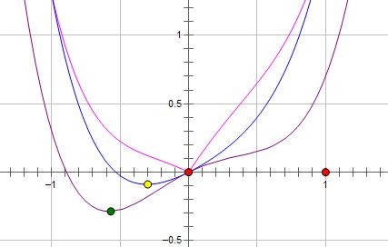
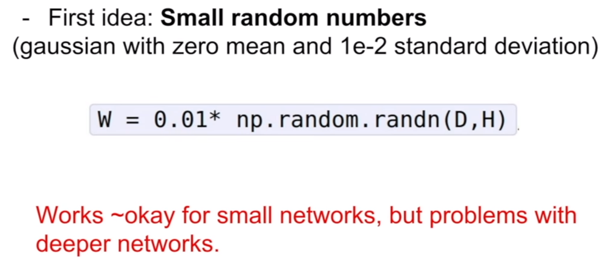

#
机器学习和深度学习面试题
#

##1. 如何解决正负类不平衡问题
类别不均衡时，不能使用accuracy作为分类器的评价指标。例如：当在对一个类别不均衡的数据集进行分类时得到了90%的准确度（Accuracy）。当你进一步分析发现，数据集的90%的样本是属于同一个类，并且分类器将所有的样本都分类为该类。在这种情况下，显然该分类器是无效的。并且这种无效是由于训练集中类别不均衡而导致的。因此即使分类器将所有的样本都分类到大类下面时，该指标值仍然会很高。即，该分类器偏向了大类这个类别的数据。
例如下面这个图:

虽然分类器B的accuracy比A高,但是在实际中显然A分类器的性能更好。

常见的解决办法:
+ 扩大数据集
当遇到类别不均衡问题时，首先应该想到，是否可能再增加数据(一定要有小类样本数据)，更多的数据往往战胜更好的算法。因为机器学习是使用现有的数据多整个数据的分布进行估计，因此更多的数据往往能够得到更多的分布信息，以及更好分布估计。即使再增加小类样本数据时，又增加了大类样本数据，也可以使用放弃一部分大类数据(即对大类数据进行欠采样)来解决。

+ 尝试其他评价指标
数据分布不均衡时，分类器可能并不能起效，甚至进行误导。因此需要用其他指标来评价。常见的评价指标有：
	+ 混淆矩阵(confusion matrix),可分别算出每一类的TP、FN、FP、TN
	+ 精确度(precision): 分类器预测出的正样本中，真正正样本所占比例
	+ 召回率(recall): 所有正样本中，分类器能预测正确的比率
	+ $F_\beta\_{Score}$: 综合了precision和recall,值越高，表示算法性能越好。
	+ Kappa曲线: 
	$$
    	k = \frac{p_o-p_e}{1-p_e}
    $$
    kappa是用来进行一致性检验，也可以用于衡量分类精度，基于混淆矩阵。其中$p_o$为观测一致率，$p_e$为期望一致率。计算举例：
    
    
    + ROC曲线(ROC Curves):

+ 对数据集重采样
可以使用一些策略该减轻数据的不平衡程度。该策略便是采样(sampling)，主要有两种采样方法来降低数据的不平衡性。对小类的数据样本进行采样来增加小类的数据样本个数，即过采样（over-sampling ，采样的个数大于该类样本的个数）,即删除部分样本。对大类的数据样本进行采样来减少该类数据样本的个数，即欠采样（under-sampling，采样的次数少于该类样本的个素）,即添加部分样本的副本。尝试随机采样与非随机采样两种采样方法,对各类别尝试不同的采样比例，比一定是1:1，有时候1:1反而不好，因为与现实情况相差甚远。也可以同时使用过采样与欠采样。

+ 尝试产生人工数据样本
使用SMOTE(Synthetic Minority Over-sampling Technique)方法来构造样本。SMOTE是一种过采样算法，它构造新的小类样本而不是产生小类中已有的样本的副本，即该算法构造的数据是新样本，原数据集中不存在的。

具体操作过程为：
	1. 取所有的minority数据点。
	
	2. 以其中某个点为中心，选取k nearest neighbor
	
	3. 从上述邻居中随机选取2个点(视增加数据点比例来定)
	
	4. 然后分别在连线上产生数据点
	

+ 尝试使用不同的分类算法
不要对待每一个分类都使用自己喜欢而熟悉的分类算法。应该使用不同的算法对其进行比较，因为不同的算法使用于不同的任务与数据。决策树往往在类别不均衡数据上表现不错。它使用基于类变量的划分规则去创建分类树，因此可以强制地将不同类别的样本分开。

+ 尝试对模型进行惩罚
可以使用相同的分类算法，但是使用一个不同的角度，比如你的分类任务是识别那些小类，那么可以对分类器的小类样本数据增加权值，降低大类样本的权值(这种方法其实是产生了新的数据分布，即产生了新的数据集)，从而使得分类器将重点集中在小类样本身上。一个具体做法就是，在训练分类器时，若分类器将小类样本分错时额外增加分类器一个小类样本分错代价，这个额外的代价可以使得分类器更加"关心"小类样本。

+ 使用异常点检测法
我们可以从不同于分类的角度去解决数据不均衡性问题，我们可以把那些小类的样本作为异常点(outliers)，因此该问题便转化为异常点检测(anomaly detection)与变化趋势检测问题(change detection)。 

+ 其他方法
设超大类中样本的个数是极小类中样本个数的L倍，那么在随机梯度下降（SGD，stochastic gradient descent）算法中，每次遇到一个极小类中样本进行训练时，训练L次。

	将大类中样本划分到L个聚类中，然后训练L个分类器，每个分类器使用大类中的一个簇与所有的小类样本进行训练得到。最后对这L个分类器采取少数服从多数对未知类别数据进行分类，如果是连续值（预测），那么采用平均值。

    设小类中有N个样本。将大类聚类成N个簇，然后使用每个簇的中心组成大类中的N个样本，加上小类中所有的样本进行训练。

    无论你使用前面的何种方法，都对某个或某些类进行了损害。为了不进行损害，那么可以使用全部的训练集采用多种分类方法分别建立分类器而得到多个分类器，采用投票的方式对未知类别的数据进行分类，如果是连续值（预测），那么采用平均值。

##2. L1和L2正则化的区别
###2.1 L1正则化
L1正则化也叫LASSO regularizer,的主要作用是能够产生一个稀疏的模型，即模型中很多系数的值为0。这样的模型有以下几个好处:
+ 起到简化压缩模型的作用，L1正则化产生稀疏权值矩阵，即产生一个稀疏模型，可以用于特征选择。
+ 提高模型的可解释性，比如说，一个病如果依赖于 5 个变量的话，将会更易于医生理解、描述和总结规律，但是如果依赖于 5000 个变量的话，基本上就超出人肉可处理的范围了。
+ 防止过拟合：一定程度上能避免过拟合问题。

####2.1.1 为何L1正则化能产生稀疏模型
一般损失函数为:
$$
\begin{align}
J(w)&=L(w)+\lambda\Omega(w)\\
&=L(w)+\lambda\sum_{i=1}^m|w_i|
\end{align}
$$
其中$L(w)$是原始的损失函数，后面的$\lambda\Omega(w)$是正则项。上述对$J(w)$的最优化等价于
$$
\arg\min_{w}L(w)\hspace{1.0cm} s.t. \Omega(w)\leq\eta
$$
具体原因为:

即对一个特定的$\lambda$总存在一个$\eta$使得这两个问题是等价的(这个是优化里的知识)。根据拉格朗日定理可以知道，当二者相交的时候往往能取得最优值。

以上是只有两个参数的优化情况。可以看出最优值的情况下，往往倾向于使得$w_1$或者$w_2$为0。因此得到的模型为一个稀疏模型。因此可以起到特征选择的作用。

其实后面的正则化项可以使用$L_0$正则化。即：
$\Omega(w)$表示$\vec w$中非0参数的个数。但是这是一个$NP-Hard$问题，不易于计算，且$L_1$范数是$L_0$范数的最优凸近似，而且它比$L_0$范数要容易优化求解。因此用$L_0$正则化取而代之。

由于$L_1$正则化具有特征选择的作用，因此也能提高模型的可解释性。

对$L_1$正则化求导之后，得到的权重迭代公式为:
$$
w(t+1)=w(t)-\eta\lambda sgn(w)-\eta\frac{\partial L(w)}{\partial}
$$
比原始的更新规则多出了$ηλsgn(w)$这一项。当$w$为正时，更新后的$w$变小。当$w$为负时，更新后的$w$变大——因此它的效果就是让$w$往$0$靠，使网络中的权重尽可能为$0$，也就相当于减小了网络复杂度，防止过拟合。

另外，上面没有提到一个问题，当$w$为$0$时怎么办？当$w$等于$0$时，$|W|$是不可导的，所以我们只能按照原始的未经正则化的方法去更新$w$，这就相当于去掉$ηλsgn(w)$这一项，所以我们可以规定$sgn(0)=0$，这样就把w=0的情况也统一进来了。(在编程的时候，令$sgn(0)=0,sgn(w>0)=1,sgn(w<0)=-1$)

###2.2 L2正则化
L2正则化也叫ridge regularizer，能倾向于产生norm比较小的权重$w$,拟合过程中通常都倾向于让权值尽可能小，最后构造一个所有参数都比较小的模型。因为一般认为参数值小的模型比较简单，能适应不同的数据集，也在一定程度上避免了过拟合现象。可以设想一下对于一个线性回归方程，若参数很大，那么只要数据偏移一点点，就会对结果造成很大的影响；但如果参数足够小，数据偏移得多一点也不会对结果造成什么影响，专业一点的说法是『抗扰动能力强』。如下图:

其中: $\lambda$和数据集有关，和$C$的大小也有关。$\lambda$的选择要看具体的验证集。$C$越大，$\lambda$就越小。当C无穷大的时候,就相当于没有正则项,$\lambda=0$。当$C=0$时，$\lambda$无穷大,此时正则化项被无限放大，$w=0$。

加上正则化项之后的损失函数为:
$$
\begin{align}
J(w)&=L(w)+\lambda\Omega(w)\\
&=L(w)+\lambda\sum_{i=1}^mw_i^2
\end{align}
$$

求导以后：
$$
\frac{\partial L(w)}{\partial w}+\lambda\frac{\partial\Omega(w)}{\partial w}=0
$$
根据拉格朗日定理，一般极值多在取等时得到，可以据此换成上面等价的式子。

####2.2.1 为何L2正则化可以取得比较小的参数
假设需要优化的损失为:
$$
J(w)=L(w)+\lambda w^Tw
$$
根据梯度迭代原理，有:
$$
\begin{align}
w(t+1)&=w(t)-\eta\frac{\partial L(w)}{\partial w}-2\eta \lambda w(t)\\
&=w(t)(1-2\eta\lambda)-\eta\frac{\partial L(w)}{\partial w}
\end{align}
$$
加入没有正则化项，则上式为:
$$
w(t+1)=w(t)-\eta\frac{\partial L(w)}{\partial w}
$$
从上式可以看到，与未添加$L_2$正则化的迭代公式相比，每一次迭代，$θ_j$都要先乘以一个小于$1$的因子，从而使得$θ_j$不断减小，因此总得来看，$θ$是不断减小的。因此$\theta$的减小幅度也会变小。
###2.3 L1和L2正则化的比较
假设费用函数 L 与某个参数 x 的关系如图所示:

则最优的 x 在绿点处，x 非零。现在施加$L_2$正则化，新的费用函数$L + Cx^2$如图中蓝线所示：

最优的 x 在黄点处，x 的绝对值减小了，但依然非零。而如果施加$L1$正则化，则新的费用函数$L + C|x|$如图中粉线所示：

最优的 x 就变成了 0。这里利用的就是绝对值函数的尖峰。两种 regularization 能不能把最优的 x 变成 0，取决于原先的费用函数在 0 点处的导数。如果本来导数不为 0，那么施加 L2 regularization 后导数依然不为 0，最优的 x 也不会变成 0。而施加 L1 regularization 时，只要 regularization 项的系数 C 大于原先费用函数在 0 点处的导数的绝对值，x = 0 就会变成一个极小值点。
>[知乎](https://www.zhihu.com/question/37096933/answer/70426653)

###2.3 L1和L2正则化的适用场合
L1优点是能够获得sparse模型，对于large-scale的问题来说这一点很重要，因为可以减少存储空间。缺点是加入L1后目标函数在原点不可导，需要做特殊处理。L2优点是实现简单，能够起到正则化的作用。缺点就是L1的优点：无法获得sparse模型。实际上L1也是一种妥协的做法，要获得真正sparse的模型，要用L0正则化。

那么如果数据损失项使用L1 Norm，很明显，L1 Norm对outlier没有L2 Norm那么敏感；如果正则化损失项使用L1的话，那么使学习到的参数倾向于稀疏，使用L2 Norm则没有这种倾向。

实践中，根据Quaro的data scientist Xavier Amatriain 的经验，实际应用过程中，L1 nrom几乎没有比L2 norm表现好的时候，优先使用L2 norm是比较好的选择。

##3. SVM解决多分类问题
从 SVM的那几张图可以看出来，SVM是一种典型的两类分类器，即它只回答属于正类还是负类的问题。而现实中要解决的问题，往往是多类的问题（少部分例外，例如垃圾邮件过滤，就只需要确定“是”还是“不是”垃圾邮件），比如文本分类，比如数字识别。如何由两类分类器得到多类分类器，就是一个值得研究的问题。

还以文本分类为例，现成的方法有很多，其中一种一劳永逸的方法，就是真的一次性考虑所有样本，并求解一个多目标函数的优化问题，一次性得到多个分类面，就像下图这样：

多个超平面把空间划分为多个区域，每个区域对应一个类别，给一篇文章，看它落在哪个区域就知道了它的分类。只可惜这种算法还基本停留在纸面上，因为一次性求解的方法计算量实在太大，大到无法实用的地步。

稍稍退一步，我们就会想到所谓“一类对其余”的方法，就是每次仍然解一个两类分类的问题。比如我们有5个类别，第一次就把类别1的样本定为正样本，其余2，3，4，5的样本合起来定为负样本，这样得到一个两类分类器，它能够指出一篇文章是还是不是第1类的；第二次我们把类别2 的样本定为正样本，把1，3，4，5的样本合起来定为负样本，得到一个分类器，如此下去，我们可以得到5个这样的两类分类器（总是和类别的数目一致）。到了有文章需要分类的时候，我们就拿着这篇文章挨个分类器的问：是属于你的么？是属于你的么？哪个分类器点头说是了，文章的类别就确定了。这种方法的好处是每个优化问题的规模比较小，而且分类的时候速度很快（只需要调用5个分类器就知道了结果）。但有时也会出现两种很尴尬的情况，例如拿一篇文章问了一圈，每一个分类器都说它是属于它那一类的，或者每一个分类器都说它不是它那一类的，前者叫分类重叠现象，后者叫不可分类现象。分类重叠倒还好办，随便选一个结果都不至于太离谱，或者看看这篇文章到各个超平面的距离，哪个远就判给哪个。不可分类现象就着实难办了，只能把它分给第6个类别了……更要命的是，本来各个类别的样本数目是差不多的，但“其余”的那一类样本数总是要数倍于正类（因为它是除正类以外其他类别的样本之和嘛），这就人为的造成了上一节所说的“数据集偏斜”问题。

因此我们还得再退一步，还是解两类分类问题，还是每次选一个类的样本作正类样本，而负类样本则变成只选一个类（称为“一对一单挑”的方法，哦，不对，没有单挑，就是“一对一”的方法，呵呵），这就避免了偏斜。因此过程就是算出这样一些分类器，第一个只回答“是第1类还是第2类”，第二个只回答“是第1类还是第3类”，第三个只回答“是第1类还是第4类”，如此下去，你也可以马上得出，这样的分类器应该有5 X 4/2=10个（通式是，如果有k个类别，则总的两类分类器数目为k(k-1)/2）。虽然分类器的数目多了，但是在训练阶段（也就是算出这些分类器的分类平面时）所用的总时间却比“一类对其余”方法少很多，在真正用来分类的时候，把一篇文章扔给所有分类器，第一个分类器会投票说它是“1”或者“2”，第二个会说它是“1”或者“3”，让每一个都投上自己的一票，最后统计票数，如果类别“1”得票最多，就判这篇文章属于第1类。这种方法显然也会有分类重叠的现象，但不会有不可分类现象，因为总不可能所有类别的票数都是0。看起来够好么？其实不然，想想分类一篇文章，我们调用了多少个分类器？10个，这还是类别数为5的时候，类别数如果是1000，要调用的分类器数目会上升至约500,000个（类别数的平方量级）。这如何是好？

看来我们必须再退一步，在分类的时候下功夫，我们还是像一对一方法那样来训练，只是在对一篇文章进行分类之前，我们先按照下面图的样子来组织分类器（如你所见，这是一个有向无环图，因此这种方法也叫做DAG SVM）。

这样在分类时,我们就可以先问分类器“1对5”（意思是它能够回答“是第1类还是第5类”），如果它回答5，我们就往左走，再问“2对5”这个分类器，如果它还说是“5”，我们就继续往左走，这样一直问下去，就可以得到分类结果。好处在哪？我们其实只调用了4个分类器（如果类别数是k，则只调用k-1个），分类速度飞快，且没有分类重叠和不可分类现象！缺点在哪？假如最一开始的分类器回答错误（明明是类别1的文章，它说成了5），那么后面的分类器是无论如何也无法纠正它的错误的（因为后面的分类器压根没有出现“1”这个类别标签），其实对下面每一层的分类器都存在这种错误向下累积的现象。。

不过不要被DAG方法的错误累积吓倒，错误累积在一对其余和一对一方法中也都存在，DAG方法好于它们的地方就在于，累积的上限，不管是大是小，总是有定论的，有理论证明。而一对其余和一对一方法中，尽管每一个两类分类器的泛化误差限是知道的，但是合起来做多类分类的时候，误差上界是多少，没人知道，这意味着准确率低到0也是有可能的，这多让人郁闷。

而且现在DAG方法根节点的选取（也就是如何选第一个参与分类的分类器），也有一些方法可以改善整体效果，我们总希望根节点少犯错误为好，因此参与第一次分类的两个类别，最好是差别特别特别大，大到以至于不太可能把他们分错；或者我们就总取在两类分类中正确率最高的那个分类器作根节点，或者我们让两类分类器在分类的时候，不光输出类别的标签，还输出一个类似“置信度”的东东，当它对自己的结果不太自信的时候，我们就不光按照它的输出走，把它旁边的那条路也走一走，等等。
####3.1 时间复杂度

总结：one VS All: 存在分类重叠现象和不可分类现象。分类重叠倒还好办，随便选一个结果都不至于太离谱，或者看看这篇文章到各个超平面的距离，哪个远就判给哪个。不可分类现象就着实难办了。还会产生数据倾斜问题。

All VS ALL(one Vs one, all-pairs):需要构建多个分类器，如果类别比较多，则构建的分类器也多。但是单个分类器构建的时间比较短。通常情况下，ALL VS ALL效果较好。

DAG: 需要解决误差累积问题。

还有一种error correct output codes的方法，后期有时间补充。

###4. 梯度消失和梯度爆炸
由于深度学习一般认为是层数越多越好。但是由于BP通过链式求导来更新权值，如果其中很多项大于1，则产生梯度爆炸，导致权值更新太大，产生震荡。如果很多项小于1，则权值基本没什么更新，会产生梯度消失现象。一般靠近输出的层学习会很好，靠近输入的层学习效果不好。如果激活函数选的不好，更会加剧这个过程:

可以看出,sigmoid函数的导数不可能大于0.25，tanh的导数不可能大于1。

####4.1 梯度消失和梯度爆炸的解决方案
+ 预训练加微调
此方法来自Hinton在2006年发表的一篇论文，Hinton为了解决梯度的问题，提出采取无监督逐层训练方法，其基本思想是每次训练一层隐节点，训练时将上一层隐节点的输出作为输入，而本层隐节点的输出作为下一层隐节点的输入，此过程就是逐层“预训练”（pre-training）；在预训练完成后，再对整个网络进行“微调”（fine-tunning）。Hinton在训练深度信念网络（Deep Belief Networks中，使用了这个方法，在各层预训练完成后，再利用BP算法对整个网络进行训练。此思想相当于是先寻找局部最优，然后整合起来寻找全局最优，此方法有一定的好处，但是目前应用的不是很多了。(主要是费时费力)
+ 梯度剪切、正则
梯度剪切这个方案主要是针对梯度爆炸提出的，其思想是设置一个梯度剪切阈值，然后更新梯度的时候，如果梯度超过这个阈值，那么就将其强制限制在这个范围之内。这可以防止梯度爆炸。

	正则化是通过对网络权重做正则限制过拟合，如果发生梯度爆炸，权值的范数就会变的非常大，通过正则化项，可以部分限制梯度爆炸的发生。
> 事实上，在深度神经网络中，往往是梯度消失出现的更多一些。

+ relu、leakrelu、elu等激活函数
relu函数的导数在正数部分是恒等于1的，因此在深层网络中使用relu激活函数就不会导致梯度消失和爆炸的问题。

	relu的优点:
     + 解决了梯度消失、爆炸的问题
     + 计算方便，计算速度快
     + 加速了网络的训练
	relu的缺点:
    + 由于负数部分恒为0，会导致一些神经元无法激活（可通过设置小学习率部分解决）
    + 输出不是以0为中心的

  尽管relu也有缺点，但是仍然是目前使用最多的激活函数。可以使用leak-relu或者elu来代替。
+ 使用batchnorm
+ 使用残差结构
+ 使用LSTM

###5. CNN在NLP、Speech、AlphaGo上的应用
为什么CNN用在CV上更得心应手，却不一定适合NLP？要看清这点就要理解CNN的原理。CNN有两个主要特点，区域不变性(location invariance)和组合性(Compositionality)。1. 区域不变性：滤波器在每层的输入向量(图像)上滑动，检测的是局部信息，然后通过pooling取最大值或均值。pooling这步综合了局部特征，失去了每个特征的位置信息。这很适合基于图像的任务，比如要判断一幅图里有没有猫这种生物，你可能不会去关心这只猫出现在图像的哪个区域。但是在NLP里，词语在句子或是段落里出现的位置，顺序，都是很重要的信息。2. 局部组合性：CNN中，每个滤波器都把较低层的局部特征组合生成较高层的更全局化的特征。这在CV里很好理解，像素组合成边缘，边缘生成形状，最后把各种形状组合起来得到复杂的物体表达。在语言里，当然也有类似的组合关系，但是远不如图像来的直接。而且在图像里，相邻像素必须是相关的，相邻的词语却未必相关。当然，还有些技术细节，CNN具体应用在CV和NLP上会有些不同，就不赘述了。比如，滤波器的大小，在CV里滤波器一般覆盖一个局部的小区域，NLP会覆盖整个词汇向量的宽度，等等。。

图片/语音这类感知问题中, 输入的都是裸的信号, 这一点的好处在于, 输入数据具有连续性:一个苹果, 它稍微胖一点瘦一点红一点, 点几个噪点上去, 对于人类来说仍然是苹果.一句话, 稍微大声一点尖锐一点卡顿一点加点噪声变点音色, 对于人类来说仍然是这句话.也即: 输入数据可以在它的小邻域内做连续变化而不改变自身意义, 或者说输入点可以做小的扰动而不改变自身意义然而对于其他问题, 如NLP, 推荐系统, 乱七八糟的DM问题, 输入数据不再是裸的信号了, 人类还没有找到很好对这些问题的输入数据的描述方式, 也即feature, 使得这种描述的信息损失很小, 且具有连续变化, 或者说抗扰动的能力, 同时这种描述最好别在输入空间中太sparse..比如说, NLP 里如果要给document分类, 或者识别'情绪'什么的, 还是有解决的比较好的..因为这个问题抗扰动: document里多几个词少几个词不影响分类. 同时对于人类来说, 它比很多问题更像一个感知问题: 扫一眼文章就可以大致知道它的类别. 最近比较火的image description, 也比较类似于这种.

部连接／权值共享／池化操作／多层次结构。局部连接使网络可以提取数据的局部特征；权值共享大大降低了网络的训练难度，一个Filter只提取一个特征，在整个图片（或者语音／文本） 中进行卷积；池化操作与多层次结构一起，实现了数据的降维，将低层次的局部特征组合成为较高层次的特征，从而对整个图片进行表示。

最主要的原因是因为数据之间存在着局部相关性，空间位置的不变性。如果特征之间的位置可以改变，则不能使用CNN。

####5.1 哪些数据不适合用深度学习
+ 数据集太小，数据样本不足时，深度学习相对其它机器学习算法，没有明显优势。 
+ 数据集没有局部相关特性，目前深度学习表现比较好的领域主要是图像／语音／自然语言处理等领域，这些领域的一个共性是局部相关性。图像中像素组成物体，语音信号中音位组合成单词，文本数据中单词组合成句子，这些特征元素的组合一旦被打乱，表示的含义同时也被改变。对于没有这样的局部相关性的数据集，不适于使用深度学习算法进行处理。

###6. 深度学习调参技巧
####6.1 初始化
使用多种不同的初始化方法。
+ 随机的比较小的数据

对于小的网络勉强还可以，但是对于比较大的网络就有很多问题了。
如果初始化的时候取比价小的值，则会出现下面的情况

如果初始时$W$值比较大，则会出现下面的情况

因为tanh在两端的输出值多为1或-1。但是这时输出值虽然不是0，但是其梯度仍然是0。因此在反向传播的时候，对$W$求解梯度时，计算的结果仍然是0。依然会造成梯度消失问题。

另外的推倒过程为:

XAvier(sa wei er)初始化效果如下:

由于保证了输入和输出的均值均为$0$,方差相同，因此效果较好。
XAvier满足的权重服从下面的均匀分布，为：
$$
W\thicksim U[-\frac{\sqrt{6}}{\sqrt{n_j+n_{j+1}}}, \frac{\sqrt{6}}{\sqrt{n_j+n_{j+1}}}]
$$
推倒：
为了保持前向传播和反向传播每一层方差一致，应满足:
$$
\forall i, n_iVar[W^i]=1\\
\forall i, n_{i+1}Var[W^{i+1}]=1
$$
但是，实际当中输入与输出的个数往往不相等，于是为了均衡考量，最终我们的权重方差应满足：
$$
\forall i, Var[W^i]=\frac{2}{n_i+n_{i+1}}
$$
对于服从[a,b]之间均匀分布的方差为:
$$
var=\frac{(b-a)^2}{12}
$$
因此Xavier初始化的实现就是满足下面的均匀分布:
$$
W\thicksim U[-\frac{\sqrt{6}}{\sqrt{n_j+n_{j+1}}}, \frac{\sqrt{6}}{\sqrt{n_j+n_{j+1}}}]
$$

总之就是一句话：随机高斯分布初始化，会造成在前向和后向传播时梯度消失。
+ Xavier的问题
Xavier initialization是在线性函数上推导得出，这说明它对非线性函数并不具有普适性，所以这个例子仅仅说明它对tanh很有效，那么对于目前最常用的ReLU神经元呢？

Xavier的推导过程是基于几个假设的，其中一个是激活函数是线性的。这并不适用于ReLU激活函数。另一个是激活值关于0对称，这个不适用于sigmoid函数和ReLU函数。

由于Relu函数会将一般的输入变成0，因此越到后面，输出为0的越多(Dead Unit)。如果层数太多，最后也会导致梯度变成0.

He initialization的思想是：在ReLU网络中，假定每一层有一半的神经元被激活，另一半为0，所以，要保持variance不变，只需要在Xavier的基础上再除以2：

因此此时高斯分布的方差为:
$$
std=\sqrt{\frac{2}{n_i}}\hspace{1.0cm}其中n_i为输入神经元的个数
$$
因此此时可以做到网络的输出与与网络的层数无关。
####6.2 激活函数
+ 使用Relu,但要注意初始化和学习率的选取
+ 可以尝试Leaky Relu和Elu
+ 可以尝试tanh
+ 不要使用sigmoid

####6.3 数据预处理
+ 减去整个图像的均值
+ 减去各个通道的均值

####6.4 网络的训练
采用逐层训练法。缺点是耗时耗力。

####6.4 学习率
刚开始选择大一点的学习率，当loss变化出现震荡时减小学习率。

####6.5 Batch size选取技巧
无论是CPU还是GPU，内存管理仍然以字节为基本单元做硬件优化。因此将batch size设置成2的指数倍，如64、128、256等，将有效提高矩阵分片、张量计算等操作的硬件处理效率。

####6.6 正则优化
添加L2正则优化，dropout设置为0.5.

####6.7 其他方法
k折交叉验证。每次交叉都打乱数据排序。迁移学习。

###7. 谈谈Batch Normalization
####7.1 选择batch的好处
使用mini-batch而不是一个样本的好处是作为全部样本的采样，一个mini-batch的"随机"梯度和batch的梯度方向更接近。即batch的梯度相对于单个样本更接近总体，更能够模拟总体的梯度方向，从而加快收敛。另一个好处能够利用硬件的数据并行能力。

###7.2 使用normalization的好处
以前要想收敛，选择合适的learning_rate和初始化参数非常重要，如果选择不合适，可能无法收敛。对于很深的网络，层次越多，error往前传播的就越小，而且很多神经元会饱和。饱和之后，梯度会变得很小，从而参数的$\Delta$就非常小。使用Relu能缓解饱和问题，但是依然会有internal covariate shift问题。而Batch normalization能解决饱和问题，也能解决internal covariate shift问题。

####7.2.1 Internal covariate shift
如果训练和测试时输入的分布发生变化，会给模型带来问题。应为模型就是根据训练数据拟合出一个模型，然后用这个模型去预测测试集。因此假设的前提是训练集和测试集的数据分布是一致的。否则训练数据无法使用。现实生活中不会有太大差异。但小的差异还是会存在的。在比较深的网络里，小的差异也会带来一些问题。因为前面的结果会传递到后面的层，而且层次越多，前面的细微变化就会带来后面的巨大变化。如果某一层的输入分布总是变化的话就会无所适从，参数很难调整好。因此可以对输入进行白化处理。但是之后的层就不好保证了。比较坏的情况是，比如最后一层，经过一个mini-batch，把参数调整的比以前好一些了，但是它之前的所有层的参数都变化了，从而导致下一轮训练的时候输入范围也发生变化，就很难正确分类。这就是internal covariate shift。其中的internal指的就是中间的隐藏层。

####7.2.2 Batch Normalization的解决方案
如果我们能保证每次mini-batch的每个层的输入数据都是均值0方差1，那么就可以解决Internal covariate shift问题。因此可以加上一个batch normalization来对这个mini-batch进行处理。但是也会带来一个问题。这样会对原有数据进行强行更改。

参数更改和求导过程为:

####7.2.2 测试过程
在训练的最后一个epoch时，要对这一epoch所有的训练样本的均值和标准差进行统计，这样在一张测试图片进来时，使用训练样本中的标准差的期望和均值的期望（好绕口）对测试数据进行归一化，注意这里标准差使用的期望是其无偏估计：

###7.3 BN的优缺点
+ 提高学习效率。允许使用更高的学习率。如果每层的scale不一致，实际上每层需要的学习率是不一样的，同一层不同维度的scale往往也需要不同大小的学习率。通常需要使用最小的学习率才能保证损失函数有效下降。Batch Normalization将每层、每维的scale保持一致，那么我们就可以使用较高的学习率进行优化。
+ 改善流经网络的梯度
+ 减少对初始化的强烈依赖
+ 改善正则化策略：作为正则化的一种形式，轻微减少了对dropout的需求
你再也不用去理会过拟合中drop out、L2正则项参数的选择问题，采用BN算法后，你可以移除这两项了参数，或者可以选择更小的L2正则约束参数了，因为BN具有提高网络泛化能力的特性。
+ 不需要使用LRN了。因为BN本身就是一个归一化网络层。
+ 缓解梯度消失:所以BN的提出者就想能否将每层的激活值都进行归一化，将它们拉到均值为0方差为1的区域，这样大部分数据都从梯度趋于0的区域变换至激活函数中间梯度较大的区域，从而解决了梯度消失的问题。这样梯度变大了，网络更新快，训练变快了。具体表现就是达到相同的正确率迭代次数更少，迭代相同次数时正确率会高。

###8. 卷积神经网络中$1\times 1$卷积的作用
+ 降维：不考虑像素与周边像素的关系。但卷积的输入是长方体，所以$1\times 1$卷积实际上是对每个像素点在不同的channels上进行线性组合，且保留了图片原有的平面结构，调控depth，从而完成升维或者降维功能，减少网络参数。
+ 实现跨通道的信息交互和整合
$1\times 1$就是多个feature channels线性叠加，从而实现夸通道信息交互。
+ 增加模型的非线性
卷积之后有激励层。$1\times 1$的卷积在前一层的学习表示上添加了非线性激励，提升了网络的表达能力。

###9. 各种optimizer的总结

###10. Tensorflow计算图谱总结
Tensorflow是一个通过计算图的形式来表述计算的编程系统，计算图也叫数据流图，可以把计算图看做是一种有向图，Tensorflow中的每一个计算都是计算图上的一个节点，而节点之间的边描述了计算之间的依赖关系。