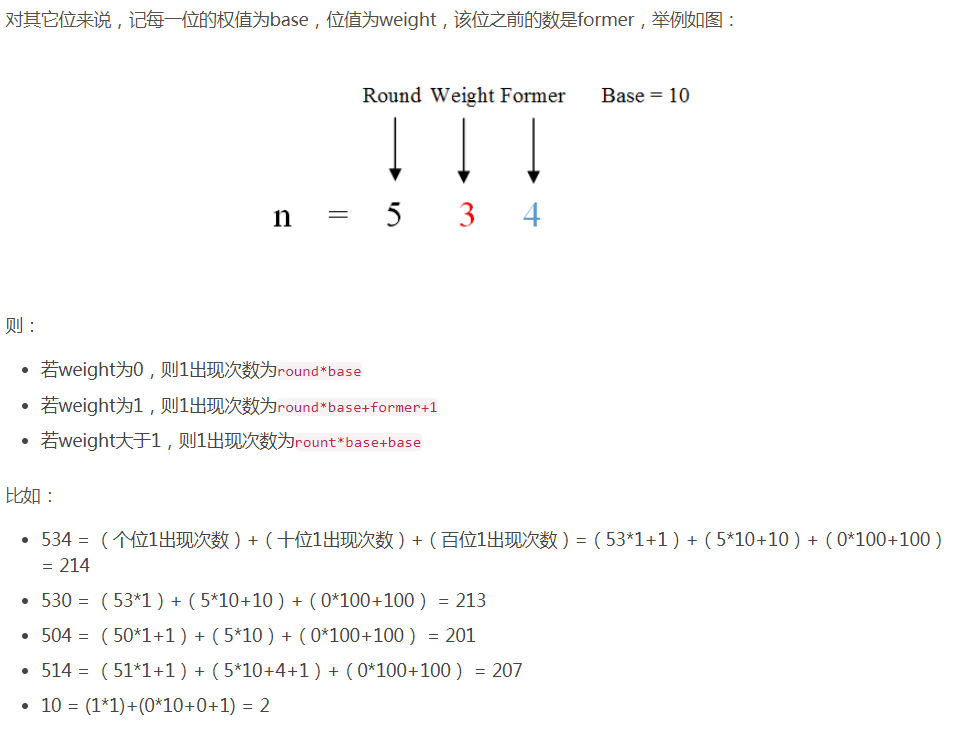

##1. 数组中出现次数超过一半的数字
+ 利用快排的思路。找数组中最中间的数字。
+ 设置一个次数

##2. 查找最小的k个数
+ 还是利用快排的思想。找下标为k的。
+ 另外创建一个容器保存k个数。该容器用最大堆来实现。

##3. 连续子数组的最大和
动态规划算法：
$$
\begin{align}
f(i) &= pData[i]\hspace{3.2cm} i=0 orf(i-1)\le0\\
f(i) &= f(i-1)+pData[i]\hspace{1.0cm}i\ne0 orf(i-1)\ge0
\end{align}
$$

##4. 1~n中1出现的次数

##5. 序列中某一位的数

##6. 数组排成最小的数
数组转字符串，然后定义特殊的排序规则。

##7. 数字翻译问题
动态规划
礼物的最大价值
最长不含重复字符的子字符串
背包问题
寻找丑数

##8. 归并排序
数组中的逆序对

##9. 求两个链表的第一个公共节点
+ 采用两个栈保存两个链表
+ 得到两个链表的长度差l,然后先在比较长的链表上走l步，然后同时开始走，直到遇到公共节点为止。

##10. 排序排序数组中某个数字k出现的次数
使用二分查找的思想。首先找到第一个k出现的下标，然后找到最后一个k出现的下标，然后相减就可以了。

##11. 0~n-1中缺失的数字
使用二分查找法，如果middle == data[middle]，查找右半边。如果middle != data[middle]，判断middle-1元素，如果data[middle-1]==middle，则middle为所求，否则继续判断左半边。

##11. 排序数组中数值和下标相等的元素
使用二分查找法

##12. 二叉搜索树中第k大节点
中序遍历

##13. 二叉树的深度
使用简单的递归就可以了。

##14. 判断一颗树是不是平衡二叉树
使用后续遍历，每次遍历的时候要记录当前节点的深度

##15. 

